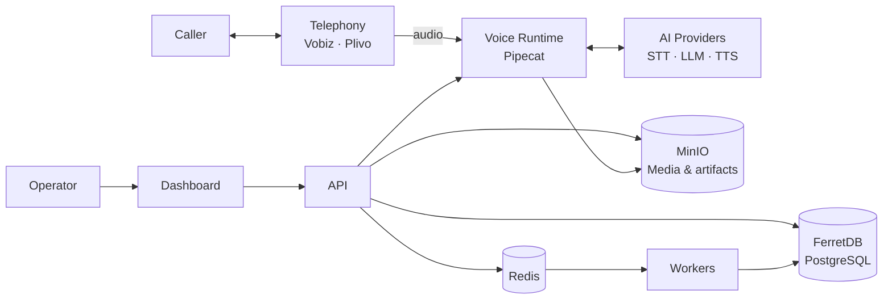

<div align="center">

# 🎙️ VoicEra

**Open-source infrastructure for self-hosted, real-time voice AI.**

Build telephony agents in Indian languages — with **your infrastructure, your data, and your choice of models and carriers.**
<br>

[](LICENSE)
[](https://www.python.org/downloads/)
[](docker-compose.yaml)
[](https://voicera.mintlify.app/docs/guides)
[](CONTRIBUTING.md)

<br>

**[Quick Start](#quick-start)** &nbsp; · &nbsp;
**[Architecture](#architecture)** &nbsp; · &nbsp;
**[Low-Resource Languages](#built-for-low-resource-languages)** &nbsp; · &nbsp;
**[Contributing](#contributing)**

</div>


## Why VoicEra?

Voice AI is increasingly powerful, but production deployments can create lock-in around **models, telephony, data, and infrastructure**.

VoicEra is an open infrastructure layer that puts those choices back with the operator.

- **Self-hosted by design** — run the platform on infrastructure you control.
- **Provider neutral** — swap STT, TTS, LLM, and telephony providers without rewriting the platform.
- **Data ownership** — call media, transcripts, and recordings stay in your infrastructure.
- **Public-good friendly** — Apache 2.0 licensed, transparent, forkable, and deployable without a VoicEra-managed service.
- **Composable** — use cloud APIs, local models, or a mix of both.

> **VoicEra is platform you own, not another AI vendor.**

## Quick start

```bash
git clone https://github.com/COSS-India/VoicEra.git
cd VoicEra

make application-up
```

`make application-up` creates the environment, generates required secrets, and starts the stack.

> **Important:** use `make application-up` instead of a bare `docker compose up`. Some services require the generated `SECRET_KEY`.

Once running:

| Service | URL |
|---|---|
| Dashboard | `http://localhost:3000` |
| API | `http://localhost:8000` |
| OpenAPI | `http://localhost:8000/docs` |
| Runtime | `http://localhost:7860` |
| MinIO | `http://localhost:9001` |
| FerretDB | `http://localhost:27018` |

```bash
make application-down
```

See the [documentation](https://voicera.mintlify.app/docs/guides) for production deployment and configuration.

You bring the models and telephony account. VoicEra connects them into a deployable system.

## Architecture



The platform separates **control plane** from **real-time execution**:

- **API** — agents, configuration, campaigns, authentication, and orchestration.
- **Runtime** — live call audio and model interaction.
- **Dashboard** — operator interface.
- **Workers** — asynchronous jobs and campaign execution.
- **Storage** — self-hosted database, object storage, and queue.
- **Providers** — interchangeable AI and telephony integrations.

[Read the architecture guide →](https://voicera.mintlify.app/docs/guides/concepts/architecture)

## Designed for digital public infrastructure

VoicEra follows principles that matter for Digital Public Goods:

| Principle | VoicEra |
|---|---|
| **Open source** | Apache 2.0-licensed source code |
| **Self-hostable** | Deploy on infrastructure you control |
| **Interoperable** | Provider registries and defined integration contracts |
| **No platform lock-in** | Swap model and telephony providers |
| **Data sovereignty** | Operators control call data and storage |
| **Reusable** | API-driven components and provider adapters |
| **Inclusive** | First-class support for Indian languages and low-resource deployments |
| **Transparent** | Public source, documentation, and contribution process |

VoicEra is intended to be **reused, adapted, and independently operated** — including by governments, NGOs, public-interest organisations, and other open-source projects.


## Extending VoicEra

Integrations live behind stable interfaces, so adding a provider should not require changing the core runtime.

### Add an AI provider

Create a provider under:

```text
apps/providers/{cloud,adapters,local}/
```

STT, TTS, and LLM providers register through the provider registry.

[Add an AI provider →](https://voicera.mintlify.app/docs/developer/guides/adding-a-provider)

### Add a telephony provider

Implement the telephony contract under:

```text
apps/telephony/providers/
```

Existing Vobiz and Plivo integrations provide reference implementations.

[Add a telephony provider →](https://voicera.mintlify.app/docs/developer/guides/adding-a-telephony-provider)

### Run models locally

Use the optional model server to expose self-hosted STT, TTS, or LLMs through a common gateway.

```text
Agent
  ↓
VoicEra
  ↓
Model Server
  ├── STT
  ├── TTS
  └── LLM
```

## Built for low-resource languages

VoicEra is designed to make voice AI more accessible for **low-resource and underserved languages** — where commercial models, tooling, and high-quality training data are often limited.

It brings together open and interoperable integrations across speech and language technologies, including:

* **Bhashini** — Indian-language STT and TTS
* **AI4Bharat** — Indic speech and language models
* **Kenpath Vistaar** — LLM support for underserved languages
* **Cloud providers** — additional STT, TTS, and LLM options

The architecture makes it possible to combine these models, self-host them, or replace them as better language technologies emerge.

See the [provider registry](https://voicera.mintlify.app/docs/developer/reference/provider-registry) for the current list.

## Repository

```text
VoicEra/
├── apps/
│   ├── api/            FastAPI control plane
│   ├── runtime/        Pipecat real-time voice runtime
│   ├── providers/      STT · TTS · LLM integrations
│   └── telephony/      Telephony integrations
├── frontend/           Next.js dashboard
├── model-server/       Optional self-hosted model gateway
├── scripts/             Service lifecycle scripts
└── docs/                Mintlify documentation
```

## Bring your own infrastructure

VoicEra does not provide telephony accounts or AI inference.

For a real phone deployment, you need:

1. **STT, TTS, and LLM access** — cloud providers or self-hosted models.
2. **A telephony provider** — currently Vobiz or Plivo.
3. **Infrastructure** to run VoicEra and store your data.

For browser-based testing, telephony is not required.

## Documentation

- [Getting started](https://voicera.mintlify.app/docs/guides)
- [Architecture](https://voicera.mintlify.app/docs/guides/concepts/architecture)
- [Provider registry](https://voicera.mintlify.app/docs/developer/reference/provider-registry)
- [Environment variables](https://voicera.mintlify.app/docs/developer/reference/environment-variables)
- [Model server](https://voicera.mintlify.app/docs/developer/model-server)
- [Operator FAQ](https://voicera.mintlify.app/docs/guides/operator/faq)

## Contributing

VoicEra is built in the open.

```text
Use → Adapt → Integrate → Contribute
```

Before opening a pull request, read [CONTRIBUTING.md](CONTRIBUTING.md).

Security issues should be reported privately according to [SECURITY.md](SECURITY.md).

## License

VoicEra is released under the [Apache License 2.0](LICENSE).

<div align="center">

**Build voice infrastructure. Keep control.**

</div>
