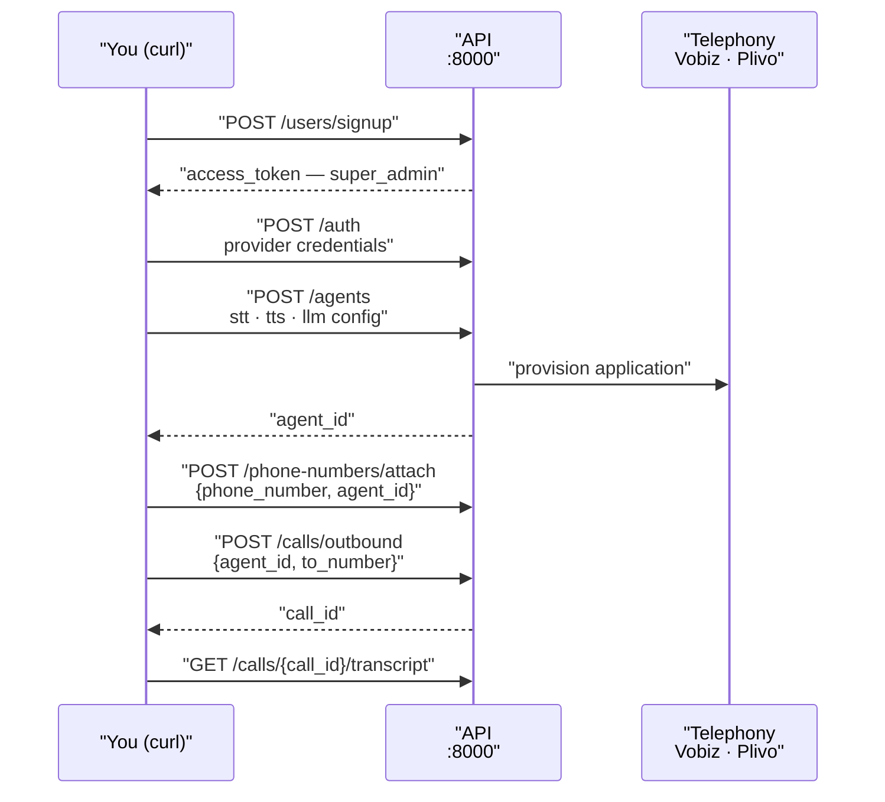

Everything an operator does — creating agents, attaching numbers, placing calls, reading transcripts, running campaigns — is an HTTP request. The dashboard is one way to make them; this page is the working set for doing it directly, which is what you want for anything scripted or reproducible.

<Note>
The stack also ships a [dashboard](../developer/frontend/overview) covering most of this. Nothing on this page depends on it. For exploring routes interactively, use the console described in [API overview](overview).
</Note>

The shape of a first run, before the detail:



## Getting a token

Token mechanics, lifetime, and roles are covered in [Authentication](authentication). The one call you need to start:

```bash
export API=http://localhost:8000

export TOKEN=$(curl -s -X POST "$API/api/v1/users/signup" \
  -H 'Content-Type: application/json' \
  -d '{"email":"you@example.com","password":"YOUR_PASSWORD","organisation_name":"Your Org"}' \
  | python3 -c 'import sys,json; print(json.load(sys.stdin)["access_token"])')
```

The first signup creates the organisation and makes you its `super_admin`. On later runs, log in instead of signing up again — see [Authentication](authentication) for the login call, token expiry, and the service-to-service bot-token path.

A re-login helper for long sessions:

```bash
login() {
  export TOKEN=$(curl -s -X POST "$API/api/v1/users/login" \
    -H 'Content-Type: application/json' \
    -d "{\"email\":\"$VOICERA_EMAIL\",\"password\":\"$VOICERA_PASSWORD\"}" \
    | python3 -c 'import sys,json; print(json.load(sys.stdin)["access_token"])')
}
```

## The tasks you do most

Each recipe assumes `$API` and `$TOKEN` are set. Placeholders are `YOUR_AGENT_ID`, `YOUR_ORG_ID`, `YOUR_CALL_ID`.

### Add provider credentials

Do this first — agents validate their model configuration against configured providers. See [Provider credentials](provider-auth) for the field contract; the flow is catalog, store, verify:

```bash
curl "$API/api/v1/auth/catalog/openai" -H "Authorization: Bearer $TOKEN"

curl -X POST "$API/api/v1/auth" \
  -H "Authorization: Bearer $TOKEN" \
  -H 'Content-Type: application/json' \
  -d '{"provider": "openai", "auth": {"api_key": "sk-…"}}'

curl "$API/api/v1/auth/configured" -H "Authorization: Bearer $TOKEN"
```

### Create an agent

Browse the catalogs first — they are generated from the [provider registry](../developer/reference/provider-registry), so they are always current:

```bash
curl "$API/api/v1/configuration/stt" -H "Authorization: Bearer $TOKEN"
curl "$API/api/v1/configuration/tts?languages=hi" -H "Authorization: Bearer $TOKEN"
curl "$API/api/v1/configuration/llm" -H "Authorization: Bearer $TOKEN"
curl "$API/api/v1/configuration/telephony" -H "Authorization: Bearer $TOKEN"
```

Then create. A `telephony` agent requires `telephony_provider` and provisions an application at the provider on create; a `websocket` agent must not send `telephony_provider`.

```bash
curl -X POST "$API/api/v1/agents" \
  -H "Authorization: Bearer $TOKEN" \
  -H 'Content-Type: application/json' \
  -d '{
    "name": "Support Agent",
    "agent_category": "telephony",
    "telephony_provider": "vobiz",
    "config": {
      "schema_version": 1,
      "prompts": {
        "system_prompt": "You are a helpful phone support agent.",
        "greeting_message": "Hello! How can I help you today?"
      },
      "language": {"primary": "en", "secondary": []},
      "models": {
        "stt_config": {"provider": "deepgram", "model": "nova-3-general", "language": "en"},
        "tts_config": {"provider": "cartesia", "model": "sonic-3.5", "language": "en", "voice": "3faa81ae-d3d8-4ab1-9e44-e50e46d33c30"},
        "llm_config": {"provider": "openai", "model": "gpt-4.1", "base_url": "https://api.openai.com/v1"}
      }
    }
  }'
```

The `agents` path has **no trailing slash**. `422` means config validation failed — the message names the field. Full field reference in [Agent configuration](../developer/reference/agent-configuration) and [Agents](agents).

### Attach a number

See what your telephony account holds, then attach:

```bash
curl "$API/api/v1/phone-numbers/providers/vobiz/inventory" \
  -H "Authorization: Bearer $TOKEN"

curl -X POST "$API/api/v1/phone-numbers/attach" \
  -H "Authorization: Bearer $TOKEN" \
  -H 'Content-Type: application/json' \
  -d '{
    "phone_number": "+919000000000",
    "provider": "vobiz",
    "agent_id": "YOUR_AGENT_ID"
  }'
```

With `agent_id`, this also links the number to the agent's provider application, so inbound calls route to it. Omit `agent_id` to import into inventory only.

Detach is a `DELETE` **with a body**, and keeps the inventory row:

```bash
curl -X DELETE "$API/api/v1/phone-numbers/detach" \
  -H "Authorization: Bearer $TOKEN" \
  -H 'Content-Type: application/json' \
  -d '{"phone_number": "+919000000000"}'
```

### Place a test call

```bash
curl -X POST "$API/api/v1/calls/outbound" \
  -H "Authorization: Bearer $TOKEN" \
  -H 'Content-Type: application/json' \
  -d '{
    "agent_id": "YOUR_AGENT_ID",
    "to_number": "+919876543210",
    "custom_variables": {"customer_name": "Asha"}
  }'
```

`custom_variables` override the agent's `config.custom_variables` defaults for this call only. Add `from_number` to override the caller ID. The response carries a `call_id`; everything afterwards keys off it.

### Check a call's transcript

```bash
curl "$API/api/v1/calls/YOUR_CALL_ID/transcript" -H "Authorization: Bearer $TOKEN"
curl "$API/api/v1/calls/YOUR_CALL_ID/recording" -H "Authorization: Bearer $TOKEN" -o recording.wav
```

Both return `404` until the runtime uploads the artifact at the end of the call, and `404` permanently for a call that produced none.

<Note>
Browser websocket sessions create a `call_type: web` CallLog, so they produce transcripts and recordings alongside telephony calls. Pre-register one with `POST /api/v1/calls/web` to know the `call_id` up front.
</Note>

### Invite a member

```bash
curl -X POST "$API/api/v1/members/invite" \
  -H "Authorization: Bearer $TOKEN" \
  -H 'Content-Type: application/json' \
  -d '{"email": "colleague@example.com", "password": "THEIR_INITIAL_PASSWORD"}'
```

The invite sets the member's initial password directly; there is no email invitation flow. Requires `admin` or `super_admin`. See [Multi-tenancy and roles](../developer/reference/multi-tenancy) for who can promote or remove members.

### Start a campaign

Three calls: upload, create, start. Field contract, retry/circuit-breaker config, and reports are in [Campaigns](campaigns) and [Running a campaign](../guides/operator/running-a-campaign).

```bash
curl -X POST "$API/api/v1/campaign/upload" \
  -H "Authorization: Bearer $TOKEN" \
  -F "file=@contacts.csv"

curl -X POST "$API/api/v1/campaign/create" \
  -H "Authorization: Bearer $TOKEN" \
  -H 'Content-Type: application/json' \
  -d '{
    "name": "October outreach",
    "agent_id": "YOUR_AGENT_ID",
    "source_type": "csv",
    "source_id": "SOURCE_ID_FROM_UPLOAD",
    "max_concurrency": 5
  }'

curl -X POST "$API/api/v1/campaign/YOUR_CAMPAIGN_ID/start" \
  -H "Authorization: Bearer $TOKEN"
```

## Scripting

Three habits make API-driven operation bearable.

**Keep credentials out of the command.** Put them in the environment and let the shell interpolate:

```bash
export API=http://localhost:8000
export VOICERA_EMAIL=you@example.com
export VOICERA_PASSWORD='…'
```

**Fail loudly.** `curl` exits `0` on a `4xx` by default, which turns a failed script into a silently wrong one. Use `--fail-with-body`:

```bash
curl --fail-with-body -s -X POST "$API/api/v1/agents" \
  -H "Authorization: Bearer $TOKEN" \
  -H 'Content-Type: application/json' \
  -d @agent.json
```

**Keep bodies in files.** Agent configurations are long and quoting them inline invites mistakes. `-d @agent.json` reads from disk and diffs in version control.

A poll loop for a campaign, using only Python's standard library:

```bash
while true; do
  curl -s "$API/api/v1/campaign/YOUR_CAMPAIGN_ID/progress" \
    -H "Authorization: Bearer $TOKEN" \
  | python3 -c 'import sys,json; d=json.load(sys.stdin); print(d["state"], d["processed_rows"], "/", d["total_rows"])'
  sleep 30
done
```

## Recommended tooling

| Tool | Use it for |
| --- | --- |
| `/docs` | Exploring, and one-off calls with the Authorize button. Fastest way to get a body shape right. |
| `curl` | Everything scripted. Present in every container and CI image. |
| `python3 -c` | Parsing JSON without adding a dependency. It is already installed wherever the stack runs. |
| `jq` | Nicer than `python3 -c` if you have it. Not required by anything here. |
| An OpenAPI client generator | Fed from `/openapi.json`, when you are building a real integration rather than operating by hand. |
| `mongosh` | Reading FerretDB directly when the API cannot tell you something. Port **27018** on the host. |

VoicEra ships no CLI. There is no `voicerctl`; `scripts/` contains only `start-application-services.sh` and `stop-application-services.sh`.

## Related

* [API overview](overview)
* [Endpoints cheatsheet](endpoints-cheatsheet)
* [Running a campaign](../guides/operator/running-a-campaign)
* [Daily operations](../guides/operator/operations)
* [FAQ](../guides/operator/faq)
