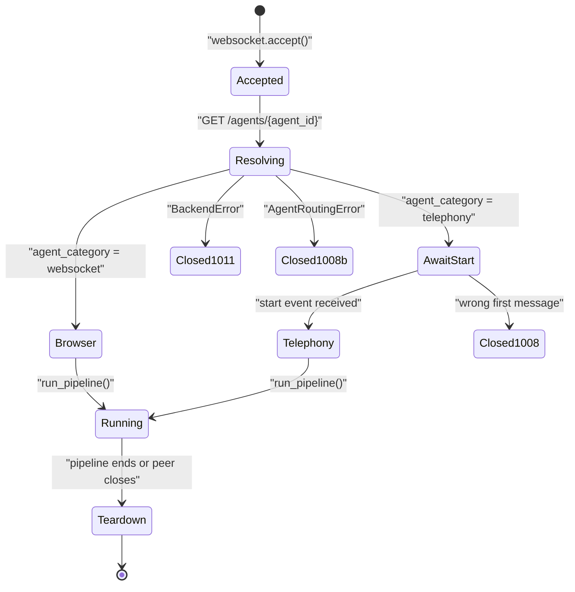

VoicEra has one media WebSocket, served by the runtime, and it behaves differently depending on the agent it resolves. This page documents that route in both modes, the connection lifecycle, and the close codes you will see. It closes with the model-server's own transcription sockets, which are a separate surface.

<Note>
For the client-side view — how to write a browser page or what a provider sends — see [Browser WebSocket agents](../developer/clients/browser-websocket) and [Telephony agents](../developer/clients/telephony). This page is the protocol reference.
</Note>

## `WS /agent/{org_id}/{agent_id}`

Declared in `apps/runtime/routes/agent.py` and mounted with no prefix on the runtime, port `7860`.

| Property | Value |
| --- | --- |
| Path parameters | `org_id`, `agent_id` — both required, both resolved against the API |
| Query parameters | `call_id` — optional, correlates the session with a `CallLogs` document |
| Authentication | **None** |
| Subprotocol | None negotiated |
| Message types | Binary in browser mode; text `start` then binary in telephony mode |

The handler accepts the socket **before** it looks anything up. It then fetches the agent with `backend_client.get_agent(agent_id, org_id)` and branches on `agent_category`. Everything about the session — sample rate, serializer, whether artifacts are persisted — follows from that one field.

<Warning>
There is no authentication on this route. No token, no header, no origin check. The runtime resolves the organisation and the agent entirely from the URL path, so anyone who can reach port `7860` and knows an `org_id` and `agent_id` can open a session and consume your provider quota. Keep the runtime behind a reverse proxy — see [Security hardening](../guides/deployment/security-hardening).
</Warning>

## Telephony mode

Selected when `agent_category` is `telephony`. Entered through `run_telephony_bot()` in `apps/runtime/services/pipecat/runners.py`.

| Property | Value |
| --- | --- |
| Handshake | The client must send a text JSON message with `"event": "start"` as its **first** message |
| Serializer | `create_frame_serializer(provider, stream_sid=..., call_sid=..., sample_rate=...)` |
| Sample rate | `SAMPLE_RATE`, default `8000` |
| `call_id` | From the query string, or created by registering an inbound `CallLog` |
| Artifacts | Transcript and recording uploaded to MinIO; `CallLog` finalised on teardown |

The `start` object is parsed by `parse_stream_start()` in `apps/telephony/webhooks.py`. The provider call SID is resolved from `CallUUID`, `call_uuid`, `call_id`, `callId`, `callSid`, `CallSid`, `request_uuid`, or the same keys nested under `start`; the runtime then falls back to `callSid`, `callId`, `call_uuid` on the `start` object directly, and finally to the literal string `unknown`. The stream SID comes from `streamSid`, then `streamId`, then `unknown`.

The serializer is chosen by the provider id on the agent document, through the registry in `apps/telephony/registry.py`. `plivo` uses Pipecat's `PlivoFrameSerializer`; `vobiz` uses a subclass of it that supports 16 kHz L16, because μ-law is 8 kHz only per the Vobiz specification. The wire format after `start` is therefore the provider's own — the runtime does not define it.

If the first message is not a `start` event, the socket closes with `1008` and reason `Expected start event`.

## Browser mode

Selected when `agent_category` is `websocket`. Entered through `run_websocket_bot()`.

| Property | Value |
| --- | --- |
| Handshake | None — the pipeline starts on connect and the agent speaks the greeting first |
| Serializer | `ProtobufFrameSerializer` from Pipecat |
| Sample rate | `WEBSOCKET_SAMPLE_RATE`, default `16000` |
| `call_id` | From `?call_id=` when valid, otherwise registered via `POST /api/v1/calls/web` |
| Artifacts | `CallLog` with `call_type: web`, plus transcript and recording in MinIO |

Every message in both directions is a binary protobuf `Frame` with a `oneof` over `TextFrame`, `AudioRawFrame`, `TranscriptionFrame`, `MessageFrame`, and `InterruptionFrame`. Audio is signed 16-bit little-endian PCM in `AudioRawFrame.audio`, with `sample_rate` and `num_channels` alongside it. `MessageFrame.data` carries RTVI events as a JSON string. The full schema is reproduced in [Browser WebSocket agents](../developer/clients/browser-websocket).

A supplied `call_id` is accepted only if its `call_type` is `web` and its `agent_id` matches the path; otherwise it is discarded with a warning and a fresh one is registered.

`run_pipeline()` is called with `finalize_call=bool(call_id)` in `apps/runtime/services/pipecat/runners.py`, so a web session with a call log is finalised on teardown exactly like a telephony call.

## Connecting

A minimal connection in browser mode — open the socket, send one audio frame, read frames back. This is the bare protocol; for a working capture-and-playback client see [Browser WebSocket agents](../developer/clients/browser-websocket), which covers the full protobuf `Frame` schema, sample rates, and the audio pipeline.

<CodeGroup>

```javascript JavaScript
const ws = new WebSocket(`ws://localhost:7860/agent/${orgId}/${agentId}`);
ws.binaryType = "arraybuffer";

ws.onopen = () => {
  // Encode a Frame with an `audio` field carrying PCM16 bytes — see
  // the protobuf schema in Browser WebSocket agents — then:
  // ws.send(encodedFrameBytes);
};

ws.onmessage = (event) => {
  // event.data is an ArrayBuffer containing one encoded `Frame`.
  // Decode it with the same protobuf schema to get audio, text,
  // or transcription frames back.
  console.log("received frame bytes:", event.data.byteLength);
};

ws.onclose = (event) => {
  console.log("closed", event.code, event.reason);
};
```

```python Python
import asyncio
import websockets

async def main():
    org_id = "YOUR_ORG_ID"
    agent_id = "YOUR_AGENT_ID"
    uri = f"ws://localhost:7860/agent/{org_id}/{agent_id}"

    async with websockets.connect(uri) as ws:
        # Encode a Frame with an `audio` field carrying PCM16 bytes
        # using the same protobuf schema, then:
        # await ws.send(encoded_frame_bytes)

        async for message in ws:
            # message is bytes containing one encoded `Frame`.
            # Decode it with the protobuf schema to get audio, text,
            # or transcription frames back.
            print("received frame bytes:", len(message))

asyncio.run(main())
```

</CodeGroup>

Both examples connect to a `websocket`-category agent — no handshake message is required, and the agent speaks its greeting first. A `telephony`-category agent instead requires a text `start` event as the first message, sent by the telephony provider, not by an integrator's client; see [Telephony mode](#telephony-mode).

There is no official SDK for either language. Both snippets use each ecosystem's standard WebSocket client (`WebSocket` in the browser, [`websockets`](https://websockets.readthedocs.io/) in Python) plus a protobuf library to encode and decode `Frame` messages against the schema in [Browser WebSocket agents](../developer/clients/browser-websocket#protobuf-and-rtvi-frames).

## Connection lifecycle



In both modes `run_pipeline()` builds the STT, LLM, and TTS services from the agent config and the organisation's stored credentials, assembles the Pipecat pipeline in `factory.py`, registers event handlers, and hands the worker to `run_with_lifecycle()` in `lifecycle.py`. On teardown that function flushes the transcript writer if one exists and, when `finalize_call` is set and a `call_id` is known, patches the `CallLog` with `end_time_utc`, `status: "completed"`, and `call_response: "answered"`, then notifies the campaign orchestrator.

The greeting is queued by the transport handler the moment the transport connects, so the agent speaks before the first inbound audio frame.

## Close codes and failure modes

| Code | Reason | Cause |
| --- | --- | --- |
| `1008` | `Expected start event` | Telephony mode, and the first message was not a `start` event. |
| `1008` | The routing error text, truncated to 120 characters | `AgentRoutingError` — the agent's category or telephony provider could not be resolved. |
| `1011` | The backend error text, truncated to 120 characters | `BackendError` — the runtime could not load the agent, credentials, or call log from the API. |
| `1011` | `Pipeline error` | Any other exception during the session. The runtime logs the traceback. |
| — | Normal close | `WebSocketDisconnect` from the peer. Logged, not an error. |

Every close is attempted inside a `try`/`except` that swallows failures, so a peer that has already vanished does not mask the original error in the logs. The `finally` block always logs `WebSocket closed` with the agent id and call SID — that line is your marker that a session ended.

Failures **before** the branch happen after `accept()`, so a client sees a successful handshake followed by a close rather than an HTTP error. Check the runtime logs, not the status code.

## The model-server ASR sockets

The optional [model server](../developer/model-server/overview) publishes its own gateway on port `8100`, entirely separate from the runtime. It exposes two streaming transcription sockets, both declared in `model-server/gateway/app/main.py`.

| Route | Protocol |
| --- | --- |
| `WS /v1/asr/ws` | VoicEra's own protocol: raw PCM16 in, JSON `partial` / `turn_final` / `closed` out. Not an OpenAI route. |
| `WS /v1/realtime` | OpenAI Realtime transcription, which Pipecat's `OpenAIRealtimeSTTService` speaks. |

The gateway serves both as a transparent relay — the actual protocol is between your client and whichever STT model is deployed in the slot, and a model that does not implement a route simply has nothing listening behind it.

<Note>
Do not assume `/v1/asr/ws` works with every model. Coverage differs per checkpoint:

| Model | `/v1/asr/ws` | `/v1/realtime` |
| --- | --- | --- |
| `indic-conformer` | No | Yes |
| `indic-transcribe` | Yes | Yes |

`models.yaml` records this per model as `streaming_endpoint` and `realtime_endpoint`. `indic-conformer` sets `streaming_endpoint: false` with the note "use OpenAI Realtime instead". Check the flag before pointing a client at a route.
</Note>

Neither route is authenticated. When no STT model is deployed, both accept the socket, send a JSON error frame with `"type": "error"` and `"reason": "upstream_not_configured"`, and close with code `1013`:

```json
{
  "type": "error",
  "reason": "upstream_not_configured",
  "error": "No STT model is deployed. Set STT_MODEL in .env and include stt in COMPOSE_PROFILES."
}
```

Query strings are passed through to the upstream unchanged, so `?language=hi` and `?intent=transcription` reach the model as written.

## Related

* [Browser WebSocket agents](../developer/clients/browser-websocket)
* [Telephony agents](../developer/clients/telephony)
* [Endpoints cheatsheet](endpoints-cheatsheet)
* [REST API](overview)
* [Voice pipeline](../guides/concepts/voice-pipeline)
* [Gateway API](../developer/model-server/gateway-api)
