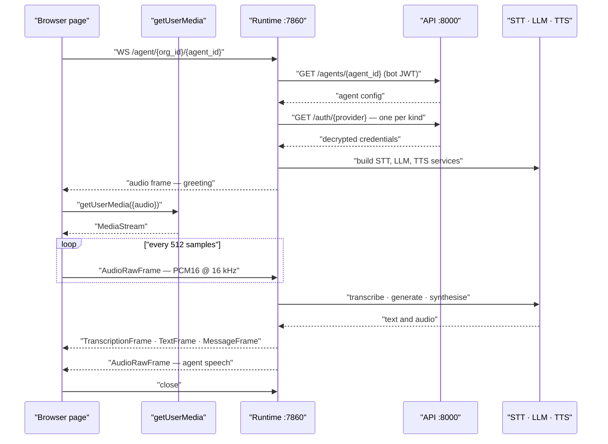

A `websocket` agent talks to a browser directly. There is no telephony provider, no answer webhook, and no phone number — the page opens one WebSocket to the runtime and exchanges Pipecat protobuf frames over it. This page covers the URL, the wire format, and a minimal client.

<Note>
The runtime dispatches on the agent's `agent_category`, not on the path. Browser and telephony clients use the same route. See [Agents and agent categories](../../guides/concepts/agents).
</Note>

## The URL

One route, declared in `apps/runtime/routes/agent.py`:

```text
wss://{VOICE_SERVER_BASE_URL}/agent/{org_id}/{agent_id}
```

`VOICE_SERVER_BASE_URL` is the public base URL of the runtime, set in the root `.env`. The runtime rewrites the scheme itself when it builds telephony URLs (`https://` becomes `wss://`, `http://` becomes `ws://`, in `apps/runtime/constants.py`) — a browser client must do the same when deriving the URL from an HTTP origin.

Locally, with the default port:

```text
ws://localhost:7860/agent/YOUR_ORG_ID/YOUR_AGENT_ID
```

An optional `call_id` query parameter attaches the session to a call log you registered in advance:

```text
ws://localhost:7860/agent/YOUR_ORG_ID/YOUR_AGENT_ID?call_id=YOUR_CALL_ID
```

Omit it and the runtime registers one itself. See [What is recorded](#what-is-recorded).

## The websocket agent category

The runtime loads the agent from the API and branches immediately:

* `agent_category` is `websocket` — `run_websocket_bot()` runs, using `ProtobufFrameSerializer` at `WEBSOCKET_SAMPLE_RATE`, and no `start` event is expected.
* `agent_category` is `telephony` — the runtime blocks waiting for a provider `start` JSON message and closes with code `1008` if the first message is anything else.

So a browser connecting to a telephony agent hangs until it sends a `start` frame it has no reason to send. Create the agent with `agent_category: "websocket"` and omit `telephony_provider`. `GET /api/v1/agents/{agent_id}` tells you which category an existing agent has.

## Protobuf and RTVI frames

The transport is `ProtobufFrameSerializer` from Pipecat — every message in both directions is a binary protobuf `Frame`. The schema the dashboard compiles at runtime, and which the runtime speaks:

```protobuf
syntax = "proto3";
package pipecat;

message TextFrame {
  uint64 id = 1;
  string name = 2;
  string text = 3;
}

message AudioRawFrame {
  uint64 id = 1;
  string name = 2;
  bytes audio = 3;
  uint32 sample_rate = 4;
  uint32 num_channels = 5;
  optional uint64 pts = 6;
}

message TranscriptionFrame {
  uint64 id = 1;
  string name = 2;
  string text = 3;
  string user_id = 4;
  string timestamp = 5;
}

message MessageFrame {
  string data = 1;
}

message InterruptionFrame {
  uint64 id = 1;
  string name = 2;
}

message Frame {
  oneof frame {
    TextFrame text = 1;
    AudioRawFrame audio = 2;
    TranscriptionFrame transcription = 3;
    MessageFrame message = 4;
    InterruptionFrame interruption = 5;
  }
}
```

You send `audio` frames carrying signed 16-bit little-endian PCM. You receive `audio` frames to play, and `transcription`, `text`, and `message` frames to render. `MessageFrame.data` is a JSON string carrying RTVI events.

The supported client library is `@pipecat-ai/websocket-transport` (with `@pipecat-ai/client-js` / `@pipecat-ai/client-react`). The dashboard uses that stack — see [Browser test calls](../frontend/test-calls) and `frontend/src/lib/pipecat/createBrowserClient.ts`.

## Sample rate

Browser sessions run at `WEBSOCKET_SAMPLE_RATE`, which defaults to `16000` in `.env.example`. Telephony runs at `SAMPLE_RATE`, default `8000`. Set the same rate on your client recorder/player and in the `sample_rate` field of every `AudioRawFrame` you send. Mismatched rates do not error — they produce audio at the wrong pitch and speed.

## A minimal client

Prefer the official packages over hand-rolled protobuf:

```javascript
import { PipecatClient } from "@pipecat-ai/client-js";
import {
  WebSocketTransport,
  ProtobufFrameSerializer,
} from "@pipecat-ai/websocket-transport";

const client = new PipecatClient({
  transport: new WebSocketTransport({
    serializer: new ProtobufFrameSerializer(),
    recorderSampleRate: 16000,
    playerSampleRate: 16000,
  }),
  enableMic: true,
  enableCam: false,
});

await client.connect({
  wsUrl: `ws://localhost:7860/agent/${orgId}/${agentId}`,
});
```

The dashboard connects through the Next rewrite (`ws(s)://{host}/agent/...`) after `POST /calls/web`. For a standalone page talking to the runtime directly, use the runtime host as above.

## Authentication and CORS

<Warning>
The runtime WebSocket has **no authentication**. `apps/runtime/routes/agent.py` accepts the socket before doing anything else, and resolves the organisation and agent purely from the path. There is no token, no header check, and no origin check. Anyone who can reach port `7860` and knows an `org_id` and `agent_id` can hold a conversation with your agent and spend your provider credits.
</Warning>

Treat the runtime as an internal service and put a reverse proxy in front of it. Terminate TLS there, restrict by origin or source address, and add your own authentication if the page is public. See [Security hardening](../../guides/deployment/security-hardening).

CORS does not apply to WebSockets, so there is nothing to configure for the media connection. The REST calls your page makes alongside it — fetching the agent list, for example — hit the API on `:8000`, whose `CORSMiddleware` in `apps/api/app/main.py` is configured with `allow_origins=["*"]`. That is convenient for local development and too permissive for production.

## What is recorded

Browser sessions are logged like telephony calls.

On connect the runtime resolves a `call_id`:

1. If the URL carries `?call_id=`, it loads that call log and checks two things — `call_type` must be `web`, and `agent_id` must match the path. A mismatch is logged and the id discarded.
2. Otherwise, or after a discard, it registers a new one with `POST /api/v1/calls/web`.

With a `call_id` in hand the transcript writer and recording handlers are registered, exactly as for telephony.

| Artifact | Telephony call | Browser session |
| --- | --- | --- |
| `CallLogs` document | Created, `call_type` `inbound` or `outbound` | Created, `call_type` `web` |
| Transcript in MinIO | Uploaded at call end | Uploaded at call end |
| Recording in MinIO | Uploaded at call end | Uploaded at call end |
| Duration and disposition | Patched onto the CallLog | Patched onto the CallLog |

Artifacts land under the same paths — `voicera-calls/{org_id}/{call_id}/` — and are fetched through the same authenticated API routes.

Pre-register only when your page needs the `call_id` before the session begins:

```bash
curl -X POST http://localhost:8000/api/v1/calls/web \
  -H "Authorization: Bearer $TOKEN" \
  -H "Content-Type: application/json" \
  -d '{"agent_id": "'"$AGENT_ID"'", "custom_variables": {"customer_name": "Jane"}}'
```

The `transcription`, `text`, and `message` frames still give you the turn-by-turn text live, which is what you render during the call.

## Sequence



The greeting is queued the moment the transport connects, before the first microphone frame arrives — so the agent speaks first.

## Related

* [Connecting a client](index)
* [Telephony agents](telephony)
* [WebSocket API](../../api-reference/websocket-api)
* [Agent configuration](../reference/agent-configuration)
* [Browser test calls](../frontend/test-calls)
