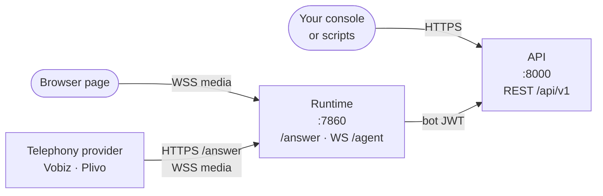

VoicEra is API-first: every interaction — creating an agent, placing a call, streaming audio — arrives over HTTP or a WebSocket, and the bundled dashboard is itself just a client of those surfaces. This page names the three a client can use and tells you which one your case needs.

<Note>
If you only want to configure agents and read call logs, you need the REST API and nothing else. The two media surfaces exist to carry audio.
</Note>

## Three ways in

| Surface | Where | Who connects | What it carries |
| --- | --- | --- | --- |
| REST API | `:8000`, under `/api/v1` | Your console, scripts, CI, the dashboard | Everything configuration and control: users, organisations, agents, phone numbers, calls, campaigns, knowledge documents. |
| Browser WebSocket | Runtime `:7860`, `WS /agent/{org_id}/{agent_id}` | A browser page you write | Live microphone audio in, agent audio out, as Pipecat protobuf frames. |
| Telephony media stream | Runtime `:7860`, `GET|POST /answer` then `WS /agent/{org_id}/{agent_id}` | Your telephony provider, on behalf of a caller | The provider's answer webhook and its bidirectional media stream. |

The runtime is not a second control plane. It reads agent configuration and provider credentials from the API using a bot JWT, and writes call artifacts back the same way. A client never talks to both for the same purpose.

## Choosing an agent category

An agent's `agent_category` decides which media surface applies to it. It is fixed at create time and changing it on a `PATCH` tears down or provisions the telephony attachment.

| `agent_category` | `/answer` | `WS /agent/{org_id}/{agent_id}` | Sample rate | CallLogs |
| --- | --- | --- | --- | --- |
| `telephony` | Returns provider Stream XML | Expects the provider `start` event first | `SAMPLE_RATE`, default `8000` | Created; transcript and recording persisted |
| `websocket` | Returns `400` | Direct browser connection, protobuf frames | `WEBSOCKET_SAMPLE_RATE`, default `16000` | Created as `call_type: web`; transcript and recording persisted |

Both categories run the same Pipecat pipeline. The difference is the frame serializer, the sample rate, and how the `CallLog` is created — a telephony call is registered from the provider webhook, a browser session through `POST /api/v1/calls/web`.

* Building a phone agent? Use `telephony` and read [Telephony agents](telephony).
* Building an in-page voice widget or a demo? Use `websocket` and read [Browser WebSocket agents](browser-websocket).

## The dashboard

The bundled Next.js dashboard is a client like any other: it drives the REST API for configuration and opens the runtime WebSocket for browser test calls.

<Warning>
The dashboard container runs the Next.js development server. Build it properly before putting it in front of users. See [Dashboard](../frontend/overview).
</Warning>

It is still the most complete worked example of a VoicEra client, and [Browser WebSocket agents](browser-websocket) quotes its audio implementation.

## Building your own console

Everything the dashboard does is available to you:

1. `POST /api/v1/users/signup` creates the first user, an organisation, and a `super_admin` membership. `POST /api/v1/users/login` returns the JWT every other call needs.
2. `POST /api/v1/auth` stores provider credentials for the organisation, encrypted at rest.
3. `GET /api/v1/configuration/{stt,tts,llm,telephony}` returns the provider catalogue and per-provider setting schemas — enough to render a form without hard-coding a vendor list.
4. `POST /api/v1/agents` creates the agent. For `telephony` agents the API provisions the provider application and stores the answer URL on the agent document.
5. From there, place calls, run campaigns, or open the media WebSocket.

The full route list is in the [Endpoints cheatsheet](../../api-reference/endpoints-cheatsheet); the request and response shapes are in the [REST API reference](../../api-reference/overview). A running API also serves an interactive console at `http://localhost:8000/docs`, generated from the same routers, so it never drifts.

## Related

* [Browser WebSocket agents](browser-websocket)
* [Telephony agents](telephony)
* [REST API](../../api-reference/overview)
* [WebSocket API](../../api-reference/websocket-api)
* [Agents and agent categories](../../guides/concepts/agents)
