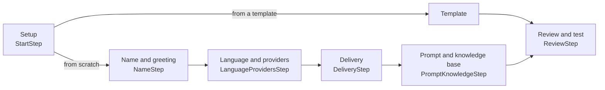

The wizard at `/agent-creation` walks you through building an agent config and ends by creating it with `POST /agents`. It is the dashboard's main reason to exist: the agent config is a deeply nested object, and the wizard assembles it from provider catalogs the API serves rather than making you type it.

<Warning>
The dashboard container runs Next.js in **development** mode with the source bind-mounted. That is right for local work and wrong for anything user-facing — see [Production deployment](../../guides/deployment/production).
</Warning>

## The steps

Six entries, declared as `STEPS` in `frontend/src/app/(app)/agent-creation/page.tsx`. The footer counts them as five — `Step {step + 1} of {STEPS.length - 1}` — because Setup is a chooser rather than a form step. The stepper lets you jump **backwards** only: `SectionNav` receives `disabled: i > step`, so a step ahead of you is not clickable, and the Next button enforces the gates.



| Step | Component | What it does |
| --- | --- | --- |
| Setup | `StartStep.tsx` | Choose "start from scratch" or browse the template gallery. |
| Name & greeting | `NameStep.tsx` | The agent's name and its opening line. |
| Language & providers | `LanguageProvidersStep.tsx` + `AgentStackFields.tsx` | Pick languages, then STT, TTS and LLM providers, a voice and a model. |
| Delivery | `DeliveryStep.tsx` | How the agent is reached — telephony or browser websocket. |
| Prompt & knowledge base | `PromptKnowledgeStep.tsx` | System prompt, the prompt library, and attaching knowledge documents. |
| Review & test | `ReviewStep.tsx` | Read the whole config back, create the agent, then open a live browser call in `CallStage`. |

Templates short-circuit the middle: picking one merges its `set` object into the form and jumps straight to Review. There are nine templates across eight categories plus an "All" filter (`TEMPLATES` and `TPL_CATS` in `frontend/src/lib/wizard-data.ts`) — mandi rates, pension status, grievance intake, and similar Indic public-service starting points. They set names, greetings, languages, and prompts; they do not set providers, so you still need the stack step's choices before the agent can be created.

The Next button is disabled until:

* **Name & greeting** — the agent has a name, or "Give it a name to continue".
* **Language & providers** — at least one language plus an STT, TTS and LLM provider and an LLM model (`languageProvidersReady`), or "Select a language and STT/TTS/LLM providers to continue".

Next is also disabled while the catalogs are still loading. There is no step after Review, which creates the agent itself.

## How catalogs populate

Nothing in the form's provider dropdowns is hardcoded. `frontend/src/lib/use-wizard-catalogs.ts` fetches everything from the API and re-fetches as your selections change.

On mount, and again whenever the language selection changes, it issues six requests in parallel:

| Request | Purpose |
| --- | --- |
| `GET /languages` | The full language id → label map. |
| `GET /configuration/stt?languages=…` | STT providers that support the selected languages. |
| `GET /configuration/tts?languages=…` | TTS providers that support the selected languages. |
| `GET /configuration/llm` | LLM providers (not language-filtered). |
| `GET /configuration/telephony` | Telephony providers, for the delivery dropdown. |
| `GET /auth/configured` | Which providers this organisation has credentials for. |

The last one is the important filter. `filterToConfigured()` intersects each provider list with `GET /auth/configured`, so **a provider you have not connected under Integrations never appears in the wizard**. If your stack step shows an empty dropdown, the fix is to add credentials — see [Provider credentials (ProviderAuth)](../reference/provider-auth).

Once you pick a provider, a second round of requests fetches its field schema:

* `GET /configuration/stt/setting/{provider}?languages=…`
* `GET /configuration/tts/setting/{provider}?languages=…`
* `GET /configuration/llm/setting/{provider}`

These return a `fields` map — each field carrying a `type`, `default`, `examples`, and a `secret` flag (`ProviderSettingsCatalog` in `frontend/src/lib/catalog-types.ts`). The wizard turns them into UI directly:

* `modelOptionsFromSettings()` builds the LLM model dropdown from the `model` field's `examples`.
* `voiceOptionsFromSettings()` builds the voice picker from the `voice` field's `examples`.
* `voiceFieldIsFreeText()` switches the voice picker to a text input when a provider has no enumerated voices — Cartesia's voice UUIDs, for example.

The language list is narrowed the same way. A separate effect fetches the settings for every *configured* STT and TTS provider and unions their `language` field `examples` into `availableLanguages`, so the language chips only offer languages your connected providers can actually handle. If that lookup yields nothing, it falls back to the full `GET /languages` map rather than showing an empty list.

When you change languages, providers that no longer appear in the filtered catalogs are dropped and replaced with the first still-valid option. Model and voice selections are reconciled the same way.

`frontend/src/lib/wizard-data.ts` still contains hardcoded `LLM_PROVIDERS`, `STT_PROVIDERS` and `TTS_PROVIDERS` arrays with provider and model names. Nothing imports them — they are leftovers from the pre-API prototype. The live wizard reads catalogs only. Do not use those arrays as a provider inventory.

## The prompt library

The Instructions step has an "insert from library" action that opens `PromptLibraryDialog.tsx`. It offers nine reusable prompt fragments from `frontend/src/lib/prompt-modules.ts`, filed under five categories — Tone, Escalation, Compliance, Language, and Verification.

Each module is static text with a short rationale: a warm rural-helpline tone, an escalation phrasing, a verification script. Selecting one appends its text to your system prompt with a blank line between, and the dialog marks it "Added" if the text is already present so you cannot insert it twice.

These are text snippets shipped with the dashboard, not API data. The API has no prompt-library endpoint. There is no standalone page for browsing them outside the wizard — an earlier `/library` route that mirrored the picker was removed.

## What it posts to the API

`formToAgentCreatePayload()` in `frontend/src/lib/agent-mapper.ts` turns the flat form into the nested agent body. `ReviewStep.tsx` calls it for both paths: `createAgent()` for a new agent, and `updateAgent()` — `PATCH /agents/{agent_id}` — when the edit page supplied one.

**Agent category is derived, not chosen directly.** If the delivery dropdown has a telephony provider selected, `agent_category` is `"telephony"` and `telephony_provider` is included. If it is empty, the agent is `"websocket"` — the default, and the only kind that can take a browser test call. See [Agents and agent categories](../../guides/concepts/agents).

**Languages split by position.** The first language chip becomes `language.primary`; the rest become `language.secondary`.

**Model configs come from the catalogs, not the form.** `buildModelConfigsFromCatalogs()` calls `settingsToModelConfig()` (`frontend/src/lib/catalog-utils.ts`), which walks the provider's field schema and, for each non-secret field, takes your override if you set one, else the field's `default`, else its first `example`. Secret fields and `provider` / `kind` / `name` are skipped — credentials live in ProviderAuth, never in the agent config. Only three overrides are passed: the primary language, the chosen voice, and the chosen LLM model.

The resulting body:

```json
{
  "name": "Kisan Sahayak",
  "agent_category": "websocket",
  "config": {
    "schema_version": 1,
    "prompts": {
      "system_prompt": "...",
      "greeting_message": "..."
    },
    "behaviour": {
      "interruption_min_words": 3,
      "user_silence_hangup_seconds": 30,
      "call_timeout_seconds": 600,
      "ignore_user_speech_before_greeting": true,
      "hold_messages": ["Ek minute dekh raha hoon"],
      "hold_message_timeout_seconds": 5,
      "user_online_detection_enabled": true,
      "user_online_detection_message": "Are you still there?",
      "user_online_detection_seconds": 90,
      "user_online_detection_repeats": 1,
      "user_online_detection_closing_message": "I'll end the call now. Goodbye."
    },
    "language": { "primary": "hi", "secondary": [] },
    "models": {
      "stt_config": { "provider": "..." },
      "tts_config": { "provider": "...", "voice": "..." },
      "llm_config": { "provider": "...", "model": "..." }
    },
    "knowledge_base": { "enabled": false, "document_ids": [], "top_k": 5 }
  }
}
```

Several values in `behaviour` and `knowledge_base` are **constants the mapper hardcodes**, not wizard inputs: `hold_message_timeout_seconds` (5), all four `user_online_detection_*` values apart from the enabled toggle, and `top_k` (5). To change them, edit the agent over the API. Field meanings are in [Agent configuration](../reference/agent-configuration).

<Note>
`AgentForm` still carries `tokens`, `temperature`, and `bufferMs` (`frontend/src/lib/wizard-data.ts`), but no step renders a control for them and `formToAgentCreatePayload()` never reads them. They are dead form state. Set LLM sampling parameters over the API instead.
</Note>

If the provider settings have not finished loading, the mapper throws rather than posting a half-built config — the wizard surfaces this as "Provider settings are still loading."

On success, `ReviewStep` holds the returned `agent_id` and opens a live browser call against it in `CallStage`. See [Browser test calls](test-calls).

## Related

* [Browser test calls](test-calls)
* [Dashboard tour](dashboard-tour)
* [Agents and agent categories](../../guides/concepts/agents)
* [Agent configuration](../reference/agent-configuration)
* [Create your first agent](../../guides/dashboard/create-an-agent)
