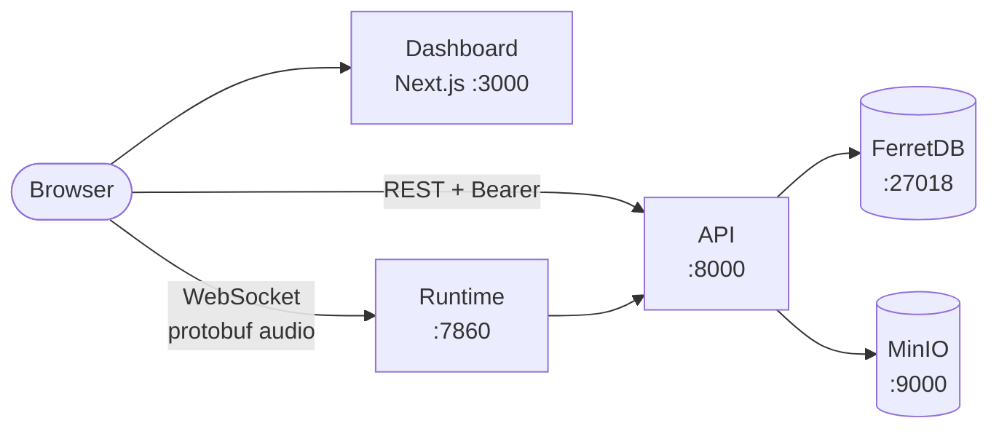

The web console for VoicEra. It starts with the rest of the stack and covers agents, numbers, campaigns, knowledge documents, call history, and per-call latency.

<Warning>
The `frontend` container runs the Next.js **development** server with your checkout bind-mounted. Right for local work, wrong for anything user-facing — see [Production deployment](../../guides/deployment/production).
</Warning>

## Where it sits

The dashboard is a browser client of the same public API as any other. It adds no server of its own — Next.js serves the pages, and every data request goes from the browser straight to the API or the runtime.

Next.js serves the pages, but the data never flows through it: every REST call and the audio WebSocket go straight from the browser to the API and the runtime. There is no server-side proxy and no session on the Next.js side.

## The pages

| Page | Covers |
| --- | --- |
| [Overview](overview) | What it is, its stack, and which API surfaces it consumes. |
| [Running the dashboard](running) | Cloning the branch, installing, and pointing it at your stack. |
| [Agent creation wizard](agent-wizard) | The guided flow from provider keys to a working agent. |
| [Dashboard tour](dashboard-tour) | Every route: agents, numbers, campaigns, knowledge base, history, telemetry, members, integrations. |
| [Browser test calls](test-calls) | Talking to an agent from the browser, and how the audio path works. |

## Why it is documented at all

Everything the dashboard does goes through the public REST API. It is the most complete worked example of a VoicEra client — useful reading even if you build your own console.

## Related

* [Connecting a client](../clients/index) — the surfaces the dashboard uses
* [REST API](../../api-reference/overview)
