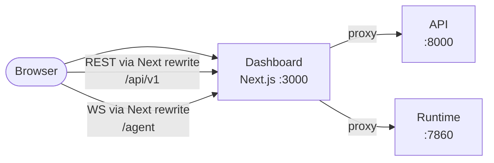

The dashboard is a Next.js web console that sits on top of the VoicEra REST API. It gives you a browser interface for creating agents, wiring provider credentials, attaching phone numbers, and reviewing call history — work you would otherwise do with HTTP requests against `/docs`.

<Warning>
The dashboard container runs Next.js in **development** mode with the source bind-mounted. That is right for local work and wrong for anything user-facing — see [Production deployment](../../guides/deployment/production).
</Warning>

## What it is

A single-page-feel Next.js App Router application under `frontend/` — 119 files, all client-rendered behind an auth gate. It holds no state of its own: it authenticates against `POST /users/login`, stores the bearer token in browser `localStorage` (`frontend/src/lib/auth-storage.ts`), and every screen is a view onto an API call.

Because it is a browser client, it can do one thing the API alone cannot: place a live microphone call to a `websocket` agent through the runtime. See [Browser test calls](test-calls).

## Status

| Fact | Value |
| --- | --- |
| In `docker-compose.yaml` | Yes — the `frontend` service |
| Directory | `frontend/` |
| Container | `voicera_oss_frontend` |
| Port | `${FRONTEND_HOST_PORT:-3000}` |
| Build mode | `npm run build` + `npm run start` — a real production build, proxied through Next's own server |
| Maturity | The language map is the last screen still drawing fixed sample data |

The API knows about the dashboard in exactly one place: `FRONTEND_URL` (default `http://localhost:3000`) is used to build password-reset links in `apps/api/app/services/user_service.py`. Nothing else in the core stack depends on it.

<Note>
`frontend/README.md` is unmodified `create-next-app` boilerplate. Ignore it — the behaviour described on these pages comes from the source files.
</Note>

## The stack

| Package | Version |
| --- | --- |
| `next` | 16.3.3 |
| `react` / `react-dom` | 19.2.8 |
| `tailwindcss` | 4 |
| `typescript` | 5 |
| `framer-motion` | 13 |
| `recharts` | 3.10 — the Telemetry per-turn latency chart |
| `jspdf` | 4.2 |
| `d3` + `topojson-client` | 7 / 3 — the language map |
| `lucide-react` | 1.35 — icons |
| `@pipecat-ai/client-js` | Pipecat client for browser test calls |
| `@pipecat-ai/websocket-transport` | Protobuf WebSocket transport (16 kHz) |
| `@pipecat-ai/client-react` | Provider, audio, mic, devices, VoiceVisualizer, conversation |

All versions are from `frontend/package.json`. There is no state-management library, no data-fetching library, and no component framework: fetches go through a single `apiFetch` helper and state is plain React hooks.

## What it talks to

Two services, over two protocols.

Next.js serves the pages and proxies both REST (`/api/v1/*` → `API_PROXY_TARGET`) and browser test-call WebSockets (`/agent/...` → `RUNTIME_PROXY_TARGET`). `frontend/src/lib/api/http.ts` calls same-origin `/api/v1`, and `frontend/src/lib/pipecat/createBrowserClient.ts` opens a same-origin WebSocket that Next forwards to the runtime.

### API surfaces it consumes

Every request is built in `frontend/src/lib/api-client.ts` or `frontend/src/lib/api/*.ts`. Paths below are relative to the API base, which defaults to `http://localhost:8000/api/v1`.

| Module | Endpoints it calls | API router |
| --- | --- | --- |
| `api-client.ts` (agents) | `GET /agents`, `GET /agents/{id}`, `POST /agents`, `PATCH /agents/{id}`, `DELETE /agents/{id}` | agents |
| `api-client.ts` (provider auth) | `GET /auth/catalog`, `GET /auth/configured`, `POST /auth`, `GET /auth/{provider}`, `DELETE /auth/{provider}` | [ProviderAuth](../reference/provider-auth) |
| `api-client.ts` (catalogs) | `GET /languages`, `GET /configuration/{stt,tts,llm,telephony}`, `GET /configuration/{stt,tts}/setting/{provider}`, `GET /configuration/llm/setting/{provider}` | configuration |
| `api/users.ts` | `POST /users/login`, `POST /users/signup`, `GET /users/me`, `GET /users/organisations`, `POST /users/switch-organisation`, `GET /users/check/{email}`, `GET /users/{email}`, `POST /users/forgot-password`, `POST /users/reset-password` | users |
| `api/members.ts` | `POST /members/invite`, `GET /members/{org_id}`, `POST /members/assign-admin`, `POST /members/remove` | members |
| `api/organisations.ts` | `DELETE /organisations/{org_id}` | organisations |
| `api/phone-numbers.ts` | `GET /phone-numbers`, `GET /phone-numbers/providers/{provider}/inventory`, `POST /phone-numbers/attach`, `DELETE /phone-numbers/detach` | phone numbers |
| `api/calls.ts` | `POST /calls/outbound`, `POST /calls/web`, `GET /calls/org/{org_id}`, `GET /calls/{call_id}`, `GET /calls/{call_id}/recording`, `GET /calls/{call_id}/transcript`, `GET /calls/{call_id}/metrics` | calls |
| `api/campaigns.ts` | `GET /campaign/`, `POST /campaign/upload`, `POST /campaign/create`, `POST /campaign/{id}/start`, `POST /campaign/{id}/pause`, `POST /campaign/{id}/resume`, `POST /campaign/{id}/redial`, `GET /campaign/{id}/runs` | campaign |
| `api/knowledge.ts` | `GET /knowledge`, `POST /knowledge/upload`, `DELETE /knowledge/{document_id}` | knowledge |

Recordings and transcripts come back as blobs rather than JSON, because `<audio src>` cannot send an `Authorization` header — `apiFetchBlob` fetches them with the bearer token and the UI builds an object URL.

`frontend/src/lib/api-types.ts` holds the TypeScript shapes for all of the above; it is the frontend's copy of the API contract, not a generated client.

## When to use it instead of the API

| Task | Better in |
| --- | --- |
| Placing a browser microphone test call | Dashboard — the API has no way to do this |
| Reading a provider's exact credential fields before filling them | Dashboard — it renders `GET /auth/catalog` as a form |
| Building an agent config without hand-writing the nested JSON | Dashboard — [the wizard](agent-wizard) assembles it |
| Listening to a recording next to its transcript | Dashboard — the call detail view aligns both |
| Running campaigns | Either — the Campaigns screen covers upload, create, start, pause, resume, and redial |
| Uploading knowledge documents | Either — the Knowledge Base screen lists, uploads, and deletes |
| Anything scripted, scheduled, or reproducible | API — see [REST API](../../api-reference/overview) |

Treat the dashboard as a convenience layer for exploration and one-off setup. Production operations belong on the API.

## Related

* [Running the dashboard](running)
* [Agent creation wizard](agent-wizard)
* [Browser test calls](test-calls)
* [Agents and agent categories](../../guides/concepts/agents)
* [REST API](../../api-reference/overview)
