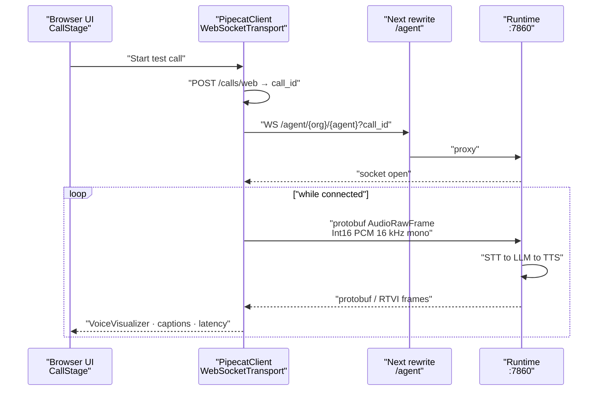

The dashboard can talk to an agent through your laptop's microphone and speakers — no phone number, no telephony provider, no public URL. This is the one capability the dashboard has that the REST API does not, and it is the fastest way to hear whether a prompt, a voice, or a language choice actually works.

<Warning>
The dashboard container runs Next.js in **development** mode with the source bind-mounted. That is right for local work and wrong for anything user-facing — see [Production deployment](../../guides/deployment/production).
</Warning>

## What a browser test call is

A live, bidirectional audio session between your browser and the [runtime](../services/runtime), running the same STT → LLM → TTS pipeline a real caller would hit. Your microphone replaces the phone line; the runtime's telephony frame serializer is replaced by Pipecat's protobuf serializer.

You reach it from two places, both rendering `BrowserCallSession` → `CallStage`:

* **`AgentTestModal.tsx`** — the Test action on a `websocket` agent's card on `/dashboard`. It shows the call stage next to a summary of the agent's language, STT, TTS, voice, LLM and model.
* **`ReviewStep.tsx`** — the final step of the [agent creation wizard](agent-wizard). It creates the agent first, then connects to the id that comes back.

The stage shows transport status, a call timer, live turn latency (user stopped speaking → bot started speaking), mic mute, a mic device picker, Pipecat `VoiceVisualizer` bars, and live captions from `usePipecatConversation`.

## Requirements

| Requirement | Why |
| --- | --- |
| An agent with `agent_category` of `websocket` | The runtime returns a telephony media path for `telephony` agents. `AgentsHome.tsx` branches on this field and offers `telephony` agents an outbound phone call instead. |
| The Next.js rewrite for `/agent/...` | Browser opens a **same-origin** WebSocket; Next proxies it with `RUNTIME_PROXY_TARGET` (default `http://127.0.0.1:7860`, Compose `http://runtime:7860`). See [Running the dashboard](running). |
| Provider credentials configured | The runtime loads them from the API. Without them the pipeline cannot start. |
| Microphone permission | Requested by the Pipecat client when the call connects. |
| A secure context or localhost | Browsers only grant microphone access on HTTPS or `localhost`. |

To make a `websocket` agent in the wizard, leave the delivery dropdown on its default — "WebSocket — browser test". Selecting a telephony provider makes it a `telephony` agent instead. Categories are covered in [Agents and agent categories](../../guides/concepts/agents).

## The audio path



The dashboard uses the official Pipecat packages:

* `@pipecat-ai/client-js` — `PipecatClient`
* `@pipecat-ai/websocket-transport` — `WebSocketTransport` + `ProtobufFrameSerializer` at **16000** Hz (matches `WEBSOCKET_SAMPLE_RATE`)
* `@pipecat-ai/client-react` — `PipecatClientProvider`, `PipecatClientAudio`, mic control, media devices, `VoiceVisualizer`, `usePipecatConversation`, transport state, RTVI events

Factory and connect helpers live in `frontend/src/lib/pipecat/createBrowserClient.ts`. Before `connect()`, the helper calls `createWebCall({ agent_id })` (best-effort) so the CallLog exists and the socket can carry `?call_id=`.

Live **turn latency** is measured in the browser: timestamp on `UserStoppedSpeaking`, then `Turn Xms` when `BotStartedSpeaking` fires. Post-call pipeline metrics are still persisted by the runtime observers as before.

WebSocket transport only exposes a **local** `MediaStreamTrack`, so `VoiceVisualizer` always uses `participantType="local"` (bot visualizer would draw nothing). Bars restyle when the agent is speaking.

## How it connects

One WebSocket, to the same route telephony uses. The runtime dispatches on the agent's `agent_category`, so the path does not change:

```text
ws(s)://{dashboard-host}/agent/{org_id}/{agent_id}?call_id=…
```

`org_id` comes from the stored session, `agent_id` from the agent being tested. The socket itself carries no handshake message and no auth token: the runtime resolves the agent from the path and loads its config and provider credentials from the API itself.

On disconnect / unmount the Pipecat client releases the microphone and closes the socket.

## Limitations

<Note>
**Browser test calls are recorded.** The browser registers a `call_type: web` CallLog with `POST /calls/web` before connecting, so a transcript and recording are stored under the same MinIO paths as telephony calls. The captions shown during the call, however, live only in React state and are gone when you close the modal — read the stored transcript through `GET /api/v1/calls/{call_id}/transcript`.
</Note>

Other constraints worth knowing:

* **Telephony agents cannot take a browser call.** The runtime expects a provider `start` event on that socket. Use `POST /calls/outbound` and a real phone instead.
* **No authentication on the socket.** Anyone who can reach the runtime port and knows an `org_id` and `agent_id` pair can open a session. Do not expose port 7860 publicly without a proxy that authenticates. See [Security hardening](../../guides/deployment/security-hardening) and [Public voice URLs](../../guides/deployment/public-voice-urls).
* **A test call in the wizard creates a real agent.** The Test call step calls `POST /agents` before it can connect. Abandoning the wizard afterwards leaves the agent in your organisation.

## Related

* [Browser WebSocket agents](../clients/browser-websocket)
* [Agent creation wizard](agent-wizard)
* [Dashboard tour](dashboard-tour)
* [Agents and agent categories](../../guides/concepts/agents)
* [Runtime (apps/runtime)](../services/runtime)
* [WebSocket API](../../api-reference/websocket-api)
