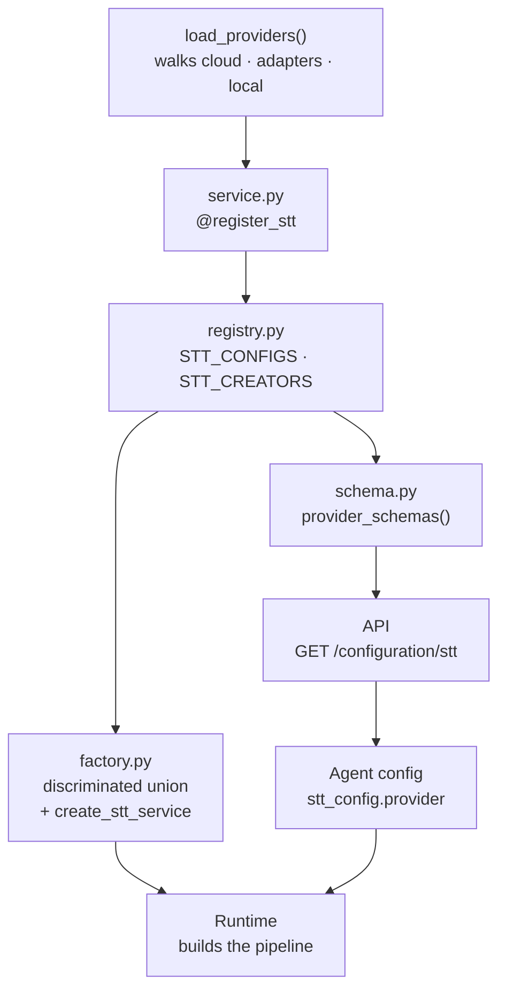

How to add a speech-to-text, text-to-speech, or large-language-model vendor to `apps/providers`. Adding a provider means creating one folder and registering one creator function per capability. You never edit a central dispatch table.

## Quick reference

**Create, and only these:**

```
apps/providers/{cloud|adapters|local}/<name>/
  catalog.py        # languages + settings map, voice/URL constants — no Pydantic
  config.py          # Auth, Settings, Config classes — pure Pydantic
  service.py          # @register_stt / @register_tts / @register_llm creators
  __init__.py          # empty
```

Which of `cloud/`, `adapters/`, `local/` you pick **is** the `provider_type` — see [Cloud, adapter, or local](#cloud-adapter-or-local).

**Never touch:** `apps/providers/factory.py`, `registry.py`, `schema.py`. Discriminated unions and the catalog dump are derived from your registration, not edited.

**One required edit outside your folder:** bump the relevant count in `test_union_variant_counts_match_registry` (`apps/providers/tests/test_provider_schemas.py`) — the number of STT/TTS/LLM variants it asserts. This is the one place a manual edit is expected; forgetting it just means the test fails and tells you, so it's the intended way to catch a mis-registered provider.

**Only legitimate exception:** `apps/runtime/requirements.txt`, if your vendor needs a Pipecat extra not already installed.

<Note>
This page is the how-to. For *why* the registry works this way — discriminated unions, the catalog dump, and where credentials live — read [Provider registry](../reference/provider-registry).
</Note>

## Before you start

Read `apps/providers/README.md` and open one existing vendor folder side by side with your editor. `apps/providers/cloud/deepgram/` is the clearest STT example, `cloud/cartesia/` the clearest TTS one, and `cloud/openai/` shows one folder serving all three kinds.

Check two things first:

* **Does Pipecat already support the vendor?** If `pipecat.services.<vendor>` exists, your `service.py` is a handful of lines. If not, you are writing an adapter — see [Cloud, adapter, or local](#cloud-adapter-or-local).
* **What are the credentials?** Everything the vendor authenticates with goes on an `Auth` class and is marked `secret`. Everything else — voices, endpoints, speeds — goes on `Settings`.

## Cloud, adapter, or local

`provider_type` is not something you declare. `apps/providers/schema.py` derives it from the config class's module path, so the directory you choose *is* the decision:

| Directory | `provider_type` | Use when |
| --- | --- | --- |
| `cloud/<vendor>/` | `cloud` | Pipecat already ships a service class for the vendor and you are configuring it. 22 vendors live here. |
| `adapters/<vendor>/` | `adapter` | You are writing the Pipecat service subclass yourself. Two examples: `adapters/bhashini/` (`tts.py`, NVCF gRPC) and `adapters/kenpath/` (`llm.py`, JWT-signed Vistaar HTTP). |
| `local/<vendor>/` | `local` | The vendor is VoicEra's own [model server](../model-server/overview) gateway, not a third-party API. Two examples: `local/indic_orpheus/` (TTS) and `local/indic_nemotron/` (STT). |

Kenpath's two LLM services also carry a provider-specific hangup convention — they end the call when their own streamed text contains the word "goodbye", instead of the config-driven `automatic_call_ending` tool. See [Voice pipeline → Provider-specific call ending: Kenpath](../../guides/concepts/voice-pipeline#provider-specific-call-ending-kenpath).

Put the folder in the wrong place and `_provider_type()` raises with a message telling you exactly that.

## The six steps

These are the steps from `apps/providers/README.md`, which is the authoritative version.

1. Add `cloud/<name>/`, `adapters/<name>/`, or `local/<name>/` with `catalog.py`, `config.py`, and `service.py`. For STT/TTS, put languages + settings in one `*_CAPABILITIES` map in `catalog.py` (no vendor `languages.py`).
2. Put credentials on Auth, knobs on Settings, and on Config set `name: str = "Display Name"` (the UI label) plus `provider: Literal["…"] = "…"`.
3. On STT/TTS `language` fields, use `json_schema_extra=language_schema_extra(languages_map(CAPABILITIES))`. Set `settings_by_model_language: ClassVar = settings_tree(CAPABILITIES)`. Default `model` with `model_ids(CAPABILITIES)[0]` — do not put `DEFAULT_*_MODEL` in catalog.
4. For selectable fields, set `examples` and optionally `allow_custom_input=True` (the catalog becomes `input_mode` `both` rather than `options`).
5. In `service.py`, implement `@register_stt` / `@register_tts` / `@register_llm` creators that take the typed config and build the Pipecat (or adapter) service. Import Pipecat **inside** the creator so missing extras do not break package import.
6. Do **not** edit a central `if`/`elif` in `factory.py` — registration plus `load_providers()` pick up the new module. The schema dump follows automatically.

Here is what happens to your folder once it exists:



`load_providers()` imports every `*.service` module under `cloud`, `adapters`, and `local`, which runs your decorator, which fills the registry maps, which both the factory unions and the catalog dump read from. One registration reaches all of it.

## The three module files

| File | Holds | Imported by |
| --- | --- | --- |
| `catalog.py` | `STT_CAPABILITIES` / `TTS_CAPABILITIES` (languages + per-vendor-code settings), plus voice tuples / URL constants. No Pydantic, no `DEFAULT_*_MODEL`, no `"*"`. | `config.py` |
| `config.py` | The Auth, Settings, and Config classes. Pure Pydantic — importable without the vendor SDK or Pipecat. | `service.py`, `registry.py` |
| `service.py` | The `@register_*` creator functions. The only file that touches Pipecat. | `load_providers()` |

One capabilities map per kind keeps models, languages, and settings reviewable in a single diff. Helpers in `apps/providers/capabilities.py` derive model ids, language schema extras, and the canonical-keyed settings tree for `/configuration/*`.

## Auth versus Settings

Each vendor `config.py` stacks three layers, in this inheritance order:

```python
class DeepgramAuth(BaseModel):
    api_key: str | list[str] = Field(
        description="Deepgram API key (or a list for rotation).",
        json_schema_extra={"secret": True},
    )


class DeepgramSTTSettings(BaseModel):
    base_url: str | None = Field(
        default=None,
        description="Override the Deepgram API base URL.",
    )


class DeepgramSTTConfig(DeepgramAuth, DeepgramSTTSettings, BaseSTTConfig):
    name: str = "Deepgram"
    provider: Literal["deepgram"] = "deepgram"
```

The split is load-bearing, not cosmetic:

| Layer | Contains | Where it ends up |
| --- | --- | --- |
| **Auth** | Credentials and account identity. Every field carries `json_schema_extra={"secret": True}`. | Encrypted into `ProviderAuth` with `PROVIDER_AUTH_ENCRYPTION_KEY`. Never on the agent document. |
| **Settings** | Vendor knobs — `voice`, `speed`, `volume`, `base_url`, `grpc_url`. | Stored in plain text on the agent's `config.models`. |
| **Config** | Auth + Settings + a `Base*Config` supplying `kind`, `name`, `provider`, `model`, and `language`. | The class the creator is typed against. |

Two rules follow from it, and the tests enforce both:

* **Credentials never live on the bases.** `BaseSTTConfig` and friends in `base.py` carry no `api_key`.
* **Endpoints and hosts belong on Settings, not Auth.** `base_url` is configuration; a token is a secret. `test_provider_auth_secrets_only_plus_auth_mro` asserts the auth dump contains only the secret fields.

Multiple secret fields are fine. `aws_bedrock` declares both `aws_access_key` and `aws_secret_key`, and `test_aws_bedrock_lists_credential_secrets` pins that pair.

Credentials are **provider-level**, not per-kind. One OpenAI key covers OpenAI STT, TTS, and LLM, because `provider_level_auth("openai")` merges the auth fields across the kinds sharing the provider id.

## Languages and capabilities

Canonical language ids live once in `apps/providers/languages.py` — `hi`, `en`, `en-US`, `multi`, and the rest. For STT/TTS, each vendor maps *vendor* codes to those ids **inside** `catalog.py` as part of `STT_CAPABILITIES` / `TTS_CAPABILITIES`, next to per-language settings:

```python
from ...capabilities import expand_settings

_LANGS = {"multi": "multi", "en": "en", "hi": "hi", "ta": "ta"}

STT_CAPABILITIES = {
    "nova-3-general": {
        "languages": dict(_LANGS),
        "settings": expand_settings(_LANGS, {}),  # or per-vendor-code meta
    },
}
```

Settings keys must be vendor language codes only (same keys as `languages`) — never `"*"`. Use `expand_settings` when the same knobs apply to every language.

Wire helpers in `config.py`:

```python
from typing import ClassVar
from ...capabilities import languages_map, model_ids, settings_tree
from ...languages import language_schema_extra
from .catalog import STT_CAPABILITIES

_STT_MODELS = model_ids(STT_CAPABILITIES)

class AcmeSTTConfig(...):
    settings_by_model_language: ClassVar[dict] = settings_tree(STT_CAPABILITIES)

    model: str = Field(default=_STT_MODELS[0], ...)
    language: str = Field(
        default="multi",
        json_schema_extra=language_schema_extra(languages_map(STT_CAPABILITIES)),
    )
```

`language_schema_extra()` inverts and flattens the map into three keys the API serves:

| Key | Shape | Used for |
| --- | --- | --- |
| `examples` | Flat sorted list of canonical ids | The full language list for this provider. |
| `model_options` | `model → [canonical ids]` | Filtering the language picker once a model is chosen. |
| `language_codes` | `model → {canonical: vendor_code}` | Translating back to the vendor's own code on the wire. |

`settings_tree()` rekeys settings by **canonical** id for the dump (`settings_by_model_language`). `resolve_settings(tree, model, language)` takes that canonical id.

The inversion keeps the first vendor code that maps to a canonical id. ElevenLabs sends `or` for Odia and `auto` for auto-detect, so `language_codes["scribe_v2_realtime"]["od"] == "or"` and `["multi"] == "auto"` — the storage layer never sees the vendor spelling.

Vendor **defaults may differ on purpose**. Deepgram STT defaults to `multi`, Deepgram TTS to `en`, Bhashini to `hi`. Do not force one default across providers.

<Note>
Every canonical id you emit must already exist in `LANGUAGES` in `apps/providers/languages.py`. `test_every_stt_tts_schema_with_language_has_structured_extras` walks every provider's `examples` and fails on an id that is not there. If your vendor supports a language VoicEra has no canonical id for, add it to `LANGUAGES` in the same change.
</Note>

## Controlling input_mode

`input_mode` tells the API consumer whether a field is a dropdown, a text box, or both. You do not set it. `schema.py` derives it:

| Field has | `allow_custom_input` | `input_mode` |
| --- | --- | --- |
| No `examples` and no `model_options` | — | `input` |
| `examples` or `model_options` | absent or `False` | `options` |
| `examples` or `model_options` | `True` | `both` |

So a free-text override is a field with no `examples`:

```python
base_url: str | None = Field(default=None, description="Override the API base URL.")
# → input_mode "input"
```

A closed list is `examples` alone — Deepgram TTS is English-only, so its `language` uses `allow_custom_input=False` and comes out `options`. An open list with suggestions sets `allow_custom_input=True` and comes out `both`, which is what you want for model ids that the vendor adds to faster than you can ship a release.

Secret fields get **no** `input_mode` at all — `test_secrets_have_no_input_mode` asserts it, and `test_non_secret_fields_have_input_mode` asserts every non-secret field has one. `allow_custom_input` itself is read for the derivation and then dropped; `test_catalog_omits_schema_noise` fails if it leaks into the dump.

## Registering creators

Registration is by type annotation, not by string. `registry._register` reads the creator's first parameter, resolves the config class from it, and takes the provider id from that class's `provider` field default:

```python
from ...registry import register_stt, register_tts, api_key
from .config import DeepgramSTTConfig, DeepgramTTSConfig


@register_stt
def create_stt(cfg: DeepgramSTTConfig):
    from pipecat.services.deepgram.stt import DeepgramSTTService, DeepgramSTTSettings

    return DeepgramSTTService(
        api_key=api_key(cfg.api_key),
        settings=DeepgramSTTSettings(model=cfg.model, language=cfg.language),
    )
```

Four things in that snippet are conventions worth copying:

* **The Pipecat import is inside the function.** `apps/api` imports `apps.providers` without Pipecat installed. A module-level Pipecat import would break the API for every provider, not just yours.
* **The parameter is annotated with a concrete config class.** An unannotated or non-Pydantic first parameter raises a `TypeError` at import.
* **`api_key(cfg.api_key)` resolves a rotation list.** When a vendor's key field is `str | list[str]`, this helper returns the first entry. `registry.llm_settings(cfg)` does the equivalent for LLM sampling knobs, emitting only the fields that are actually set.
* **Optional overrides go through `kwargs`.** Passing `base_url=None` to a Pipecat service is not the same as omitting it.

Registering the same provider id twice for one kind raises `ValueError` at import — that is the collision check, and it fires before anything can silently shadow an existing vendor.

`adapters/bhashini/service.py` looks identical, except the deferred import points at its own `tts.py` instead of Pipecat. `adapters/kenpath/service.py` does the same with `llm.py`.

## Local providers: one extra registration call

A `local/<vendor>/` provider talks to VoicEra's own [model server](../model-server/overview) gateway instead of a third-party API. It follows the same catalog/config/service shape as cloud and adapter providers, but `service.py` makes one additional call before the `@register_*` decorator runs:

```python
# apps/providers/local/indic_orpheus/service.py
from ...availability import register_local
from ...registry import register_tts
from .catalog import GATEWAY_MODEL_ID, SAMPLE_RATE, resolve_base_url
from .config import IndicOrpheusTTSConfig

register_local("indic_orpheus", GATEWAY_MODEL_ID)


@register_tts
def create_tts(cfg: IndicOrpheusTTSConfig):
    from .tts import IndicOrpheusTTSService

    # Gateway has no auth; OpenAI SDK still requires a non-empty key string.
    return IndicOrpheusTTSService(
        api_key="not-needed",
        base_url=resolve_base_url(),
        model=cfg.model,
        voice=cfg.voice,
        style=cfg.style,
        sample_rate=SAMPLE_RATE,
    )
```

`register_local(provider_id, gateway_model_id)` (in `apps/providers/availability.py`) is what makes this provider's `authenticated` flag mean something different from every cloud or adapter provider's:

* **Cloud / adapter**: `authenticated` means "this organisation has stored `ProviderAuth` credentials for this provider id."
* **Local**: `authenticated` means "the model server currently reports this model id as deployed." `is_authenticated()` looks `provider_id` up in the `register_local()` map; if found, it does a 10-second-cached `GET {MODEL_SERVER_URL}/models` and checks whether `gateway_model_id` is in the response's `data[].id` list, instead of checking stored credentials at all.

`gateway_model_id` is the model server's own catalogue id for the slot (`GATEWAY_MODEL_ID` in the local provider's `catalog.py`, matching the folder name under `model-server/<slot>/` — see [Adding a model](../model-server/adding-a-model)). It is a separate namespace from the `apps/providers` provider id: `indic_orpheus` (provider id) points at the gateway id `"orpheus"`; `indic_nemotron` points at `"indic-nemotron"`. They don't have to match, and usually won't.

Because there is no third-party SDK to configure, a local provider's own transport client is hand-written, the same way an adapter's is:

* `local/indic_orpheus/tts.py` wraps `AsyncOpenAI` pointed at the gateway's OpenAI-compatible `/v1/audio/speech`, reading the gateway URL from `MODEL_SERVER_URL` via `resolve_base_url()` (raises `RuntimeError` if unset).
* `local/indic_nemotron/stt.py` hand-rolls a `websockets` client against the gateway's `/v1/asr/ws`, reading the URL from `MODEL_SERVER_WS_URL` via `resolve_ws_url()`.

Auth is often unnecessary — the gateway itself has no auth layer, so `indic_orpheus` has no `Auth` class at all. Don't add one your local provider doesn't need.

<Note>
No `local` LLM provider exists yet. `model-server/llm/qwen3.5-4b/` is `status: ready` in the model server's own catalog, but nothing in `apps/providers/local/` wires it up, so agents cannot select it. If you are adding the first local LLM provider, `local/indic_orpheus/` and `local/indic_nemotron/` are still the closest structural templates — you'll be writing the `register_llm` creator and the OpenAI-compatible client yourself.
</Note>

## Why you never edit factory.py

`factory.py` builds its discriminated unions *from the registry*:

```python
def _union_type(kind: Kind):
    classes = config_classes(kind)
    return Annotated[Union[classes], Field(discriminator="provider")]

load_providers()

STTConfig = _union_type(Kind.STT)
```

`create_stt_service` then dispatches with `get_creator(Kind.STT, cfg.provider)(cfg)`. There is no branch on provider name anywhere in the file. Adding a vendor changes the union's membership and the creator map as a side effect of the decorator running, so:

* `AgentConfig.model_validate({...})` accepts your provider id without a schema change.
* `GET /configuration/stt` lists it without a router change.
* `GET /auth/catalog` exposes its secret fields without a router change.
* The runtime builds it without an `ai_service_factory` change.

The same holds for `schema.py`. If you find yourself adding a provider name to a list outside your own folder, you have gone off the path.

## Testing

`apps/providers/tests/test_provider_schemas.py` is a single module that tests the registry as a whole rather than each vendor, so most of it covers your provider automatically:

```bash
export PYTHONPATH="$PWD"
pytest apps/providers/tests -v
```

These generic checks will start applying to your folder the moment it is discovered:

| Check | What it catches |
| --- | --- |
| `test_every_registered_config_has_creator` | A config class registered without a creator, or the reverse. |
| `test_catalog_omits_schema_noise` | `$defs`, `$ref`, `anyOf`, or a leaked `allow_custom_input` in the dump — usually a nested `BaseModel` where a flat field belonged. |
| `test_provider_type_from_package_path` | A folder placed outside `cloud/`, `adapters/`, or `local/`. |
| `test_secrets_have_no_input_mode` / `test_non_secret_fields_have_input_mode` | A credential missing `secret: True`, or a knob that ended up marked secret. |
| `test_every_stt_tts_schema_with_language_has_structured_extras` | A `language` field wired without `language_schema_extra()`, or a canonical id absent from `LANGUAGES`. |
| `test_no_duplicate_provider_ids_within_kind` | Two folders claiming the same `provider` literal. |

One check needs a manual edit. `test_union_variant_counts_match_registry` asserts exact counts:

```python
assert len(_union_variants(STTConfig)) == 13
assert len(_union_variants(TTSConfig)) == 15
assert len(_union_variants(LLMConfig)) == 10
```

Bump the number for the kinds you added. That failure is the test doing its job — it is how an accidentally unregistered or double-registered provider shows up.

Add a vendor-specific test only where your provider does something the generic checks cannot see, such as a non-obvious vendor code inversion. `test_elevenlabs_stt_odia_vendor_code_in_schema` and `test_sarvam_stt_auto_detect_vendor_code_is_unknown` are the models to follow.

<Note>
There is no CI. Run the suite yourself before opening a pull request. See [Testing](testing).
</Note>

## A worked example

Adding a fictional `acme` STT vendor that Pipecat already supports.

**1. `apps/providers/cloud/acme/catalog.py`**

```python
"""Acme model catalog (STT)."""

from ...capabilities import expand_settings

_STT_LANGS = {
    "en": "en",
    "hi": "hi",
    "ta": "ta",
    "auto": "multi",  # Acme wire code → VoicEra canonical
}

STT_CAPABILITIES = {
    "acme-realtime-v2": {
        "languages": dict(_STT_LANGS),
        "settings": expand_settings(_STT_LANGS, {}),
    },
    "acme-batch-v2": {
        "languages": dict(_STT_LANGS),
        "settings": expand_settings(_STT_LANGS, {}),
    },
}
```

**2. `apps/providers/cloud/acme/config.py`**

```python
"""Acme STT configuration."""

from __future__ import annotations

from typing import ClassVar, Literal

from pydantic import BaseModel, Field

from ...base import BaseSTTConfig
from ...capabilities import languages_map, model_ids, settings_tree
from ...languages import language_schema_extra
from .catalog import STT_CAPABILITIES

_STT_MODELS = model_ids(STT_CAPABILITIES)


class AcmeAuth(BaseModel):
    api_key: str = Field(
        description="Acme API key.",
        json_schema_extra={"secret": True},
    )


class AcmeSTTSettings(BaseModel):
    """No UI URL overrides — keep endpoints as catalog constants if needed."""


class AcmeSTTConfig(AcmeAuth, AcmeSTTSettings, BaseSTTConfig):
    """Acme speech-to-text configuration."""

    settings_by_model_language: ClassVar[dict] = settings_tree(STT_CAPABILITIES)

    name: str = "Acme"

    provider: Literal["acme"] = "acme"
    model: str = Field(
        default=_STT_MODELS[0],
        description="Acme STT model.",
        json_schema_extra={
            "examples": list(_STT_MODELS),
            "allow_custom_input": True,
        },
    )
    language: str = Field(
        default="multi",
        description="Canonical language id, or 'multi' for auto-detection.",
        json_schema_extra=language_schema_extra(
            languages_map(STT_CAPABILITIES),
        ),
    )
```

**3. `apps/providers/cloud/acme/service.py`**

```python
"""Build Pipecat (or adapter) services from this vendor's configs."""

from __future__ import annotations

from ...registry import register_stt
from .config import AcmeSTTConfig


@register_stt
def create_stt(cfg: AcmeSTTConfig):
    from pipecat.services.acme.stt import AcmeSTTService, AcmeSTTSettings

    return AcmeSTTService(
        api_key=cfg.api_key,
        settings=AcmeSTTSettings(model=cfg.model, language=cfg.language),
    )
```

**4. An empty `apps/providers/cloud/acme/__init__.py`.**

**5. Bump the STT count** in `test_union_variant_counts_match_registry` if needed, then run the suite:

```bash
pytest apps/providers/tests -v
```

**6. Confirm the catalog picked it up:**

```bash
python -c "
from apps.providers import Kind, provider_schemas
import json
print(json.dumps(provider_schemas(Kind.STT)['acme'], indent=2))
"
```

You should see `provider_type: "cloud"`, `secrets: ["api_key"]`, `model.input_mode: "both"`, a `language` entry carrying `examples`, `model_options`, and `language_codes`, and top-level `settings_by_model_language`. Nothing outside `apps/providers/cloud/acme/` changed except possibly one integer in a test.

If your vendor also needs a Pipecat extra, add it to the extras list in `apps/runtime/requirements.txt` — that is the one file outside your folder a cloud provider legitimately touches.

## Related

* [Provider registry](../reference/provider-registry)
* [Provider credentials (ProviderAuth)](../reference/provider-auth)
* [Adding a telephony provider](adding-a-telephony-provider)
* [Providers service](../services/providers)
* [Testing](testing)
