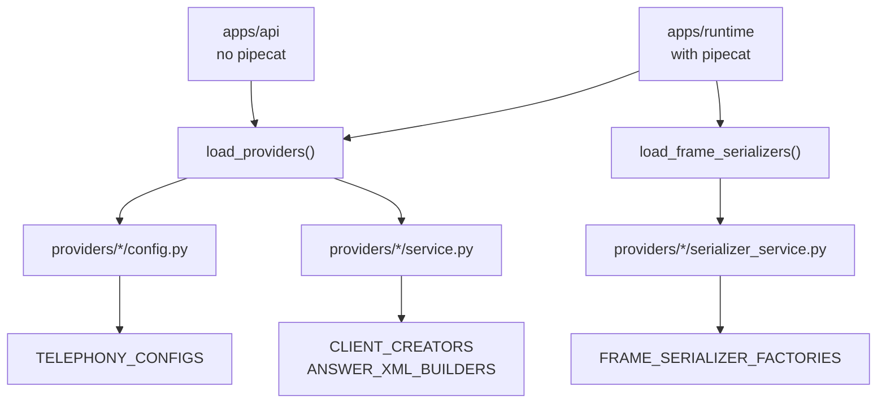

How to add a phone-network vendor to `apps/telephony`. The package ships two — Vobiz and Plivo — and they are deliberately structured identically, so the fastest way to add a third is to open both folders side by side and follow the shape.

## Quick reference

**Create, and only these:**

```
apps/telephony/providers/<name>/
  config.py              # Auth, Settings, @register_telephony
  client.py               # HTTP client: credentials, base URL, headers
  application.py          # create/delete/link/unlink/list/initiate_call
  recording.py            # start/fetch/download recording
  xml.py                  # answer-stream XML for this vendor
  schemas.py               # Pydantic request/response shapes
  service.py               # @register_client, @register_answer_xml
  __init__.py               # re-exports client, config, schemas — no serializer imports
  serializer_service.py    # optional — only if runtime needs a frame serializer
  serializers.py            # optional — pairs with serializer_service.py
```

**Never touch:** `apps/telephony/xml.py`, `calls.py`, `serializers.py`, `registry.py`, the package's own `__init__.py`, `schema.py`. All dispatch by lookup — no vendor names ever appear there.

**One required edit outside your folder:** `apps/telephony/tests/test_registry.py` — add your provider id to the `frozenset` in `test_registered_providers_include_vobiz_and_plivo` and to the parametrised test lists. Skipping this doesn't break anything at import time, but it's the only thing that catches a half-registered provider (e.g. config registered but no client, or no answer-XML builder).

**Only legitimate exception:** `apps/runtime/requirements.txt`, if your frame serializer needs a Pipecat extra not already installed.

<Note>
Read [Telephony model](../../guides/concepts/telephony-model) first for what an application, an answer URL, and a frame serializer are. This page assumes those.
</Note>

<Note>
`apps/telephony/README.md` covers the package's public API and the registration decorators in more detail.
</Note>

## The folder contract

A telephony provider is a folder under `apps/telephony/providers/<name>/` with ten modules. Both existing vendors have exactly this set.

| File | Responsibility | Required |
| --- | --- | --- |
| `config.py` | `Auth`, `Settings`, and the `@register_telephony` config class. | Yes |
| `client.py` | The HTTP client: credentials, base URL, auth headers, URL joining. Delegates to `application.py` and `recording.py`. | Yes |
| `application.py` | `create_application`, `delete_application`, `update_application_name`, `link_number`, `unlink_number`, `list_numbers`, `initiate_call`. | Yes |
| `recording.py` | `start_call_recording`, `fetch_recording_metadata`, `download_recording`, `wait_and_download_recording`. | Yes |
| `xml.py` | The provider's answer-stream XML format. | Yes |
| `schemas.py` | Pydantic request and response shapes for the provider's API. | Yes |
| `service.py` | `@register_client` and `@register_answer_xml` registrations. | Yes |
| `serializer_service.py` | `@register_frame_serializer`. Imports Pipecat, loaded lazily. | Optional |
| `serializers.py` | The frame serializer class itself, or a re-export of Pipecat's. | With `serializer_service.py` |
| `__init__.py` | Re-exports the client, config, and schemas. Must **not** import serializers. | Yes |

The split between `client.py` and `application.py` / `recording.py` is not ceremony. `client.py` holds only what is provider-account specific — how auth headers are shaped, how the account path is built — and the other two hold the calls. Vobiz sends `X-Auth-ID` and `X-Auth-Token` headers under `/Account/{auth_id}/`; another vendor might use HTTP basic auth. Changing that is a `client.py` edit and nothing else.

<Note>
`__init__.py` must not import `serializers` or `serializer_service`. Both existing vendors say so in their module docstring. `apps/api` (which has no Pipecat installed) reaches your provider only through the parent package — `apps.telephony.registry` and `apps.telephony` itself, e.g. `apps/api/app/services/agent_telephony_service.py` and `outbound_call_service.py` — never by importing a vendor submodule directly. A serializer import at package level would still break it the moment `apps.telephony` is imported, since Python runs `__init__.py` for the whole package.
</Note>

## Config, Auth and Settings

Same three-layer stack as `apps/providers`, with bases from `apps/telephony/base.py`:

```python
from apps.telephony.base import BaseTelephonyAuth, BaseTelephonyConfig, BaseTelephonySettings
from apps.telephony.registry import register_telephony

DEFAULT_VOBIZ_API_BASE_URL = "https://api.vobiz.ai/api/v1"


class VobizAuth(BaseTelephonyAuth):
    auth_id: str = Field(
        description="Vobiz Auth ID (Integrations model: VobizAuthId).",
        json_schema_extra={"secret": True, "integration_model": "VobizAuthId"},
    )
    auth_token: str = Field(
        description="Vobiz Auth Token (Integrations model: VobizAuthToken).",
        json_schema_extra={"secret": True, "integration_model": "VobizAuthToken"},
    )


class VobizSettings(BaseTelephonySettings):
    base_url: str = Field(
        default=DEFAULT_VOBIZ_API_BASE_URL,
        description="Vobiz REST API base URL.",
        json_schema_extra={
            "examples": [DEFAULT_VOBIZ_API_BASE_URL, "https://api.vobiz.in/v1"],
            "allow_custom_input": True,
        },
    )


@register_telephony
class VobizConfig(VobizAuth, VobizSettings, BaseTelephonyConfig):
    """Vobiz (Plivo-compatible) cloud telephony."""

    name: str = "Vobiz"
    provider: Literal["vobiz"] = "vobiz"
```

Three details that matter:

* **`@register_telephony` decorates the class, not a function.** It reads the `provider` field's default and puts the class into `TELEPHONY_CONFIGS`. Registering the same id twice raises `ValueError` at import.
* **Both credential fields are `secret: True`.** They land in `ProviderAuth`, Fernet-encrypted with `PROVIDER_AUTH_ENCRYPTION_KEY`. See [Provider credentials](../reference/provider-auth).
* **`integration_model` names the legacy credential key.** Copy the pattern for a new vendor: `"integration_model": "AcmeAuthId"`.

`base_url` belongs on Settings, never on Auth. Ship a `DEFAULT_*_API_BASE_URL` constant so the field is optional, and set `allow_custom_input=True` if the vendor has regional endpoints.

`BaseTelephonyAuth` declares `auth_id` and `auth_token`, so a vendor that authenticates with something else — a single bearer token, say — should still express it through those two names or override them outright. Consistency here is what lets `initiate_outbound()` build a config for any provider from the same three arguments.

## Registering a client

`service.py` is short. It does two registrations and nothing else:

```python
from apps.telephony.providers.vobiz.client import VobizClient
from apps.telephony.providers.vobiz.config import VobizConfig
from apps.telephony.registry import register_answer_xml, register_client

from . import xml as xml_mod


@register_client
def create_client(cfg: VobizConfig) -> VobizClient:
    return VobizClient(cfg.auth_id, cfg.auth_token, cfg.base_url)
```

`@register_client` works the same way `@register_stt` does in `apps/providers`: it reads the annotation on the first parameter, resolves the config class, and takes the provider id from that class's `provider` default. There is no string argument to get wrong.

`load_providers()` in `apps/telephony/registry.py` imports both `config` and `service` for every package under `providers/`, so the moment your folder exists with those two modules, the provider is registered. A vendor package missing either module is skipped rather than raising.

Once registered, three call paths reach your client without further wiring:

```python
from apps.telephony import create_client, initiate_outbound
from apps.telephony.registry import build_config

client = create_client(build_config("acme", auth_id=..., auth_token=..., base_url=...))
result = await client.initiate_call(from_number=..., to_number=..., answer_url=...)

# Or by provider name in one call:
result = await initiate_outbound(
    "acme",
    auth_id=..., auth_token=..., base_url=...,
    from_number=..., to_number=..., answer_url=..., hangup_url=...,
)
```

Your client must expose the seven application methods and the four recording methods listed in [The folder contract](#the-folder-contract), because the API's agent-provisioning and call-artifact services call them by name. Application and outbound methods return `{status, message, ...}` dicts built by `success()` and `fail()` from `apps/telephony/base.py`; recording helpers return ids, bytes, or `None`.

Use the shared HTTP helpers rather than reaching for `httpx` directly. `request_json()` and `request_bytes()` in `base.py` already handle status errors, connection errors, and empty bodies, and return `(data, error_message)` so the caller never has to catch.

## Registering answer XML

The second half of `service.py`:

```python
@register_answer_xml("vobiz")
def build_answer_stream_xml(
    websocket_url: str,
    *,
    sample_rate: int = 8000,
    **kwargs: Any,
) -> str:
    return xml_mod.build_answer_stream_xml(
        websocket_url,
        sample_rate=sample_rate,
        **kwargs,
    )
```

`@register_answer_xml` takes the provider id as a string, because an XML builder has no typed config parameter to read it from.

The format itself lives in `xml.py`, and it is a plain function returning a string:

```python
def build_answer_stream_xml(
    websocket_url: str,
    *,
    sample_rate: int = 8000,
    **_: Any,
) -> str:
    if sample_rate == 16000:
        content_type = "audio/x-l16;rate=16000"
    else:
        content_type = f"audio/x-mulaw;rate={sample_rate}"

    return f'''<?xml version="1.0" encoding="UTF-8"?>
<Response>
    <Stream bidirectional="true" keepCallAlive="true" contentType="{content_type}">
        {websocket_url}
    </Stream>
</Response>'''
```

Vobiz and Plivo currently emit the same XML. Each keeps its own copy anyway, precisely so one can diverge without touching the other. Write your vendor's real format here even if it happens to match — do not import another provider's builder.

The runtime's `/answer` route calls the parent dispatcher and never a provider module:

```python
from apps.telephony import build_answer_stream_xml

xml = build_answer_stream_xml(provider, websocket_url, sample_rate=16000)
```

`sample_rate` comes from the `SAMPLE_RATE` environment variable (`8000` or `16000`) via `apps/runtime/constants.py`.

## Optional frame serializer

A frame serializer translates between the provider's WebSocket media protocol and Pipecat frames. It is optional because the API never needs it — only the runtime does — and it is the one part of the folder that requires Pipecat.

If Pipecat already ships a serializer for your vendor, re-export it:

```python
# serializers.py
from pipecat.serializers.plivo import PlivoFrameSerializer

__all__ = ["PlivoFrameSerializer"]
```

If not, write the class in `serializers.py` — Vobiz does, in about a hundred lines.

Either way, `serializer_service.py` registers a factory:

```python
"""Vobiz frame serializer registration (requires pipecat).

Imported only by ``load_frame_serializers()`` — not loaded by the API.
"""

from apps.telephony.providers.vobiz.serializers import VobizFrameSerializer
from apps.telephony.registry import register_frame_serializer


@register_frame_serializer("vobiz")
def create_frame_serializer(
    *,
    stream_sid: str,
    call_sid: str,
    sample_rate: int = 8000,
    **kwargs: Any,
):
    return VobizFrameSerializer(
        stream_sid=stream_sid,
        call_sid=call_sid,
        params=VobizFrameSerializer.InputParams(
            vobiz_sample_rate=sample_rate,
            sample_rate=sample_rate,
            **kwargs,
        ),
    )
```

Keep that module docstring — it is the reminder that stops someone importing this file from `__init__.py`.

The laziness is enforced by two separate loaders in `apps/telephony/registry.py`:



`load_providers()` imports only `config` and `service`. `load_frame_serializers()` is a second, separate walk that imports `serializer_service` and is only reached through `get_frame_serializer_factory()`. The runtime triggers it implicitly by calling `create_frame_serializer()`; the API never does.

Note the signature difference: `PlivoFrameSerializer` takes `stream_id` / `call_id` while `VobizFrameSerializer` takes `stream_sid` / `call_sid`. The `serializer_service.py` wrapper is where you absorb that — the parent `create_frame_serializer()` always takes `stream_sid` and `call_sid`, and every caller uses those names.

## Never add if/elif to the facades

`apps/telephony/xml.py`, `calls.py`, and `serializers.py` are dispatch facades at the package root. Each one looks up a registered callable and calls it:

```python
def build_answer_stream_xml(provider, websocket_url, *, sample_rate=8000, **kwargs):
    builder = get_answer_xml_builder(provider)
    return builder(websocket_url, sample_rate=sample_rate, **kwargs)
```

There is no branch on provider name in any of them, and there must never be one. The registry raises a clear `ValueError` for an unregistered provider — `Unsupported telephony provider for XML: 'twilio'` — and `apps/telephony/tests/test_registry.py` asserts that message for all three lookups.

Adding a vendor should touch exactly one new directory. If your diff edits `xml.py`, `calls.py`, `serializers.py`, or `registry.py`, something has gone wrong. The one legitimate exception is `apps/runtime/requirements.txt`, when your serializer needs a Pipecat extra that is not already installed.

## Testing

Six modules in `apps/telephony/tests` cover the package. Run them from the repository root:

```bash
export PYTHONPATH="$PWD"
pytest apps/telephony/tests -v
```

| Module | Covers |
| --- | --- |
| `test_registry.py` | Registration, lazy serializer loading, and the errors for unknown providers. |
| `test_clients.py` | Client construction, auth headers, URL joining, and the application and recording calls. |
| `test_xml.py` | The answer XML each provider emits, per sample rate. |
| `test_serializers.py` | Frame serializer construction through the parent factory. |
| `test_webhooks.py` | Webhook body decoding and hangup detection. |
| `test_schema.py` | The catalog dump and the telephony configuration defaults. |

`test_registry.py` is parametrised over `["vobiz", "plivo"]` and asserts the registered set exactly:

```python
def test_registered_providers_include_vobiz_and_plivo() -> None:
    assert registered_providers() == frozenset({"vobiz", "plivo"})
```

Adding a vendor means updating that frozenset and adding your id to the parametrise lists. Those edits are the point — they are how a half-registered provider gets caught, since `test_each_provider_has_config_client_and_xml` then checks your id is in all three of `TELEPHONY_CONFIGS`, `CLIENT_CREATORS`, and `ANSWER_XML_BUILDERS`, and `test_each_provider_has_frame_serializer_after_lazy_load` checks the serializer map after the lazy import.

Add your own XML test alongside `test_xml.py`'s existing cases — the exact string a provider expects is the thing most likely to be wrong, and the hardest to notice, because a malformed `<Response>` produces a call that connects and then goes silent.

You can also dump the catalog to eyeball what the API will serve:

```bash
python apps/telephony/scripts/print_schemas.py
```

<Note>
There is no CI. Run these yourself before opening a pull request, and test a real inbound call against the vendor's sandbox — the registry tests prove the wiring, not that the vendor accepts your XML.
</Note>

## Related

* [Telephony model](../../guides/concepts/telephony-model)
* [Telephony service](../services/telephony)
* [Adding an AI provider](adding-a-provider)
* [Public voice URLs](../../guides/deployment/public-voice-urls)
* [Testing](testing)
