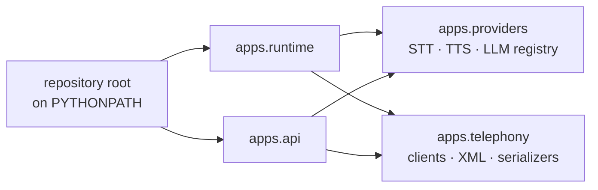

How to run the API, the runtime, the ARQ worker, and the campaign orchestrator as host processes against a containerised database. This is the setup you want when you are editing Python and need a fast feedback loop.

<Note>
If you only want to *use* VoicEra, run the whole stack in Docker instead — see [Install and run](../../guides/quickstart/install-and-run). This page is for changing the code.
</Note>

## What you need

| Requirement | Version | Why |
| --- | --- | --- |
| Python | 3.11 | Both `Dockerfile`s pin `python:3.11-slim`. `apps/runtime/requirements.txt` notes 3.11+ is required because Pipecat's `Language` enum must be a `StrEnum` for Deepgram. |
| Docker and Docker Compose | Recent | For PostgreSQL, FerretDB, Redis, and MinIO. You do not need to run the application containers. |
| Git | Any | |

Clone the repository and copy the environment template:

```bash
cp .env.example .env
```

Then generate the three secrets that have no usable default:

```bash
python3 -c "import secrets; print(secrets.token_urlsafe(32))"
python3 -c "from cryptography.fernet import Fernet; print(Fernet.generate_key().decode())"
```

Put the first into `SECRET_KEY` and again into `INTERNAL_API_KEY`, and the Fernet key into `PROVIDER_AUTH_ENCRYPTION_KEY`. See [Environment variables](../reference/environment-variables) for what each one does.

<Note>
There is exactly **one** `.env`, at the repository root, plus a separate `model-server/.env` for the optional model stack. There are no per-app env files. `apps/api/app/config.py` resolves the root `.env` four directories up from itself, so running `uvicorn` from inside `apps/api` still picks it up.
</Note>

## Repository layout in brief

```text
VoicEra/
├── apps/
│   ├── api/        FastAPI REST surface, ARQ worker, campaign orchestrator
│   ├── runtime/    Answer webhook and the Pipecat audio pipeline
│   ├── providers/  STT, TTS, and LLM vendor registry
│   └── telephony/  Vobiz and Plivo clients, answer XML, serializers
├── model-server/   Optional self-hosted STT, TTS, and LLM stack
├── scripts/        start-application-services.sh, stop-application-services.sh
└── docker-compose.yaml
```

The full map, including the files that are intentionally empty, is in [Repository layout](repository-layout).

## The PYTHONPATH and the apps namespace

`apps/` is a Python namespace package. `apps/runtime` imports `apps.providers` and `apps.telephony` directly:

```python
from apps.telephony import build_answer_stream_xml, parse_stream_start
from apps.providers.factory import create_stt_service
```

For those imports to resolve, **the repository root must be on `PYTHONPATH`**. Docker arranges this two different ways, which is why the two services look different when you run them by hand:

| Service | How the namespace is satisfied |
| --- | --- |
| `apps/api` | `apps/api/Dockerfile` copies `apps/api/` to `/app` and then copies `apps/__init__.py`, `apps/providers`, and `apps/telephony` into `/app/apps/`. Compose additionally mounts `./apps:/app/apps:ro`. So `app.*` and `apps.*` both resolve from `/app`. |
| `apps/runtime` | `apps/runtime/Dockerfile` sets `ENV PYTHONPATH=/app` and copies the whole `apps/` tree under it. |

What resolves what, with the repository root on the path:



Running from source, export the repository root once per shell:

```bash
export PYTHONPATH="$PWD"
```

<Note>
There is **no** `pip install -e .` — `pyproject.toml` is an empty placeholder, so the project is not pip-installable. Install dependencies with an explicit `pip install -r apps/<app>/requirements.txt`, and set `PYTHONPATH` yourself.

The `Makefile` does cover the Docker stack — `make application-up`, `make application-down`, `make application-logs`, and the `model-server-*` equivalents; run `make help` for the list. It has no targets for running services from source, which is what the rest of this page describes.
</Note>

## Database-only Compose

Start just the storage layer and leave the application processes to your shell:

```bash
docker compose -f docker-compose.yaml up postgres ferretdb
```

FerretDB publishes `27018` on the host and listens on `27017` inside the container, so your `.env` must point at the host port:

```bash
MONGODB_HOST=localhost
MONGODB_PORT=27018
```

`.env.example` already ships those values — it is `docker-compose.yaml` that overrides them to `mongodb:27017` for the containers.

If you are working on campaigns, the knowledge base, or call artifacts, add the services those need:

```bash
docker compose -f docker-compose.yaml up postgres ferretdb redis minio minio-init
```

Redis backs the ARQ queue, the campaign event bus, and concurrency slots. MinIO holds recordings, transcripts, campaign CSVs, and knowledge-base PDFs. `minio-init` creates the bucket named by `MINIO_BUCKET` and then exits.

## Running the API

```bash
python -m venv .venv
source .venv/bin/activate
pip install -r apps/api/requirements.txt
cd apps/api
uvicorn app.main:app --reload --host 0.0.0.0 --port 8000
```

This matches `apps/api/Dockerfile`'s `CMD` and the compose `command:` on the `api` service, which adds `--reload`.

Confirm it came up:

```bash
curl http://localhost:8000/docs
```

The interactive OpenAPI console at `http://localhost:8000/docs` is the always-current route list.

<Note>
The API imports `apps.providers` and `apps.telephony` too, and finds them through the `apps/` directory in the repository root when you run from `apps/api` with the root on `PYTHONPATH`. If you see `ModuleNotFoundError: No module named 'apps'`, that export is missing.
</Note>

## Running the runtime

The runtime is a separate virtualenv — its requirements pull in Pipecat and its vendor extras, which the API does not need.

```bash
python -m venv .venv-runtime
source .venv-runtime/bin/activate
pip install -r apps/runtime/requirements.txt
export PYTHONPATH="$PWD"
uvicorn apps.runtime.app:app --reload --host 0.0.0.0 --port 7860
```

Run this **from the repository root**, not from `apps/runtime` — the module path is `apps.runtime.app`. The uvicorn line matches `apps/runtime/Dockerfile`'s `CMD`; the compose `runtime` service declares no `command:` and so inherits it.

`apps/runtime/app.py` also has a `main()` entry point, reachable as a module:

```bash
python -m apps.runtime.app
```

That path reads `RUNTIME_HOST` (default `0.0.0.0`) and `RUNTIME_PORT` (default `7860`) and starts uvicorn with `reload=False`. Use the explicit `uvicorn` command while developing; use `python -m apps.runtime.app` when you want the environment variables to pick the bind address.

Confirm it came up:

```bash
curl http://localhost:7860/health
```

<Note>
`pipecat-ai[deepgram,cartesia,openai,silero,websocket]==1.8.1` is a large install and pulls model weights for Silero VAD on first use. Expect the first `pip install` and the first call to be slow.
</Note>

## Running the worker and orchestrator

Both run the `apps/api` package, so reuse the API virtualenv and run them from `apps/api`.

The ARQ worker executes campaign batches and CSV source syncs off the request path:

```bash
cd apps/api
python -m arq app.tasks.arq.WorkerSettings
```

The campaign orchestrator listens on Redis pub/sub, schedules the next batch, and detects campaign completion:

```bash
cd apps/api
python -m app.services.campaign.campaign_orchestrator
```

Both commands are copied from the `arq-worker` and `campaign-orchestrator` `command:` lines in `docker-compose.yaml`. Neither service listens on a port.

<Note>
`ENABLE_CAMPAIGN_ORCHESTRATOR` (default `True`) lets API startup spawn the orchestrator in-process. Docker runs it as a separate container instead. If you are running the API from source and also start the orchestrator by hand, set `ENABLE_CAMPAIGN_ORCHESTRATOR=False` so you do not run two.
</Note>

## Hot reload

`uvicorn --reload` watches the working directory. Because the API and the runtime resolve `apps/` differently, reload covers different trees:

| Process | Reload watches | Changes to `apps/providers` or `apps/telephony` |
| --- | --- | --- |
| API from `apps/api` | `apps/api` | Not picked up. Restart the process. |
| Runtime from the repository root | The whole repository | Picked up. |

Editing a provider or telephony vendor while the API is running therefore needs a manual restart. The same is true in Docker: `./apps:/app/apps:ro` is mounted read-only into the API container, but uvicorn's reloader is rooted at `/app`, whose contents come from `./apps/api`.

## Linting

The only lint configuration in the repository is `model-server/ruff.toml`, and it applies to the `model-server/` tree:

```bash
cd model-server
ruff check .
```

It sets `line-length = 100`, `target-version = "py312"`, and selects `E`, `F`, `W`, `I`, `B`, `UP`, `SIM`, `C4`, `RET`, `ARG`. Vendored model folders are excluded path by path — the file explains why, and the exclusions are deliberately not blanket `stt/**` / `tts/**` globs, so files you add inside a vendored folder stay linted.

There is no ruff, black, or isort configuration covering `apps/`. Match the surrounding style: `from __future__ import annotations` at the top of every module, PEP 8, and type hints on public functions.

<Note>
There is no CI. Nothing runs lint or tests on a push. Run [the test suites](testing) and `ruff check .` yourself before opening a pull request.
</Note>

## Related

* [Repository layout](repository-layout)
* [Testing](testing)
* [Contributing](contributing-guide)
* [Environment variables](../reference/environment-variables)
* [Architecture](../../guides/concepts/architecture)
