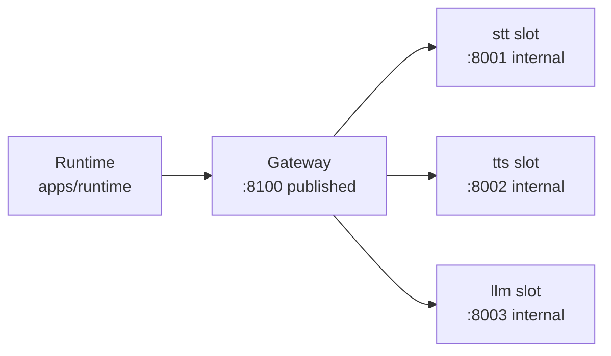

`model-server` is the self-hosted half of VoicEra's AI providers. It runs speech-to-text, text-to-speech and a language model on your own GPUs, and puts all three behind a single OpenAI-compatible gateway on port `8100`. This page is the orientation: what the layout is, how to start it, and what state each piece is actually in.

<Note>
If you only want to point an agent at self-hosted models, read [Self-hosted models](../../guides/deployment/self-hosted-models) first. This section is about the model server itself.
</Note>

## Why one gateway

Three **slots**, each holding as many **models** as you have folders for. A slot is one container on a fixed port; which model fills it is a folder name in `.env`.

Only the gateway publishes a port. The model containers listen inside their own network namespace and are reachable only by Compose service name, so this stack sits beside other stacks on the same host without competing for ports. Everything is routed on modality, and the gateway holds no model-specific knowledge — each model server speaks the OpenAI shape natively, so adding a model never touches gateway code.



The gateway container listens on `8000` inside its network namespace; `GATEWAY_PORT` (default `8100`) is what it is published as on the host. Defined in `model-server/compose.model-server.yml`.

## Layout

```text
model-server/
├── gateway/               the only published port    :8100
├── stt/                   speech-to-text slot        :8001 (internal)
│   ├── indic-conformer/
│   ├── indic-transcribe/
│   └── indic-nemotron/
├── tts/                   text-to-speech slot        :8002 (internal)
│   ├── indic-parler/
│   ├── indic-mio/
│   └── orpheus/
├── llm/                   language-model slot        :8003 (internal)
│   └── qwen3.5-4b/
├── models.yaml            catalogue of every model, served at /models
└── tests/                 run without a GPU
```

Adding a model is adding a folder — no service, no port, no gateway change, which is what makes swapping one a one-line edit rather than a project. See [Adding a model](adding-a-model).

## Running it

From the repository root:

```bash
STT_MODEL=indic-conformer make model-server-setup
```

`make model-server-setup` (which wraps `scripts/start-model-server.sh`) asks which model should fill each slot, fetches weights, builds the images and starts the stack. When it finishes it prints the demo URL:

```text
  Demo:     http://localhost:8100/demo
  Gateway:  http://localhost:8100
  Health:   curl http://localhost:8100/health
  Models:   curl http://localhost:8100/models
```

Stop it with `make model-server-down`. Or drive Compose directly:

```bash
cp .env.example .env
docker compose -f compose.model-server.yml up -d --build
```

Driving Compose by hand with only the base file skips the overlays a model or host may need — a `compose.extra.yml` a model brings, the shared HuggingFace cache, and the MPS attachment. `compose-files.sh` produces the correct `-f` list, which is also what `make model-server-up` runs once the configuration already exists:

```bash
docker compose $(sh model-server/compose-files.sh) --project-directory model-server up -d
```

First build takes 20-40 minutes. See [Running on GPUs](gpu-operations) for GPU selection and disk requirements.

## What it replaces

The earlier layout had three separate services — one for STT, one for TTS, one for the LLM — each with its own port, its own repository conventions and its own way of being started. `model-server` is one gateway with three slots instead. The consequences:

| Then | Now |
| --- | --- |
| Three services to start, configure and monitor | One `scripts/start-model-server.sh`, one `/health`, one published port |
| Each service exposed its own host port | Only `GATEWAY_PORT` binds on the host |
| Adding a model meant a new service | Adding a model means a folder and a catalogue entry |
| Each service had its own environment file | One `model-server/.env` |
| Model choice was baked into which service ran | Model choice is `STT_MODEL` / `TTS_MODEL` / `LLM_MODEL` |

## Current state

Verified on the `ace-h200` box on 26 August, running beside the production and translate stacks:

| | |
| --- | --- |
| Both models on GPU 1 | via the shared MPS daemon, ~12.3 GB |
| TTS time-to-first-audio | 1.5 s cold, ~250 ms warm |
| Realtime factor | 0.69x |
| Round trip | TTS speaks a sentence, STT transcribes it back word for word |
| Effect on production | none — `voicera-prod` stayed `running(11)` throughout |

<Note>
Two things are **not** verified on hardware, and `model-server/README.md` is explicit about both.

**A real call through the runtime has not been tested.** That needs a second runtime pointed at the gateway via `MODEL_SERVER_URL`, plus an agent configured for `indic-conformer-stt` and `indic-parler-tts`.

**The LLM slot has not been run on hardware at all.** `llm/qwen3.5-4b/` is written but has never been built or started, so the vLLM flags in it are unverified against a live model. The numbers above cover STT and TTS only.
</Note>

Per-model status is recorded in `model-server/models.yaml` and summarised on [STT models](stt-models), [TTS models](tts-models) and [LLM models](llm-models).

## Relationship to apps/providers

There are **two separate naming layers**, easy to conflate but not interchangeable.

**Inside the model server**, `tests/test_client_selection.py` pins the convention `<catalogue id>-<slot>` — the folder `orpheus` under `tts/` is nameable as `orpheus-tts` by an OpenAI-shaped client talking to the gateway directly. This is a model-server-internal test convention, not a lookup: the catalogue doesn't record the client-facing name, so the test asserts every `ready` model is nameable this way and every name the client accepts has a model behind it. That test exists because the failure has no symptom until a call drops — a model can be catalogued, built, healthy, and listed at `/models` while the runtime has never heard of its name.

**Inside `apps/providers`**, a self-hosted model is exposed to agents through its own `local/<name>/` provider — `indic_orpheus` (TTS) and `indic_nemotron` (STT) today, see [Providers → The local providers](../services/providers#the-local-providers). Its provider id (`indic_orpheus`) and model id (`orpheus-indic`) are independent of the `<catalogue id>-<slot>` convention above; the only thing they share with the model server is the gateway slot id (`GATEWAY_MODEL_ID = "orpheus"` in the provider's `catalog.py`), which is what `register_local()` polls `GET /models` for to decide whether the provider shows as `authenticated`. An agent selects a self-hosted STT/TTS model the same way it selects any other provider — `{"provider": "indic_orpheus", "model": "orpheus-indic", ...}` — not by the model-server-internal `<catalogue id>-<slot>` name. No local LLM provider exists yet, so a self-hosted LLM is still reached the older way, through a cloud `openai` config with a custom `base_url` — see [Self-hosted models](../../guides/deployment/self-hosted-models).

## Related

* [Slots and models](slots-and-models)
* [Gateway API](gateway-api)
* [Self-hosted models](../../guides/deployment/self-hosted-models)
* [Ports and defaults](../reference/ports-and-defaults)
