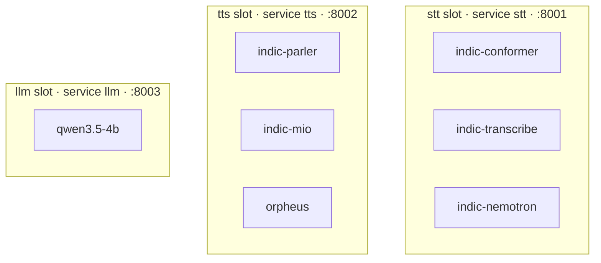

The model server separates two questions that look like one: which slots run, and which model fills each slot. Keeping them apart is what lets you change a model without touching anything that starts containers. This page is the mechanics of that split.

## The slot/model split

A **slot** is one Compose service on a fixed port. There are exactly three, and they never change:

| Slot | Service name | Internal port | OpenAI route |
| --- | --- | --- | --- |
| `stt` | `stt` | 8001 | `POST /v1/audio/transcriptions` |
| `tts` | `tts` | 8002 | `POST /v1/audio/speech` |
| `llm` | `llm` | 8003 | `POST /v1/chat/completions` |

A **model** is a folder under `stt/`, `tts/` or `llm/`. The folder name is the model id, and it is what the slot's Compose service uses as its build context.



Exactly one model fills a slot at a time. `tests/test_model_switching.py` renders the real Compose file with the real tool and asserts that naming a different model resolves to a different build context and image tag while the service name and port stay put.

## COMPOSE_PROFILES vs \*\_MODEL

`model-server/.env` answers the two questions with two separate variables:

```bash
COMPOSE_PROFILES=stt,tts      # which slots run at all
STT_MODEL=indic-conformer     # which folder under stt/ fills the slot
TTS_MODEL=indic-parler
LLM_MODEL=
```

**The profile is the slot name, never a model name.** `COMPOSE_PROFILES` decides whether a slot's container starts; `<SLOT>_MODEL` decides which folder it builds from. `tests/test_catalogue.py` pins that profiles stay slot names.

`<SLOT>_MODEL` does double duty: it is also what tells the gateway a slot is deployed. One variable, so Compose and the gateway cannot disagree about what is running. In `gateway/app/config.py`:

```python
model = _clean(f"{kind.upper()}_MODEL")
url = _clean(f"{kind.upper()}_UPSTREAM") or (_DEFAULT_URL[kind] if model else "")
```

An empty `LLM_MODEL` means the LLM slot is not deployed, and the gateway answers `503` on `/v1/chat/completions` naming the missing upstream rather than failing to start. See [Gateway API](gateway-api).

`<SLOT>_UPSTREAM` defaults to the Compose service name — `http://stt:8001`, `http://tts:8002`, `http://llm:8003` — which never changes when you swap a model. Set it only to point a slot at a different host entirely.

## Switching a model

In full:

```bash
sed -i 's/^LLM_MODEL=.*/LLM_MODEL=gemma-3-4b/' .env
docker compose -f compose.model-server.yml up -d --build llm
```

The service is still called `llm`, still on 8003, so the gateway never learns that anything changed.

<Note>
Rebuild the slot; restarting it is not enough. `<SLOT>_MODEL` selects the build context, so `up -d` without `--build` reuses the image built from the previous folder and quietly keeps serving the old model.
</Note>

If the new model brings a `compose.extra.yml`, use `compose-files.sh` instead so the overlay is included:

```bash
docker compose $(sh compose-files.sh) --project-directory . up -d --build llm
```

## Why the gateway never learns

The gateway is pure async I/O with no model-specific knowledge. It routes on modality, streams without buffering, and reads only three things about a slot: whether a model is named for it, where its upstream is, and what the catalogue says about it.

That is why nothing in `compose.model-server.yml` or `gateway/` changes when you add or swap a model — a claim the tests enforce rather than the documentation asserting it. The gateway has no `depends_on` on the slots either: with profiles, a slot may legitimately not be running, so the gateway starts regardless and answers `503` for what is missing.

## scripts/start-model-server.sh menus and unattended runs

`scripts/start-model-server.sh` asks which model should fill each slot:

```text
  Speech to text
    1) indic-conformer
    2) indic-transcribe
    3) indic-nemotron
    0) none
  Choose [1]:
```

The list is built by listing the folders in `stt/`, `tts/` and `llm/` — not by parsing `models.yaml` — so a model you add shows up in the installer without anyone editing the installer. `tests/test_setup_selection.py` pins that: it asserts `scripts/start-model-server.sh` calls `pick_model` for every slot and that the folder-listing helper is still there. That regressed once already, when it asked "Enable STT? yes/no" and then hardcoded `indic-conformer`.

Set the variable in the environment to skip a menu and run unattended, from the repository root:

```bash
STT_MODEL=indic-conformer TTS_MODEL=indic-parler LLM_MODEL= make model-server-setup
```

An empty value means "no model in this slot" — distinct from the variable being unset, which means "ask me".

Other environment variables `scripts/start-model-server.sh` reads:

| Variable | Effect |
| --- | --- |
| `HF_TOKEN` | HuggingFace token, needed for the gated TTS tokenizers |
| `GPU_DEVICE_IDS` | Which GPU to attach; defaults to the value in `.env`, else `0` |
| `USE_SHARED_HF_CACHE=1` | Reuse an existing cache via `compose.shared-hf-cache.yml` |
| `SKIP_BUILD=1` | Configure only; do not build images |
| `SKIP_START=1` | Build but do not start containers |

`scripts/start-model-server.sh` writes your selections into `.env`, so a later restart keeps them. It also records the shared-cache choice there, which it did not always do — it used to be a setup-time variable only, and the overlay vanished on the next start.

### The compose file list

Three things decide which Compose files are needed, and none of them are fixed: which model fills each slot, whether that model brings its own services, and whether the host has an MPS daemon. `compose-files.sh` is the single place that answers all three. `scripts/start-model-server.sh` sources it and the Makefile calls it, so nothing that starts or stops the stack can disagree with anything else that does.

```bash
sh model-server/compose-files.sh
# -f .../compose.model-server.yml -f .../tts/indic-mio/compose.extra.yml -f .../compose.mps.yml
```

It reads `model-server/.env` when present and falls back to the same defaults Compose would use, so it is correct even before `scripts/start-model-server.sh` has ever run.

## Related

* [Adding a model](adding-a-model)
* [Gateway API](gateway-api)
* [Running on GPUs](gpu-operations)
* [Environment variables](../reference/environment-variables)
