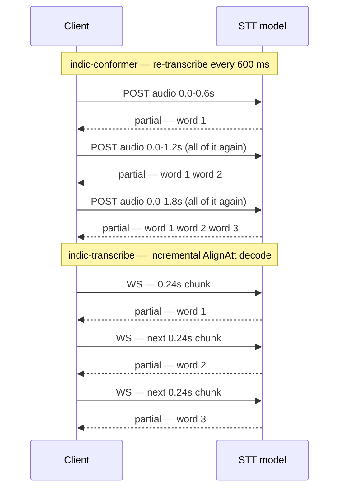

Three models can fill the STT slot. They cover overlapping sets of Indian languages and all return words while the caller is still speaking — but they get there by different means, at very different GPU cost. That distinction is the substance of this page.

## Available models

| id | Model | Status | Sample rate | Languages | Streaming endpoint |
| --- | --- | --- | --- | --- | --- |
| `indic-conformer` | AI4Bharat Indic Conformer 600M | `ready` | 16000 | 23 Indic | no (`WS /v1/realtime`) |
| `indic-transcribe` | AI4Bharat / BodhanAI Indic-Transcribe 1.2B | `ready` | 16000 | 25 Indian languages | yes (`WS /v1/asr/ws`) |
| `indic-nemotron` | AI4Bharat Nemotron Streaming ASR 600M | `ready` | 16000 | 27 Indian languages + `en` | yes (`WS /v1/asr/ws`) |
| `canary` | NVIDIA Canary | `planned` | — | European-language focus | — |

Set the one you want with `STT_MODEL` in `model-server/.env`. Statuses are from `model-server/models.yaml`.

<Note>
`indic-transcribe` is marked `ready` in the catalogue — the folder exists with a Dockerfile — but its own README says **it has not been run on hardware**, and names two real blockers: the image is pinned to `torch 2.12.0+cu132` targeting CUDA 13 / sm_120 (Blackwell) while the H200 is Hopper sm_90, and the checkpoint needs a token for a private HuggingFace repository. `ready` means deployable by the slot mechanics, not verified on this hardware.
</Note>

## indic-conformer

AI4Bharat's 600M hybrid RNNT/CTC Conformer, served through NeMo. Covers 23 Indic languages. Bhili (`bhb`) uses a separate checkpoint — enable it with `BHILI_ENABLE=yes` and point `BHILI_NEMO_PATH` at the file. The server routes on the request's `language` field, so callers use the same endpoint either way.

```bash
STT_MODEL=indic-conformer make model-server-setup
# open http://localhost:8100/demo for the live demo
```

`fetch.sh` in the folder downloads the checkpoint (~2.4 GB) into `models/`.

The image installs the AI4Bharat NeMo fork from a local checkout rather than cloning during the build, matching production. Compose passes it in as a named build context; `NEMO_CONTEXT_PATH` in `.env` says where it lives, defaulting to `~/ai4bharat_nemo`:

```bash
git clone --branch nemo-v2 --depth 1 https://github.com/AI4Bharat/NeMo.git ~/ai4bharat_nemo
```

Its routes, through the gateway:

| Endpoint | Purpose |
| --- | --- |
| `POST /v1/audio/transcriptions` | OpenAI-compatible; multipart `file` plus a `language` field |
| `WS /v1/realtime?intent=transcription` | OpenAI Realtime transcription; word-by-word deltas |
| `GET /health` | ready to serve |
| `GET /demo` | live browser demo page |

Point Pipecat's `OpenAIRealtimeSTTService` at the gateway:

```python
stt = OpenAIRealtimeSTTService(
    api_key="local",
    base_url="ws://localhost:8100/v1/realtime",
    turn_detection=False,
    settings=OpenAIRealtimeSTTService.Settings(
        model="indic-conformer",
        language=Language.HI,
    ),
)
```

Audio is sent as 24 kHz PCM; the server resamples to 16 kHz for NeMo. Partials are produced by re-transcribing the growing buffer every `REALTIME_INTERIM_MS` (default 600 ms, in `stt/indic-conformer/realtime_ws.py`). Multiple concurrent WebSocket sessions share the same GPU batch worker.

## indic-transcribe

Canary 1.2B, 25 Indian languages, and — the reason it is here — **incremental decoding**, using NeMo's AlignAtt streaming decoder with a Silero VAD in front.

Be precise about what that buys. Both STT models return partial transcripts while the caller is still talking; the pipeline has done that since before the model server existed. `indic-conformer` gets there by re-transcribing the whole open segment every 600 ms, so the work per utterance grows as the utterance does. This model decodes forward from where it left off, so each new word costs one word. **The gain is latency and GPU cost, not the existence of partial transcripts.**

Its routes:

```text
POST /v1/audio/transcriptions    OpenAI-shaped, whole utterance
WS   /v1/asr/ws                  live: PCM16 in, JSON partials and finals out
GET  /health                     503 while loading, 200 once warm
GET  /v1/languages               the languages this checkpoint really has
```

`/metrics`, `/admin/*` and the model's own demo page at `/` are not part of the slot contract and are reachable only with `docker compose exec`.

Three things about the socket protocol, from the folder's `SETUP.md`:

* **The stream does not end on its own.** It runs until the client sends `{"type": "stop"}`. Add `&endpoint=1` to opt into pause-based turn commits — off by default, because guessing a turn boundary from pause length cuts people off mid-thought.
* **`turn_final` means the turn ended, not the stream.** A client that closes on it reintroduces the bug that flag was built to fix.
* **The language is always yours to state.** There is no auto-detection. A wrong language produces confidently wrong output rather than an error.

Unlike `indic-conformer`, this model *validates* the language against its checkpoint and returns `400` with the reason. Its language set is a superset of what `STT_LANGUAGE_MAP` can ask for, adding Bhojpuri (`bho`) and English (`en`), so switching `STT_MODEL` to it cannot lose a language an existing agent config uses. The authoritative list comes from the checkpoint's own `tokenizer_config.json` at load time and is reported by `GET /v1/languages` — 25 languages, not the 27 the shipped wrapper code advertises, because `bgc` and `hne` are absent from `core`'s vocabulary.

The Pipecat side of the socket does not exist yet. The voice pipeline still uses the REST path for both models and produces its own partials from it, because that works against either one. Until `ModelServerSTTService` is moved onto the socket, deploying `indic-transcribe` is safe but buys little — the incremental decoder goes unused.

## indic-nemotron

AI4Bharat's Nemotron streaming ASR, 600M, cache-aware with a fixed chunk. It is a **superset of the other two**: 27 Indian languages plus English from one multisoftmax checkpoint (27 × 256 tokens = 6912 classes, the prompt selecting the slice), with Bhili on a second checkpoint and no separate flag — unlike `indic-conformer`, which needs `BHILI_ENABLE=yes`. Switching to it cannot lose a language a caller can ask for.

```bash
STT_MODEL=indic-nemotron make model-server-setup
```

Three things this deployment declares rather than inherits:

| | |
| --- | --- |
| Latency | Chosen at inference time — 160, 320, or 640 ms. Upstream's code defaults to 640; this deployment sets `NEMOTRON_ATT_CONTEXT=96,3` for **320 ms**, which beats `indic-transcribe`'s 400 ms floor. |
| No `auto` language | Deliberate. The vocabulary is sliced per language, and an unsliced decode emits cross-script nonsense. Upstream measured two language-ID designs and neither discriminated, so callers must name a language. |
| Demo path | The folder is vendored byte-for-byte from upstream, which serves its demo at `/` rather than `/demo`. The gateway reaches it through `STT_DEMO_PATH=/` instead of patching upstream's code. |

Its VAD, batching, and mel window are all tunable from `.env` — `NEMOTRON_VAD`, `NEMOTRON_VAD_SILENCE_MS`, `NEMOTRON_MAX_BATCH`, `NEMOTRON_BATCH_WINDOW_MS`, `NEMOTRON_MEL_WINDOW_MS`. `tests/test_nemotron_slot.py` pins the slot wiring, and `tests/test_demo_routing.py` pins the demo path.

<Tip>
This is the one STT model **confirmed on hardware**: running on `ace-h200` GPU 1 since 2 September 2026, both checkpoints loaded, 320 ms verified at `/health`.
</Tip>

<Note>
Both checkpoints are gated on HuggingFace **manually** — a token is not enough. A maintainer has to approve each account on both model pages before `fetch.sh` can pull them.
</Note>

## Partial transcripts vs streaming endpoint

These are two different questions, and conflating them is a mistake `models.yaml` records as having "already been made once here". The catalogue therefore keeps two separate fields:

| Field | What it records |
| --- | --- |
| `partial_transcripts` | What the **caller** gets. `native` or `client-side` both mean words come back while the speaker is still talking, which telephony requires and every STT model in this repo has always done. There is no `none`. |
| `streaming_endpoint` | Whether the **model** serves `WS /v1/asr/ws`. False does not mean the caller waits for a full sentence — it means the client produces the partials instead. |

So a model without the WebSocket route is not a model that waits for you to finish. It is a model whose partials the client produces on its behalf, by brute force:

| | How partials are produced | Cost |
| --- | --- | --- |
| `indic-conformer` | the client re-transcribes the open segment every 600 ms (`AI4BHARAT_INTERIM_MS`) over the POST route | grows with utterance length |
| `indic-transcribe` | the model decodes incrementally over the WebSocket | one word costs one word |




`tests/test_partial_transcripts.py` pins the client-side path, which is what production runs today. It checks that the emitter exists and is called from the audio path, that it fires on elapsed audio rather than on the segment ending, that it is skipped while a transcription is already in flight so a slow model cannot queue a backlog of stale partials, and that both STT models go through it. The interval is read from the real source, so lengthening it to something a caller would notice fails the test.

The catalogue records a third field for `indic-conformer`: `realtime_endpoint: true`, meaning `WS /v1/realtime?intent=transcription`. That is a different protocol from `/v1/asr/ws`, and the gateway relays both. See [Gateway API](gateway-api).

## Benchmarks and load tests

`indic-transcribe` ships a generated performance report. Every number in it is read from a JSON run file by `bench/report.py`; nothing is typed by hand, and a run that was not executed prints `NOT MEASURED`.

These numbers were measured **upstream**, on an NVIDIA RTX PRO 6000 Blackwell Server Edition (96 GB, sm_120) on an AWS `g7e.2xlarge`. They are not measurements of VoicEra's hardware, where this model has not been run.

Single-stream, at the shipped geometry (`chunk 0.24 s / right 0.16 s`), from `stt/indic-transcribe/REPORT.md`:

| | | |
| --- | --- | --- |
| First word | 1866 ms p50 | from the first audio byte; 1365 ms from speech onset |
| Word-to-word gap | 288 ms p50 | between partials inside a turn |
| Periodic pause | 1919 ms every 22 s | decoder-state rotation; deliberate |
| Tail | 51 ms | stop talking → transcript settles |
| Concurrent streams | 8 | largest level where every stream still finished in about its own audio duration |
| Offline throughput | 91x real time | whole-utterance batch decoding, for reference |

The periodic pause is the most visible behaviour in the live demo, and it is deliberate. `decoder_mems_list` grows one position per decode step against the decoder's 1024-position limit; a stream that never rotates does not degrade gracefully, it stalls outright and never recovers. Rotation resets the decoder at 12 s of speech (soft: waits for a ≥250 ms gap so the cut lands between words) or 20 s regardless. Measured against a cold start, the rotation warm-up ratio is 1.250 — near enough to 1.0 to settle the cause: the pause is time-to-first-partial being re-paid, not GPU work or model deliberation.

The geometry is a deliberate trade, not a default. NeMo recommends `chunk 1.0 / right 0.5`; this service ships `0.24 / 0.16`. Over 43 s of continuous speech that is 95 commits at a 0.30 s median gap against the default's 36 commits and a 3.36 s worst gap, for the same transcript accuracy. **It costs capacity, not accuracy**: roughly twice the GPU per stream, so roughly half the concurrent sessions.

<Tip>
Do not size capacity from time-to-first-partial. From `LOADTEST.md`: at 60 concurrent streams — 7.5x the real-time capacity of 8 — TTFP p50 only doubles (1926 ms → 3881 ms) while drift behind real time grows 88x (174 ms → 15325 ms). Nothing errors, nothing is refused, every transcript is still produced; it arrives later and later. The columns that reveal it are `normalized_latency_by_bucket` (past ~1.10 you are over capacity) and `delta_lag_p95_ms`. `/metrics` also emits `over_realtime_capacity` and `capacity_warning` directly.
</Tip>

Admission is capped in the slot's overlay at the measured real-time capacity — `CORE_MAX_SESSIONS=8`, `CORE_REALTIME_CAPACITY=8` — rather than at the 64 upstream raised it to, because this card is shared with production and admitting several times what the decoder can serve in real time degrades every stream instead of refusing one.

Two campaigns live in `stt/indic-transcribe/bench/`, answering different questions: `docs/BENCHMARKS.md` is the sweep that chose the shipped configuration, and `REPORT.md` plus `LOADTEST.md` measure what that configuration actually does. The two do not transfer — the sweep measured concurrency at `chunk 0.96 / right 0.48`, so quoting it for the live service would overstate capacity by about a factor of two.

## Weights and gated repos

Neither model's weights are in the repository.

**indic-conformer.** `stt/indic-conformer/models/IndicConformer.nemo` is gitignored. `fetch.sh` downloads it (~2.4 GB); `scripts/start-model-server.sh` runs that automatically. The weights live inside the model's own folder, which is what the slot bind-mounts.

**indic-transcribe.** There is deliberately no `fetch.sh` — preparing this model is a download, a conversion, and two verification gates, and the conversion has to run inside the built image. `SETUP.md` in the folder is the authority. In outline:

1. Pull the HF checkpoint into `models/core/` (needs a token with read access to the private repository).
2. Build the image.
3. Run `tools/transcribe_hf.py --verify-only` to get a reference transcript and its token ids from the HuggingFace implementation.
4. Run `tools/hf_to_nemo.py` to convert — ~4.6 GB, 1926 tensors, vocab 7152.
5. Run `tools/verify_nemo.py --expect-ids` with the ids from step 3.

The gate is **byte-identical token ids**, not similar text, which is the right gate: a conversion where "all the keys matched" can still land weights wrong. Compare ids rather than strings — the HF port's `decode()` ends in `.strip()` while NeMo's `Hypothesis.text` keeps the leading SentencePiece space, so two identical models differ by one U+0020.

`models/core/` and `artifacts/` are gitignored. `compose.extra.yml` mounts them in — `/models/core` read-only, `/artifacts` writable — and pins `HF_HUB_OFFLINE=1`, because an image that cannot fetch should fail fast rather than hang on a network call it will never be allowed to make. Override the locations with `CORE_MODELS_DIR` and `CORE_ARTIFACTS_DIR` in `.env`.

Budget ~30 GB of disk for this model: ~14 GB image, 4.9 GB HF checkpoint, 4.6 GB converted checkpoint. One uvicorn worker, always — the engine owns the GPU from a single thread, and a second worker would load a second copy of the model.

## Related

* [TTS models](tts-models)
* [Gateway API](gateway-api)
* [Running on GPUs](gpu-operations)
* [Voice pipeline](../../guides/concepts/voice-pipeline)
