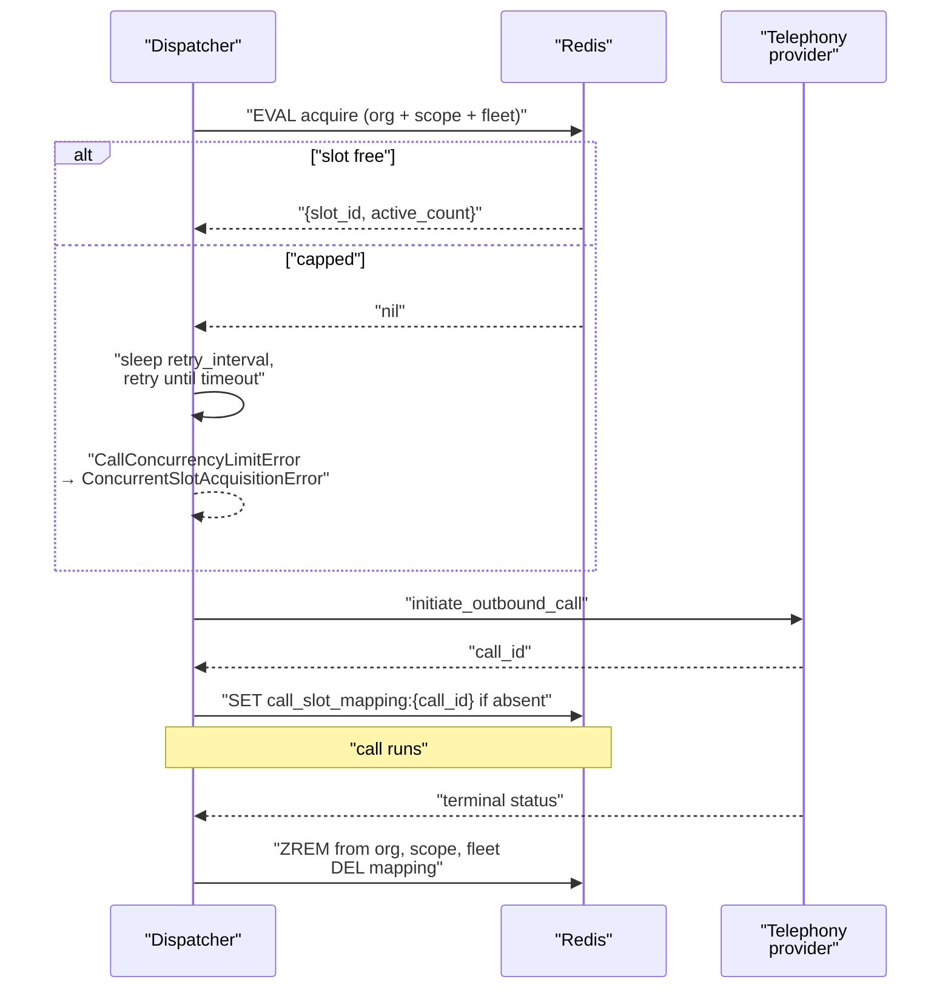

VoicEra limits how many calls an organisation can have in flight at once, how many any single campaign can hold, and how fast new calls may be started. All of it lives in `apps/api/app/services/call_concurrency/` and is backed by Redis.

<Note>
Concurrency slots are separate from the per-second rate limit. The rate limit governs how quickly calls *start*; the concurrency cap governs how many are *active*.
</Note>

## Why concurrency is capped

An outbound [campaign](../../guides/concepts/campaigns) will happily dial as fast as it is allowed to. Three things break if nothing stops it:

* **Telephony provider limits.** Providers cap concurrent channels per account and reject or throttle beyond that.
* **Runtime capacity.** Each live call holds one WebSocket and one full [voice pipeline](../../guides/concepts/voice-pipeline) in the runtime.
* **Provider spend.** Every concurrent call is concurrent STT, LLM, and TTS usage against your own keys.

The cap is enforced at the point of dispatch, before the outbound call is placed, so a campaign that cannot get a slot simply waits.

## Organisation slots

Every acquisition first checks the organisation-wide cap. The limit comes from `get_org_concurrent_limit` in `campaign_repository.py`: the `concurrent_call_limit` field on the `Organizations` document if set and at least 1, otherwise `DEFAULT_ORG_CONCURRENCY_LIMIT`.

That default is 10, defined in `apps/api/app/constants/campaign.py` and overridable with the `DEFAULT_ORG_CONCURRENCY_LIMIT` environment variable:

```python
DEFAULT_ORG_CONCURRENCY_LIMIT = max(
    1, int(os.getenv("DEFAULT_ORG_CONCURRENCY_LIMIT", "10"))
)
```

Active slots live in a Redis sorted set `concurrent_calls:{org_id}`, one member per slot, scored by acquisition time. The set expires after 3600 seconds of inactivity.

## Campaign-scoped slots

A campaign can hold a tighter cap than its organisation. `CreateCampaignRequest.max_concurrency` defaults to 5 and is bounded 1–20 by the schema; it is stored in `orchestrator_metadata.max_concurrency`.

`_validate_max_concurrency` in `apps/api/app/routers/campaign.py` rejects a value above the organisation limit at both create and update time:

```text
max_concurrency (12) cannot exceed org limit (10)
```

At dispatch, `CampaignCallDispatcher.acquire_concurrent_slot` passes `scope_key = f"campaign:{campaign_id}"` and `scope_max_concurrent = max_concurrency`. That gives a second sorted set, `concurrent_calls:campaign:{campaign_id}`, checked in the same operation as the organisation set. A slot is only granted when **both** caps have room.

Nothing outside campaigns passes a `scope_key` today, so scoped slots are a campaign feature in practice even though the service is generic.

## The sliding-window rate limiter

Separately from slots, `rate_limiter.acquire_token` implements a one-second sliding window against `rate_limit:{org_id}`:

* Entries older than one second are trimmed.
* If fewer than `rate_limit` entries remain, one is added and the token is granted.
* The key expires after 2 seconds, so an idle organisation leaves nothing behind.

The dispatcher calls it with `campaign.rate_limit_per_second` (1–20, default 1) and spins at 50 ms intervals until a token is granted. Unlike slot acquisition, this loop has no timeout.

## Acquiring and releasing a slot

`CallConcurrencyService.acquire_org_slot` takes `timeout: float = 0` and `retry_interval: float = 1`. With the default timeout of 0, the first failed attempt raises `CallConcurrencyLimitError` immediately. The campaign dispatcher overrides it with `CONCURRENT_SLOT_TIMEOUT = 120.0`, so a campaign call retries roughly once a second for two minutes before giving up.

Acquisition and binding are two steps for a reason: the slot is taken *before* the outbound call is placed, and bound to the resulting `call_id` afterwards.



`bind_call_slot` writes the hash `call_slot_mapping:{call_id}` holding `org_id`, `slot_id`, and `scope_key`, with a TTL of `stale_call_timeout`. It uses a Lua script that refuses to overwrite an existing key: if the mapping is already there, the new slot is released and `CallSlotAlreadyBoundError` is raised, so one call can never hold two slots.

Release happens through `release_call_slot(call_id)`, driven by `POST /campaign/internal/call-status`. It looks up the mapping, removes the slot member from the organisation set, the scope set, and the fleet set, then deletes the mapping. If the outbound call fails before binding, `dispatch_call` releases the unbound slot directly.

## Stale slot reclamation

A crashed worker or a call that never reports a terminal status would otherwise leak a slot forever. `RateLimiter.stale_call_timeout` is 1200 seconds (20 minutes), and every acquisition begins by trimming entries scored older than `now - 1200` from the organisation set, the scope set, and the fleet set. Reclamation is lazy — it happens when someone next tries to acquire, not on a timer.

The `call_slot_mapping:{call_id}` hash carries the same 1200-second TTL, so the mapping expires on the same schedule as the slot it describes.

The from-number pool uses the same timeout: its Lua script resets any number whose busy timestamp is older than the cutoff back to score 0 (free).

## Fleet-wide limits

Every acquisition also adds a member to one global sorted set, `FLEET_CONCURRENT_KEY = "concurrent_calls_fleet"`, with the member string `{org_id}:{slot_id}`. It is trimmed for staleness and cleaned up on release exactly like the per-organisation set.

<Note>
The fleet set is written and cleaned but never checked against a maximum. It is observability — `ZCARD concurrent_calls_fleet` gives you live calls across every organisation — not an enforced cap. There is no fleet-wide limit in the code today.
</Note>

## Why Lua

Every check-and-acquire is a single `EVAL`. The naive alternative — read the count, compare it, then add a member — is a race: two workers can both read 9 of 10 in use and both add a member, leaving 11 active calls against a limit of 10.

Redis executes a Lua script atomically, so trim, count, compare, and add happen as one indivisible operation. Three scripts matter:

| Script | Keys | What it does |
| --- | --- | --- |
| `acquire_token` | `rate_limit:{org_id}` | Trims the 1-second window, grants a token if under the per-second limit. |
| `try_acquire_concurrent_slot_details` | org set, scope set, fleet set | Trims all three for staleness, returns `nil` if either the org or the scope cap is full, otherwise adds the slot to all three and returns `{slot_id, active_count}`. |
| `store_call_slot_mapping_if_absent` | `call_slot_mapping:{call_id}` | Writes the mapping hash only if the key does not exist, returning 0 if it does. |

The from-number pool adds two more, one to reclaim-and-pick a free caller ID and one to return it to the pool.

Only *acquisition* is atomic. `release_concurrent_slot` issues three separate `ZREM` calls — releasing is idempotent, so it does not need a script.

## Tuning

| Knob | Where | Default |
| --- | --- | --- |
| `DEFAULT_ORG_CONCURRENCY_LIMIT` | Environment variable | 10 |
| `concurrent_call_limit` | `Organizations` document, per organisation | Unset — falls back to the default |
| `max_concurrency` | `CreateCampaignRequest` / `UpdateCampaignRequest`, 1–20 | 5 |
| `rate_limit_per_second` | `CreateCampaignRequest` / `UpdateCampaignRequest`, 1–20 | 1 |
| `stale_call_timeout` | `RateLimiter.__init__`, code only | 1200 s |
| `CONCURRENT_SLOT_TIMEOUT` | `campaign_call_dispatcher.py`, code only | 120.0 s |

Set the organisation limit to what your telephony account actually allows, then set each campaign's `max_concurrency` at or below it. There is no reason to raise `max_concurrency` past the organisation limit — the API rejects it.

## Failure modes

| Symptom | Cause | What to do |
| --- | --- | --- |
| Batch aborts, campaign goes to `failed` | No slot within 120 s. `CallConcurrencyLimitError` is wrapped as `ConcurrentSlotAcquisitionError`, which `process_campaign_batch` treats as fatal. | Lower `max_concurrency` or raise the organisation limit. Unprocessed claims are returned to `queued`, so no contact is lost. |
| Calls start slowly, nothing fails | The per-second token loop is throttling. | Raise `rate_limit_per_second`. |
| Slots appear stuck for up to 20 minutes | A call never reported a terminal status, so the slot waits on stale reclamation. | Check that the runtime can reach `POST /campaign/internal/call-status`. |
| `CallSlotAlreadyBoundError` | A `call_id` was bound twice. | The duplicate slot is released automatically; investigate duplicate dispatch. |
| Concurrency ignored after a Redis flush | All slot state is in Redis and is not persisted anywhere else. | Expect a brief over-shoot; the sets rebuild as new calls acquire. |

Because slot state lives only in Redis, wiping Redis loses the record of every in-flight call. Active calls continue, but their slots are gone and their eventual release is a no-op.

## Related

* [Campaigns](../../guides/concepts/campaigns) — the only caller that uses scoped slots today
* [Calls and call artifacts](../../guides/concepts/calls) — the call lifecycle a slot is bound to
* [Workers and orchestrator](../services/workers)
* [Environment variables](environment-variables)
* [Campaign troubleshooting](../../guides/troubleshooting/campaigns)
