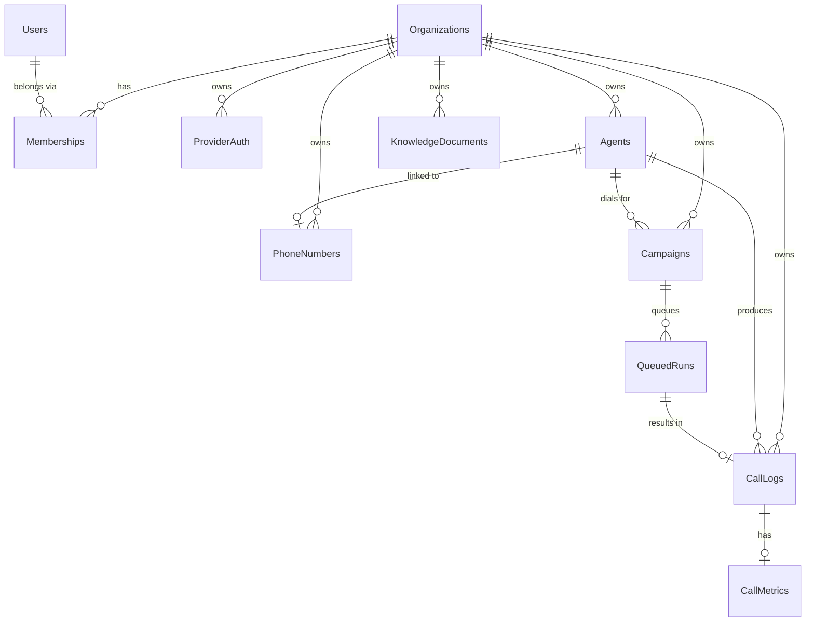

VoicEra stores everything in FerretDB, which speaks the MongoDB wire protocol over PostgreSQL. This page lists every collection, the fields on its documents, the enumerations that constrain them, and the indexes created at startup.

Collection names and indexes come from `apps/api/app/database_init.py`. Document field names come from `apps/api/app/models/schemas.py` and the services that write them. Campaign and queued-run documents come from `apps/api/app/services/campaign/campaign_repository.py`.

`initialize_database()` runs on every API startup and is idempotent. It creates all eleven collections and their indexes if they are missing and leaves existing data alone. There is no migration system — a schema change is a code change plus whatever backfill you write yourself.

There are eleven collections: `Organizations`, `Users`, `Memberships`, `ProviderAuth`, `Agents`, `PhoneNumbers`, `KnowledgeDocuments`, `CallLogs`, `CallMetrics`, `Campaigns`, and `QueuedRuns`.

## Relationships

Every collection except `Users` is scoped by `org_id`. `Users` is global — one account can hold memberships in many organisations, and the JWT carries whichever one is currently active. See [Multi-tenancy and roles](multi-tenancy).

## Organizations

One document per organisation. Created by `POST /api/v1/users/signup` and by nothing else — there is no standalone create-organisation endpoint.

| Field | Type | Notes |
|---|---|---|
| `org_id` | string | Generated identifier. Unique. |
| `name` | string | Display name from the signup payload. |
| `created_by_email` | string | Email of the user who signed up. |
| `created_at` | string | UTC ISO 8601. |
| `concurrent_call_limit` | int or null | Optional per-organisation call ceiling. Absent on documents written by signup. |

Written by `apps/api/app/services/org_service.py`, which sets only the first four fields. `concurrent_call_limit` is read — not written — by `get_org_concurrent_limit()` in `apps/api/app/services/campaign/campaign_repository.py`: when present it is clamped to a minimum of `1`, and when absent the organisation falls back to `DEFAULT_ORG_CONCURRENCY_LIMIT` (default `10`).

No endpoint writes `concurrent_call_limit`. The field is read by the campaign code but can only be set by editing the document directly in FerretDB.

## Users

One document per person, global across organisations. Passwords are bcrypt hashes truncated to bcrypt's 72-byte limit before hashing.

| Field | Type | Notes |
|---|---|---|
| `email` | string | Unique. The JWT `sub` claim. |
| `password` | string | bcrypt hash. Never returned by any endpoint. |
| `created_at` | string | UTC ISO 8601. |
| `default_org_id` | string | Organisation created at signup. |
| `last_logged_in_at` | string | UTC ISO 8601. Written at signup and rewritten on every successful login. |

The `UserResponse` schema returned by `GET /api/v1/users/me` adds `org_id`, `role`, `organisation_name`, and an `organisations` list of `{org_id, name, role}` — those are joined from `Memberships` and `Organizations` at read time, not stored on the user.

## Memberships

The join between a user and an organisation, carrying the role. A user with three memberships has three documents.

| Field | Type | Notes |
|---|---|---|
| `email` | string | References `Users.email`. |
| `org_id` | string | References `Organizations.org_id`. |
| `role` | `Role` | One of `super_admin`, `admin`, `member`. |
| `created_at` | string | UTC ISO 8601. |

Signup writes the `super_admin` membership. `POST /api/v1/members/invite` writes `member` memberships; `POST /api/v1/members/assign-admin` promotes one to `admin`.

## ProviderAuth

Encrypted credentials for one provider in one organisation. Documented in full at [Provider credentials (ProviderAuth)](provider-auth).

| Field | Type | Notes |
|---|---|---|
| `org_id` | string | Owning organisation. |
| `provider` | string | Registered provider id, for example `deepgram`, `cartesia`, `openai`. |
| `auth` | string | Fernet-encrypted JSON blob. Decrypted with `PROVIDER_AUTH_ENCRYPTION_KEY`. |
| `created_at` | string | UTC ISO 8601. |
| `updated_at` | string | UTC ISO 8601. |

`GET /api/v1/auth/{provider}` returns the decrypted `auth` as an object, masked for callers whose role is not `admin` or `super_admin`.

<Warning>
The `auth` blob is encrypted with `PROVIDER_AUTH_ENCRYPTION_KEY`. Rotating that key makes every stored credential undecryptable, and there is no re-encryption path — every organisation has to re-enter its provider credentials.
</Warning>

## Agents

One document per agent. The behaviour and AI configuration live in a nested `config` blob.

| Field | Type | Notes |
|---|---|---|
| `agent_id` | string | Unique within the organisation. |
| `org_id` | string | Owning organisation. |
| `name` | string | Unique within the organisation. |
| `status` | `AgentStatus` | `active` or `archived`. |
| `agent_category` | `AgentCategory` | `telephony` or `websocket`. |
| `created_by` | string | Email of the creating user. |
| `linked_phone_number` | string or null | Set when a number is attached; the reverse link lives on `PhoneNumbers.agent_id`. |
| `telephony` | object or null | Provider application attachment: `provider`, `application_id`, `answer_url`, and optional `hangup_url`. |
| `config` | object | `AgentConfigPayload`. |
| `created_at` | string | UTC ISO 8601. |
| `updated_at` | string | UTC ISO 8601. |

The `config` blob holds `schema_version`, `prompts`, `behaviour`, `language`, `models`, `knowledge_base`, and `custom_variables`. Every field of it — the full `AgentBehaviour` knob list, the STT, TTS, and LLM config shapes, and the knowledge-base attachment — is documented in [Agent configuration](agent-configuration).

`hangup_url` is optional on the telephony attachment for agents provisioned before hangup URLs were always set.

## PhoneNumbers

The organisation's number inventory. A number belongs to one organisation globally and is optionally bound to one agent.

| Field | Type | Notes |
|---|---|---|
| `phone_number` | string | Unique **across all organisations**, not just within one. |
| `provider` | string | Registered telephony provider id. |
| `org_id` | string | Owning organisation. |
| `agent_id` | string or null | Bound agent, or null when detached. |
| `created_at` | string | UTC ISO 8601. |
| `updated_at` | string | UTC ISO 8601. |
| `last_link_action` | string or null | Audit: what the last attach or detach did. |
| `last_link_agent_id` | string or null | Audit: which agent was involved. |
| `last_link_by_email` | string or null | Audit: who performed it. |
| `last_link_at` | string or null | Audit: when. |

<Note>
The `phone_number_unique` index is on `phone_number` alone, with no `org_id` component. Two organisations cannot hold the same number, and the second attach fails on a duplicate key rather than with a clear conflict message.
</Note>

## CallLogs

One document per call, inbound, outbound, or browser.

| Field | Type | Notes |
|---|---|---|
| `call_id` | string | Globally unique. |
| `org_id` | string | Owning organisation. |
| `agent_id` | string | Agent that handled the call. |
| `agent_name` | string or null | Denormalised for list views. |
| `call_type` | `CallType` | `inbound`, `outbound`, or `web`. |
| `status` | `CallLogStatus` | Lifecycle state. |
| `call_response` | `CallResponse` or null | Disposition. Null until the call ends. |
| `from_number` | string | Caller. |
| `to_number` | string | Callee. |
| `telephony_provider` | string or null | Null for `web` calls. |
| `provider_call_sid` | string or null | Provider's own call identifier. Sparse index. |
| `custom_variables` | object | Per-call variables merged over the agent's defaults. |
| `created_at`, `updated_at` | string | UTC ISO 8601. |
| `start_time_utc`, `end_time_utc` | string or null | Call boundaries. |
| `duration` | float or null | Seconds. Computed from the two timestamps when `end_time_utc` is patched in. |
| `recording_url` | string or null | MinIO object. Served through `GET /api/v1/calls/{call_id}/recording`. |
| `transcript_url` | string or null | MinIO object. Served through `GET /api/v1/calls/{call_id}/transcript`. |
| `error_message` | string or null | Failure detail. |
| `campaign_id` | string or null | Set when the call came from a campaign. |
| `queued_run_id` | string or null | The `QueuedRuns` document that produced this call. |

`duration` is derived, not supplied. When a patch sets `end_time_utc` and does not carry a `duration`, `apps/api/app/services/call_log_service.py` computes it from `start_time_utc` and `end_time_utc` and clamps it to zero or above. A patch with no `end_time_utc` has any `duration` stripped out.

`CallLogResponse` in `apps/api/app/models/schemas.py` declares `recording_url` and `transcript_url` twice each. Pydantic keeps the last declaration, so the behaviour is identical to declaring them once — but the duplication is real in the source and is not a documentation error.

## CallMetrics

One document per call with pipeline performance data. Written once at call end by the runtime via `PUT /api/v1/calls/{call_id}/metrics`. Fetched separately through `GET /api/v1/calls/{call_id}/metrics` — not embedded on `CallLogResponse`.

| Field | Type | Notes |
|---|---|---|
| `call_id` | string | Matches the `CallLogs.call_id`. Unique index. |
| `org_id` | string | Owning organisation. |
| `recorded_at` | string | UTC ISO 8601 when metrics were persisted. |
| `summary` | object | Aggregates: `turn_count`, `interrupted_turn_count`, `user_bot_latency_avg_secs`, etc. |
| `transport` | object or null | Client/bot connect timing from pipeline startup. |
| `turns` | array | Turn start/end records with duration and interruption flag. |
| `latencies` | object | `first_bot_speech_secs`, `user_to_bot_secs`, per-turn `breakdowns`. |

## Campaigns

One document per outbound campaign. Written by `apps/api/app/services/campaign/campaign_repository.py`.

| Field | Type | Notes |
|---|---|---|
| `campaign_id` | string | UUID4. Globally unique. |
| `org_id` | string | Owning organisation. |
| `name` | string | Display name. |
| `agent_id` | string | Agent that places the calls. Must be a telephony agent. |
| `source_type` | string | `csv` by default. |
| `source_id` | string | MinIO object key of the uploaded CSV. |
| `state` | `CampaignState` | Lifecycle state. |
| `total_rows`, `processed_rows`, `failed_rows` | int | Progress counters. Default `0`. |
| `rate_limit_per_second` | int | Default `1`. Accepted range 1–20. |
| `retry_config` | object | Defaults from `DEFAULT_CAMPAIGN_RETRY_CONFIG`. |
| `orchestrator_metadata` | object | Counters the orchestrator and circuit breaker keep. |
| `from_number` | string or null | Optional caller ID; one number can back many concurrent calls. |
| `logs` | array | Appended campaign log entries. |
| `created_by` | string or null | Email of the creating user. |
| `created_at`, `updated_at` | string | UTC ISO 8601. |
| `started_at`, `completed_at` | string or null | Set on start and completion. |
| `source_sync_status`, `source_sync_error`, `source_last_synced_at` | string or null | CSV ingest state. |
| `last_batch_scheduled_at`, `last_activity_at` | string or null | Orchestrator heartbeats. |

Defaults defined in `apps/api/app/constants/campaign.py`:

| Config | Defaults |
|---|---|
| `retry_config` | `enabled: true`, `max_retries: 2`, `retry_delay_seconds: 120`, `retry_on_busy: true`, `retry_on_no_answer: true`, `retry_on_voicemail: false` |
| `circuit_breaker` | `enabled: true`, `failure_threshold: 0.5`, `window_seconds: 300`, `min_calls_in_window: 5` |

`max_concurrency`, `schedule_config`, and `circuit_breaker` are **not** top-level fields. `apps/api/app/routers/campaign.py` nests all three inside `orchestrator_metadata` on both create and update, so `orchestrator_metadata.max_concurrency` is where the concurrency ceiling actually lives. Create and update both reject a `max_concurrency` above the organisation's ceiling, which is `Organizations.concurrent_call_limit` when set and `DEFAULT_ORG_CONCURRENCY_LIMIT` otherwise.

## QueuedRuns

The per-contact call queue for a campaign. One document per contact **per retry attempt** — a retry creates a new document rather than mutating the original, which is what makes the retry path idempotent.

| Field | Type | Notes |
|---|---|---|
| `queued_run_id` | string | UUID4. Globally unique. |
| `campaign_id` | string | Owning campaign. |
| `source_uuid` | string | Stable identifier of the contact row in the source CSV. |
| `context_variables` | object | Per-contact variables from the CSV, passed to the agent at call time. |
| `state` | string | `queued`, `processing`, `processed`, or `failed`. |
| `retry_count` | int | `0` for the first attempt, incremented per retry. |
| `parent_queued_run_id` | string or null | The attempt this one retries. Null on a first attempt. |
| `scheduled_for` | string or null | Earliest time this run may be claimed. |
| `retry_reason` | string or null | Why the run was requeued. |
| `call_id` | string or null | The `CallLogs` document this run produced. Sparse index. |
| `created_at` | string | UTC ISO 8601. |
| `claimed_at` | string or null | When the orchestrator claimed it for processing. |
| `processed_at` | string or null | When it reached a terminal state. |

The orchestrator claims work with `find_one_and_update`, moving a document from `queued` to `processing` atomically, so two orchestrator instances cannot dial the same contact. `campaign_call_dispatcher.py` then sets `processed` or `failed`.

The `(campaign_id, source_uuid, retry_count)` unique index is the idempotency guarantee: re-running the queue build for a campaign cannot create a second document for the same contact at the same attempt number.

## KnowledgeDocuments

Metadata for an uploaded PDF. The vectors themselves live in per-organisation Chroma stores under `CHROMA_BASE_DIR`, not in FerretDB.

| Field | Type | Notes |
|---|---|---|
| `document_id` | string | Unique within the organisation. |
| `org_id` | string | Owning organisation. |
| `original_filename` | string | As uploaded. |
| `status` | `KnowledgeDocumentStatus` | `processing`, `ready`, or `failed`. |
| `chunk_count` | int or null | Null until ingest finishes. |
| `embedding_model` | string or null | Model used, from `KB_EMBEDDING_MODEL`. |
| `storage_key` | string or null | MinIO object key of the source PDF. |
| `error_message` | string or null | Set when `status` is `failed`. |
| `created_at`, `updated_at` | string | UTC ISO 8601. |

Ingest runs as a FastAPI background task, so `POST /api/v1/knowledge/upload` returns `processing` immediately. See [Knowledge base (RAG)](../../guides/concepts/knowledge-base-rag).

## Enumerations

Every enumeration is a `Literal` in `apps/api/app/models/schemas.py` unless noted. Values are case-sensitive.

| Name | Values | Used on |
|---|---|---|
| `Role` | `super_admin`, `admin`, `member` | `Memberships.role`, JWT `role` claim |
| `AgentCategory` | `telephony`, `websocket` | `Agents.agent_category` |
| `AgentStatus` | `active`, `archived` | `Agents.status` |
| `KnowledgeBaseMode` | `tool`, `context` | `Agents.config.knowledge_base.mode` |
| `CallLogStatus` | `initiated`, `ringing`, `failed`, `in_progress`, `completed` | `CallLogs.status` |
| `CallType` | `inbound`, `outbound`, `web` | `CallLogs.call_type` |
| `CallResponse` | `pending`, `answered`, `busy`, `no_answer`, `failed`, `cancelled` | `CallLogs.call_response` |
| `CampaignState` | `created`, `syncing`, `running`, `paused`, `completed`, `failed` | `Campaigns.state` |
| `KnowledgeDocumentStatus` | `processing`, `ready`, `failed` | `KnowledgeDocuments.status` |

`Role` is mirrored as constants in `apps/api/app/database_init.py` (`ROLE_SUPER_ADMIN`, `ROLE_ADMIN`, `ROLE_MEMBER`, and the `VALID_ROLES` frozenset), which is what the routers compare against.

`TelephonyProvider` is aliased to plain `str`, not a `Literal`. Valid values come from the telephony registry at runtime — call `GET /api/v1/configuration/telephony` to enumerate them. See [Provider registry](provider-registry).

The `QueuedRuns.state` values — `queued`, `processing`, `processed`, `failed` — are string literals in the campaign services, not a declared `Literal` type.

`failed` appears in three different enumerations with three different meanings: a call that failed to connect (`CallLogStatus`), a call disposition (`CallResponse`), and a campaign that stopped abnormally (`CampaignState`). They are unrelated. Read the field name, not the value.

## Indexes

Created by `initialize_database()` on every API startup. Failures on already-existing or duplicate indexes are swallowed and logged.

| Collection | Index name | Keys | Unique |
|---|---|---|---|
| Organizations | `org_id_unique` | `org_id` | Yes |
| Organizations | `name_index` | `name` | No |
| Users | `email_unique` | `email` | Yes |
| Memberships | `email_org_unique` | `email`, `org_id` | Yes |
| Memberships | `org_id_index` | `org_id` | No |
| Memberships | `email_index` | `email` | No |
| ProviderAuth | `org_provider_unique` | `org_id`, `provider` | Yes |
| ProviderAuth | `org_id_index` | `org_id` | No |
| Agents | `org_agent_id_unique` | `org_id`, `agent_id` | Yes |
| Agents | `org_name_unique` | `org_id`, `name` | Yes |
| Agents | `org_id_index` | `org_id` | No |
| Agents | `created_by_index` | `created_by` | No |
| Agents | `linked_phone_number_index` | `linked_phone_number` | No |
| PhoneNumbers | `phone_number_unique` | `phone_number` | Yes |
| PhoneNumbers | `org_id_index` | `org_id` | No |
| PhoneNumbers | `agent_id_index` | `agent_id` | No |
| PhoneNumbers | `org_agent_id_index` | `org_id`, `agent_id` | No |
| PhoneNumbers | `provider_index` | `provider` | No |
| KnowledgeDocuments | `org_document_id_unique` | `org_id`, `document_id` | Yes |
| KnowledgeDocuments | `org_created_at_index` | `org_id`, `created_at` desc | No |
| KnowledgeDocuments | `org_status_index` | `org_id`, `status` | No |
| CallLogs | `call_id_unique` | `call_id` | Yes |
| CallLogs | `org_created_at_index` | `org_id`, `created_at` desc | No |
| CallLogs | `provider_call_sid_index` | `provider_call_sid` (sparse) | No |
| CallLogs | `org_agent_id_index` | `org_id`, `agent_id` | No |
| CallLogs | `org_campaign_created_index` | `org_id`, `campaign_id`, `created_at` desc (sparse) | No |
| CallMetrics | `call_id_unique` | `call_id` | Yes |
| CallMetrics | `org_call_id_index` | `org_id`, `call_id` | No |
| Campaigns | `campaign_id_unique` | `campaign_id` | Yes |
| Campaigns | `org_created_at_index` | `org_id`, `created_at` desc | No |
| Campaigns | `org_state_index` | `org_id`, `state` | No |
| QueuedRuns | `queued_run_id_unique` | `queued_run_id` | Yes |
| QueuedRuns | `campaign_state_scheduled_index` | `campaign_id`, `state`, `scheduled_for` | No |
| QueuedRuns | `campaign_source_retry_unique` | `campaign_id`, `source_uuid`, `retry_count` | Yes |
| QueuedRuns | `call_id_index` | `call_id` (sparse) | No |

Every organisation-scoped read is served by an `org_id` prefix, which is what keeps tenant isolation cheap rather than a full scan.

## Related

* [Agent configuration](agent-configuration)
* [Data store (FerretDB)](data-store)
* [Multi-tenancy and roles](multi-tenancy)
* [Campaigns](../../guides/concepts/campaigns)
* [Calls and call artifacts](../../guides/concepts/calls)
* [Endpoints cheatsheet](../../api-reference/endpoints-cheatsheet)
