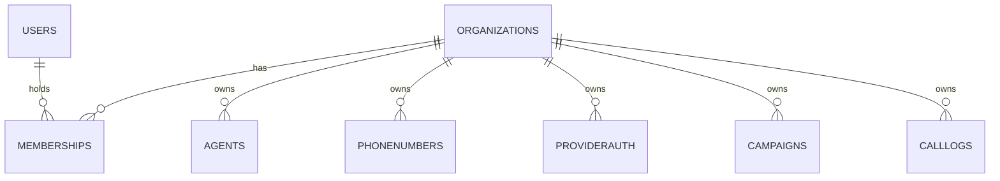
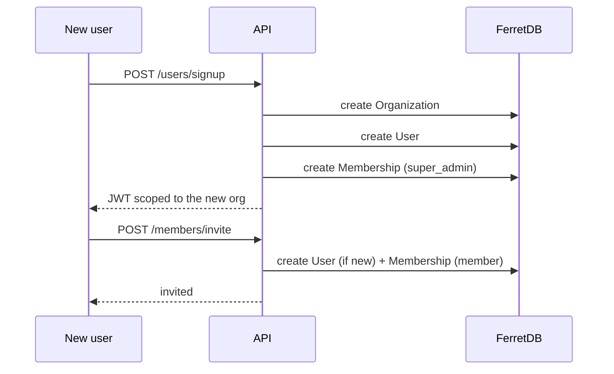
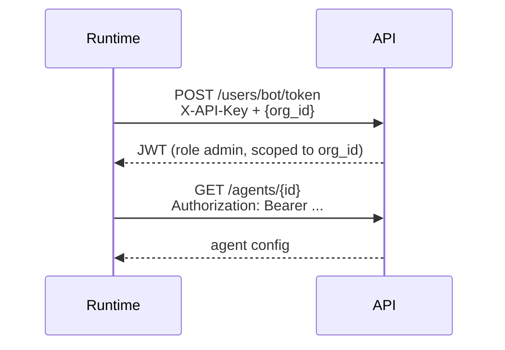

Every resource in VoicEra belongs to an **organisation**. A user can belong to several, holds a role in each, and works inside exactly one at a time — the *active* organisation, carried in the JWT.

## The three entities



`Memberships` is the join: one document per (user, organisation) pair, carrying the role. A user with no membership in an organisation cannot see anything inside it.

## Roles

Three roles, defined as a `Literal` in `apps/api/app/models/schemas.py`:

| Role | Granted by | Can do |
| --- | --- | --- |
| `super_admin` | Created automatically for whoever signs up and creates the organisation | Everything, including deleting the organisation and promoting or removing members |
| `admin` | Promoted by a `super_admin` | Manage provider credentials, delete agents, invite members |
| `member` | Default for an invited user | Create and edit agents, run campaigns, read call history; sees provider secrets masked |

### Permission matrix

| Action | `member` | `admin` | `super_admin` |
| --- | :-: | :-: | :-: |
| Create and update agents | Yes | Yes | Yes |
| Delete an agent | No | Yes | Yes |
| Attach and detach phone numbers | Yes | Yes | Yes |
| Run campaigns, upload knowledge | Yes | Yes | Yes |
| Delete a campaign | No | Yes | Yes |
| Read stored provider credentials | Masked | Yes | Yes |
| Store or delete provider credentials | No | Yes | Yes |
| Invite a member | No | Yes | Yes |
| Promote to `admin`, remove a member | No | No | Yes |
| Delete the organisation | No | No | Yes |

<Note>
Role checks are explicit `HTTPException` raises inside the handlers, not FastAPI dependencies. A valid token with the wrong role gets **403**; a missing or invalid token gets **401**.
</Note>

## The active organisation

A JWT carries three claims that matter:

| Claim | Meaning |
| --- | --- |
| `sub` | The user's email |
| `org_id` | The **active** organisation for this token |
| `role` | The user's role *in that organisation* |

Handlers read `org_id` from the token, never from the request body, so a caller cannot reach another tenant's data by changing a payload field.

Signing uses HS256 with `SECRET_KEY`, and tokens expire after `ACCESS_TOKEN_EXPIRE_MINUTES` (default **30**).

<Warning>
If `SECRET_KEY` is unset, `apps/api/app/auth.py` logs a warning and generates a temporary key at import time. Every restart then invalidates all outstanding tokens, and multiple replicas will not accept each other's. Always set it — `make application-up` does this for you.
</Warning>

### Switching organisations

```bash
curl -X POST http://localhost:8000/api/v1/users/switch-organisation \
  -H "Authorization: Bearer $TOKEN" \
  -H "Content-Type: application/json" \
  -d '{"org_id": "TARGET_ORG_ID"}'
```

You get back a **new token** scoped to that organisation, with the role you hold there. The choice also persists as your default for the next login. List what you can switch to with `GET /api/v1/users/organisations`.

## Signing up and inviting



Signup always creates an organisation and makes the signer its `super_admin`. There is no seeded default account — see [Generated secrets and defaults](../../guides/quickstart/secrets-and-defaults).

Check whether an address is already known before inviting:

```bash
curl "http://localhost:8000/api/v1/users/check/someone@example.com"
```

## Machine access

The runtime and other services are not users, so they do not log in. They exchange the shared internal key for a short-lived, organisation-scoped token:



| Header | Value | Used for |
| --- | --- | --- |
| `X-API-Key` | `INTERNAL_API_KEY` | Minting a bot token, and a small number of internal routes such as `GET /agents/by-phone/{phone_number}` |
| `Authorization: Bearer` | The minted JWT | Everything else |

The returned token carries role `admin` in the requested organisation. An unknown `org_id` returns **404**.

<Warning>
`INTERNAL_API_KEY` is a single shared secret with organisation-wide reach. Treat it like a root credential: never send it from a browser, and rotate it as described in [Security hardening](../../guides/deployment/security-hardening).
</Warning>

## How scoping is enforced

1. The token is verified and decoded (`get_current_user`).
2. `org_id` comes from the token.
3. Queries filter on that `org_id`.
4. Role-restricted handlers compare the `role` claim and raise 403 on mismatch.

A request for an object in another organisation returns **404**, not 403 — existence is not leaked across tenants.

## Related

* [Provider credentials](provider-auth) — how secrets are stored and masked
* [Agents](../../guides/concepts/agents) — what a member can configure
* [REST API](../../api-reference/overview) — auth column for every route
* [Security hardening](../../guides/deployment/security-hardening)
