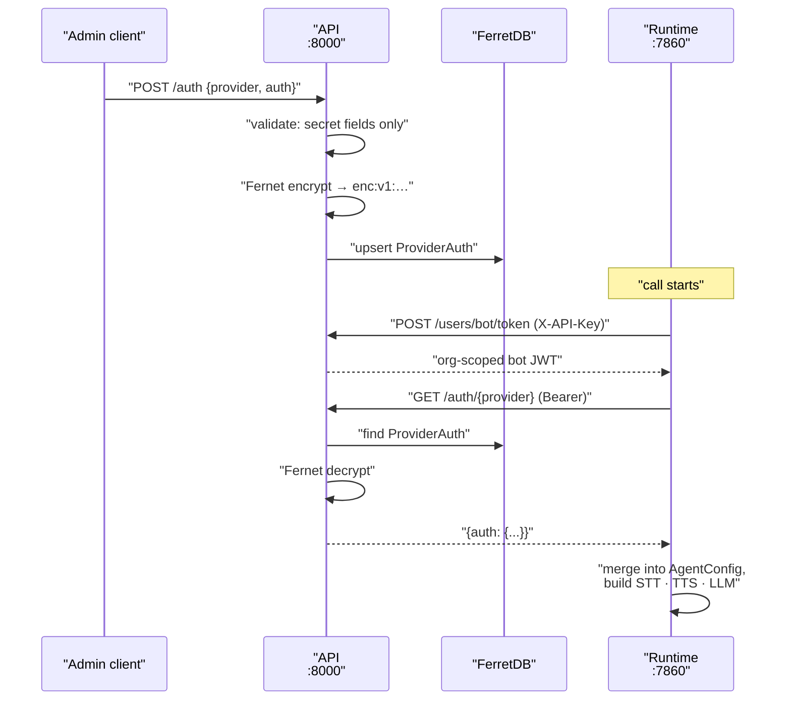

`ProviderAuth` is where an organisation's API keys live. One document per organisation per provider, encrypted at rest, never mixed into agent configuration. This page covers what is stored, how it is protected, and how it reaches a live call.

<Note>
The field names and which of them are secret come from the [provider registry](provider-registry) — `ProviderAuth` stores no schema of its own.
</Note>

## Provider-level, not agent-level

Credentials are **provider-level**: one key set shared across that provider's STT, TTS, and LLM. Configure OpenAI once and every agent in the organisation that uses OpenAI for any slot gets the same key.

Agent documents stay secret-free. An agent's `config.models.stt_config` holds `provider`, `model`, `language`, and vendor knobs — never an API key. The two halves are merged only in the runtime, in memory, at the moment a call starts.

This is why `provider_auth_catalog(provider)` merges the auth fields across every kind a provider registers for. Deepgram registers both STT and TTS; its catalog entry lists `api_key` once, not twice.

## What is stored

Only **secret** fields. `validate_auth_payload` in `apps/api/app/services/provider_auth_catalog.py` enforces it:

* The provider's `secrets` list from the catalog is the complete allowlist.
* Any key not in that list — a region, an endpoint, a `project_id`, a typo — is rejected by name with a 422.
* A provider with no secret fields at all cannot have auth stored.
* Catalog `required` fields that are also secrets must be present and non-empty.
* Keys are filtered down to the allowlist before being written, so nothing extra sneaks through.

The stored document is small:

| Field | Contents |
| --- | --- |
| `org_id` | Owning organisation |
| `provider` | Provider id, e.g. `deepgram` |
| `auth` | The Fernet ciphertext string, prefixed `enc:v1:` |
| `created_at`, `updated_at` | ISO timestamps |

Non-secret vendor settings — `base_url`, `region`, `grpc_url` — belong on the agent's provider config, not here. That split is the Auth-versus-Settings boundary described in the [provider registry](provider-registry).

## Fernet encryption at rest

The **whole** `auth` object is encrypted, not individual values. `secret_crypto.encrypt_json` serialises the validated dict with sorted keys and no whitespace, encrypts it with Fernet, and prefixes the token with `enc:v1:`. What lands in FerretDB is one opaque string.

The key is `settings.PROVIDER_AUTH_ENCRYPTION_KEY`, a Fernet key with no default. A missing or malformed key raises `EncryptionNotConfiguredError`, which the auth router turns into a 500 — writes and reads both fail loudly rather than silently storing plaintext.

Decryption fails closed. `decrypt_json` passes through a dict (legacy plaintext), warns and parses a bare JSON string, and otherwise refuses anything without the `enc:v1:` prefix. An `InvalidToken` becomes `ValueError("Failed to decrypt ProviderAuth credentials")`.

## Masking for members

The same route returns different data depending on who asks. `_mask_for_user` in `apps/api/app/routers/auth.py` checks the caller's role against `_WRITE_ROLES` — `super_admin` and `admin`:

| Role | `GET /auth/{provider}` | `POST /auth` | `DELETE /auth/{provider}` |
| --- | --- | --- | --- |
| `super_admin` | Real secrets | Allowed | Allowed |
| `admin` | Real secrets | Allowed | Allowed |
| `member` | Masked secrets | 403 | 403 |

Masking keeps the last four characters and replaces everything before them with asterisks. A value of four characters or fewer becomes `****` outright, and a list of keys is masked element by element. Masking happens after decryption, in `mask_auth_secrets`.

See [Multi-tenancy and roles](multi-tenancy) for how roles are assigned.

## The catalog, configure, use loop

Configuring a provider is three calls, and only the middle one writes anything.

1. **`GET /auth/catalog`** — every provider's auth schema, or `GET /auth/catalog/{provider}` for one. This tells you which fields to collect and which are secret.
2. **`POST /auth`** — upsert `{provider, auth}`. Admin or super_admin only. The response echoes the decrypted values, never the ciphertext.
3. **`GET /auth/configured`** — the sorted list of provider ids that have credentials stored for the organisation. Use it to show what is set up without fetching any secrets.

`DELETE /auth/{provider}` removes the document; a 404 means there was nothing to delete. An unknown provider id on any of these routes returns 404 from `UnknownAuthProviderError`.

The catalog spans both registries — `apps.providers` and `apps.telephony` — so a telephony provider's credentials are configured through exactly the same routes.

## How the runtime fetches credentials

The runtime holds no keys of its own. It asks the API on every call.

`BackendClient.get_bot_token` in `apps/runtime/services/backend.py` exchanges `INTERNAL_API_KEY` for an organisation-scoped JWT, caches it per organisation for 25 minutes, and force-refreshes on any 401. The bot JWT carries admin rights, which is why `GET /auth/{provider}` returns unmasked secrets to it.

`merge_models_with_auth` in `apps/runtime/services/ai_service_factory.py` then does the join. For each of `stt_config`, `tts_config`, and `llm_config` it reads the provider id off the agent's model blob, fetches that provider's auth, and merges: `{**blob, **auth}`. The result is validated as an `AgentConfig` and handed to the factory. It logs the merged *key names*, never the values.

Because the merge is `{**blob, **auth}`, a stored credential wins over anything of the same name on the agent config. In practice they never collide — the agent config cannot hold secret fields.

## Rotating the encryption key

<Warning>
`PROVIDER_AUTH_ENCRYPTION_KEY` is the only thing that can decrypt stored credentials. Lose it, or change it while `ProviderAuth` documents exist, and **every stored credential becomes permanently undecryptable**. There is no recovery path, no escrow, and no second key. Every `GET /auth/{provider}` will fail with "Failed to decrypt ProviderAuth credentials", and every call will fail to build its AI services.
</Warning>

The only supported rotation is re-entry. With the old key still in place, record which providers are configured (`GET /auth/configured`) and have the real credentials to hand — they cannot be recovered from the database once the key changes. Then swap the key, restart the API, and re-`POST /auth` for every provider.

Back the key up separately from the database. A backup that contains the ciphertext but not the key is not a backup.

## What never leaves the API

Encryption and decryption both live in `apps/api`. Nothing else has the key.

| Component | Sees | Does not see |
| --- | --- | --- |
| API | Plaintext credentials in memory during encrypt and decrypt | — |
| FerretDB / PostgreSQL | The `enc:v1:` ciphertext | Plaintext |
| Runtime | Plaintext for the providers one call needs, in memory | The encryption key, other organisations' credentials |
| ARQ worker, orchestrator | Nothing — neither touches `ProviderAuth` | Everything |
| Members | Masked values | Real secrets |

The ciphertext itself is never returned to a client. `upsert_provider_auth` returns the validated plaintext it just wrote, and `_to_response` decrypts before responding, so no route ever echoes `enc:v1:`.

## Related

* [Provider registry](provider-registry) — where the auth field definitions come from
* [Agents and agent categories](../../guides/concepts/agents) — the secret-free half of a provider config
* [Multi-tenancy and roles](multi-tenancy) — who counts as an admin
* [Runtime (apps/runtime)](../services/runtime) — the bot-token consumer
* [Security hardening](../../guides/deployment/security-hardening)
* [Generated secrets and defaults](../../guides/quickstart/secrets-and-defaults)
