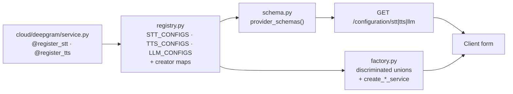

`apps/providers` holds Pydantic configs and a factory that build Pipecat (and first-party) STT, TTS, and LLM services. Adding a vendor means adding a folder — no central list, no `if/elif`, no second copy of the catalog in the API or a client form.

<Note>
To add a vendor, follow [Adding an AI provider](../guides/adding-a-provider). This page explains why the package is shaped the way it is.
</Note>

## The problem with a central if/elif

The obvious way to support many vendors is one dispatch function that branches on a provider string, plus a hand-maintained list of provider names and their fields for the UI. That gives you three places to edit per vendor and three places to get out of sync — and the list a client sees is only ever as fresh as the last time someone remembered to update it.

VoicEra inverts it. Each vendor module registers itself; everything else is derived:



`load_providers()` walks `cloud/`, `adapters/`, and `local/` with `pkgutil.iter_modules` and imports every `<vendor>.service` module so the decorators run. A vendor package without a `service.py` is skipped rather than raising. Package roots are resolved from `__package__`, not a hard-coded `apps.providers` prefix, so the tree still loads when pytest imports it as `voicera.apps.providers`.

`registry._register` reads the config class off the creator's first type hint and the provider id off that class's `provider` field default. Registering two different config classes under the same provider id raises `ValueError` at import time.

## Registry, factory, schema

| Path | Role |
| --- | --- |
| `base.py` | Shared `Kind` / `ProviderType` enums and Auth/Settings/Config bases |
| `registry.py` | `@register_*` maps, `load_providers()`, creator helpers (`api_key`, `llm_settings`) |
| `factory.py` | Discriminated unions from the registry plus thin `create_*` dispatch |
| `schema.py` | `provider_schemas` / `configuration_defaults` readable catalog dump |
| `languages.py` | Canonical language ids → labels; `language_schema_extra()` |
| `cloud/<vendor>/` | Pipecat-backed vendors (`catalog`, `config`, `languages`, `service`) |
| `adapters/<vendor>/` | First-party services (`service.py` plus optional `tts.py`) |
| `local/<vendor>/` | Reserved for self-hosted providers |

`factory.py` builds one `Annotated[Union[...], Field(discriminator="provider")]` per kind from the registered classes, then composes them into `AgentConfig`:

```python
from apps.providers import AgentConfig, create_stt_service

agent = AgentConfig.model_validate({
    "stt_config": {"provider": "deepgram", "api_key": "...", "model": "nova-3"},
    "tts_config": {"provider": "openai", "api_key": "..."},
    "llm_config": {"provider": "openai", "api_key": "...", "model": "gpt-4.1-mini"},
})

stt = create_stt_service(agent)
```

Pydantic picks the right config class from the `provider` discriminator and validates the rest against it, so an unknown provider or a missing required field fails at validation, not at call time.

Vendor creators import Pipecat *inside* the function body, so a missing per-vendor extra breaks only that vendor rather than the whole package import. The package `__init__` goes further and loads factory symbols lazily through `__getattr__`, which is why a catalog dump does not need loguru or Pipecat installed at all.

`apps/providers/cloud/factory.py` is a deprecated re-export kept for compatibility. Import from `apps.providers` or `apps.providers.factory`.

## Auth vs Settings vs Config

Each vendor `config.py` stacks three layers:

1. **Auth** — credentials (`api_key`, `auth_token`, …). Secrets are marked with `json_schema_extra={"secret": True}`.
2. **Settings** — vendor knobs (`voice`, `speed`, `base_url`, `grpc_url`, …).
3. **Config** — Auth + Settings + the matching `Base*Config`, contributing `provider`, `model`, and `language`.

Credentials never live on the bases. Endpoints and hosts belong on Settings, not Auth. The split is what lets [ProviderAuth](provider-auth) store exactly the secret fields and nothing else — `validate_auth_payload` rejects any non-secret catalog field outright.

Deepgram is a compact example:

```python
class DeepgramAuth(BaseModel):
    api_key: str | list[str] = Field(
        description="Deepgram API key (or a list for rotation).",
        json_schema_extra={"secret": True},
    )


class DeepgramSTTConfig(DeepgramAuth, DeepgramSTTSettings, BaseSTTConfig):
    """Deepgram speech-to-text configuration."""

    name: str = "Deepgram"
    provider: Literal["deepgram"] = "deepgram"
```

`name` is the UI display label; `provider` is the discriminator. Both are required for registration to work.

## Provider types

`ProviderType` has three values, derived in `schema._provider_type` from the config class's module path rather than declared:

| Value | Source folder | What it means |
| --- | --- | --- |
| `cloud` | `apps/providers/cloud/` | A hosted vendor reached over its own API, wired through Pipecat. |
| `adapter` | `apps/providers/adapters/` | A first-party service class implementing a Pipecat `STTService` / `TTSService`. |
| `local` | `apps/providers/local/` | Talks to VoicEra's own [model server](../model-server/overview) gateway instead of a third-party API. Two providers today: `indic_orpheus` (TTS) and `indic_nemotron` (STT). |

A config class outside all three raises `ValueError`, which keeps the layout honest.

## The schema dump

`provider_schemas(kind)` returns a **readable catalog**, not raw JSON Schema — no `$defs`, `$ref`, or `anyOf`. Every entry carries the provider id, display name, provider type, first docstring line, required fields, the secret field names, and a per-field description:

```python
from apps.providers import Kind, provider_schemas

openai = provider_schemas(Kind.LLM)["openai"]
# {
#   "provider": "openai",
#   "name": "OpenAI",
#   "provider_type": "cloud",
#   "description": "...",
#   "required": ["api_key"],
#   "secrets": ["api_key"],
#   "fields": {
#     "api_key": {"type": "...", "secret": true},
#     "model": {"type": "string", "examples": [...], "input_mode": "both"},
#     "base_url": {"type": "string", "input_mode": "input"},
#   },
# }
```

`kind`, `provider`, and `name` are omitted from `fields` — they are catalog top-level, not form inputs. Field entries carry `default`, `minimum`/`maximum` from Pydantic constraints, and the whitelisted extras `secret`, `examples`, `multiline`, `model_options`, `language_codes`, and `docs_url`. The `secrets` list is always present, even when empty.

## How input_mode is derived

A client form needs to know whether a field is a dropdown, a text box, or both. `_input_mode` derives it rather than making each vendor declare it:

| Field has | `allow_custom_input` | `input_mode` |
| --- | --- | --- |
| `examples` or `model_options` | absent or false | `options` |
| `examples` or `model_options` | `true` | `both` |
| Neither | any | `input` |

Secrets get no `input_mode` at all — a secret is always a password input, never a picker. `allow_custom_input` is read for the derivation but is not itself dumped into the catalog.

## Languages

Canonical language ids live in `languages.py` — `hi`, `en`, `en-US`, `multi`, and the rest of the Indian language set with their labels. They are what the database stores and what a client selects; they are stable and provider-agnostic.

Each STT/TTS vendor maps its own codes to those ids inside `catalog.py` as `STT_CAPABILITIES` / `TTS_CAPABILITIES` (alongside per-vendor-code settings), then wires helpers in config:

```python
from ...capabilities import languages_map, settings_tree
from ...languages import language_schema_extra
from .catalog import STT_CAPABILITIES

settings_by_model_language: ClassVar[dict] = settings_tree(STT_CAPABILITIES)

language: str = Field(
    default="multi",
    json_schema_extra=language_schema_extra(languages_map(STT_CAPABILITIES)),
)
```

The dump then exposes three related keys on that field:

| Key | Shape |
| --- | --- |
| `examples` | Flat list of canonical ids the vendor supports |
| `model_options` | `model → [canonical ids]` |
| `language_codes` | `model → {canonical id: vendor code}` |

Plus top-level `settings_by_model_language` keyed by **canonical** language ids (no `"*"`).

Labels ship once, globally, on `configuration_defaults()["languages"]` — vendors never carry their own label strings.

Vendor **defaults** differ on purpose. Deepgram STT defaults to `multi`; other vendors default to `en`, `en-US`, or `hi`. Do not force a single default across providers.

Mid-call language switching does not exist. A language is chosen per agent config and holds for the whole call.

## configuration_defaults()

`configuration_defaults()` is the one-shot envelope for a configuration UI:

```python
from apps.providers import configuration_defaults

defaults = configuration_defaults()
# {
#   "stt": {...}, "tts": {...}, "llm": {...},
#   "default_providers": {"stt": "deepgram", "tts": "elevenlabs", "llm": "openai"},
#   "languages": {"hi": "Hindi", "en": "English", ...},
# }
```

`DEFAULT_SERVICE_PROVIDERS` in `schema.py` picks Deepgram for STT, ElevenLabs for TTS, and OpenAI for LLM. The function validates that each of those is actually registered and raises `ValueError` if not, so a default can never point at a vendor that was removed.

## The catalog endpoints

`apps/api/app/routers/configuration.py` is a thin pass-through to the schema dump. Every route needs a bearer token.

| Route | Returns |
| --- | --- |
| `GET /configuration/stt` | Every STT provider, optionally filtered by `?languages=` |
| `GET /configuration/tts` | Every TTS provider, optionally filtered by `?languages=` |
| `GET /configuration/llm` | Every LLM provider |
| `GET /configuration/telephony` | Every telephony provider, from the parallel `apps.telephony` registry |
| `GET /configuration/stt/setting/{provider}` | Full field catalog for one STT provider |
| `GET /configuration/tts/setting/{provider}` | Full field catalog for one TTS provider |
| `GET /configuration/llm/setting/{provider}` | Full field catalog for one LLM provider |
| `GET /configuration/telephony/setting/{provider}` | Full field catalog for one telephony provider |

The `languages` query parameter takes comma-separated canonical ids and filters as an AND — a provider must support all of them to be listed. An unknown language id returns 400; an unknown provider id returns 404.

`apps.telephony` mirrors this package's structure with its own registry and schema module, which is why the same router serves both. See [Telephony model](../../guides/concepts/telephony-model).

## Current inventory

Generated by running `provider_schemas()` against the live registry, not counted by hand:

```bash
python3 -c "from apps.providers import Kind, provider_schemas; [print(k, sorted(provider_schemas(k))) for k in Kind]"
```

**22 cloud vendors, 2 adapters, and 2 local providers.** Several vendors register for more than one kind, so the per-kind lists overlap.

| Provider id | Display name | Type | Kinds |
| --- | --- | --- | --- |
| `assemblyai` | AssemblyAI | cloud | STT |
| `atlascloud` | Atlas Cloud | cloud | LLM |
| `aws_bedrock` | AWS Bedrock | cloud | LLM |
| `azure_openai` | Azure OpenAI | cloud | LLM |
| `azure_speech` | Azure Speech | cloud | STT, TTS |
| `bhashini` | Bhashini | **adapter** | STT, TTS |
| `camb` | Camb.ai | cloud | TTS |
| `cartesia` | Cartesia | cloud | STT, TTS |
| `deepgram` | Deepgram | cloud | STT, TTS |
| `elevenlabs` | ElevenLabs | cloud | STT, TTS |
| `gladia` | Gladia | cloud | STT |
| `google` | Google | cloud | STT, TTS, LLM |
| `google_vertex` | Google Vertex AI | cloud | LLM |
| `groq` | Groq | cloud | LLM |
| `indic_nemotron` | Indic Nemotron | **local** | STT |
| `indic_orpheus` | Indic Orpheus | **local** | TTS |
| `kenpath` | Kenpath | **adapter** | LLM |
| `inworld` | Inworld | cloud | TTS |
| `lmnt` | LMNT | cloud | TTS |
| `openai` | OpenAI | cloud | STT, TTS, LLM |
| `openrouter` | OpenRouter | cloud | LLM |
| `rime` | Rime | cloud | TTS |
| `sarvam` | Sarvam | cloud | STT, TTS, LLM |
| `smallest` | Smallest.ai | cloud | STT, TTS |
| `speechmatics` | Speechmatics | cloud | STT |
| `xai` | xAI | cloud | TTS |

That is 13 STT providers, 15 TTS providers, and 10 LLM providers. No local LLM provider exists yet — see [Adding an AI provider](../guides/adding-a-provider#local-providers-one-extra-registration-call).

<Note>
Bhashini covers **STT** (Dhruva WebSocket ASR, `api_key`) and **TTS** (NVCF gRPC, `auth_token` + `function_id`) — different transports and different credentials under one provider id. Kenpath is **LLM only**, and authenticates with an RSA private key rather than an API key — see [Providers](../services/providers#kenpath).
</Note>

## Related

* [Adding an AI provider](../guides/adding-a-provider) — the six-step recipe
* [Provider credentials (ProviderAuth)](provider-auth) — where the secret fields go
* [Agents and agent categories](../../guides/concepts/agents) — where a provider config is stored
* [Voice pipeline](../../guides/concepts/voice-pipeline) — what the created services plug into
* [Providers (apps/providers)](../services/providers)
