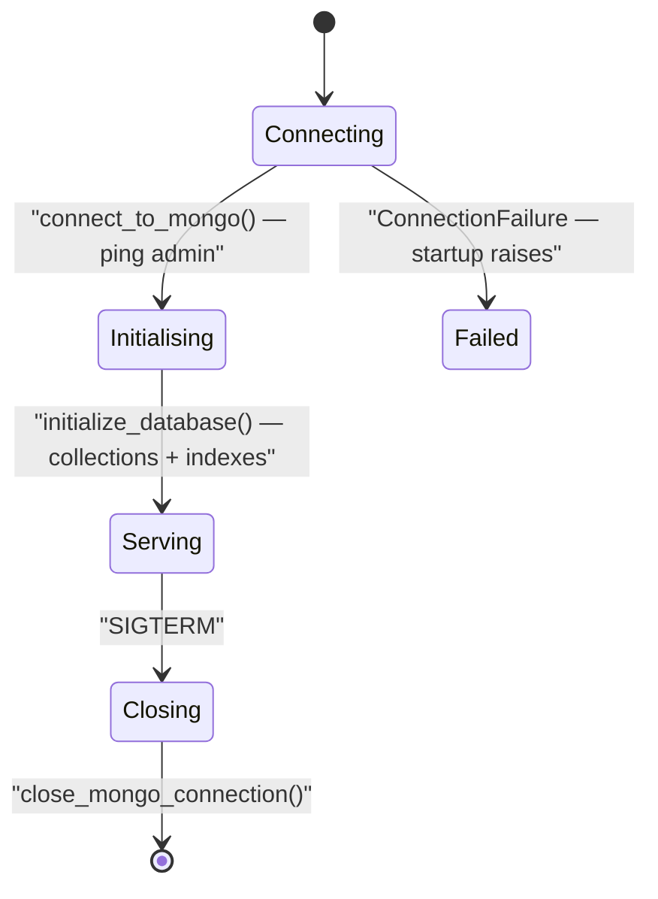

`apps/api` is the FastAPI application that owns every document in VoicEra: users, organisations, agents, phone numbers, call logs, campaigns, and knowledge documents. It listens on port 8000 and is the only service that talks to FerretDB.

<Note>
The same package also runs as the ARQ worker and the campaign orchestrator, with a different `command`. This page covers the HTTP process only — see [Workers and orchestrator](workers) for the other two.
</Note>

## Responsibilities

| Responsibility | Where it lives |
| --- | --- |
| Authentication, JWTs, password reset | `app/routers/users.py`, `app/services/auth_service.py` |
| Organisations, memberships, roles | `app/routers/{organisations,members}.py` |
| Agent CRUD and config validation | `app/routers/agents.py`, `app/services/agent_config_validation.py` |
| Telephony provisioning and phone numbers | `app/services/agent_telephony_service.py`, `app/services/phone_number_service.py` |
| Provider catalogs and credentials | `app/routers/{configuration,auth}.py`, `app/services/provider_auth_catalog.py` |
| Call logs and artifact proxying | `app/routers/calls.py`, `app/services/call_log_service.py` |
| Campaigns, batching, circuit breaker | `app/routers/campaign.py`, `app/services/campaign/` |
| Knowledge base ingest and retrieval | `app/routers/{knowledge,rag}.py`, `app/rag/` |

## Router map

Every router is mounted under `settings.API_V1_PREFIX`, which defaults to `/api/v1`. `app/main.py` includes them in this order:

`users` · `members` · `organisations` · `languages` · `configuration` · `auth` · `agents` · `phone-numbers` · `calls` · `campaign` · `knowledge` · `rag`

The tables below are reproduced from `apps/api/README.md`. `/docs` on a running instance is always the authoritative list.

### Auth and users

| Method | Path | Auth |
|--------|------|------|
| POST | `/users/signup` | public → JWT (`super_admin` of new org) |
| POST | `/users/login` | public → JWT |
| POST | `/users/bot/token` | `X-API-Key: INTERNAL_API_KEY` — body `{ "org_id" }` → org-scoped JWT (`admin`) |
| POST | `/users/switch-organisation` | Bearer (persists default org for next login) |
| GET | `/users/organisations` | Bearer |
| GET | `/users/me` | Bearer |
| GET | `/users/check/{email}` | public |
| GET | `/users/{email}` | Bearer (self) |
| POST | `/users/forgot-password` | public |
| POST | `/users/reset-password` | public |
| POST | `/members/invite` | Bearer (`admin` or `super_admin`) |
| GET | `/members/{org_id}` | Bearer (member of org) |
| POST | `/members/assign-admin` | Bearer (`super_admin`) |
| POST | `/members/remove` | Bearer (`super_admin`) |
| DELETE | `/organisations/{org_id}` | Bearer (`super_admin`, active org) |

Service-to-service callers use `POST /users/bot/token` with the internal key and an `org_id`, then send the returned `access_token` as a Bearer token. An unknown `org_id` returns 404.

### Configuration catalogs

| Method | Path | Auth |
|--------|------|------|
| GET | `/configuration/stt` | Bearer (optional `languages` AND filter) |
| GET | `/configuration/tts` | Bearer (optional `languages`) |
| GET | `/configuration/llm` | Bearer |
| GET | `/configuration/telephony` | Bearer |
| GET | `/configuration/{kind}/setting/{provider}` | Bearer |

These are generated from [`apps/providers`](providers) and [`apps/telephony`](telephony) at request time. There is no hand-maintained list in the router.

### Provider credentials

Credentials are **provider-level** — one key set is shared across the STT, TTS, and LLM slots of that provider. Only secret fields are stored in `ProviderAuth`, and the whole `auth` object is Fernet-encrypted at rest with `PROVIDER_AUTH_ENCRYPTION_KEY`.

| Method | Path | Auth |
|--------|------|------|
| GET | `/auth/catalog` | Bearer — all provider auth schemas |
| GET | `/auth/catalog/{provider}` | Bearer — one provider schema |
| GET | `/auth/configured` | Bearer — provider ids with stored auth |
| POST | `/auth` | Bearer (`admin` or `super_admin`) — upsert `{provider, auth}` (secrets only) |
| GET | `/auth/{provider}` | Bearer — stored auth (members see masked secrets) |
| DELETE | `/auth/{provider}` | Bearer (`admin` or `super_admin`) |

See [Provider credentials (ProviderAuth)](../reference/provider-auth).

### Agents

Agents store typed behaviour plus AI model configs, secret-free. For **telephony** agents the API automatically creates a provider application using org credentials from `ProviderAuth` and stores the attachment on the agent document. **WebSocket** agents skip telephony provisioning.

Set `VOICE_SERVER_BASE_URL` before creating telephony agents. Answer and hangup use the same URL:

```text
{VOICE_SERVER_BASE_URL}/answer?agent_id={agent_id}&org_id={org_id}
```

| Method | Path | Auth |
|--------|------|------|
| POST | `/agents` | Bearer (any org member) — create; `created_by` = JWT email |
| GET | `/agents` | Bearer — list agents in active org |
| GET | `/agents/by-phone/{phone_number}` | `X-API-Key` — resolve agent by linked number |
| GET | `/agents/{agent_id}` | Bearer — get one (same org) |
| PATCH | `/agents/{agent_id}` | Bearer (any org member) — partial update |
| DELETE | `/agents/{agent_id}` | Bearer (`admin` or `super_admin`) |

`config.models` must include `stt_config`, `tts_config`, and `llm_config`, each with a registered `provider` and non-secret settings only. Full field reference in [Agent configuration](../reference/agent-configuration).

### Phone numbers

| Method | Path | Auth |
|--------|------|------|
| GET | `/phone-numbers` | Bearer — list org inventory |
| GET | `/phone-numbers/agent/{agent_id}` | Bearer — number attached to agent |
| POST | `/phone-numbers/attach` | Bearer — add to inventory; with `agent_id` also provider-link + set `Agents.linked_phone_number` |
| DELETE | `/phone-numbers/detach` | Bearer — provider-unlink + clear agent association (keeps inventory row) |
| GET | `/phone-numbers/providers/{provider}/inventory` | Bearer — list numbers on the org provider account |

Omit `agent_id` on attach to import a number into inventory only, with no provider link.

### Calls, campaigns, and knowledge

| Router | Prefix | Notable routes |
| --- | --- | --- |
| `calls` | `/calls` | `PATCH /{call_id}`, `PATCH /by-provider-sid/{provider_call_sid}`, `GET /{call_id}/recording`, `GET /{call_id}/transcript`, `GET /org/{org_id}` |
| `campaign` | `/campaign` | `POST /create`, `POST /{campaign_id}/start`, `/pause`, `/resume`, `/redial`, `GET /{campaign_id}/progress`, `GET /{campaign_id}/report`, `POST /internal/call-status` |
| `knowledge` | `/knowledge` | `GET`, `POST` (PDF upload), `DELETE` |
| `rag` | `/rag` | `POST /retrieve` |
| `languages` | — | `GET /languages` |

The recording and transcript routes are authenticated proxies over MinIO — the runtime stores a `minio://` URI and clients never talk to MinIO directly. See [Calls and call artifacts](../../guides/concepts/calls) and the full [REST API reference](../../api-reference/overview).

## Service layer

Routers stay thin. `app/services/` owns the rules:

| Module | What it does |
| --- | --- |
| `agent_service.py` | Agent documents, ownership, and lifecycle. |
| `agent_config_validation.py` | Validates `config.models` against the provider registry before saving. |
| `agent_telephony_service.py` | Creates, updates, and removes provider applications when an agent changes. |
| `phone_number_service.py` | Org DID inventory plus provider link and unlink. |
| `auth_service.py`, `user_service.py`, `member_service.py`, `org_service.py` | Identity, roles, and membership. |
| `provider_auth_catalog.py` | Merges provider schemas with what the org has stored. |
| `secret_crypto.py` | Fernet encrypt and decrypt for `ProviderAuth` blobs. |
| `call_log_service.py`, `inbound_call_service.py`, `outbound_call_service.py` | CallLog creation and updates for each direction. |
| `knowledge_service.py` | Knowledge document records and MinIO objects. |
| `call_concurrency/` | Redis-backed concurrency slots and rate limiting. See [Call concurrency](../reference/call-concurrency). |
| `campaign/` | Repository, dispatcher, circuit breaker, event protocol, orchestrator. See [Campaigns](../../guides/concepts/campaigns). |

`app/rag/` holds the ingest pipeline: `pdf_to_text.py` → `chunk_text.py` → `embed_chunks.py` → `chroma_store.py`. `app/storage/minio_client.py` wraps the MinIO SDK. `app/models/schemas.py` holds the Pydantic request and response models.

## Persistence

Three stores, each with a different job.

| Store | Client | Holds |
| --- | --- | --- |
| FerretDB | `pymongo` via `app/database.py` | Every document. Collections include `Organizations`, `Users`, `Memberships`, `ProviderAuth`, `Agents`, `PhoneNumbers`. |
| MinIO | `minio` SDK via `app/storage/minio_client.py` | Call recordings, transcripts, knowledge PDFs. Bucket `MINIO_BUCKET`, default `voicera-calls`. |
| Chroma | `chromadb`, on-disk | Per-organisation vector store under `CHROMA_BASE_DIR`, `/app/app/rag/chroma_data` in Docker. |

`app/database.py` builds the connection URI from `MONGODB_HOST`, `MONGODB_PORT`, `MONGODB_USER`, `MONGODB_PASSWORD`, and `MONGODB_DATABASE`. `MONGODB_AUTH_SOURCE` and `MONGODB_AUTH_MECHANISM` default to empty strings because FerretDB authenticates with PostgreSQL users over SCRAM-SHA-256. Connections use `serverSelectionTimeoutMS=5000`.

See [Data store (FerretDB)](../reference/data-store) and the [Data model](../reference/data-model).

## Startup lifecycle

`app/main.py` uses a FastAPI `lifespan` context manager rather than event handlers.



1. `connect_to_mongo()` creates the `MongoClient` and runs `ping` against `admin`. A `ConnectionFailure` or `ServerSelectionTimeoutError` is logged and re-raised, so the process exits rather than serving a broken app.
2. `initialize_database()` (`app/database_init.py`) creates collections and indexes. It is idempotent: `_ensure_index` swallows "already exists" and "duplicate" errors, so restarts are safe.
3. On shutdown `close_mongo_connection()` closes the client.

Log level is `DEBUG` when `settings.DEBUG` is true, `INFO` otherwise. `DEBUG` is coerced by a validator that accepts `1`, `true`, `yes`, `on` and treats anything else as false — a host shell exporting `DEBUG=release` will not crash settings parsing.

## CORS and middleware

`CORSMiddleware` is the only middleware, configured as:

```python
app.add_middleware(
    CORSMiddleware,
    allow_origins=["*"],
    allow_credentials=True,
    allow_methods=["*"],
    allow_headers=["*"],
)
```

<Warning>
`allow_origins=["*"]` together with `allow_credentials=True` is permissive and suitable for local development only. Restrict origins before exposing the API to the internet — see [Security hardening](../../guides/deployment/security-hardening).
</Warning>

Interactive docs are served at `/docs` (Swagger UI) and `/redoc` (ReDoc). Both are enabled unconditionally.

## Running it standalone

Start only the database layer, then run uvicorn on the host:

```bash
docker compose -f docker-compose.yaml up postgres ferretdb
```

```bash
cd apps/api
python -m venv .venv
source .venv/bin/activate
pip install -r requirements.txt
uvicorn app.main:app --reload --host 0.0.0.0 --port 8000
```

Configuration comes from the repository root `.env`, resolved in `app/config.py` relative to the file. There is no per-app `.env`. When running on the host, set `MONGODB_HOST=localhost` and `MONGODB_PORT=27018` to reach the published FerretDB port.

The image is `python:3.11-slim`. It installs `gcc`, `g++`, and `libgomp1`, then `apps/api/requirements.txt`, and copies `apps/providers` and `apps/telephony` alongside the app. Its `CMD` runs uvicorn without `--reload`; Compose overrides that with a `--reload` command and a bind mount for development.

## Health

```bash
curl -s http://localhost:8000/health
```

```json
{"status": "ok", "database": "up"}
```

`GET /health` calls `ping_database()`, which issues a `ping` against `admin` on the existing client. If the client is unset or the ping raises, the response is `{"status": "degraded", "database": "down"}` — with HTTP 200 either way, so a probe must inspect the body, not the status code.

`GET /` returns the project name, version, and a pointer to `/docs`.

## Related

* [Workers and orchestrator](workers) — the other two containers from this package
* [Runtime (apps/runtime)](runtime) — the only other service that calls this API
* [Multi-tenancy and roles](../reference/multi-tenancy)
* [REST API reference](../../api-reference/overview) · [Endpoints cheatsheet](../../api-reference/endpoints-cheatsheet)
