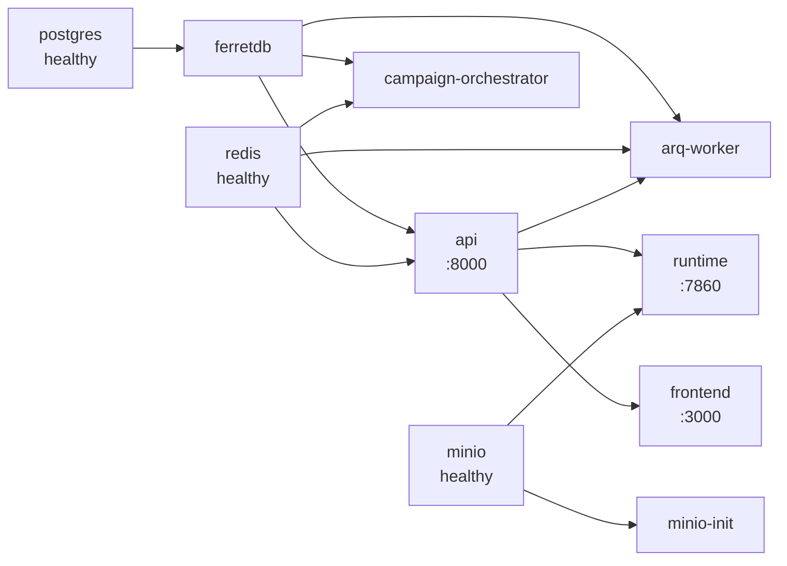

VoicEra ships as ten containers defined in `docker-compose.yaml`. This page maps each container to the code it runs, the port it listens on, and the order it starts in. Read it before you scale, restart, or debug a single piece of the stack.

<Note>
For the layered picture — system context, containers, and the internals of the API and the runtime — see [Architecture](../../guides/concepts/architecture). This page is the operator's index of the same set.
</Note>

## Containers versus packages

Containers and Python packages are not one to one. `apps/api` is a **single** package that runs as **three** containers. All three build from `apps/api/Dockerfile`, share the same image, mount the same code, and differ only in their `command`.

| Container | Builds from | Command | Port | Purpose |
| --- | --- | --- | --- | --- |
| `postgres` | `ghcr.io/ferretdb/postgres-documentdb:17-0.107.0-ferretdb-2.7.0` | image default | none published | Storage engine behind FerretDB. |
| `ferretdb` | `ghcr.io/ferretdb/ferretdb:2.7.0` | image default | `27018` host → `27017` container | MongoDB wire protocol over PostgreSQL. Network alias `mongodb`. |
| `api` | `apps/api/Dockerfile` | `uvicorn app.main:app --host 0.0.0.0 --port 8000 --reload` | `8000` | The [REST API](api) — auth, agents, campaigns, RAG, telephony provisioning. |
| `minio` | `minio/minio:latest` | `server /data --console-address ":9001"` | `9000` API, `9001` console | S3-compatible store for recordings and transcripts. |
| `minio-init` | `minio/mc:latest` | `mc alias set` + `mc mb --ignore-existing` | none | One-shot job that creates the `voicera-calls` bucket, then exits. |
| `redis` | `redis:7` | `redis-server --requirepass ${REDIS_PASSWORD}` | none published | ARQ job queue, campaign event bus, concurrency slots and rate limits. |
| `arq-worker` | `apps/api/Dockerfile` | `python -m arq app.tasks.arq.WorkerSettings` | none | Runs campaign batches and source syncs. See [Workers and orchestrator](workers). |
| `campaign-orchestrator` | `apps/api/Dockerfile` | `python -m app.services.campaign.campaign_orchestrator` | none | Schedules the next batch and detects campaign completion. |
| `runtime` | `apps/runtime/Dockerfile` | image `CMD` (uvicorn on `:7860`) | `7860` | The [voice runtime](runtime) — answer webhook and Pipecat pipeline. |
| `frontend` | `frontend/Dockerfile` | `npm run start` | `3000` | The [dashboard](../frontend/index) — the web console. Runs a production Next.js build, proxying `/api/v1` to `api` server-side. |

Two more packages are libraries, not containers. `apps/providers` and `apps/telephony` are copied into both images and imported:

| Package | Copied into | Used by |
| --- | --- | --- |
| [`apps/providers`](providers) | `api`, `runtime` | API builds provider catalogs; runtime builds live STT, TTS, and LLM services. |
| [`apps/telephony`](telephony) | `api`, `runtime` | API provisions applications and numbers; runtime builds answer XML and frame serializers. |

Container names carry the `voicera_oss_` prefix (`voicera_oss_api`, `voicera_oss_arq_worker`, and so on), as do the four volumes.

## Ports

Only five containers publish a host port. Everything else is reachable on the `app-network` bridge by service name.

| Service | Host port | Container port | Override with |
| --- | --- | --- | --- |
| `frontend` | 3000 | 3000 | `FRONTEND_HOST_PORT` |
| `api` | 8000 | 8000 | `API_HOST_PORT` |
| `runtime` | 7860 | 7860 | `RUNTIME_HOST_PORT` |
| `ferretdb` | 27018 | 27017 | `FERRETDB_HOST_PORT` |
| `minio` | 9000 / 9001 | 9000 / 9001 | `MINIO_API_PORT` / `MINIO_CONSOLE_PORT` |

The full table, including model-server ports, is in [Ports and defaults](../reference/ports-and-defaults).

## Start-up order

`depends_on` in `docker-compose.yaml` defines this graph. `postgres`, `redis`, and `minio` gate on a healthcheck (`condition: service_healthy`); every other edge gates on `condition: service_started`, which only waits for the process to launch, not to be ready.

<Note>
`api` waits for `ferretdb` to *start*, not to accept connections, and `ferretdb` itself only waits for `postgres` to pass `pg_isready`. On a cold first boot the API can come up before FerretDB serves queries and log a connection failure. `restart: unless-stopped` recovers it. If a container is stuck restarting, see [Deployment troubleshooting](../../guides/troubleshooting/deployment).
</Note>

## Who talks to whom

| From | To | Over | For |
| --- | --- | --- | --- |
| `api` | `ferretdb` | MongoDB wire protocol | All documents — users, agents, calls, campaigns. |
| `api` | `redis` | `REDIS_URL` | Enqueue ARQ jobs, publish campaign events, hold concurrency slots. |
| `api` | `minio` | S3 | Serve recordings and transcripts through proxy routes. |
| `api` | Chroma volume | local filesystem | Per-organisation RAG vector store at `/app/app/rag/chroma_data`. |
| `arq-worker` | `redis` | ARQ queue | Pull jobs, publish batch results. |
| `arq-worker` | `ferretdb` | MongoDB wire protocol | Read campaigns and queued runs, write state. |
| `campaign-orchestrator` | `redis` | pub/sub + ARQ | Subscribe to `campaign_events`, enqueue the next batch. |
| `runtime` | `api` | REST, `API_BASE_URL=http://api:8000/api/v1` | Fetch the agent, mint a bot JWT, patch the CallLog. |
| `runtime` | `minio` | S3, `MINIO_ENDPOINT=minio:9000` | Upload `transcript.txt` and `recording.wav`. |
| Telephony provider | `runtime` | HTTPS `/answer`, then WSS | Answer the call and stream audio. |

The runtime never touches FerretDB directly. It reaches every document through the API using a bot JWT minted with `INTERNAL_API_KEY` — see [How it authenticates to the API](runtime#how-it-authenticates-to-the-api).

## Related

* [Architecture](../../guides/concepts/architecture) — the C4 view of the same containers
* [Data flow](../../guides/concepts/data-flow) — what moves where, per scenario
* [Docker Compose](../../guides/deployment/docker-compose) — running and operating the stack
* [Environment variables](../reference/environment-variables)
