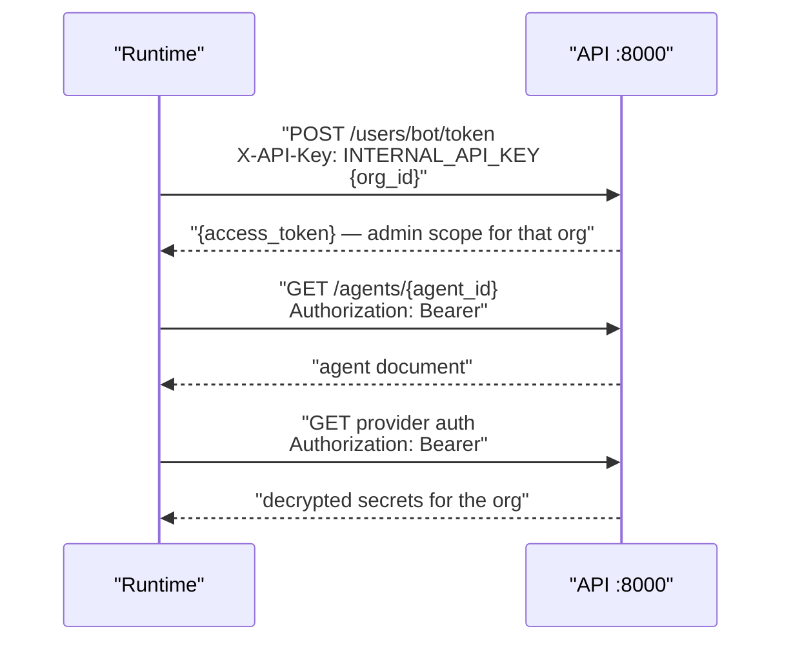

`apps/runtime` is the FastAPI service on port 7860 that answers telephony calls and runs the real-time audio pipeline. One WebSocket connection carries one call. It holds no database of its own — every document it needs comes from the [API](api) over REST.

<Note>
This page covers the service: its routes, how it reaches the API, and what it writes. The turn-by-turn mechanics of the audio loop are in [Voice pipeline](../../guides/concepts/voice-pipeline).
</Note>

## Responsibilities

1. Serve `GET|POST /answer?agent_id=&org_id=` for **telephony** agents and return Stream XML, with the provider read from `agent.telephony.provider`.
2. Accept `WS /agent/{org_id}/{agent_id}` for both agent categories.
3. Load agent config and provider credentials from the API on port 8000.
4. Build and run a Pipecat pipeline — STT → LLM → TTS — through [`apps/providers`](providers).
5. Upload the transcript and recording to MinIO and link them on the CallLog.

## Routes

| Method | Path | Returns |
| --- | --- | --- |
| GET | `/health` | `{"status": "ok", "service": "voicera-runtime"}` — static, no dependency checks |
| GET, POST | `/answer` | Provider Stream XML, or 400 / 502 as text |
| WS | `/agent/{org_id}/{agent_id}` | Media stream, optional `?call_id=` query parameter |

`/answer` requires both `agent_id` and `org_id` as query parameters; either missing returns 400. The webhook body is parsed by `decode_webhook_body()` from [`apps/telephony`](telephony), which accepts JSON or `x-www-form-urlencoded`, then merged with the query string.

If the parsed event is a hangup, the runtime patches the CallLog with `end_time_utc` and `status: "completed"` (plus a mapped `call_response` where one applies), optionally notifies campaign call status, and returns 200 with no XML. Otherwise it fetches the agent, rejects a non-telephony agent with 400, registers an inbound CallLog when the payload carries a provider call SID, and returns the Stream XML built by `build_answer_stream_xml(provider, websocket_url, sample_rate=...)`.

The WebSocket URL embedded in that XML is derived from `VOICE_SERVER_BASE_URL` by `voice_server_ws_base()`, which rewrites `https://` to `wss://` and `http://` to `ws://`:

```text
wss://voice.example.com/agent/{org_id}/{agent_id}?call_id={call_id}
```

## Agent modes

| `agent_category` | `/answer` | `/agent` WebSocket | Frame serializer |
|----------------|-----------|--------------------|------------------|
| `telephony` | Yes — returns provider Stream XML | Expects telephony `start` event | `create_frame_serializer(provider, ...)` |
| `websocket` | No — returns 400 | Direct browser connection | `ProtobufFrameSerializer` (RTVI) |

`agent_category()` in `services/agent_routing.py` defaults an agent with no category to `websocket` and raises `AgentRoutingError` on any other value.

<Tabs>
<Tab title="Telephony agents">
Answer and hangup URLs are provisioned by the API when the agent is created:

```text
{VOICE_SERVER_BASE_URL}/answer?agent_id={agent_id}&org_id={org_id}
```

The provider — `vobiz` or `plivo` — comes from the agent document. The runtime does not default to a single vendor. On the WebSocket, the first message must be a JSON `start` event; anything else closes the socket with code 1008. The runtime reads `provider_call_sid`, `streamSid`, and the numbers from that event via `parse_stream_start()`, and registers an inbound CallLog if the answer webhook did not already create one.
</Tab>

<Tab title="WebSocket agents">
Browser clients connect directly to:

```text
wss://{VOICE_SERVER_BASE_URL}/agent/{org_id}/{agent_id}
```

Use the Pipecat JS client with `@pipecat-ai/websocket-transport` and protobuf frames. No `/answer` webhook is involved, and no `start` event is expected. See [Browser WebSocket agents](../clients/browser-websocket).

Browser websocket sessions register a `call_type: web` CallLog on connect — either auto-created via `POST /api/v1/calls/web`, or reused from a `call_id` query parameter — so they produce transcripts and recordings under the same MinIO paths as telephony calls.
</Tab>
</Tabs>

## How it authenticates to the API

The runtime has no user credentials. `services/backend.py` mints an org-scoped bot JWT and caches it per organisation.



The cached token is reused for 25 minutes (`_TOKEN_TTL_SECONDS`), a little short of the API's 30-minute `ACCESS_TOKEN_EXPIRE_MINUTES`. A 401 forces a refresh and one retry. A missing `INTERNAL_API_KEY` raises `BackendError` immediately.

`services/ai_service_factory.py` then merges the agent's `config.models` with the fetched credentials — one `GET` per kind — and hands the result to `apps.providers` as an `AgentConfig`. Any of `stt_config`, `tts_config`, or `llm_config` missing a `provider` raises `ServiceBuildError`.

## Pipeline modules

`services/pipecat/` is nine modules plus three subpackages rather than one function:

| Module | Role |
| --- | --- |
| `runners.py` | Public entrypoints — `run_telephony_bot()` and `run_websocket_bot()` |
| `pipeline.py` | Core pipeline orchestration |
| `factory.py` | Builds the pipeline components |
| `config.py` | Parses pipeline behaviour out of the agent config |
| `lifecycle.py` | Run lifecycle and call finalisation |
| `audio.py` | Audio encoding helpers and custom-variable resolution |
| `hold.py` | One-shot hold and filler messages while the LLM thinks |
| `idle.py` | User-online detection and idle handling |
| `call_ending.py` | Graceful call ending through Pipecat function calling |
| `events/` | `logging.py`, `recording.py`, `transport.py` — turn logging, recording capture, connect and disconnect handlers |
| `metrics/` | `observers.py`, `writer.py` — Pipecat observers that measure per-turn and user-to-bot latency, and a writer that `PUT`s the result to [`/calls/{call_id}/metrics`](../../api-reference/calls) during teardown. Created only when the call has a `call_id`. |
| `termination/` | Empty package. Nothing imports it. |

`services/knowledge/` adds RAG to a call: `setup.py`, `config.py`, `tool.py`, `context_processor.py`, and `formatting.py` wire the API's `POST /rag/retrieve` into the LLM context. See [Knowledge base (RAG)](../../guides/concepts/knowledge-base-rag).

How these fit together during a live call — frame flow, interruption, VAD, and turn-taking — is covered in [Voice pipeline](../../guides/concepts/voice-pipeline).

## Call artifacts

For **telephony** calls, `services/storage/` uploads two objects at call end, keyed by `call_id`:

```text
voicera-calls/{org_id}/{call_id}/transcript.txt
voicera-calls/{org_id}/{call_id}/recording.wav
```

`transcript.py` buffers Pipecat turn messages during the call; `object_storage.py` writes to MinIO; `call_artifacts.py` then PATCHes the CallLog with a `minio://bucket/key` URI on `transcript_url` or `recording_url`:

```http
PATCH /api/v1/calls/{call_id}
```

Both `org_id` and `call_id` are sanitised into the object key — any character outside `[A-Za-z0-9-_]` becomes `_`. Clients fetch artifacts through the authenticated API proxy, never from MinIO directly:

```text
GET /api/v1/calls/{call_id}/recording
GET /api/v1/calls/{call_id}/transcript
```

Raw objects are browsable in the MinIO console at `http://localhost:9001`.

## Environment

| Variable | Default | Purpose |
|----------|---------|---------|
| `VOICE_SERVER_BASE_URL` | — | Public base URL for answer + WebSocket URLs |
| `SAMPLE_RATE` | `8000` | Telephony audio sample rate |
| `WEBSOCKET_SAMPLE_RATE` | `16000` | Browser WebSocket audio sample rate |
| `API_BASE_URL` | `http://localhost:8000/api/v1` | VoicEra API for agents + auth |
| `INTERNAL_API_KEY` | — | Bot JWT minting for runtime → API |

MinIO access is read straight from the environment by `object_storage.py`: `MINIO_ENDPOINT` (default `localhost:9000`), `MINIO_ACCESS_KEY`, `MINIO_SECRET_KEY`, `MINIO_SECURE`, and `MINIO_BUCKET` (default `voicera-calls`). `RUNTIME_HOST` and `RUNTIME_PORT` control the bind address when the module is run directly.

All variables live in the repository root `.env`. Inside Compose, `API_BASE_URL` and `MINIO_ENDPOINT` are overridden for in-network service discovery — `http://api:8000/api/v1` and `minio:9000`. Full list in [Environment variables](../reference/environment-variables).

<Warning>
Telephony providers must reach your public answer and WebSocket URLs, so `VOICE_SERVER_BASE_URL` has to be a routable HTTPS host, not `localhost`. The API uses the same variable when it provisions telephony agents. See [Public voice URLs](../../guides/deployment/public-voice-urls).
</Warning>

## Running it standalone

From the repository root, the whole stack:

```bash
cp .env.example .env
make application-up
```

The runtime is then at `http://localhost:7860`, or `RUNTIME_HOST_PORT` from `.env`. Smoke tests:

```bash
curl -s http://localhost:7860/health
```

```json
{"status": "ok", "service": "voicera-runtime"}
```

```bash
curl -s -X POST \
  'http://localhost:7860/answer?agent_id=YOUR_AGENT_ID&org_id=YOUR_ORG_ID'
```

Expect XML containing a `<Stream …>` URL derived from `VOICE_SERVER_BASE_URL`, for example `wss://voice.example.com/agent/YOUR_ORG_ID/YOUR_AGENT_ID`. `org_id` is always passed per request in telephony URLs — there is no global default.

The image is `python:3.11-slim` with `gcc`, and pins `pipecat-ai[deepgram,cartesia,openai,silero,websocket]==1.8.1`. It sets `PYTHONPATH=/app` and copies `apps/runtime`, `apps/providers`, and `apps/telephony`. Python 3.11 or newer is required — the code relies on `StrEnum` so that `str(Language.EN) == "en"` for Deepgram.

## Related

* [Voice pipeline](../../guides/concepts/voice-pipeline) — inside a live call
* [API (apps/api)](api) — the service the runtime authenticates to
* [Providers (apps/providers)](providers) · [Telephony (apps/telephony)](telephony)
* [Calls and call artifacts](../../guides/concepts/calls) · [Voice and audio troubleshooting](../../guides/troubleshooting/voice-and-audio)
