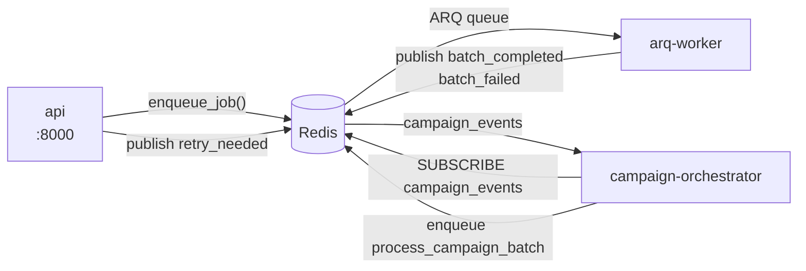

Two containers run campaign work off the request path: `arq-worker` executes batches, and `campaign-orchestrator` decides when the next batch should run and when a campaign is finished. Neither serves HTTP. Both build from the same image as the [API](api).

This page is about the two processes — what they run, how they coordinate, and how to scale them. Campaign semantics — states, retries, scheduling windows, the circuit breaker — are in [Campaigns](../../guides/concepts/campaigns).

## Two containers, one image

`api`, `arq-worker`, and `campaign-orchestrator` are all `build: apps/api/Dockerfile`. They mount the same code and differ only in `command`:

| Container | Command | Entry point |
| --- | --- | --- |
| `api` | `uvicorn app.main:app --host 0.0.0.0 --port 8000 --reload` | `app/main.py` |
| `arq-worker` | `python -m arq app.tasks.arq.WorkerSettings` | `app/tasks/arq.py` |
| `campaign-orchestrator` | `python -m app.services.campaign.campaign_orchestrator` | `app/services/campaign/campaign_orchestrator.py` |

Their environment blocks differ too. The orchestrator gets the smallest set — FerretDB connection, `SECRET_KEY`, `REDIS_URL`, and `CAMPAIGN_BATCH_SIZE` — because it never touches MinIO or places a call itself. The worker additionally gets the MinIO variables, `INTERNAL_API_KEY`, `PROVIDER_AUTH_ENCRYPTION_KEY`, and `VOICE_SERVER_BASE_URL`, because it dispatches real calls.

Redis is the only thing between them.



Neither worker calls the API over HTTP. Both import the same service layer and talk to FerretDB and Redis directly.

## The ARQ worker

`app/tasks/arq.py` defines `WorkerSettings`, with these verified values:

| Setting | Value |
| --- | --- |
| `functions` | `[sync_campaign_source, process_campaign_batch]` |
| `max_jobs` | `10` |
| `conn_timeout` | `10` |
| `redis_settings` | Host, port and password parsed from `REDIS_URL`; TLS enabled when the scheme is `rediss` |

`max_jobs = 10` is the concurrency ceiling for one worker process: at most ten jobs run at once. It is not the campaign batch size — that is `CAMPAIGN_BATCH_SIZE`, default `10`, from `app/config.py`.

The two registered functions live in `app/tasks/campaign_tasks.py`, and their names are pinned in the `FunctionNames` enum in `app/tasks/function_names.py` so producer and consumer cannot drift.

### `sync_campaign_source`

Loads the campaign, picks a sync service by `source_type` (default `csv`), and pulls the rows in.

* Zero rows synced → the campaign goes straight to `completed`, with `source_sync_status: "completed"`.
* Rows synced → state becomes `running` and a `sync_completed` event is published, which is what wakes the orchestrator.
* Any exception → state `failed`, `source_sync_status: "failed"`, `source_sync_error` set, a campaign log line appended, and the exception re-raised so ARQ records the failure.

### `process_campaign_batch`

Calls `campaign_call_dispatcher.process_batch(campaign_id, batch_size)` with `batch_size` defaulting to `settings.CAMPAIGN_BATCH_SIZE`, then publishes the outcome.

| Outcome | Published | Campaign state |
| --- | --- | --- |
| Batch processed | `batch_completed` with `processed_count` | unchanged |
| `ConcurrentSlotAcquisitionError` | `batch_failed` | `failed` |
| `PhoneNumberPoolExhaustedError`, attempt 1 or 2 | `batch_completed` with `processed_count: 0` | unchanged |
| `PhoneNumberPoolExhaustedError`, attempt 3 | `batch_failed` | `failed` |
| Any other exception | `batch_failed` | `failed` |

The pool-exhausted path is a deliberate soft retry: `MAX_PHONE_POOL_ATTEMPTS = 3`, counted in the campaign document under `phone_number_pool_exhausted_attempts`. Publishing `batch_completed` with zero processed rows makes the orchestrator schedule another batch, giving numbers time to free up. A batch that processes anything resets the counter.

## The campaign orchestrator

`CampaignOrchestrator` is a long-lived asyncio process. `run()` starts two tasks and gathers them:

* `_listen_for_events()` subscribes to `CAMPAIGN_EVENTS_CHANNEL`, defined as `"campaign_events"` in `app/constants/campaign.py`.
* `_monitor_completion()` sweeps running campaigns on a timer.

Verified settings, all set in `__init__`:

| Setting | Value | Effect |
| --- | --- | --- |
| `completion_check_interval` | `60` seconds | How often the completion sweep runs |
| `completion_timeout` | `3600` seconds | Idle time before a campaign with no pending work is marked `completed` |
| Processing lock window | `5` seconds | Suppresses a duplicate `_schedule_next_batch` for the same campaign |
| Stale batch window | `300` seconds | An in-progress batch older than this is considered lost and rescheduled |

### Event handling

`_handle_event()` dispatches on the parsed event type from `campaign_event_protocol.py`:

| Event | What the orchestrator does |
| --- | --- |
| `batch_completed` | Clears `_batch_in_progress`, re-reads the campaign, and schedules the next batch if it is still `running`. |
| `batch_failed` | Clears `_batch_in_progress` and records activity. No new batch. |
| `sync_completed` | Schedules the first batch. |
| `retry_needed` | Applies `retry_config` and creates a new queued run with a `scheduled_for` in the future. |
| `circuit_breaker_tripped` | Clears all in-memory state for that campaign. |

`_schedule_next_batch()` re-reads the campaign, checks the state is `running` or `syncing`, checks the schedule window with `_is_within_schedule()`, checks the circuit breaker — pausing the campaign and publishing `circuit_breaker_tripped` if it is open — confirms there is pending or processing work, and only then enqueues `process_campaign_batch`.

### Retries

`_handle_retry_event()` reads `retry_config` from the campaign document and honours `enabled`, `retry_on_busy`, `retry_on_no_answer`, `retry_on_voicemail`, `max_retries`, and `retry_delay_seconds`. Defaults live in `DEFAULT_CAMPAIGN_RETRY_CONFIG` in `app/constants/campaign.py`: two retries, 120 seconds apart, retrying busy and no-answer but not voicemail. A run past `max_retries` increments `failed_rows` instead. Retry runs get a derived `source_uuid` of `{original}_retry_{n}` and a `parent_queued_run_id`.

### Completion detection

Every 60 seconds `_check_stale_campaigns()` walks campaigns in state `running`. For each one, it reschedules if a tracked batch has been in progress longer than 300 seconds, schedules a batch if there is pending work and no batch running, and otherwise tests `_should_mark_complete()`: no batch in progress, no pending or processing runs, and no activity for `completion_timeout`. When there is no in-memory activity timestamp it falls back to `last_activity_at`, `last_batch_scheduled_at`, or `started_at` on the document. Completion re-checks pending work once more before writing `state: "completed"` and publishing `campaign_completed`.

## Redis keys

Both processes share one Redis instance, addressed by `REDIS_URL`.

| Key or channel | Written by | Purpose |
| --- | --- | --- |
| `campaign_events` (pub/sub channel) | API, ARQ worker, orchestrator | The campaign event bus. |
| ARQ's own queue and job keys | `enqueue_job()` in `app/tasks/arq.py` | Job queue, managed by the ARQ library. |
| `cb_failures:{campaign_id}`, `cb_successes:{campaign_id}` | `circuit_breaker.py` | Rolling success and failure counts per campaign. |
| `cb_recent_failures:{campaign_id}` | `circuit_breaker.py` | Recent failure detail for the tripped event. |
| `concurrent_calls:{organization_id}` | `call_concurrency/rate_limiter.py` | Live concurrency slots per organisation, 3600s TTL. |
| `concurrent_calls_fleet` | `call_concurrency/rate_limiter.py` | Fleet-wide slot set across organisations. |
| `rate_limit:{scope}` | `call_concurrency/rate_limiter.py` | Sliding-window rate limit, 2s TTL. |

Slot and rate-limit keys are manipulated by Lua scripts so acquisition is atomic across processes. See [Call concurrency and rate limiting](../reference/call-concurrency).

## Scaling

**The ARQ worker scales horizontally.** ARQ hands each queued job to exactly one worker, and `process_campaign_batch` acquires concurrency slots through the atomic Lua scripts in `rate_limiter.py`. Run as many replicas as your provider concurrency allows; `max_jobs = 10` multiplies per replica.

```bash
docker compose up -d --scale arq-worker=3
```

<Warning>
**Do not run more than one `campaign-orchestrator`.** The code does not make it safe.

The orchestrator keeps its scheduling state in three plain Python dictionaries on the instance — `_processing_locks`, `_last_activity`, and `_batch_in_progress`. None of it is in Redis, so a second replica shares nothing with the first. Both would receive every message on `campaign_events`, because pub/sub fans out to all subscribers rather than distributing, and both would call `_schedule_next_batch()` for the same `batch_completed`. The five-second `_processing_locks` guard is per process and would not stop the duplicate. The result is two `process_campaign_batch` jobs per completed batch, so a campaign dials at twice its configured rate.

The completion sweep has the same problem in reverse: `_batch_in_progress` is populated only by the replica that enqueued the batch, so the other replica sees no batch running and may mark a live campaign `completed`.

Run exactly one replica. Compose fixes it at one by giving the service a `container_name`, which prevents scaling it by accident.
</Warning>

Making it safe would take a Redis-backed lock in place of the in-memory dictionaries. That work has not been done.

## Failure and restart behaviour

Both containers carry `restart: unless-stopped`, and both gate on `ferretdb` starting and `redis` passing its healthcheck. The worker additionally waits for `api` to start.

| Process | On restart |
| --- | --- |
| `arq-worker` | Queued jobs survive in Redis and are picked up again. A job in flight when the process dies is retried by ARQ. Because a batch republishes its outcome on completion, the orchestrator sees the result either way. |
| `campaign-orchestrator` | All in-memory state is lost. Nothing is replayed: pub/sub does not persist, so events published while it was down are gone. Recovery comes from `_monitor_completion()` — within `completion_check_interval`, that is 60 seconds, the sweep finds every `running` campaign with pending work and schedules a batch for it. |

The orchestrator handles `SIGTERM` and `SIGINT`, sets `_running` to false, cancels its task, unsubscribes, and closes the Redis client — so `docker compose stop` is a clean shutdown, not a kill.

<Note>
The 60-second sweep is the only recovery path for events missed during an orchestrator restart. A campaign can therefore stall for up to a minute after the container comes back. If it stalls for longer, check the logs below before assuming the campaign is broken — see [Campaign troubleshooting](../../guides/troubleshooting/campaigns).
</Note>

## Logs to watch

```bash
docker compose logs -f arq-worker campaign-orchestrator
```

| Line | Source | Means |
| --- | --- | --- |
| `Campaign Orchestrator starting...` | orchestrator | The process is up and about to subscribe. |
| `Processing batch campaign=… size=…` | worker | A batch job started. |
| `Starting source sync for campaign …` | worker | CSV or other source ingest began. |
| `Error syncing campaign …` | worker | Sync failed; the campaign is now `failed`. |
| `Batch failed campaign=…` | worker | The batch raised; the campaign is now `failed`. |
| `Circuit breaker tripped campaign=… failure_rate=…` | orchestrator | Failure rate crossed the threshold; the campaign is `paused`. |
| `Published retry event call_id=… reason=…` | API or worker | A call outcome asked for a retry. |
| `Completion monitoring failed: …` | orchestrator | The sweep raised. It is caught and retried next interval, so this alone does not stop the process. |
| `Completion check campaign=…` | orchestrator | One campaign failed its completion check; the others still ran. |

A worker with no `Processing batch` lines while a campaign sits in `running` usually means the orchestrator is not enqueueing — check that its container is up and subscribed before looking at the worker.

## Related

* [Campaigns](../../guides/concepts/campaigns) — states, retries, scheduling, and the circuit breaker
* [API (apps/api)](api) — the same package, running as HTTP
* [Call concurrency and rate limiting](../reference/call-concurrency)
* [Running a campaign](../../guides/operator/running-a-campaign) · [Campaign troubleshooting](../../guides/troubleshooting/campaigns)
