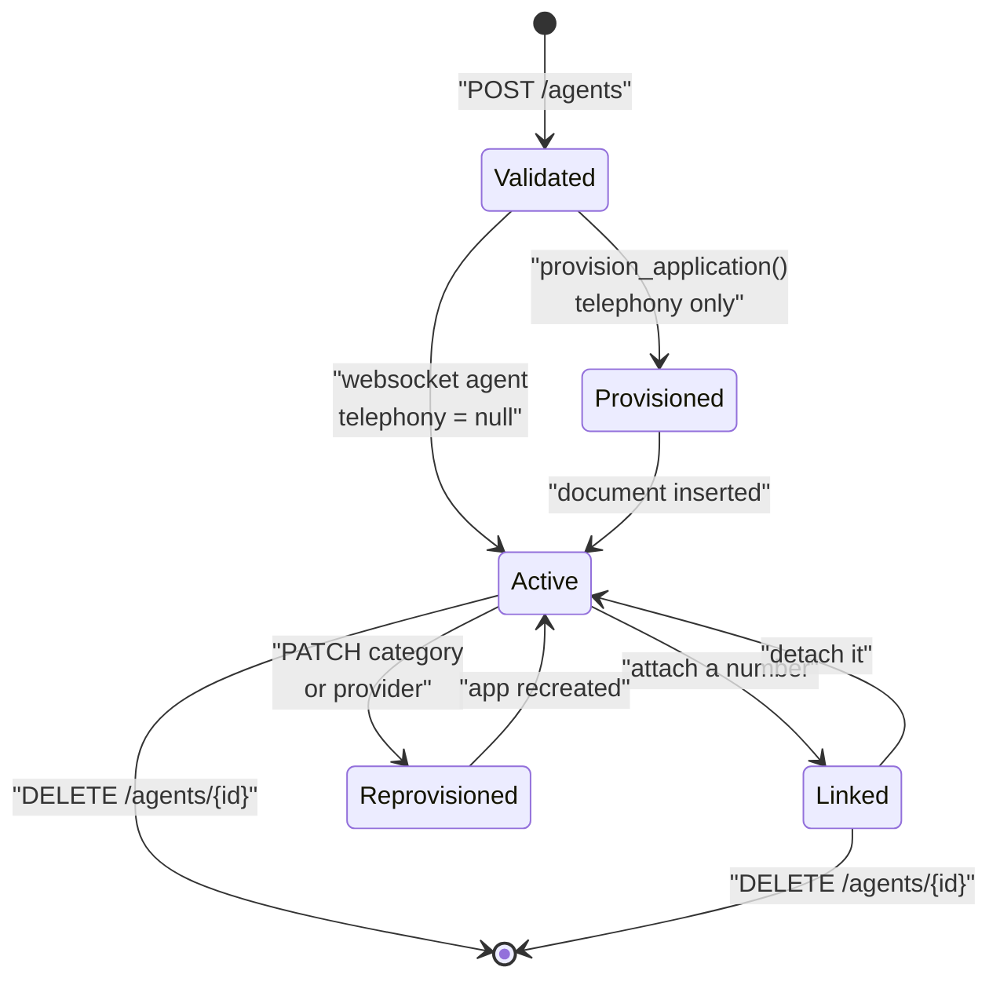

An agent is the configuration a call runs on. This page covers what lives on an agent document, the difference between the two agent categories, and the side effects the API performs on your telephony provider when you create, change, or delete one.

<Note>
Agents hold **no secrets**. Model API keys live in [`ProviderAuth`](../../developer/reference/provider-auth) and are merged in at call time. Sending a secret field inside `config.models` is rejected by validation.
</Note>

## What an agent is

An agent is a document in the `Agents` collection, scoped to one organisation. It stores:

* a name, unique within the organisation
* an `agent_category` that decides how calls reach it
* prompts, behaviour settings, language, and non-secret model configuration
* an optional knowledge-base attachment
* for telephony agents, a provisioned provider application and an optional linked phone number

Agents are created by any organisation member (`created_by` is taken from the JWT email) and deleted only by `admin` or `super_admin`. See [Multi-tenancy and roles](../../developer/reference/multi-tenancy).

## telephony vs websocket

`agent_category` is `Literal["telephony", "websocket"]`, defined in `apps/api/app/models/schemas.py`. It is the single field that decides everything about how the agent is reached.

| | `telephony` | `websocket` |
| --- | --- | --- |
| `telephony_provider` on create | Required | Must not be set |
| Provider application | Provisioned by the API on create | None |
| `telephony` on the document | An `AgentTelephonyAttachment` | `null` |
| `GET /answer` on the runtime | Returns provider Stream XML | Returns `400` |
| WebSocket connection | Provider media stream; expects a `start` event | Direct browser connection |
| Frame serializer | `create_frame_serializer(provider, …)` | `ProtobufFrameSerializer` (RTVI) |
| Sample rate | `SAMPLE_RATE`, default `8000` | `WEBSOCKET_SAMPLE_RATE`, default `16000` |
| Creates a `CallLog` | Yes | No |

The runtime resolves the category with `agent_category()` in `apps/runtime/services/agent_routing.py`, which **defaults to `websocket`** when the field is missing and raises `AgentRoutingError` for any other value.

<Tabs>
<Tab title="telephony">
Set `agent_category: "telephony"` and a `telephony_provider` that is registered in `apps/telephony` — check `GET /configuration/telephony` for the current list. Organisation credentials for that provider must already exist via `POST /auth`, and `VOICE_SERVER_BASE_URL` must be configured, or creation fails.

```json
{
  "name": "Support Agent",
  "agent_category": "telephony",
  "telephony_provider": "vobiz",
  "config": { "...": "..." }
}
```
</Tab>

<Tab title="websocket">
Set `agent_category: "websocket"` and omit `telephony_provider` entirely. Sending it raises a validation error. No provider account, no credentials, and no `VOICE_SERVER_BASE_URL` are needed.

```json
{
  "name": "Browser Demo",
  "agent_category": "websocket",
  "config": { "...": "..." }
}
```
</Tab>
</Tabs>

## The agent document

`AgentResponse` is the full shape returned by every agent route:

| Field | Type | Notes |
| --- | --- | --- |
| `agent_id` | `str` | Server-generated UUID4. Also used as the provider application name. |
| `org_id` | `str` | Owning organisation. |
| `name` | `str` | Unique per organisation; a clash returns a conflict. |
| `status` | `Literal["active", "archived"]` | Set to `"active"` on create. |
| `agent_category` | `Literal["telephony", "websocket"]` | See above. |
| `created_by` | `str` | Email from the creating JWT. |
| `linked_phone_number` | `str \| null` | Set by phone-number attach, cleared by detach. |
| `telephony` | `AgentTelephonyAttachment \| null` | `null` for websocket agents. |
| `config` | `AgentConfigPayload` | Prompts, behaviour, language, models, knowledge base, custom variables. |
| `created_at`, `updated_at` | `str \| null` | ISO 8601 UTC. |

`AgentTelephonyAttachment` carries `provider`, `application_id`, `answer_url`, and an optional `hangup_url` — optional only because agents provisioned before hangup URLs were always set may lack it.

`AgentConfigPayload` holds `schema_version` (default `1`), `prompts`, `behaviour`, `language`, `models`, `knowledge_base`, and `custom_variables`. Every field is documented in [Agent configuration](../../developer/reference/agent-configuration); how the runtime consumes it is in [Voice pipeline](voice-pipeline).

## Lifecycle and side effects

Creating or changing an agent can call out to your telephony provider. This diagram is the full state machine implemented by `agent_service.py` and `agent_telephony_service.py`:



Validation runs first, always. `validate_agent_config()` in `agent_config_validation.py` requires `prompts.greeting_message` and `language.primary` to be non-empty, rejects any secret or auth field inside a model config, and validates each of `stt_config`, `tts_config`, and `llm_config` against the registered provider's config class. When the knowledge base is enabled, it also requires non-empty `document_ids` and checks that those documents are ready.

One validation rule catches people out: `knowledge_base.mode: "tool"` is accepted only for LLM providers that support function calling — `openai`, `groq`, `azure_openai`, and `anthropic`, listed as `KB_TOOL_LLM_PROVIDERS`. Any other provider is rejected outright. Use `mode: "context"` instead.

## Telephony provisioning on create

For a `telephony` agent, `create_agent()` calls `provision_application(org_id, provider, agent_id)` **before** inserting the document. That function:

1. Requires `VOICE_SERVER_BASE_URL`, and builds `{VOICE_SERVER_BASE_URL}/answer?agent_id={agent_id}&org_id={org_id}`. The answer URL and the hangup URL are the same URL — the runtime dispatches on the webhook event.
2. Loads the organisation's provider credentials from `ProviderAuth`. Missing or incomplete credentials (`auth_id` and `auth_token` are both required) raise `AgentTelephonyError`.
3. Calls `client.create_application(agent_id, answer_url)` through the [provider registry](../../developer/reference/provider-registry). The application is **named by the `agent_id` UUID**, deliberately — providers commonly reject spaces and punctuation in application names.
4. Returns the attachment `{provider, application_id, answer_url, hangup_url}` and stores it on the agent.

If the insert then fails, whether from a duplicate name or anything else, the API deletes the application it just created before raising. You do not get an orphaned application from a failed create.

## Changing provider on PATCH

`PATCH /agents/{agent_id}` accepts `name`, `agent_category`, `telephony_provider`, and `config`, all optional. `config` is **merged**, not replaced: nested objects are updated key by key against the stored config, then the merged result is re-validated in full.

Telephony is reconciled only when `telephony_changed` — that is, when the effective category changes, or when the category stays `telephony` and the provider changes. When it does, in this order:

1. `phone_number_service.detach_from_agent()` unlinks any attached number at the provider and clears the association.
2. `delete_application()` removes the old provider application.
3. If the new category is `telephony`, a new application is provisioned with the new provider.
4. `linked_phone_number` is set back to `null` on the document.

<Warning>
Switching an agent's `telephony_provider`, or switching it from `telephony` to `websocket`, destroys the existing provider application and unlinks its phone number. This is not reversible by patching the value back — you get a new `application_id` and must re-attach the number.
</Warning>

Changing only the agent's `name` does **not** rename the provider application. `rename_application()` exists in `agent_telephony_service.py` but is not called by `agent_service.py`, so the application keeps its `agent_id` name for life. Since applications are named by UUID rather than by the display name, this has no practical effect.

## Linked phone numbers

Phone numbers live in a separate org inventory and are attached to agents through `/api/v1/phone-numbers`:

| Route | Effect |
| --- | --- |
| `POST /phone-numbers/attach` | Adds the number to the inventory. With `agent_id`, also links it to the agent's provider application and sets `Agents.linked_phone_number`. |
| `DELETE /phone-numbers/detach` | Unlinks at the provider and clears the agent association. The inventory row stays. |
| `GET /phone-numbers/agent/{agent_id}` | The number currently attached to an agent. |

Omit `agent_id` on attach to import a number into the inventory without any provider link. An agent holds at most one linked number; attaching a number already owned by another agent unlinks it from the previous owner first.

## How an agent is resolved at call time

The runtime never reads the database. It resolves agents over the API, and it does so differently depending on which end of the call you are on:

| Scenario | Route | Auth | What it returns |
| --- | --- | --- | --- |
| Inbound or outbound `/answer` webhook | `GET /agents/{agent_id}` with `org_id` from the query string | Bot JWT | The full agent document |
| Media WebSocket `/agent/{org_id}/{agent_id}` | `GET /agents/{agent_id}` | Bot JWT | The full agent document |
| Provider-driven lookup by dialled number | `GET /agents/by-phone/{phone_number}` | `X-API-Key` | The agent whose `linked_phone_number` matches |

`org_id` and `agent_id` are always passed per request. There is no global default organisation.

For a telephony agent the runtime then reads `telephony.provider` off the document to pick the Stream XML dialect and the frame serializer — it does not assume a single vendor. That dispatch is described in [Telephony model](telephony-model).

## Related

* [Agent configuration](../../developer/reference/agent-configuration) — every config field, with defaults
* [Voice pipeline](voice-pipeline) — what the runtime does with the config
* [Telephony model](telephony-model) — applications, numbers, and Stream XML
* [Calls and call artifacts](calls) — what a call produces
* [REST API](../../api-reference/overview) — the full route list
