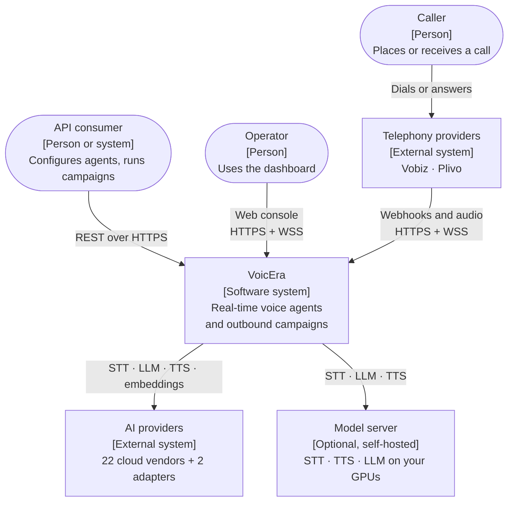
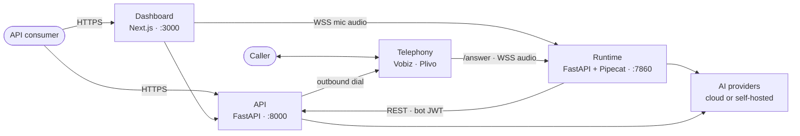
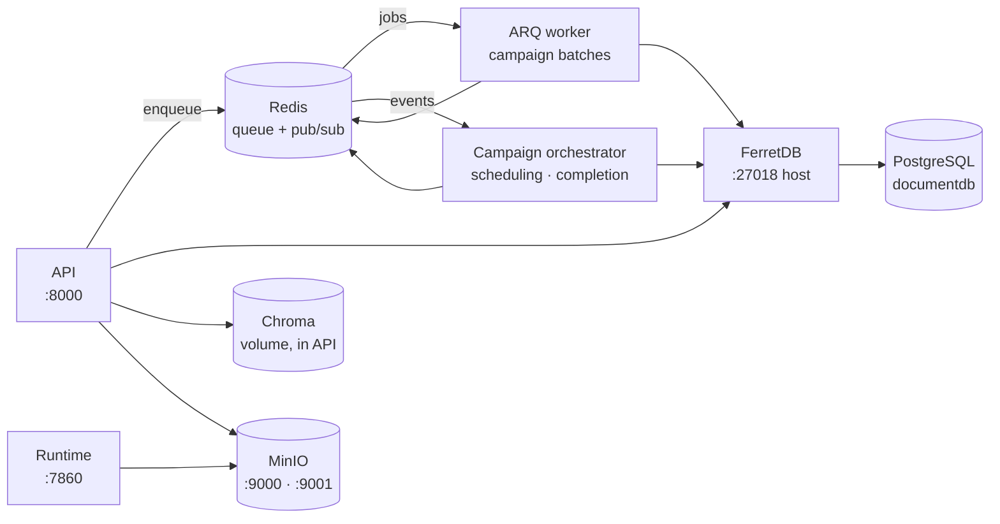
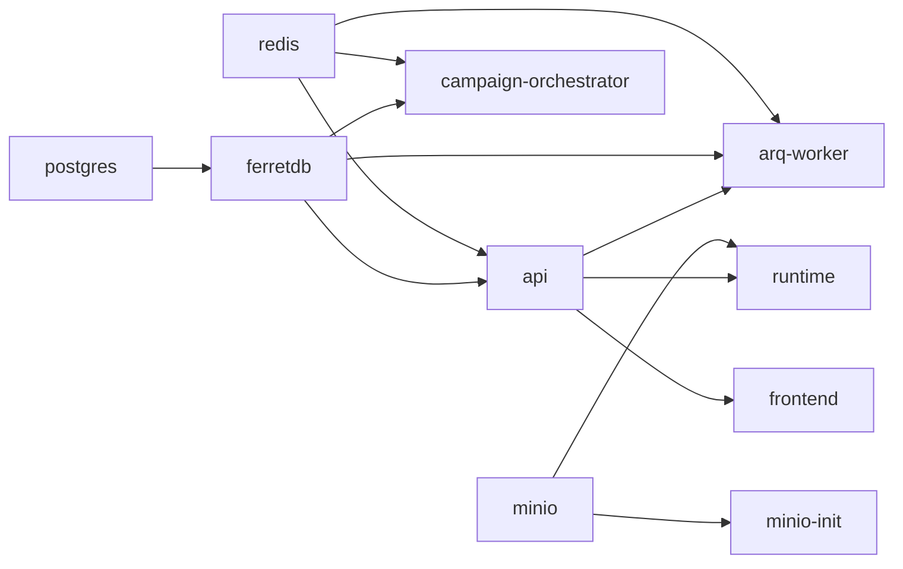
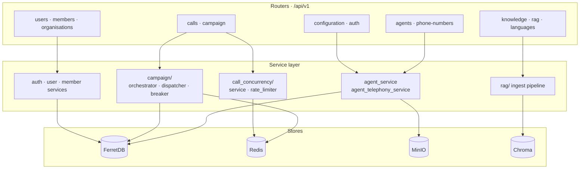
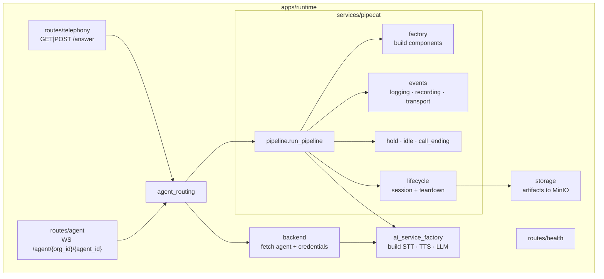

This page shows how VoicEra is structured, who talks to it, and how the deployable pieces fit together. It is aimed at architects, operators, and developers meeting the platform for the first time.

<Note>
VoicEra is described here using the [C4 model](https://c4model.com/): Level 1 shows the system as one box surrounded by its users and external systems; Level 2 zooms in to the deployable containers; Level 3 opens up the two services that carry the most logic.
</Note>

## Level 1 — System context

| Actor | Role |
| --- | --- |
| API consumer | Anything driving VoicEra over REST — your own console, a script, or the [dashboard](../../developer/frontend/overview). |
| Caller | The person on the phone, inbound or outbound. |
| Telephony providers | [Vobiz or Plivo](telephony-model). They own the numbers and stream the audio. |
| AI providers | 22 cloud vendors plus the Bhashini and Kenpath adapters, reachable through the [provider registry](../../developer/reference/provider-registry). |
| Model server | Optional [self-hosted models](../../developer/model-server/overview) behind one gateway. |

## Level 2 — Containers

Every box below is a container in `docker-compose.yaml`, except Chroma — an embedded store on a volume mounted into `api`. The one-shot `minio-init` container is omitted; it creates the bucket and exits.

Configuration and control go to the **API**; live audio goes to the **runtime**. A call reaches the runtime three ways — a caller dials in, the API dials out, or the dashboard opens a browser call — and all three converge on the same pipeline.

Behind the API sit the workers and the stores. Nothing below is reachable from outside the Compose network:

| Container | Technology | Responsibility |
| --- | --- | --- |
| Dashboard | Next.js, React | The web console. A browser client of the API, with a direct WebSocket to the runtime for browser test calls. Holds no state and no server-side session. |
| API | FastAPI, Python | REST surface, auth, persistence, RAG ingest, telephony provisioning, campaign control. |
| Runtime | FastAPI + Pipecat | The `/answer` webhook and the real-time audio pipeline, one WebSocket per call. |
| ARQ worker | ARQ | Executes campaign batches and CSV source syncs off the request path. |
| Campaign orchestrator | Python daemon | Listens on Redis pub/sub, schedules the next batch, detects completion. |
| FerretDB | FerretDB 2.7 | MongoDB wire protocol on top of PostgreSQL. See [Data store](../../developer/reference/data-store). |
| PostgreSQL | postgres-documentdb 17 | The actual storage engine behind FerretDB. Not published. |
| Redis | Redis 7 | ARQ job queue, campaign event bus, concurrency slots and rate limiting. Not published. |
| MinIO | MinIO | S3-compatible store for recordings and transcripts. |
| Chroma | Chroma | Per-organisation vector store for RAG, persisted to a volume. |

<Note>
`apps/api` is one Python package but **three containers** — `api`, `arq-worker`, and `campaign-orchestrator` all build from `apps/api/Dockerfile` and differ only in their `command`. See [Workers and orchestrator](../../developer/services/workers).
</Note>

### Start-up order

`depends_on` in `docker-compose.yaml` enforces this chain:

`postgres`, `redis`, and `minio` gate on healthchecks; the rest start as soon as their dependency starts.

## Level 3 — Inside the API

Routers stay thin; the service layer owns the rules. Full route list in the [REST API reference](../../api-reference/overview).

## Level 3 — Inside the runtime

The pipeline is nine modules plus three subpackages rather than one function. See [Voice pipeline](voice-pipeline).

## Deployment topology

The reference `docker-compose.yaml` runs everything on one host. For production:

| Concern | Reference stack | Production |
| --- | --- | --- |
| API and runtime | One replica each, `--reload` on | Multiple replicas behind a proxy, reload off |
| Runtime scaling | Single container | Scale out; each call holds one WebSocket, so route with session affinity |
| Postgres, Redis, MinIO | In-stack containers | Managed or dedicated instances |
| TLS | None | Terminate at a reverse proxy; telephony needs public HTTPS and WSS |

See [Production deployment](../deployment/production) and [Public voice URLs](../deployment/public-voice-urls).

## What changed from the mono repo

VoicEra replaces the earlier `voicera_mono_repository`. If you know the old system:

| Old | New |
| --- | --- |
| MongoDB on `:27017` | FerretDB on PostgreSQL, `27018` host / `27017` container |
| `voicera_backend` | `apps/api` |
| `voice_2_voice_server` | `apps/runtime` |
| `ai4bharat_stt_server`, `ai4bharat_tts_server`, `llm_server` | One [model server](../../developer/model-server/overview), three slots |
| A `.env` per service | One root `.env`, plus `model-server/.env` |
| Integrations documents | [`ProviderAuth`](../../developer/reference/provider-auth), Fernet-encrypted |
| Vobiz only | Vobiz and Plivo, [provider-agnostic](telephony-model) |
| No queue | Redis, ARQ worker, and campaign orchestrator |
| Hard-coded provider list | Self-describing [provider registry](../../developer/reference/provider-registry) |
| Dashboard assumed | API-first — the [dashboard](../../developer/frontend/overview) is one client of the REST API, not a privileged surface |

## Related

* [Data flow](data-flow) — what moves where, per scenario
* [Voice pipeline](voice-pipeline) — inside a live call
* [Services overview](../../developer/services/index) — containers versus packages
* [Ports and defaults](../../developer/reference/ports-and-defaults)
