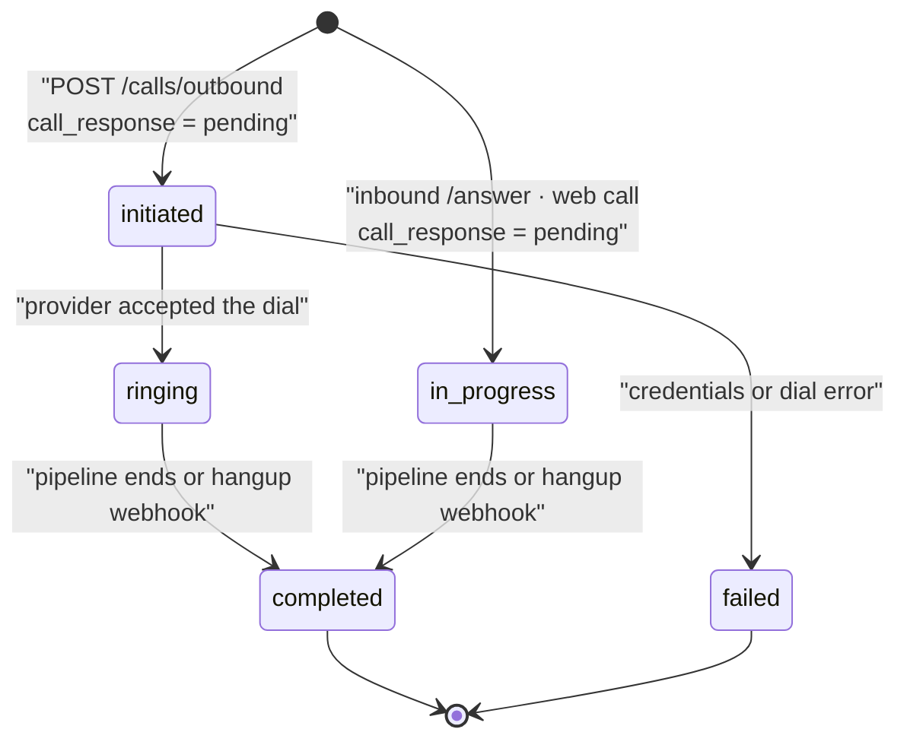

Every telephony call in VoicEra produces a `CallLog` document and, once it ends, up to two artifacts in MinIO. This page covers the record, its state machine, and how to get the transcript and recording back out.

<Note>
Browser websocket sessions create a `call_type: web` CallLog, so they produce transcripts and recordings under the same MinIO paths as telephony calls.
</Note>

## Call types

`CallType` is `Literal["inbound", "outbound", "web"]`, defined in `apps/api/app/models/schemas.py`.

| Value | Created by | When |
| --- | --- | --- |
| `outbound` | `initiate_outbound_call()` | You call `POST /api/v1/calls/outbound`, or a [campaign](campaigns) dispatches a row. |
| `inbound` | `register_inbound_call()` | The runtime's `/answer` webhook fires for a call it has no `call_id` for. |
| `web` | Browser websocket session | Registered on connect via `POST /api/v1/calls/web`, or reused from a `call_id` query parameter. |

Inbound registration is idempotent on `provider_call_sid`. If a log already exists for that SID, the existing one is returned; only `from_number` and `to_number` are backfilled, and only where they were still `"unknown"`. Retried webhooks do not create duplicates.

When the runtime cannot determine `to_number`, it falls back to the agent's `linked_phone_number`.

## Statuses and responses

Two independent enums track a call. `status` is where the call is in its lifecycle; `call_response` is how it ended.

`CallLogStatus` is `Literal["initiated", "ringing", "failed", "in_progress", "completed"]`.

`CallResponse` is `Literal["pending", "answered", "busy", "no_answer", "failed", "cancelled"]`.



An outbound call starts at `initiated`. On a successful dial it moves to `ringing` and the `provider_call_sid` is recorded. If credentials are missing, the dial raises, or the provider returns anything but success, the log is patched to `status: "failed"`, `call_response: "failed"`, with the provider message in `error_message`.

An inbound call is created directly at `in_progress`.

Both reach `completed` from one of two places, whichever fires first: `finalize_call()` in the runtime pipeline lifecycle, or the provider's hangup webhook on `/answer`. Hangup maps provider fields to a terminal `call_response` via `map_hangup_call_response()` in `apps/telephony/webhooks.py`:

| Provider `call_status` | `call_response` |
| --- | --- |
| `busy` | `busy` |
| `no-answer`, `noanswer` | `no_answer` |
| `failed` | `failed` |
| `cancelled`, `canceled` | `cancelled` |

If `call_status` says nothing useful, `hangup_cause` is tried: `USER_BUSY` or `BUSY` map to `busy`; `NO_ANSWER`, `ORIGINATOR_CANCEL`, `CALL_REJECTED`, and `UNALLOCATED_NUMBER` map to `no_answer`. Anything else leaves `call_response` untouched.

<Note>
`call_response: "answered"` is terminal. Once set, `patch_call_log()` silently drops any further `status` or `call_response` in a patch. A late hangup webhook can no longer overwrite a call the pipeline already recorded as answered.
</Note>

## The CallLog record

`CallLogResponse` is the full document. It lives in the `CallLogs` collection.

| Field | Type | Notes |
| --- | --- | --- |
| `call_id` | `str` | Server-generated UUID4. The MinIO path segment and the campaign correlation key. |
| `org_id`, `agent_id` | `str` | Owning organisation and agent. |
| `agent_name` | `str \| null` | Snapshotted at creation; not kept in sync. |
| `call_type` | `CallType` | See above. |
| `status` | `CallLogStatus` | See above. |
| `call_response` | `CallResponse \| null` | Set to `"pending"` at creation. |
| `from_number`, `to_number` | `str` | Normalised to E.164-style on outbound; `"unknown"` is possible on inbound. |
| `telephony_provider` | `str \| null` | Copied from the agent's telephony attachment. |
| `provider_call_sid` | `str \| null` | `null` until the provider accepts an outbound dial. |
| `custom_variables` | `dict` | Per-call overrides; `{}` for inbound. See [Voice pipeline](voice-pipeline). |
| `created_at`, `updated_at` | `str \| null` | ISO 8601 UTC. |
| `start_time_utc`, `end_time_utc` | `str \| null` | `end_time_utc` is set once and never overwritten. |
| `duration` | `float \| null` | Seconds, computed on the first `end_time_utc` patch. |
| `recording_url`, `transcript_url` | `str \| null` | See [Artifacts in MinIO](#artifacts-in-minio). |
| `error_message` | `str \| null` | Provider or validation failure text. |
| `campaign_id`, `queued_run_id` | `str \| null` | Set for campaign-dispatched calls. |

`duration` is computed by `_compute_duration_seconds()` from `start_time_utc` and `end_time_utc`, floored at `0.0`, and skipped if either timestamp will not parse. Because `end_time_utc` is write-once, so is the duration derived from it.

Outbound phone numbers are validated against `^\+?[0-9]{7,15}$` after stripping spaces and hyphens, and get a leading `+` if they lack one. Anything else is a `422`.

## Provider SID reconciliation

The provider knows a call by its own SID, not by VoicEra's `call_id`. Two routes bridge that gap:

| Route | Locates by | Used by |
| --- | --- | --- |
| `PATCH /api/v1/calls/{call_id}` | `call_id` | The runtime pipeline, which carries `call_id` in the WebSocket query string. |
| `PATCH /api/v1/calls/by-provider-sid/{provider_call_sid}` | `provider_call_sid` | The `/answer` hangup webhook when no `call_id` was passed — inbound calls, mostly. |

The SID route resolves the log, then delegates to the same `patch_call_log()`, so both paths share the write-once and terminal-response guards. Both accept a `CallLogUpdateRequest`: `transcript_url`, `recording_url`, `end_time_utc`, `status`, `call_response` — all optional, but an empty patch is a `400`.

## Artifacts in MinIO

The runtime writes both artifacts under the `call_id`, in the bucket named by `MINIO_BUCKET` (default `voicera-calls`):

```text
voicera-calls/{org_id}/{call_id}/transcript.txt
voicera-calls/{org_id}/{call_id}/recording.wav
```

Path segments are sanitised — any character that is not alphanumeric, `-`, or `_` becomes `_`, and an empty segment becomes `unknown`.

Both are uploaded **at call end**, not streamed. The transcript is buffered in memory by `TranscriptWriter` as one line per completed turn and flushed once in the pipeline's `finally` block. The recording is a single WAV assembled from the pipeline's `AudioBufferProcessor` when it emits `on_audio_data`, mono, 16-bit, at the call's sample rate.

After each upload the runtime PATCHes the CallLog with a `minio://bucket/key` URI via `PATCH /api/v1/calls/{call_id}`. Upload failures are logged as warnings and leave the URL field `null` — a failed artifact never fails the call.

## Fetching artifacts through the API

You never read `minio://` URIs directly. `transform_call_log_urls()` rewrites them on every read route, so what you see in a call log response is already an authenticated API path:

| Stored on the document | Returned by the API |
| --- | --- |
| `minio://voicera-calls/{org_id}/{call_id}/recording.wav` | `/api/v1/calls/{call_id}/recording` |
| `minio://voicera-calls/{org_id}/{call_id}/transcript.txt` | `/api/v1/calls/{call_id}/transcript` |

Both proxy routes require the same Bearer auth as the rest of the API, check that the call belongs to your organisation, verify the object still exists in MinIO, and then stream it in 32 KB chunks. A missing URL field or a missing object is a `404`; an unparseable URI is a `400`. Content type is inferred from the extension — `.wav` to `audio/wav`, `.mp3` to `audio/mpeg`, `.txt` to `text/plain; charset=utf-8`.

The eight call routes are:

| Method | Path | Purpose |
| --- | --- | --- |
| `POST` | `/api/v1/calls/outbound` | Place an outbound call; returns `201`. |
| `POST` | `/api/v1/calls/inbound` | Register an inbound call from the runtime; returns `201`. |
| `PATCH` | `/api/v1/calls/by-provider-sid/{provider_call_sid}` | Patch by provider SID. |
| `PATCH` | `/api/v1/calls/{call_id}` | Patch by call id. Bot JWT supported. |
| `GET` | `/api/v1/calls/{call_id}/recording` | Stream the recording. |
| `GET` | `/api/v1/calls/{call_id}/transcript` | Stream the transcript. |
| `GET` | `/api/v1/calls/org/{org_id}` | List call logs, newest first. `limit` 1–500 (default 50), `offset` from 0. |
| `GET` | `/api/v1/calls/{call_id}` | Fetch one call log. Bot JWT supported. |

`GET /calls/org/{org_id}` accepts an organisation other than your active one, but only if you hold a membership in it. The full route reference is in [REST API](../../api-reference/overview).

Raw objects are browsable in the MinIO console at `http://localhost:9001` when you need to check what was written.

## How web calls get a CallLog

A browser WebSocket session records the same artifacts as a phone call, because it gets a real `call_id`.

There are two ways it arrives, both in `apps/runtime/routes/agent.py`:

| | |
| --- | --- |
| The client supplies one | The dashboard calls `POST /calls/web` first, then opens the socket with `?call_id=…`. The runtime validates it — the log must have `call_type: web` and a matching `agent_id`, or the id is discarded. |
| The runtime registers one | If the socket arrives without a usable `call_id`, the runtime registers the web call itself and logs `Registered web call call_id=…`. |

Either way `run_websocket_bot()` forwards the id to `run_pipeline()` with `finalize_call=bool(call_id)`, so transcript logging, recording handlers, and teardown finalisation all run exactly as they do for telephony.

The practical consequence is that web calls are ordinary call logs: they appear in `GET /calls/org/{org_id}` — the org listing filters only on `org_id`, never on `call_type` — and they carry transcripts, recordings, and a duration. The dashboard's call history exposes a **web** filter tab alongside inbound and outbound for this reason.

<Note>
A session that fails to register a `call_id` still runs; it just produces nothing durable, since every artifact handler is gated on a truthy `call_id`.
</Note>

See [Browser WebSocket agents](../../developer/clients/browser-websocket).

## Related

* [Agents and agent categories](agents) — what a call runs on
* [Voice pipeline](voice-pipeline) — where the transcript and recording come from
* [Telephony model](telephony-model) — inbound webhooks and outbound dispatch
* [Campaigns](campaigns) — bulk outbound calls and their logs
* [Data model](../../developer/reference/data-model) — every collection
