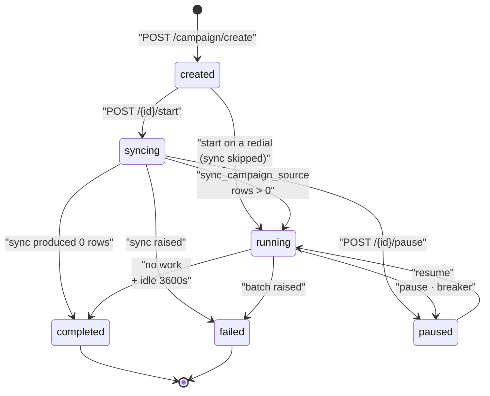
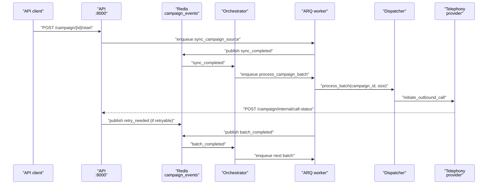
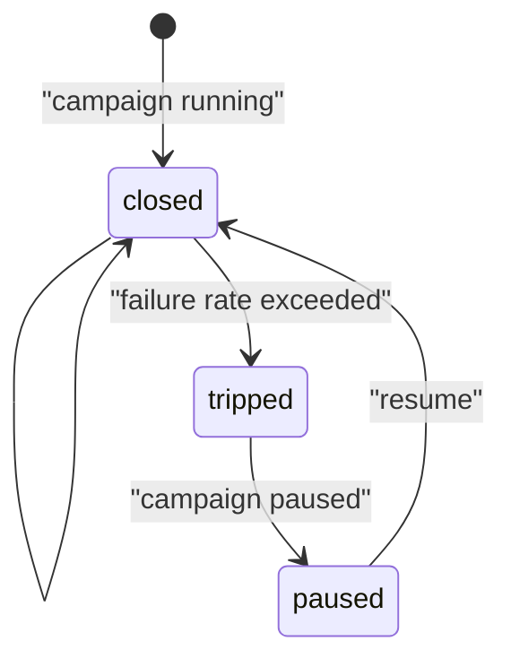

A campaign turns a CSV of phone numbers into a controlled stream of outbound calls placed by one [telephony agent](agents). This page explains the moving parts — the orchestrator, the ARQ worker, the dispatcher, retries, and the circuit breaker — and what each of them reads and writes.

<Note>
If you only want to run one, start with [Running a campaign](../operator/running-a-campaign). This page is the mechanism behind it.
</Note>

## What a campaign is

A campaign is one document in the `Campaigns` collection plus one `QueuedRuns` document per contact per attempt. The campaign holds configuration and counters; each queued run holds one contact's context variables and its own state.

| Field | What it holds |
| --- | --- |
| `campaign_id` | UUID, unique index. |
| `org_id`, `agent_id` | Owning organisation and the telephony agent that places the calls. |
| `source_type`, `source_id` | `"csv"` and the MinIO object key of the uploaded file. |
| `state` | One of six values — see [Campaign states](#campaign-states). |
| `total_rows`, `processed_rows`, `failed_rows` | Progress counters. |
| `rate_limit_per_second` | Calls per second, 1–20, default 1. |
| `retry_config` | See [Retry policy](#retry-policy). |
| `orchestrator_metadata` | `max_concurrency`, `schedule_config`, `circuit_breaker`, `counters`, and `parent_campaign_id` for redials. |
| `from_number` | Optional caller ID override. |
| `logs` | Append-only array of `{timestamp, level, event, message, details}`. |

Campaign creation is validated in `apps/api/app/routers/campaign.py`. The agent must have `agent_category == "telephony"` and at least one phone number attached, otherwise `POST /campaign/create` returns 422.

## CSV upload and source sync

Uploading and creating are two separate calls.

1. `POST /campaign/upload` takes a multipart CSV. It rejects non-`.csv` filenames, empty bodies, and anything over `settings.CAMPAIGN_MAX_CSV_BYTES` (5 MB by default). The file is stored in MinIO under `campaigns/{org_id}/{uuid}_{filename}` and that key comes back as `source_id`.
2. `POST /campaign/create` takes that `source_id` and validates the file again before persisting the campaign.

Validation lives in `CampaignSourceSyncService.validate_source_data` in `apps/api/app/services/campaign/source_sync.py` and applies to every source type:

* Headers are lowercased and stripped. A `phone_number` column is required.
* Every non-empty phone number must start with `+`. Invalid rows are reported by row number (header is row 1), first five shown.
* Duplicate phone numbers are rejected, again by row number.

Every other column becomes a context variable available to the agent during the call.

Actual ingestion happens later, off the request path. When the campaign starts, the ARQ task `sync_campaign_source` calls `CSVSyncService.sync_source_data`, which re-reads the object from MinIO and bulk-inserts one `QueuedRuns` document per row with a `source_uuid` of `csv_{md5(file_key)[:8]}_row_{n}`. Rows with an empty `phone_number` are skipped, and `total_rows` is set to the number of runs actually created.

`source_sync_factory.get_sync_service` only knows `"csv"`. Any other `source_type` raises `ValueError`. The abstraction exists for future sources; there is one today.

## Campaign states

`CampaignState` is a `Literal` in `apps/api/app/models/schemas.py` with exactly six values: `created`, `syncing`, `running`, `paused`, `completed`, `failed`.

Transitions are enforced in `runner.py`: start requires `created`, pause requires `running` or `syncing`, resume requires `paused`. Anything else returns 400. Resuming also calls `circuit_breaker.reset(campaign_id)`, which deletes the Redis failure and success windows — so a resumed campaign starts the breaker from zero.

There is no transition out of `failed`. A campaign that a batch pushed to `failed` cannot be resumed through the API — create a new campaign or a [redial](#redial).

## The orchestrator and the worker

Two containers do the work off the request path: `campaign-orchestrator` decides *when* the next batch should be enqueued and *when* a campaign is finished, and `arq-worker` runs the batches themselves against a Redis event bus. Neither places a call directly with an HTTP request — the dispatcher inside the worker does that. The mechanics of both processes — the event loop, `WorkerSettings`, scaling, and restart behaviour — are in [Workers and orchestrator](../../developer/services/workers).

The end-to-end path for one contact:

## The dispatcher and from-number pooling

`CampaignCallDispatcher.process_batch` in `campaign_call_dispatcher.py` claims work and places calls.

Claiming is atomic. `claim_queued_runs_for_processing` issues one `find_one_and_update` per run, flipping `state` from `queued` to `processing` and stamping `claimed_at`, ordered by `scheduled_for` then `created_at`. Two workers cannot claim the same run.

For each claimed run the dispatcher then:

1. Waits on the per-second token bucket (`rate_limiter.acquire_token`) polling every 50 ms.
2. Acquires a concurrency slot with `CONCURRENT_SLOT_TIMEOUT = 120.0` seconds — see [Call concurrency](../../developer/reference/call-concurrency).
3. Resolves a caller ID and places the call.
4. Marks the run `processed` with the resulting `call_id` and increments `processed_rows`.

Caller ID resolution (`_resolve_from_numbers`) is ordered: an explicit `campaign.from_number` wins outright; otherwise the agent's `linked_phone_number` comes first, followed by every `PhoneNumbers` document assigned to that agent.

The pool then behaves differently depending on how many numbers there are, per `_uses_exclusive_from_number_pool`:

* **One number** — used directly, shared across concurrent calls, no pool bookkeeping.
* **More than one** — a Redis sorted set `from_number_pool:{org_id}:agent:{agent_id}` holds each number with score 0 (free) or a timestamp (in use). A Lua script releases entries older than `stale_call_timeout`, picks a random free number, and marks it busy. If none is free, `acquire_from_number` returns `None` and the dispatcher raises `PhoneNumberPoolExhaustedError`.

Failures during a batch are handled two ways. A per-run exception marks that one run `failed` and the loop continues. `PhoneNumberPoolExhaustedError`, `ConcurrentSlotAcquisitionError`, and cancellation abort the whole batch — `_return_unprocessed_claims` flips every still-unprocessed claimed run back to `queued`, but only where `call_id` is still null, so a run that already produced a call is never re-dialled.

## Retry policy

Defaults live in `DEFAULT_CAMPAIGN_RETRY_CONFIG` in `apps/api/app/constants/campaign.py`:

| Key | Default | Meaning |
| --- | --- | --- |
| `enabled` | `true` | Master switch. |
| `max_retries` | `2` | Additional attempts per contact, 0–10. |
| `retry_delay_seconds` | `120` | Wait before the retry becomes due, 30–3600. |
| `retry_on_busy` | `true` | Retry a `busy` disposition. |
| `retry_on_no_answer` | `true` | Retry a `no_answer` disposition. |
| `retry_on_voicemail` | `false` | Retry a `voicemail` disposition. |

The trigger is `POST /campaign/internal/call-status`, called by the runtime with the internal API key when a call reaches a terminal state. It routes to `handle_call_terminal` in `status_processor.py`, which:

1. Releases the call's concurrency slot and its from-number.
2. Records the outcome with the circuit breaker. `FAILURE_RESPONSES` is `busy`, `no_answer`, `voicemail`, `failed`, `cancelled`.
3. If the disposition is in `RETRYABLE` (`busy`, `no_answer`, `voicemail`, `failed`) and the campaign's retry config allows it, publishes `retry_needed`.

The orchestrator does the work. `_handle_retry_event` re-checks the same config, loads the parent queued run, and compares `retry_count` against `max_retries`. When the cap is reached it increments `failed_rows` and stops. Otherwise it creates a new `QueuedRuns` document with:

* `source_uuid` of `{parent_source_uuid}_retry_{n}`
* `retry_count` incremented, `parent_queued_run_id` set to the original
* `scheduled_for` set to now plus `retry_delay_seconds`
* context variables copied and extended with `is_retry`, `retry_attempt`, and `retry_reason`

Idempotency comes from the database, not the code. `QueuedRuns` carries a **unique** compound index `campaign_source_retry_unique` on `(campaign_id, source_uuid, retry_count)`, created in `apps/api/app/database_init.py`. A duplicate `retry_needed` event — a redelivered pub/sub message, a double webhook — cannot create a second retry row for the same attempt.

Two asymmetries are worth knowing. `cancelled` counts as a failure for the circuit breaker but is not in `RETRYABLE`, so a cancelled call is never retried. And `failed` *is* retryable even though `retry_config` has no per-reason switch for it — only `busy`, `no_answer`, and `voicemail` can be turned off individually.

## The circuit breaker

The breaker stops a campaign that is failing wholesale — a bad number list, a telephony outage, a misconfigured agent. Defaults are in `DEFAULT_CIRCUIT_BREAKER_CONFIG`:

| Key | Default | Meaning |
| --- | --- | --- |
| `enabled` | `true` | Master switch. |
| `failure_threshold` | `0.5` | Trip at a 50% failure rate, 0.1–1.0. |
| `window_seconds` | `300` | Sliding window length, 60–3600. |
| `min_calls_in_window` | `5` | Minimum calls before the rate is evaluated, 1–100. |

The self-transition is the normal case: an outcome is recorded, the window still sits under `min_calls_in_window` or below the failure threshold, and the breaker stays closed. A campaign paused by the breaker stays paused until you resume it. The Redis keys, the Lua scripts, and exactly when the breaker is evaluated are in [Workers and orchestrator](../../developer/services/workers).

## Completion detection

There is no "last row" signal, so completion is inferred: the orchestrator sweeps every `running` campaign on a timer and marks one `completed` once no batch is in progress, no work is pending, and there has been no activity for an hour. That one-hour idle window exists so a pending retry — which may be scheduled up to an hour out — is not mistaken for an empty queue. The sweep interval, the exact fallback timestamps, and restart behaviour are in [Workers and orchestrator](../../developer/services/workers).

## Progress and reporting

| Route | What it gives you |
| --- | --- |
| `GET /campaign/{id}/progress` | `state`, `total_rows`, `processed_rows`, `failed_rows`, `progress_percentage`, `rate_limit`, `started_at`, `completed_at`. |
| `GET /campaign/{id}/runs` | Call logs for the campaign, paginated (`limit` 1–500, default 50; `offset`). |
| `GET /campaign/{id}/report` | Streaming CSV of the first 500 call logs: `call_id`, `to_number`, `status`, `call_response`, `duration`, `created_at`. |
| `GET /campaign/{id}/source-download-url` | Presigned MinIO URL for the original CSV. |

`progress_percentage` is `processed_rows / total_rows * 100`, computed in `runner.get_campaign_status`, and is 0 when `total_rows` is 0.

The CSV report is capped at 500 rows in `apps/api/app/routers/campaign.py`. For a larger campaign, page through `GET /campaign/{id}/runs` instead.

The full route list is in the [REST API reference](../../api-reference/overview), and `/docs` on a running API is always current.

## Redial

`POST /campaign/{id}/redial` creates a **new** campaign targeting only the contacts whose calls did not connect.

`get_redial_candidates` reads the parent's call logs (up to 10,000) and collects every `call_id` whose `call_response` is one of `busy`, `no_answer`, `failed`, `cancelled`, `voicemail`, then finds the `QueuedRuns` linked to those calls. If none match, the route returns 400.

The child campaign copies the parent's agent, source, rate limit, retry config, and caller ID, and its `orchestrator_metadata.parent_campaign_id` points back at the parent. Its queued runs are created directly from the candidates' context variables with `source_uuid` values of `redial_{parent_campaign_id}_{n}`.

Because the rows already exist, `start_campaign` detects `parent_campaign_id` and skips the sync step entirely: it sets the campaign straight to `running` and publishes `sync_completed` itself, so the orchestrator schedules the first batch without the worker ever touching MinIO. This is the `created → running` edge in the state diagram.

## Related

* [Running a campaign](../operator/running-a-campaign) — the operator walkthrough
* [Workers and orchestrator](../../developer/services/workers) — the two containers this page depends on
* [Call concurrency and rate limiting](../../developer/reference/call-concurrency) — the slot the dispatcher waits for
* [Calls and call artifacts](calls) — what a dispatched call produces
* [Data model](../../developer/reference/data-model) — `Campaigns` and `QueuedRuns` in full
* [Campaign troubleshooting](../troubleshooting/campaigns)
