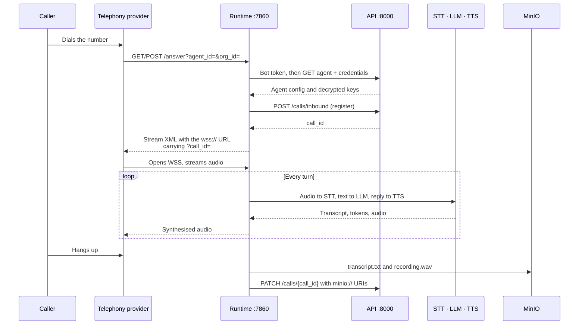
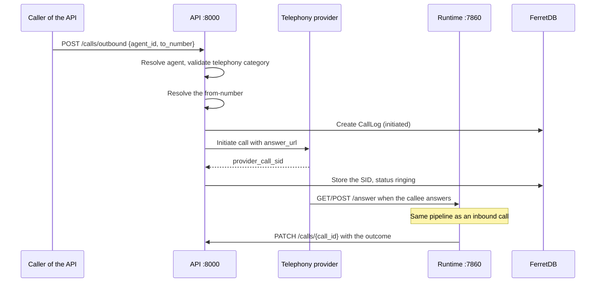
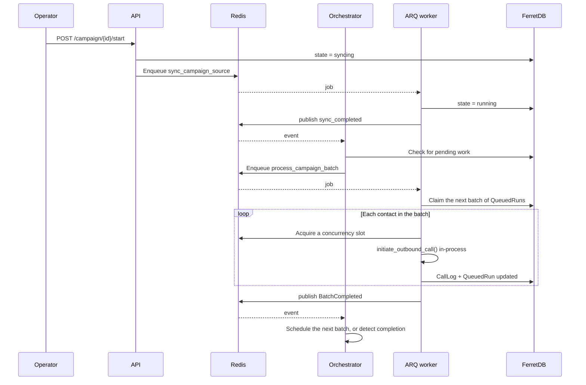
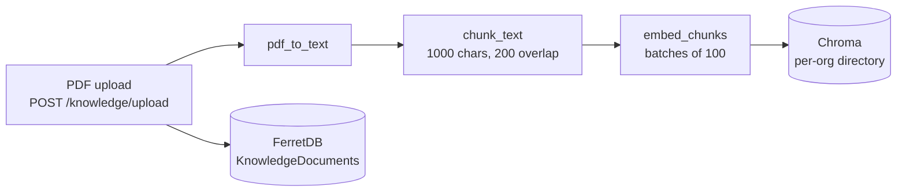
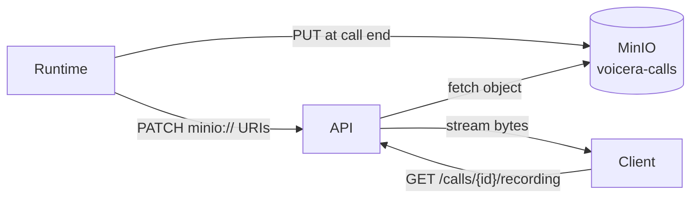
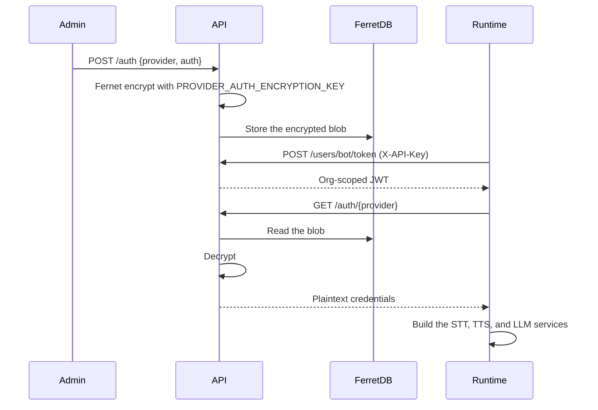

This page traces the paths data actually takes: a call arriving, a call going out, a campaign running, a document being ingested, and credentials reaching the runtime. Each is a separate scenario because each touches a different set of stores.

<Note>
For the static picture — which container talks to which — see [Architecture](architecture). This page is about movement over time.
</Note>

## Inbound call

A caller dials a number attached to a `telephony` agent.



The runtime never holds long-lived credentials of its own. It mints a bot token with `INTERNAL_API_KEY`, and the API returns decrypted provider keys for that organisation only. See [Provider credentials](../../developer/reference/provider-auth).

Inbound registration is idempotent — `register_inbound_call` returns the existing record if the same `provider_call_sid` arrives twice, so a provider retry does not create a duplicate call log.

## Outbound call

Triggered by `POST /api/v1/calls/outbound`, or by a campaign batch.



<Note>
This path takes **no concurrency slot**. `initiate_outbound_call()` never touches Redis — only `CampaignCallDispatcher` acquires and releases slots, so an organisation's ceiling constrains campaigns, not direct `POST /calls/outbound` requests. See [Call concurrency](../../developer/reference/call-concurrency).
</Note>

## Campaign call

Campaigns add a queue, a worker, and an orchestrator between the request and the call.



Nothing polls the database in a loop: the orchestrator reacts to Redis events and only falls back to a timed sweep to catch stalls. See [Campaigns](campaigns).

## Knowledge ingest



The document's metadata and status live in FerretDB; the vectors live in Chroma, on the `voicera_oss_chroma_data` volume. At call time the runtime retrieves chunks either as a tool the LLM can call or as prepended context. See [Knowledge base](knowledge-base-rag).

## Call artifacts



Layout inside the bucket:

```text
voicera-calls/{org_id}/{call_id}/transcript.txt
voicera-calls/{org_id}/{call_id}/recording.wav
```

The CallLog stores `minio://` URIs, not signed URLs. Clients always fetch through the authenticated API proxy, so bucket access never has to be public.

<Note>
Browser websocket sessions register a `call_type: web` CallLog on connect, so they produce transcripts and recordings under the same MinIO paths as telephony calls.
</Note>

## Credentials



Secrets are written once and read at call time. They are never stored on the agent document, and only secret fields are kept — non-secret settings live on the agent's config.

## Where everything lives

| Data | Store | Volume | Survives `docker compose down`? |
| --- | --- | --- | --- |
| Users, orgs, agents, numbers, call logs, campaigns | FerretDB on PostgreSQL | `voicera_oss_ferretdb_postgres_data` | Yes, unless `-v` |
| Provider credentials (encrypted) | FerretDB | same | Yes, unless `-v` |
| Recordings and transcripts | MinIO | `voicera_oss_minio_data` | Yes, unless `-v` |
| RAG vectors | Chroma | `voicera_oss_chroma_data` | Yes, unless `-v` |
| Job queue, campaign events, concurrency slots | Redis | `voicera_oss_redis_data` | Yes, but treat as ephemeral |
| Uploaded CSVs | MinIO | `voicera_oss_minio_data` | Yes, unless `-v` |

<Warning>
`docker compose down -v` deletes every volume — all four stores at once. A backup means Postgres, MinIO, and Chroma together; see [Daily operations](../operator/operations).
</Warning>

## Related

* [Architecture](architecture)
* [Voice pipeline](voice-pipeline)
* [Campaigns](campaigns)
* [Calls and call artifacts](calls)
