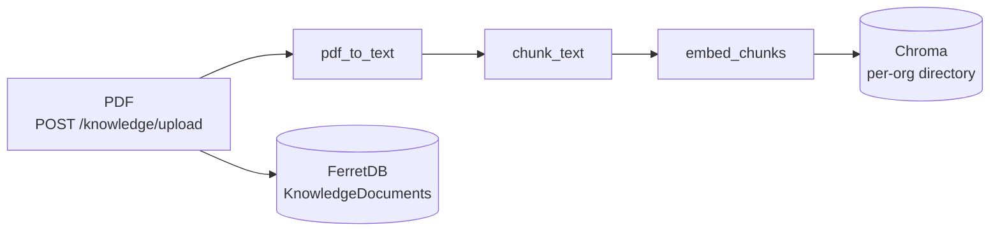
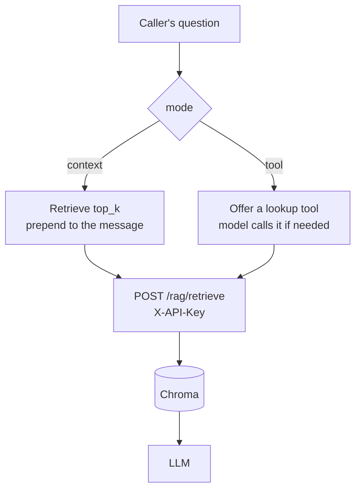

A language model answers from what it learned in training. A knowledge base lets an agent answer from **your** documents instead — scheme rules, policy PDFs, product manuals — by retrieving relevant passages at call time and giving them to the model.

This is retrieval-augmented generation: retrieve the relevant text, then generate an answer grounded in it.

## The ingest pipeline



Upload a document and the API extracts its text, splits it into overlapping chunks, embeds each chunk, and stores the vectors in Chroma. The document's metadata and status live in FerretDB; the vectors live on the `voicera_oss_chroma_data` volume. Every organisation shares one `rag_docs` collection (`rag/chroma_store.py`); isolation comes from the per-org directory each store is opened in, not from the collection name.

Defaults, from `apps/api/app/rag/ingest_pipeline.py`:

| Setting | Default | Meaning |
| --- | --- | --- |
| `DEFAULT_CHUNK_SIZE` | `1000` | Characters per chunk |
| `DEFAULT_OVERLAP` | `200` | Characters shared between neighbours, so a sentence split across a boundary still retrieves |
| `DEFAULT_BATCH_SIZE` | `100` | Chunks embedded per request |

Ingestion is asynchronous. A document moves through `processing` → `ready`, or `failed`.

## Per-organisation collections

Chunks are scoped to the organisation that uploaded them. A retrieval never crosses that boundary, so two tenants sharing a deployment cannot read each other's documents.

## The two retrieval modes

Set `mode` on the agent's `knowledge_base` block. They behave very differently.

<Tabs>
<Tab title="context">
**Retrieve on every turn, prepend to the message.**

Before the model sees the caller's message, the runtime retrieves the top matching chunks and augments the message with them.

* Predictable — grounding is always present.
* Costs one retrieval per turn, and spends tokens even when the turn needed no lookup.
* Good for narrow agents where nearly every question is about the documents.

This is the default.
</Tab>

<Tab title="tool">
**Give the model a lookup tool and let it decide.**

The knowledge base is exposed as a tool the model can call when it judges that it needs to.

* Cheaper — no retrieval on turns that do not need one.
* Adds a round trip when the model does call it.
* Good for broad agents where only some questions concern the documents.
</Tab>
</Tabs>

Implemented in `apps/runtime/services/knowledge/`: `context_processor.py` is a Pipecat frame processor for `context` mode, `tool.py` builds the tool definition for `tool` mode, and `setup.py` wires whichever the agent selected.

## Attaching documents to an agent

```json
{
  "knowledge_base": {
    "enabled": true,
    "mode": "context",
    "document_ids": ["doc-uuid-1", "doc-uuid-2"],
    "top_k": 5
  }
}
```

| Field | Meaning |
| --- | --- |
| `enabled` | Off by default |
| `mode` | `tool` or `context` |
| `document_ids` | Scopes retrieval to these documents. Empty means the whole organisation's collection. |
| `top_k` | Chunks to retrieve, 1–10, default 5 |

`top_k` is the accuracy-versus-cost dial: more chunks give the model more to work with and cost more tokens per turn.

<Note>
The runtime parses this block **more permissively** than the API validates it — an unknown `mode` falls back to `context`, and `top_k` is clamped. A document written straight into FerretDB can therefore behave differently from one created through the API.
</Note>

## Retrieval at call time



Retrieval goes through the API rather than the runtime reaching into Chroma directly:

```http
POST /api/v1/rag/retrieve
X-API-Key: <INTERNAL_API_KEY>

{"org_id": "...", "question": "...", "document_ids": [], "top_k": 5}
```

The route is internal — it takes the service key, not a user token.

## Managing documents

```bash
# Upload
curl -X POST http://localhost:8000/api/v1/knowledge/upload \
  -H "Authorization: Bearer $TOKEN" \
  -F "file=@scheme-rules.pdf"

# List
curl -s -H "Authorization: Bearer $TOKEN" \
  http://localhost:8000/api/v1/knowledge

# Delete
curl -X DELETE -H "Authorization: Bearer $TOKEN" \
  http://localhost:8000/api/v1/knowledge/$DOCUMENT_ID
```

See [Managing knowledge documents](../operator/managing-knowledge).

## Requirements and limits

| Limit | Detail |
| --- | --- |
| **PDF only** | Extraction runs through `pdf_to_text`. Other formats are not supported. |
| **Embeddings need credentials** | `KB_EMBEDDING_API_KEY` and `KB_EMBEDDING_MODEL` (default `text-embedding-3-small`). Without them, ingestion fails. |
| **Text-based PDFs** | A scanned image PDF yields no text; there is no OCR step. |
| **No re-embedding on change** | Changing the embedding model does not re-embed existing documents. Delete and re-upload. |
| **Vectors are on a volume** | `voicera_oss_chroma_data`. Losing it means re-ingesting everything. |

<Note>
The dashboard's Knowledge Base screen is backed by the API — it lists, previews, uploads, and deletes documents through `/knowledge`. The API remains the complete surface; the screen covers the common operations. See [Dashboard tour](../../developer/frontend/dashboard-tour).
</Note>

## Tuning retrieval quality

| Symptom | Try |
| --- | --- |
| The agent misses information that is in a document | Raise `top_k`; check the document reached `ready` |
| Answers cite irrelevant passages | Lower `top_k`; scope `document_ids` to the right documents |
| Latency is too high in `context` mode | Switch to `tool` mode so retrieval only happens when needed |
| Answers ignore retrieved text | Strengthen the system prompt — tell the agent to answer from the provided context |

## Related

* [Agent configuration](../../developer/reference/agent-configuration)
* [Managing knowledge documents](../operator/managing-knowledge)
* [Data flow](data-flow)
* [Agents](agents)
