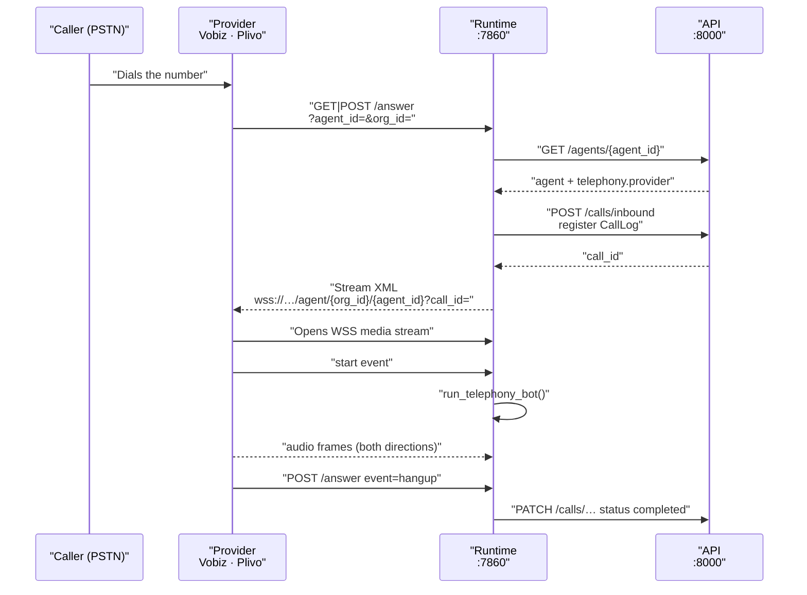
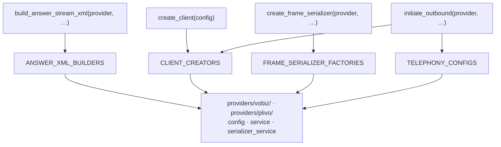

VoicEra speaks to phone networks through `apps/telephony`, a package with no database access, no environment reading, and no vendor `if` statements outside the vendor directories. This page explains how one answer route serves every provider, and where the two shipped providers actually differ.

<Note>
Credentials are always injected by the caller. `apps/telephony` never looks up [`ProviderAuth`](../../developer/reference/provider-auth), FerretDB, or environment variables — `apps/api` resolves the organisation's credentials and hands them in.
</Note>

## One /answer route, many providers

`apps/runtime` exposes exactly one telephony webhook, `GET|POST /answer`, defined in `apps/runtime/routes/telephony.py`. Both the answer URL and the hangup URL provisioned for an agent point at it — the route decides which it is by inspecting the webhook event.



The route resolves the agent, refuses anything that is not a `telephony` agent with a `400`, and registers a `CallLog` when the webhook carries a `provider_call_sid` and no `call_id` was passed on the query string. Outbound calls already carry `call_id` because the API put it there when it dialled.

Webhook bodies are parsed by `decode_webhook_body()` in `webhooks.py`, which handles **both** JSON and `x-www-form-urlencoded` — providers send either. Query parameters are then merged in, because Vobiz may put `CallUUID` on the URL rather than in the body. The normalised result is a `TelephonyWebhookEvent` with `event`, `from_number`, `to_number`, `direction`, `provider_call_sid`, `hangup_cause`, and `call_status`.

`resolve_provider_call_sid()` tries nine field paths in order — `CallUUID`, `call_uuid`, `call_id`, `callId`, `callSid`, `CallSid`, `request_uuid`, then `start.callId`, `start.callSid`, `start.call_uuid`. That one function covers both providers and both transports, which is why nothing downstream needs to know the vendor.

## Applications and number linking

Every telephony agent owns one provider **application** — the provider-side object that says "when this number rings, fetch XML from this URL". `apps/api` provisions it on agent create and names it after the `agent_id` UUID. See [Agents and agent categories](agents).

Both clients expose the same six application methods, and both return the same `{status, message, ...}` dict shape built by `success()` and `fail()` in `base.py`:

| Method | Purpose |
| --- | --- |
| `create_application` | Create the application with an answer URL. |
| `delete_application` | Remove it. |
| `update_application_name` | Rename it. |
| `link_number` | Bind a phone number to the application. |
| `unlink_number` | Unbind it. |
| `list_numbers` | List numbers on the provider account. |

A result is successful when `status == "success"`; `apps/api` raises `AgentTelephonyError` with a `502` on anything else.

## Answer Stream XML

`build_answer_stream_xml(provider, websocket_url, sample_rate=…)` in `xml.py` is the only entry point callers should use. It resolves the registered builder and delegates.

Both providers currently emit an identical document — the format lives per-provider precisely so it can diverge later without touching the caller:

```xml
<?xml version="1.0" encoding="UTF-8"?>
<Response>
    <Stream bidirectional="true" keepCallAlive="true" contentType="audio/x-mulaw;rate=8000">
        wss://voice.example.com/agent/YOUR_ORG_ID/YOUR_AGENT_ID?call_id=...
    </Stream>
</Response>
```

`contentType` is the one thing the sample rate changes. At `16000` it is `audio/x-l16;rate=16000`; at any other rate it is `audio/x-mulaw;rate={sample_rate}`. The runtime passes `telephony_sample_rate()`, which defaults to `8000` — so mu-law at 8 kHz is what you get unless you set `SAMPLE_RATE`.

## Frame serializers

Once the provider opens the WebSocket, raw media frames have to be translated into Pipecat frames. `create_frame_serializer(provider, stream_sid=…, call_sid=…, sample_rate=…)` in `serializers.py` does that dispatch.

| Provider | Class | Source |
| --- | --- | --- |
| `vobiz` | `VobizFrameSerializer` | `apps/telephony/providers/vobiz/serializers.py` |
| `plivo` | `PlivoFrameSerializer` | Re-exported from `pipecat.serializers.plivo` |

Serializers are registered in an optional `serializer_service.py` per provider and loaded **lazily**, by `load_frame_serializers()` rather than `load_providers()`. That separation is deliberate: `apps/api` imports `apps/telephony` for provisioning but has no Pipecat dependency, so serializer modules must never load on the API side.

Note the constructor arguments differ — Vobiz takes `stream_sid`/`call_sid`, Plivo's Pipecat class takes `stream_id`/`call_id`. The factory absorbs that; callers pass the same keywords either way.

## Outbound dispatch

`initiate_outbound(provider, …)` in `calls.py` builds the provider config, creates the client, and calls `client.initiate_call()`. Both providers hit `POST .../Account/{auth_id}/Call/`.

`apps/api` wraps this in `initiate_outbound_call()`, which creates the `CallLog` **before** dialling, so a dial that fails still leaves a `failed` record with the provider's message in `error_message`. See [Calls and call artifacts](calls).

The provider call SID is extracted from the result by trying `call_uuid`, `request_uuid`, then `uuid`, at the top level and again inside `raw`.

## Recording retrieval

VoicEra's own recordings come from the Pipecat pipeline, not from the provider — see [Voice pipeline](voice-pipeline). The provider recording helpers exist for pulling the carrier-side recording when you want it:

| Method | Vobiz | Plivo |
| --- | --- | --- |
| `start_call_recording` | Yes | Yes |
| `fetch_recording_metadata` | Yes | Yes |
| `download_recording` | Yes | Yes |
| `wait_and_download_recording` | By `recording_id` | By `recording_id` **or** `call_uuid` |
| `list_recordings_for_call` | — | Yes |

Recording helpers return ids or bytes, or `None` on failure — they do not use the `{status, message}` result shape. Downloads use a 120-second timeout; everything else uses 30.

## Provider differences

Everything above is shared. These are the real divergences:

| Concern | Vobiz | Plivo |
| --- | --- | --- |
| Config class | `VobizConfig` | `PlivoConfig` |
| Default `base_url` | `https://api.vobiz.ai/api/v1` | `https://api.plivo.com/v1` |
| Outbound Call payload | `from`, `to`, `answer_url`, `answer_method` only | Same, plus `hangup_url` and `hangup_method` when a hangup URL is given |
| HTTP auth | Auth headers | Auth headers **and** HTTP basic auth (`auth_tuple()`) |
| Preferred SID key | `call_uuid` first | `request_uuid` first |
| List recordings for a call | Not available | `list_recordings_for_call` |
| Frame serializer | VoicEra's own `VobizFrameSerializer` | Pipecat's `PlivoFrameSerializer` |

The Vobiz `initiate_call` signature still accepts `hangup_url` and `hangup_method` for API symmetry, then discards them — the Vobiz Call payload has no hangup fields. Vobiz reports hangup through the answer webhook instead, which is why the answer URL and hangup URL provisioned for an agent are the same URL.

Both providers use `auth_id` and `auth_token`, both marked `secret: True` in their config classes, so the credential form is identical from the API's point of view.

## Registry dispatch

There are four registries, all in `apps/telephony/registry.py`, all populated by decorators at import time and discovered by walking `providers/`:



Every one of the four maps is keyed by provider id and holds an entry for each vendor, so `vobiz` and `plivo` both appear in all four. Adding a provider means registering in each.

`load_providers()` imports `config` and `service` from every package under `providers/`, using `pkgutil`. `load_frame_serializers()` additionally imports `serializer_service`. A missing submodule is skipped, not an error. Duplicate registrations for the same provider id raise at import time, so two providers cannot silently claim the same name.

Adding a provider means adding a directory. Nothing in `xml.py`, `calls.py`, or `serializers.py` changes — the package README is explicit that provider `if`/`elif` chains do not belong in those facades. Step-by-step instructions are in [Adding a telephony provider](../../developer/guides/adding-a-telephony-provider), and the same registry pattern for AI vendors is in [Provider registry](../../developer/reference/provider-registry).

`registered_providers()` is what `apps/api` calls to validate `telephony_provider` on an agent, and `GET /configuration/telephony` exposes the catalog with defaults and field metadata.

## What the package does not do

`apps/telephony` deliberately stops at the HTTP boundary. It does not:

* read or write phone-number attach and detach records — that is `apps/api`
* touch MinIO or store recordings — that is `apps/runtime`
* serve the FastAPI `/answer` route or the media WebSocket — that is `apps/runtime`, which calls the XML helper
* look up agent config or credentials — the caller injects auth

## Related

* [Agents and agent categories](agents) — application provisioning and number linking
* [Calls and call artifacts](calls) — what a call writes down
* [Voice pipeline](voice-pipeline) — what happens once the WebSocket is open
* [Provider registry](../../developer/reference/provider-registry) — the same pattern for STT, TTS, and LLM
* [Telephony (apps/telephony)](../../developer/services/telephony) — the package as a service
* [Public voice URLs](../deployment/public-voice-urls) — making `/answer` reachable
