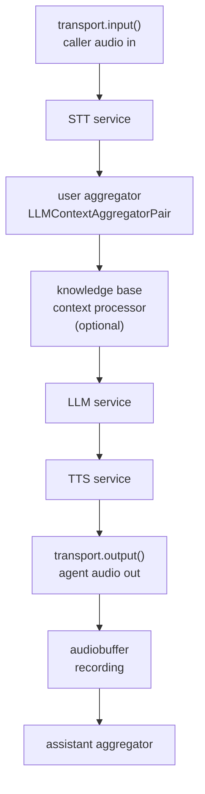
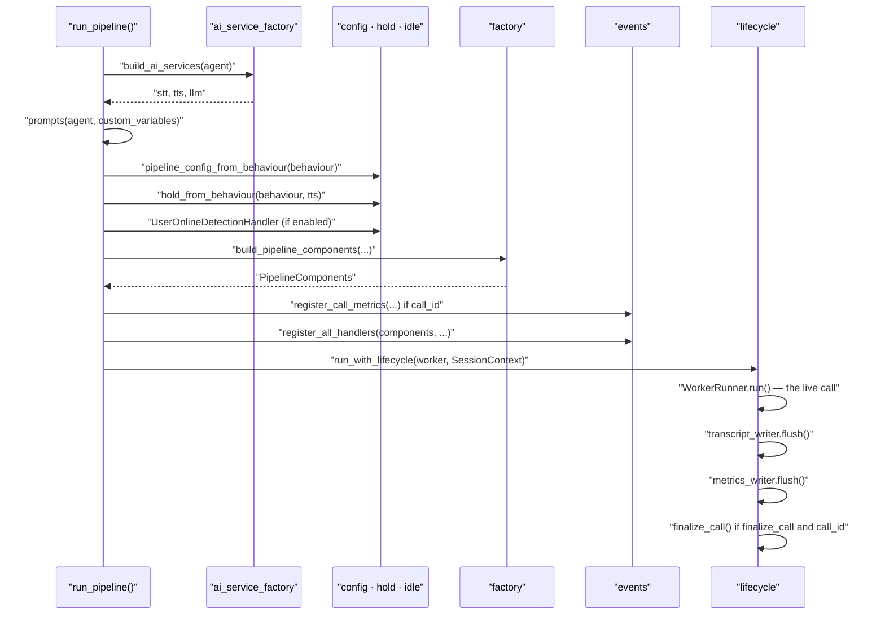

Every live call in VoicEra runs one [Pipecat](https://github.com/pipecat-ai/pipecat) pipeline inside `apps/runtime`. This page explains what that pipeline is made of, the order it is assembled in, and which agent settings change its shape.

The pipeline is not one function. It is nine modules and three subpackages under `apps/runtime/services/pipecat/`, each owning one concern, wired together by `run_pipeline()` in `pipeline.py`. Read that file alongside this page — it is short, and it is the authority.

<Note>
The pipeline is shared. Telephony calls and browser WebSocket sessions run the same `run_pipeline()`; only the frame serializer, sample rate, and whether a `CallLog` gets finalised differ. See [Runtime](../../developer/services/runtime).
</Note>

## The pipeline in one picture

Audio frames travel one way through an ordered list of processors, built in `build_pipeline_components()` (`apps/runtime/services/pipecat/factory.py`):

Two details are worth calling out. The knowledge-base processor is inserted **only** when `configure_knowledge_base()` returns one — see [Knowledge base (RAG)](knowledge-base-rag). And `audiobuffer` sits *after* `transport.output()`, so the recording it produces contains both sides of the conversation as they were actually sent.

The transport is a `FastAPIWebsocketTransport` with `audio_in_enabled=True`, `audio_out_enabled=True`, and `add_wav_header=False`. Voice activity detection is a `SileroVADAnalyzer` configured with `stop_secs=0.4`, `min_volume=0.5`, `confidence=0.3`, and `start_secs=0.1`.

## Building the AI services

Before any processor exists, `run_pipeline()` calls `build_ai_services(agent)` from `apps/runtime/services/ai_service_factory.py`. That function:

1. Reads `agent.config.models.stt_config`, `tts_config`, and `llm_config`. All three are required; a missing one raises `ServiceBuildError`.
2. For each, calls `backend_client.get_provider_auth(provider, org_id)` and merges the returned secrets over the non-secret config blob.
3. Validates the merged result as an `AgentConfig` and calls `create_stt_service()`, `create_tts_service()`, and `create_llm_service()` from `apps.providers`.

Secrets never live on the agent document. They come from [`ProviderAuth`](../../developer/reference/provider-auth) at call time, which is why rotating a key takes effect on the next call without editing any agent. Which providers are available and what each config blob accepts is in the [provider registry](../../developer/reference/provider-registry).

## Prompts and custom variables

`prompts()` in `audio.py` reads `agent.config.prompts.system_prompt` and `agent.config.prompts.greeting_message`, strips them, and substitutes custom variables into both.

The placeholder syntax is `{{variable_name}}`, matched by the regex `\{\{(\w+)\}\}`. An unknown name substitutes to an empty string rather than failing.

Values are resolved by `resolve_custom_variables()`, which merges two dictionaries:

| Source | Field | Precedence |
| --- | --- | --- |
| Agent config | `config.custom_variables` | Defaults |
| Call log | `custom_variables` on the call | Wins on conflict |

So an agent can define `{"customer_name": ""}` as a default and an outbound call or [campaign](campaigns) row can override it per call.

The system prompt, if non-empty, becomes the first message of the `LLMContext`. The greeting is not part of the context — it is queued as a `TTSSpeakFrame` when the client connects, which is why the agent speaks first without consuming an LLM turn.

## Behaviour becomes pipeline config

`pipeline_config_from_behaviour()` (`config.py`) reads `agent.config.behaviour` and produces a frozen `PipelineConfig`. Everything the pipeline does differently between agents comes from this one object.

The behaviour fields are defined on `AgentBehaviour` in `apps/api/app/models/schemas.py`:

| Field | Type | Default | Bound | What it does |
| --- | --- | --- | --- | --- |
| `interruption_min_words` | `int` | `0` | `>= 0` | Minimum words before the caller can interrupt the agent. |
| `user_silence_hangup_seconds` | `float \| null` | `null` | `>= 0` | Hang up after this many seconds of user silence (null = disabled). |
| `call_timeout_seconds` | `float \| null` | `null` | `>= 0` | Maximum call duration in seconds (null = no hard limit). |
| `ignore_user_speech_before_greeting` | `bool` | `false` | — | Ignore caller speech until the greeting has finished playing. |
| `hold_messages` | `list[str]` | `[]` | — | Messages played while the agent is on hold / thinking. |
| `hold_message_timeout_seconds` | `float \| null` | `null` | `>= 0` | Seconds to wait after LLM inference starts before playing a single hold message (null = disabled). |
| `user_online_detection_enabled` | `bool` | `false` | — | Prompt the caller after silence following bot speech. |
| `user_online_detection_message` | `str` | `""` | — | Prompt played when checking if the user is still online. |
| `user_online_detection_seconds` | `float \| null` | `null` | `>= 0` | Seconds of silence after bot speech before the online-detection prompt. |
| `user_online_detection_repeats` | `int \| null` | `null` | `>= 1` | How many times to speak the online-detection prompt in one silence cycle. |
| `user_online_detection_closing_message` | `str` | `""` | — | Spoken after the last online-detection prompt, before hangup. |
| `automatic_call_ending` | `AutomaticCallEnding` | `{enabled: false, graceful_llm_call_ending: false}` | — | Lets the LLM hang up itself. See [Automatic call ending](#automatic-call-ending). |

<Note>
`call_timeout_seconds` is accepted and stored by the API but no code in `apps/runtime` reads it. There is currently no hard call-duration cap enforced by the pipeline. Cap call length at your telephony provider, or by [campaign](campaigns) controls, until this lands.
</Note>

The runtime coerces missing values rather than rejecting them. `user_online_detection_seconds` falls back to `10`, `user_online_detection_repeats` to `1`, and `user_silence_hangup_seconds` to `0` — see `online_detection_from_behaviour()` in `idle.py`.

Full field-by-field configuration guidance is in [Agent configuration](../../developer/reference/agent-configuration).

## Hold messages

A hold message covers the gap when the LLM is slow. `hold_from_behaviour()` in `hold.py` returns a `HoldMessageHandler` only when **both** `hold_message_timeout_seconds` is a positive number **and** `hold_messages` contains at least one non-blank string. Otherwise it returns `None` and the feature is off.

When enabled, the handler:

1. Starts a timer on `on_user_turn_inference_triggered` — that is, when the LLM call begins.
2. Cancels that timer the moment the LLM pushes its first `TextFrame`, on a new user turn, or when the client disconnects.
3. If the timer expires first, picks one message at random and queues it as a `TTSSpeakFrame` with `append_to_context=False`.

Two consequences follow from that flag and from the one-shot design: the hold message never enters the LLM conversation history, and at most **one** hold message plays per turn. It is filler, not a loop.

## User online detection

Both of the silence behaviours hang off the same Pipecat event, `on_user_turn_idle`, fired after `PipelineConfig.user_idle_timeout` seconds of user silence. Which timeout applies depends on whether online detection is on:

| `user_online_detection_enabled` | Idle timeout used | Behaviour on idle |
| --- | --- | --- |
| `true` | `user_online_detection_seconds` | Speak `user_online_detection_message`, up to `user_online_detection_repeats` times. After that, speak `user_online_detection_closing_message` and end the call. |
| `false` | `user_silence_hangup_seconds` | Speak `user_online_detection_closing_message` and end the call immediately. |

The counter resets on every `on_user_turn_started`, so a caller who says anything at all gets the full allowance back.

When online detection is disabled, the closing message spoken before hangup is still read from `user_online_detection_closing_message` — there is no separate field for it. If you set `user_silence_hangup_seconds` but leave that message empty, the agent hangs up silently.

Ending a call is a single mechanism throughout the pipeline: push an `EndWorkerFrame` upstream. That drains the worker, which unwinds into the [session lifecycle](#session-lifecycle).

## Interruption and barge-in

Interruption is controlled by two independent settings on the user aggregator.

`interruption_min_words` sets how many words the caller must say before their speech counts as a turn. When greater than `0`, the pipeline installs a `MinWordsUserTurnStartStrategy(min_words=…)`. At the default `0` no strategy is installed and any detected speech interrupts. Raising it to `2` or `3` stops a cough or a "mm-hm" from cutting the agent off; raising it too high makes the agent feel deaf.

`ignore_user_speech_before_greeting`, when `true`, adds a `MuteUntilFirstBotCompleteUserMuteStrategy()`. The caller is muted until the agent finishes its first complete utterance. Use it when the greeting carries required disclosure that must not be talked over.

## Automatic call ending

Set both `automatic_call_ending.enabled` and `automatic_call_ending.graceful_llm_call_ending` to `true` and `configure_call_ending()` (`call_ending.py`) registers an `end_conversation` tool on the LLM context. Either flag alone does nothing.

The tool's docstring is what the LLM sees: *"End the conversation and shut down the bot. Call this when the user says goodbye or the task is complete."* When the model calls it, the function returns `{"status": "ended"}` and pushes an `EndWorkerFrame` downstream.

Tool registration merges rather than overwrites. If a knowledge-base tool is already on the context, `_append_tools()` appends `end_conversation` beside it and skips the append if a tool of that name is already present.

### Provider-specific call ending: Kenpath

The mechanism above needs an LLM that does OpenAI-style tool calling. Kenpath's Vistaar and Bharat Vistaar services stream plain text instead, so they end calls a different way: `apps/providers/adapters/kenpath/call_ending.py` regex-matches the word **"goodbye"** (case-insensitive, word-boundary) in the streamed LLM output. That word is Kenpath's own hangup convention, not something VoicEra defines.

Both `llm.py` and `bharat_vistaar_llm.py` call `strip_goodbye_for_tts()` on every streamed chunk before it reaches TTS, so the literal word "goodbye" is never spoken to the caller — the rest of that chunk still is. Only after the **entire** response has finished streaming (in the same `finally` block that pushes `LLMFullResponseEndFrame`) does `response_requests_end_call()` check the full text and, if it matched, call `end_call()` to push an `EndWorkerFrame`. So the agent finishes speaking its goodbye-stripped response in full before the call ends — it does not cut off mid-sentence.

This is a second, independent end-call path — it does not use `automatic_call_ending`, does not register a tool, and works even when that config is off. Bharat Vistaar also honours its own vendor-native `end_interaction` flag from the SSE payload as an additional trigger, alongside the same goodbye-word check.

## Event handlers

`register_all_handlers()` in `events/__init__.py` attaches every callback in one pass. Nothing in the processor list above knows about logging, recording, or greetings — those are all handlers.

| Registrar | Module | Attaches to | Effect |
| --- | --- | --- | --- |
| `register_transcript_file_logging` | `storage/transcript.py` | Both aggregators | Buffers turn lines in memory. Registered **only when `call_id` is set**. |
| `register_idle_handlers` | `idle.py` | User aggregator | `on_user_turn_idle` — online detection or silence hangup. |
| `register_hold_handlers` | `hold.py` | User aggregator, LLM | Starts and cancels the hold timer; resets the idle counter on turn start. |
| `register_turn_logging_handlers` | `events/logging.py` | Both aggregators | Logs each completed turn, and logs when the agent is interrupted. |
| `register_recording_handlers` | `events/recording.py` | `audiobuffer` | `on_audio_data` — wraps PCM in a WAV header and uploads. No-op without a `call_id`. |
| `register_transport_handlers` | `events/transport.py` | Transport | `on_client_connected` queues the greeting; `on_client_disconnected` cancels the hold timer and cancels the worker. |

Two of these are gated on `call_id`. A browser WebSocket session gets one — supplied by the client or registered by the runtime — so it records transcripts and audio like any telephony call. Only a session that fails to register one produces nothing durable. See [Calls and call artifacts](calls).

Call metrics are registered separately, not through `register_all_handlers()`. When `call_id` is set, `run_pipeline()` builds a `CallMetricsWriter` and calls `register_call_metrics()` (`metrics/observers.py`), which attaches a Pipecat transport-timing observer and a `UserBotLatencyObserver`. They record per-turn duration and interruptions, first-bot-speech latency, and each user-to-bot round trip. `lifecycle.py` flushes the writer during teardown, which `PUT`s the whole payload to `/calls/{call_id}/metrics` — see [Calls](../../api-reference/calls) for its shape. Writes are once per call: a second `PUT` for the same `call_id` returns the existing document unchanged.

## Session lifecycle

This is `run_pipeline()` in order. Every step is a real call in `apps/runtime/services/pipecat/pipeline.py`.

`run_with_lifecycle()` in `lifecycle.py` runs the worker inside a `try/finally`, so teardown happens even when the call drops. The `finally` block flushes the transcript writer, then the metrics writer, then — only when `finalize_call` is `True` and a `call_id` exists — calls `finalize_call()`, which PATCHes the `CallLog` with `end_time_utc`, `status: "completed"`, and `call_response: "answered"`, then notifies the campaign layer. Both are wrapped so a failure to finalise logs a warning instead of raising.

`finalize_call` is `True` for telephony calls (`run_telephony_bot`) and `False` for browser sessions (`run_websocket_bot`), both in `runners.py`.

The worker itself is a `PipelineWorker` with `enable_metrics=True`, `enable_usage_metrics=False`, `idle_timeout_secs=None`, and `processor_unusable_policy=ProcessorUnusablePolicy.END` — a processor that becomes unusable ends the call rather than stalling it.

At call end, Pipecat observers (`StartupTimingObserver` for transport timing, `UserBotLatencyObserver`, `TurnTrackingObserver`) feed a `CallMetricsWriter` that `PUT`s a slim payload (`summary`, `transport`, `turns`, `latencies`) to `PUT /api/v1/calls/{call_id}/metrics`. Metrics are stored in the `CallMetrics` collection and fetched via `GET /api/v1/calls/{call_id}/metrics`, not on the CallLog itself.

## Sample rates

Sample rate is chosen by the entry point in `runners.py` and read from the environment in `apps/runtime/constants.py`. It is applied consistently to the VAD analyzer, `audio_in_sample_rate`, and `audio_out_sample_rate`.

| Session type | Entry point | Env var | Default | Serializer |
| --- | --- | --- | --- | --- |
| Telephony | `run_telephony_bot()` | `SAMPLE_RATE` | `8000` | `create_frame_serializer(provider, …)` |
| Browser WebSocket | `run_websocket_bot()` | `WEBSOCKET_SAMPLE_RATE` | `16000` | `ProtobufFrameSerializer()` |

8 kHz is what PSTN carries, so raising `SAMPLE_RATE` gains nothing on a phone call and risks breaking the provider's frame format. Browser sessions run at 16 kHz because the browser can supply it and STT accuracy improves. Per-provider serializer details are in [Telephony model](telephony-model).

## Related

* [Architecture](architecture) — where the pipeline sits in the whole system
* [Agents and agent categories](agents) — what a `telephony` versus `websocket` agent is
* [Agent configuration](../../developer/reference/agent-configuration) — every config field
* [Calls and call artifacts](calls) — transcripts, recordings, and call logs
* [Runtime (apps/runtime)](../../developer/services/runtime) — the service that hosts the pipeline
