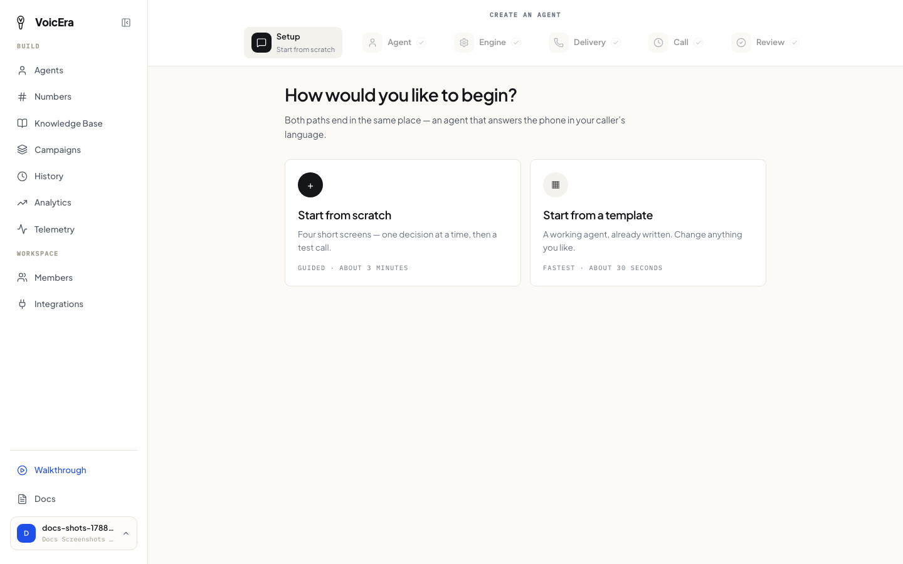
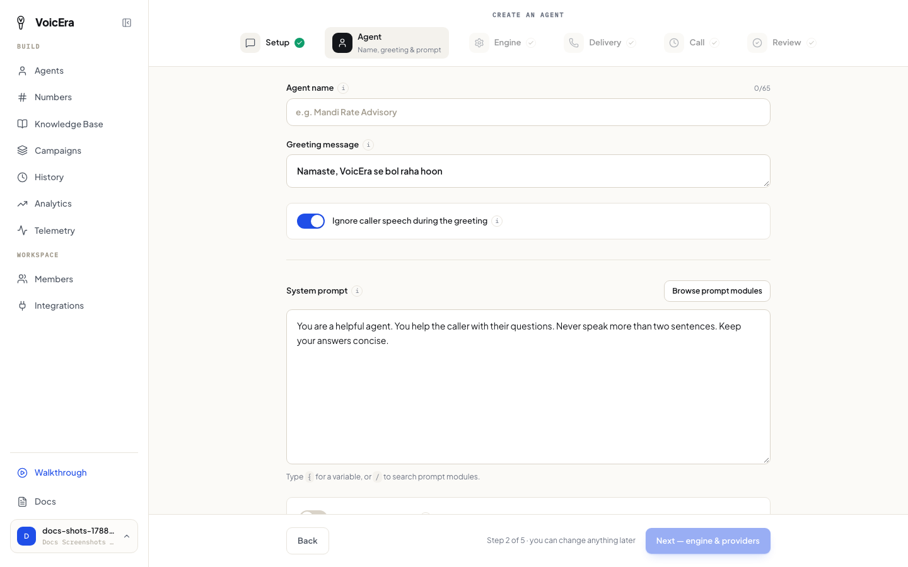
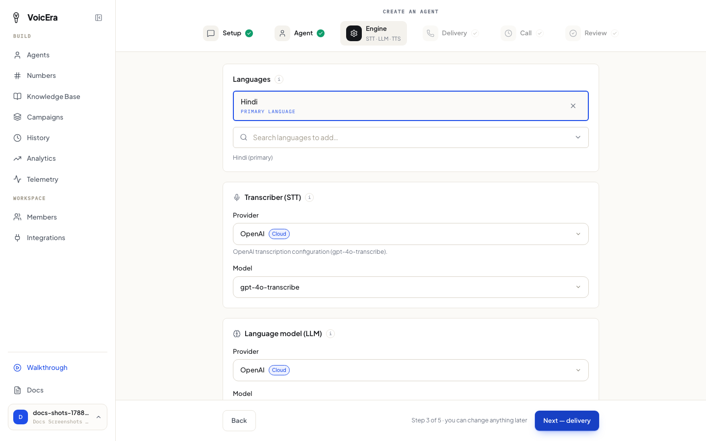
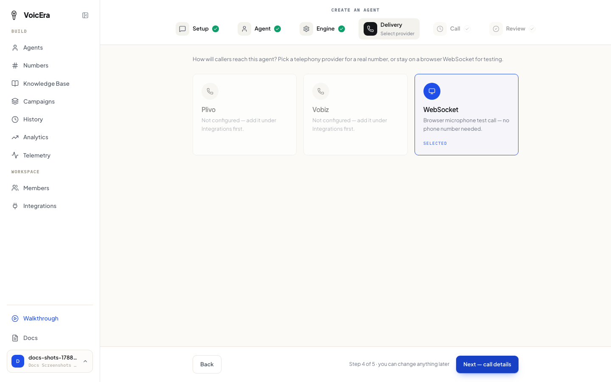
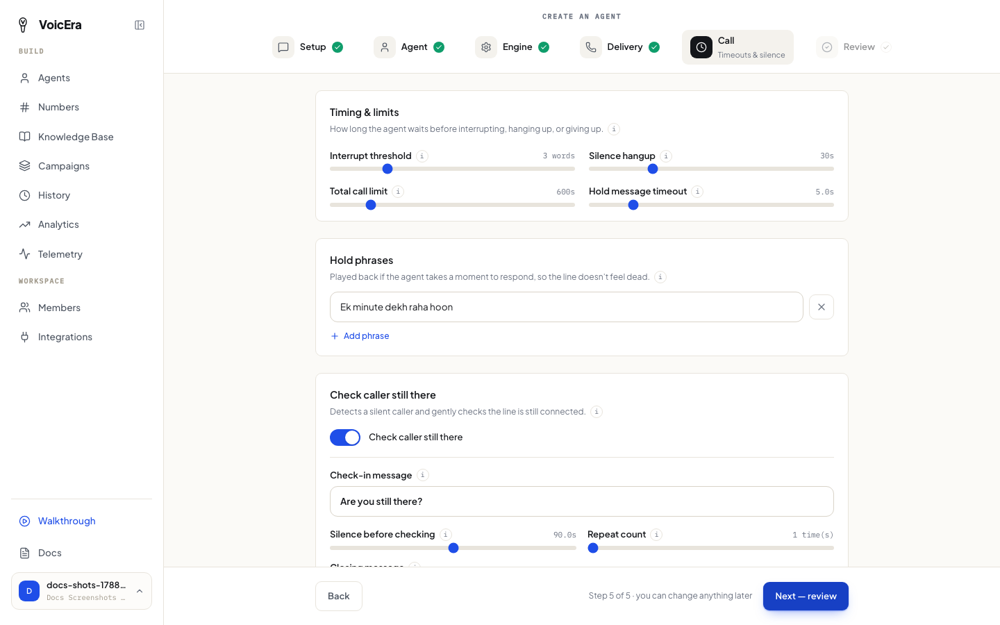
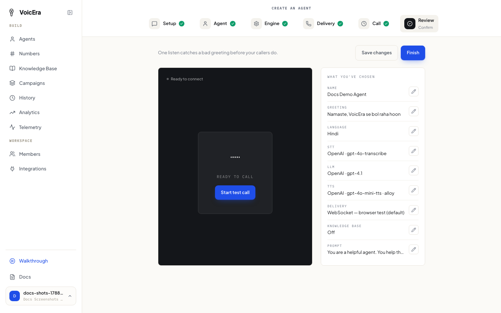

An "agent" is one phone assistant — its own voice, its own script, its own phone number if you want one. You can create as many as you need (one per department, one per language, whatever fits).

Make sure you've [connected at least one AI service](sign-up#2-connect-your-ai-services) first, or several steps below will have nothing to choose from.

## Start the wizard

From the dashboard's home screen, click **New agent**. You'll be offered two paths:

* **Start from scratch** — build everything yourself, step by step.
* **Start from a template** — pick a ready-made example and adjust it.

This guide walks the from-scratch path — templates skip most of it.

The wizard has six steps: **Setup → Agent → Engine → Delivery → Call → Review**.

## Agent: name, greeting, and instructions

Give your agent a name (for your own reference — callers won't hear it) and write its opening line: the first thing it says when someone connects, something like *"Hello, thanks for calling. How can I help you today?"*

This step also has a toggle for whether the agent should ignore anything the caller says during the greeting, and the **system prompt** — the instructions that shape how your agent behaves. If you're not sure where to start, browse the prompt library for ready-made snippets and edit one to fit.

## Engine: languages and AI services

Pick the language(s) your agent should speak, then choose which connected provider handles the transcriber (speech-to-text), the language model, and the voice (text-to-speech).

<Note>
Only vendors you connected on the [Integrations page](sign-up#2-connect-your-ai-services) show up here. If a dropdown looks empty, go back and connect a vendor for that role first.
</Note>

## Delivery: how callers reach it

Choose how this agent will be reached: a telephony provider like Plivo, or **WebSocket** — a browser test call, no phone number needed. WebSocket is the default and is good for trying the agent out before spending anything on real calls.

You can always change this later — see [Add a phone number](make-a-call#add-a-phone-number).

## Call: timing and hold behavior

Set call timing and limits, hold phrases the agent uses if it needs a moment, and whether it periodically checks that the caller is still there.

The defaults work fine to start — you can fine-tune these once you've heard how the agent sounds.

## Review and test

Read back everything you've set up. When it looks right, click **Finish** — this creates the agent and opens a live test call right in your browser.

See [Test and call with your agent](make-a-call) for what to expect from that test call.

## If something isn't working

| Problem | What it usually means |
| --- | --- |
| A dropdown for AI services is empty | You haven't connected a vendor for that role — see [Sign up and get set up](sign-up#2-connect-your-ai-services). |
| The "Next" button stays greyed out | A required field on that step is still empty — the page usually tells you which one. |
| You picked a template but still can't save | Templates set the script and language, but not AI services — go back to the Engine step and choose them. |

## Next

[Test and call with your agent](make-a-call)
