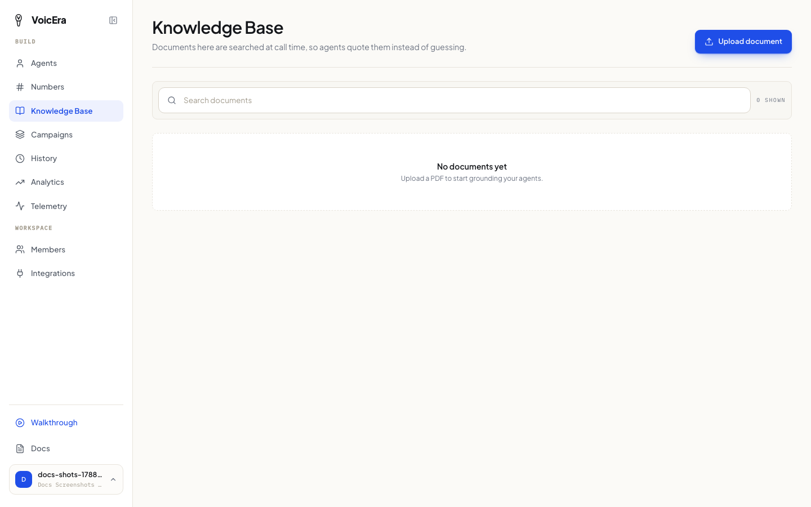
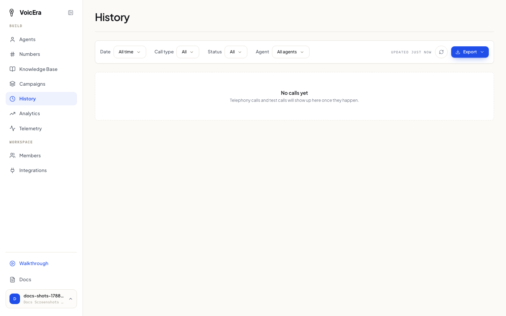
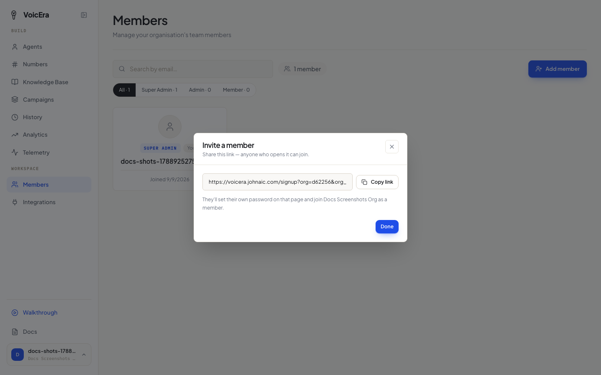

The smaller things you'll come back to often, once your agent is up and running.

## Upload a document

If you want your agent to answer questions from your own material — a policy document, a price list, an FAQ — instead of guessing, upload it as a knowledge document.

1. Click **Knowledge Base** in the sidebar.

2. Click **Upload document** and choose a PDF (up to 25 MB).
3. Wait for it to finish processing — the file shows as **Indexing**, then **Indexed** once your agent can use it. If something goes wrong, it shows as **Failed**.

Once indexed, attach it to an agent in the [Agent step of the agent wizard](create-an-agent#agent-name-greeting-and-instructions) (or the equivalent step when editing an existing agent). Click the preview icon on any document to open and read it without leaving the dashboard.

## Check call history

Click **History** in the sidebar to see every call your agents have made or received — test calls, real calls, and campaign calls all show up here.

Filter by date, by agent, or by how the call ended (connected, failed, still ringing, and so on). Click any call to open it and:

* Listen to the recording
* Read the full transcript
* See how long it lasted and how it ended

Use the **Export** menu to download a CSV or PDF of what you're currently looking at, or every transcript for the whole organisation.

<Note>
Phone numbers are partly hidden in the list for privacy. Opening a call still shows you the details you're allowed to see.
</Note>

## Invite a teammate

Click **Members** in the sidebar, then **Add member**. You'll get a shareable link — send it to your teammate, and they set their own password when they open it and join your organisation.

Three levels of access:

| Role | Can do |
| --- | --- |
| **Member** | Everyday work — agents, calls, campaigns, documents. |
| **Admin** | Everything a member can, plus manage other members. |
| **Super admin** | Everything, including promoting others to admin and deleting the organisation. Whoever signed up first gets this automatically. |

## Switch organisations or update your profile

Click your name at the bottom of the sidebar to open **Account**. From there you can update your details, or switch to a different organisation if you belong to more than one.

## If something isn't working

| Problem | What it usually means |
| --- | --- |
| A document stays stuck on "Indexing" | Give it a few minutes — larger PDFs take longer. If it moves to "Failed", try re-uploading it. |
| Upload fails immediately | Check the file is a PDF and under 25 MB. |
| An invited teammate can't do something | Check their role on the Members page — they may need Admin instead of Member. |
| A teammate says the invite link doesn't work | Links are shared per-organisation, not per-person — send a fresh one from the Members page. |
| You can't see an option other users have | You may not have Admin or Super admin access — ask whoever has it on your team. |

## Where to go from here

You've covered the core of running VoicEra day to day. For anything not covered here:

* [Common problems](../troubleshooting/common-issues) — a wider troubleshooting index
* Ask whoever manages your VoicEra installation — some problems (server logs, provider outages) need their access, not yours
