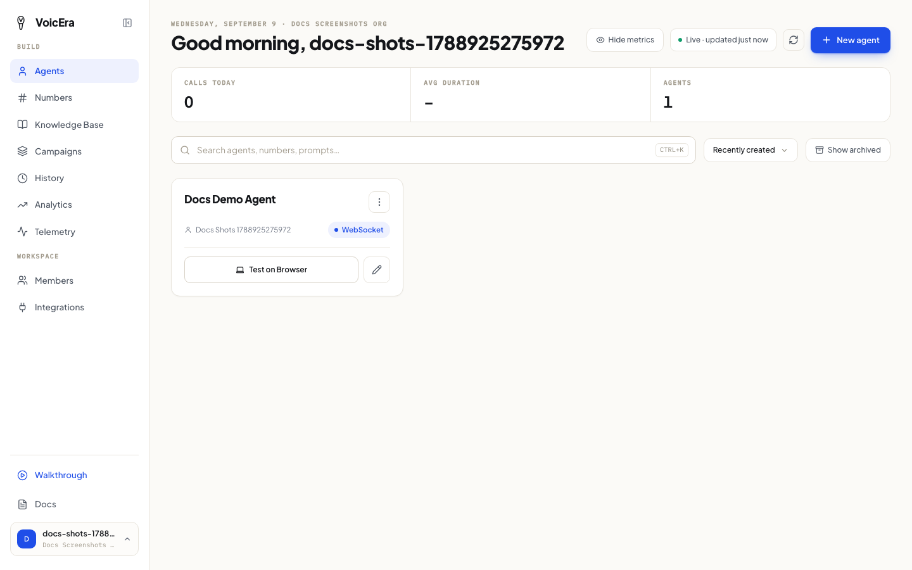
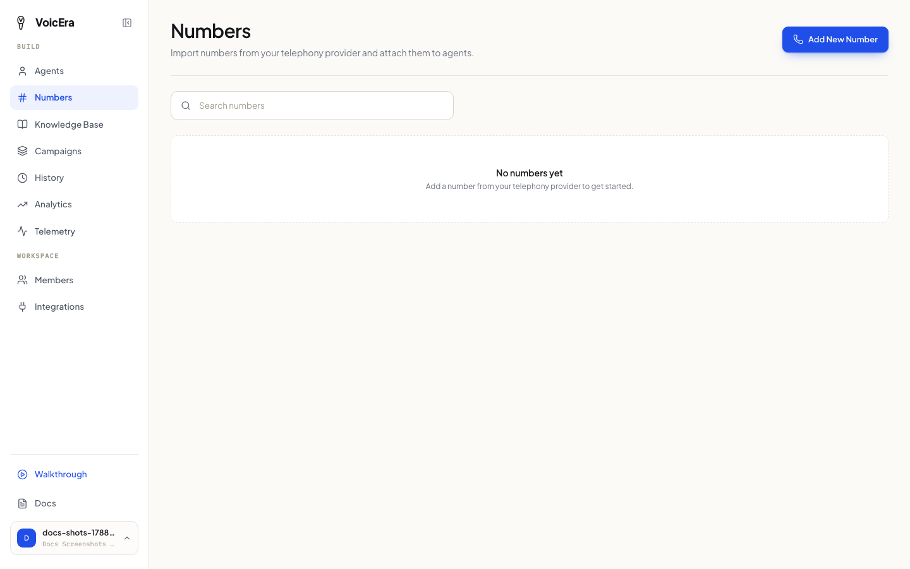
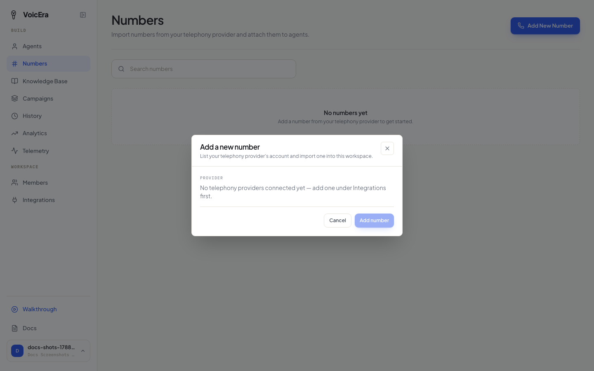

Two ways to talk to your agent: a free browser test first, then a real phone number when you're ready.

## Try it in your browser

This is the fastest way to hear whether your agent sounds right — no phone number, no cost, just your computer's microphone and speakers.

If you just finished the [agent creation wizard](create-an-agent), a test call is ready on the last step — click **Start test call**. To test an existing agent later, find its card on the dashboard's home screen and click **Test on Browser**.

Your browser will ask for microphone permission — allow it, or the agent won't be able to hear you. Once connected, you'll see a call timer and live status of the call.

<Note>
Only agents set up for **WebSocket** delivery (see [the Delivery step of the wizard](create-an-agent#delivery-how-callers-reach-it)) can be tested this way. An agent set up with a phone number instead will offer to place a real outbound call.
</Note>

<Tip>
Test calls are still recorded — you'll find the transcript later in [call history](everyday-tasks#check-call-history) just like a real call.
</Tip>

## Add a phone number

Once you're happy with how the agent sounds, give it a real phone number so real callers can reach it.

1. Click **Numbers** in the sidebar.

2. Click **Add New Number** and pick which telephony provider account to import from.

3. Pick a number, and choose which agent it should connect to.

<Note>
You need a telephony provider (like Plivo) connected under [Integrations](sign-up#2-connect-your-ai-services) before a provider shows up here.
</Note>

That's it — calls to that number now go to your agent. You can unlink a number from an agent at any time without losing the number itself.

## Placing a real outbound call

For an agent connected to a phone number, its card offers a way to place an outbound call directly — type in the number to dial and the agent calls it.

## If something isn't working

| Problem | What it usually means |
| --- | --- |
| No sound, or the browser test won't connect | Check your browser allowed microphone access — look for a blocked-microphone icon in the address bar. |
| The agent doesn't hear you | Your microphone permission may have been silently denied — check your browser's site settings for this page. |
| A phone number doesn't ring through to the agent | Confirm it's still linked to the right agent on the Numbers page — a number can be detached without deleting it. |
| No telephony provider shows up when adding a number | Connect one under [Integrations](sign-up#2-connect-your-ai-services) first. |

For deeper audio or call-connection problems, see [Voice and audio problems](../troubleshooting/voice-and-audio).

## Next

[Run a calling campaign](run-a-campaign) — call a whole list of people at once.
