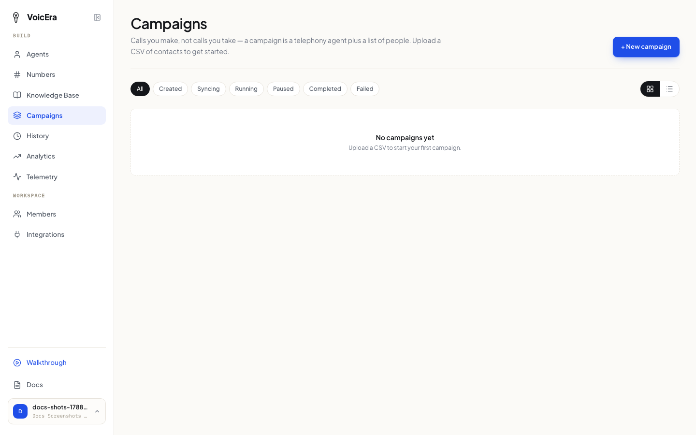

A campaign has your agent call a list of people automatically — reminders, surveys, follow-ups — instead of one call at a time. You need an agent that's already connected to a phone number (see [Add a phone number](make-a-call#add-a-phone-number)).

## Prepare your contact list

Your list is a CSV file (a spreadsheet saved as "CSV" from Excel, Google Sheets, or similar). It needs:

* A column named `phone_number` — every number must include the country code with a `+` in front, like `+919876543210`.
* No duplicate numbers.
* Any other columns you want — a name, an account number, whatever's useful. Your agent's script can reference these while calling, so it can say something like "Hi Asha" instead of a generic greeting.

**Example:**

```csv
phone_number,customer_name,account_id
+919876543210,Asha,ACC-1001
+919876543211,Ravi,ACC-1002
+919876543212,Meera,ACC-1003
```

<Note>
If your agent's script should mention a column like `customer_name`, someone technical needs to add it to the agent's configuration first — see [Agent configuration](../../developer/reference/agent-configuration).
</Note>

## Create the campaign

1. Click **Campaigns** in the sidebar.



2. Click **New campaign**, give it a name, and pick which agent should make the calls.
3. Upload your CSV — you'll see a preview so you can check the numbers look right before continuing.
4. Save.

## Start it, and keep an eye on it

Once created, a campaign sits ready until you press **Start**. While it's running, the campaign screen updates on its own — you'll see live progress as each call goes out.

You can:

* **Pause** — stop dialling, pick up again later exactly where it left off.
* **Resume** — continue a paused campaign.
* **Redial** — retry the numbers that didn't connect.

<Tip>
If too many calls in a row fail to connect, VoicEra pauses the campaign on its own rather than continuing to burn through the list — a safety net, not a bug. Check your agent's phone number and provider account if this happens.
</Tip>

## After it finishes

Open the campaign to see how each individual call went — reach a person, no answer, busy, and so on. From [call history](everyday-tasks#check-call-history), you can also listen to recordings and read transcripts for any of the calls the campaign made.

## If something isn't working

| Problem | What it usually means |
| --- | --- |
| The campaign won't create | The agent you picked probably isn't a phone-connected agent yet, or has no number attached — see [Add a phone number](make-a-call#add-a-phone-number). |
| Your CSV won't upload | Check every number starts with `+` and there's a `phone_number` column with that exact name. |
| The campaign paused itself | Too many calls in a row failed — see the tip above. |
| A column like a name isn't showing up in calls | It needs to be wired into the agent's script first — ask someone technical, or see [Agent configuration](../../developer/reference/agent-configuration). |

## Next

[Everyday tasks](everyday-tasks) — documents, call history, and your team.
