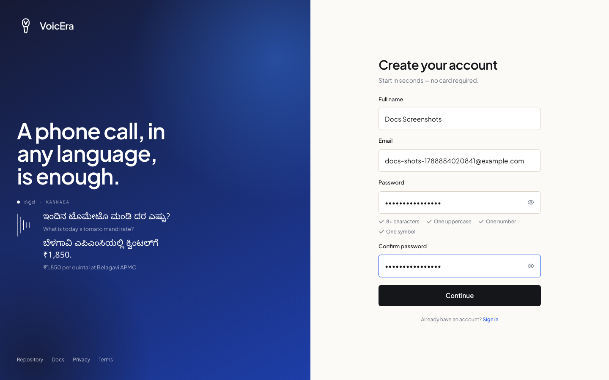
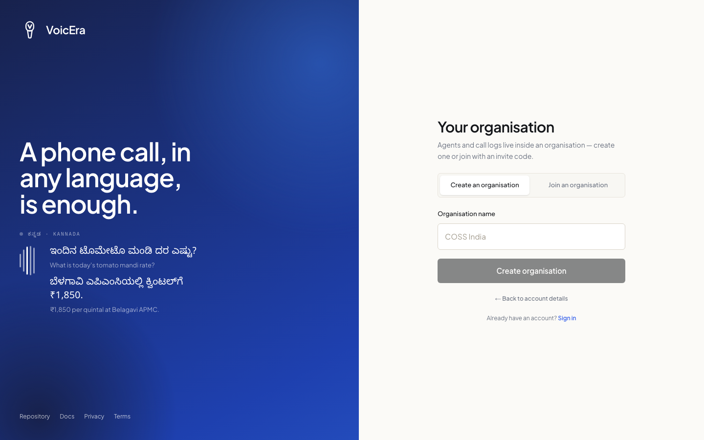
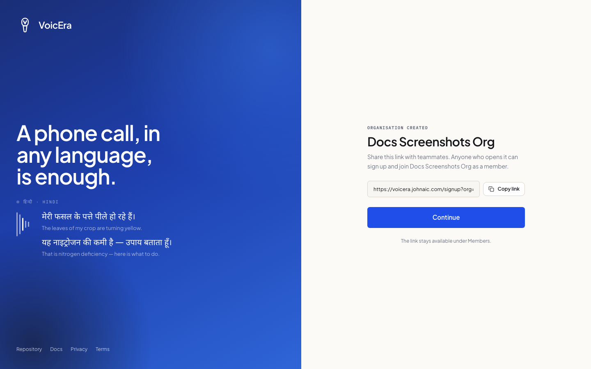
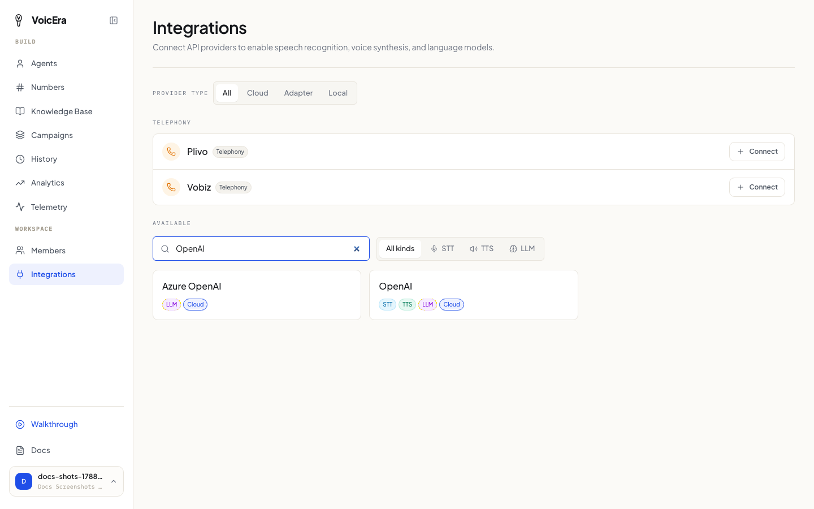
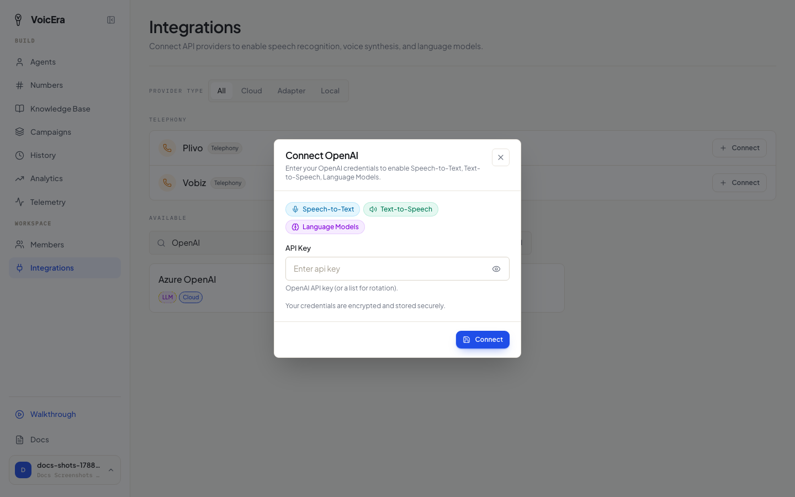
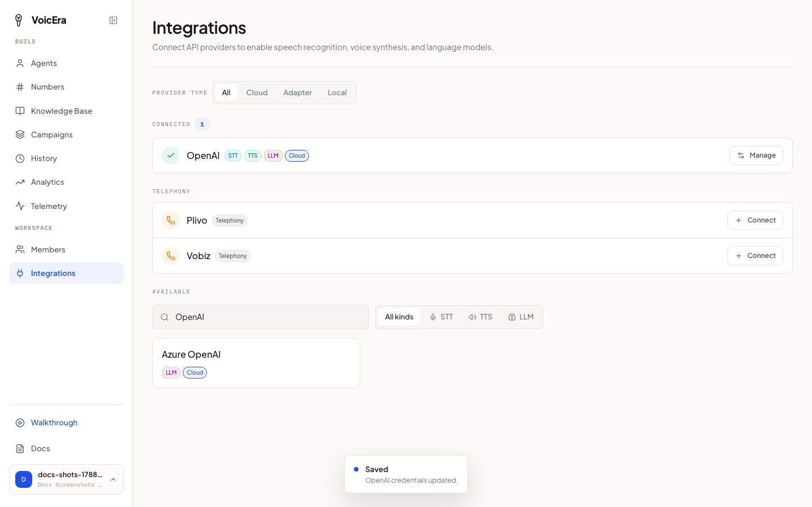

Two steps before you can build an agent: create your account, then tell VoicEra which AI services to use.

## 1. Create your account

Open the dashboard's web address and click **Sign up**. You'll be asked for your name, email, and a password.

Next, name your organisation (this can just be your company or team name) — or join one someone else already created.

The first person to sign up for an organisation automatically becomes its **super admin** — the highest level of access.

<Note>
There's no invite code or approval step to create an organisation. Once it's created, you get a shareable link to bring teammates in — see [Invite a teammate](everyday-tasks#invite-a-teammate).
</Note>

After signing up, a short guided tour offers to show you around. It's optional and you can skip it — everything it covers is also on this page and the ones after it. You can replay it any time from the profile menu in the sidebar.

## 2. Connect your AI services

Your agent needs three kinds of AI service to work:

* **Speech-to-text** — turns what the caller says into text
* **A language model** — decides what the agent should say back
* **Text-to-speech** — turns the reply into a voice

VoicEra doesn't provide these itself — you bring your own accounts with outside vendors (OpenAI, Deepgram, and many others), and connect them here. Some vendors — like OpenAI — cover all three at once with a single account.

<Tip>
Do this **before** building your agent. The agent-building wizard only shows you vendors you've already connected here — if you skip this step, the wizard will look empty.
</Tip>

**To connect a vendor:**

1. Click **Integrations** in the sidebar, then search for the vendor you have an account with.

2. Click it, paste in your API key, and save.

Repeat for each vendor you plan to use. A vendor moves into the **Connected** section once you've saved its credentials.

<Note>
Don't have an API key yet? Each vendor's own website is where you get one — search "[vendor name] API key" if you're not sure where. VoicEra doesn't issue these; it only stores yours once you have one.
</Note>

## If something isn't working

| Problem | What it usually means |
| --- | --- |
| Sign-up form won't submit | Check the email is a valid format and the password meets the length shown under the field. |
| A vendor you connected doesn't show up later, in the agent wizard | Double-check it saved on the Integrations page — reopen it and confirm your key is still there. |
| You don't know which vendor to pick | Ask whoever manages your VoicEra installation which accounts your organisation already has. |

## Next

[Create your first agent](create-an-agent)
