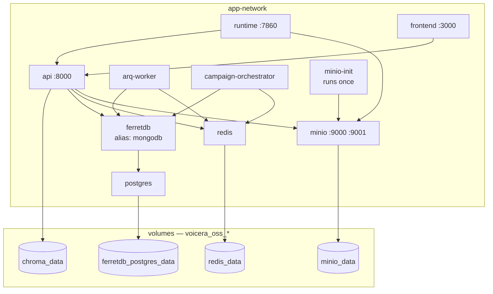

`docker-compose.yaml` at the repository root is the reference deployment: ten containers, four volumes, one network. This page explains each part and how to change it.

<Warning>
This stack is built for evaluation and development. It bind-mounts source, runs the API with `--reload`, allows all CORS origins, and ships default passwords. Read [Production deployment](production) before exposing it.
</Warning>

## Starting

```bash
make application-up
```

Use `make application-up` rather than a bare `docker compose up`. The compose file's own header says a bare `up` against a fresh checkout "will fail or come up misconfigured" — three services declare `${SECRET_KEY:?...}` and abort without it.

## The map



## Services

| Service | Image or build | Published | Command |
| --- | --- | --- | --- |
| `postgres` | `ghcr.io/ferretdb/postgres-documentdb:17-0.107.0-ferretdb-2.7.0` | — | default |
| `ferretdb` | `ghcr.io/ferretdb/ferretdb:2.7.0` | `27018:27017` | default |
| `api` | `apps/api/Dockerfile` | `8000:8000` | `uvicorn app.main:app --host 0.0.0.0 --port 8000 --reload` |
| `runtime` | `apps/runtime/Dockerfile` | `7860:7860` | default |
| `arq-worker` | `apps/api/Dockerfile` | — | `python -m arq app.tasks.arq.WorkerSettings` |
| `campaign-orchestrator` | `apps/api/Dockerfile` | — | `python -m app.services.campaign.campaign_orchestrator` |
| `frontend` | `frontend/Dockerfile` | `3000:3000` | `npm run start` |
| `redis` | `redis:7` | — | `redis-server --requirepass ...` |
| `minio` | `minio/minio:latest` | `9000`, `9001` | `server /data --console-address ":9001"` |
| `minio-init` | `minio/mc:latest` | — | creates the bucket, exits |

Three services build from **one image** (`apps/api/Dockerfile`) and differ only by `command`. See [Workers and orchestrator](../../developer/services/workers).

<Note>
`minio-init` exiting with code 0 is correct — it creates the bucket and stops. It is not a crash.
</Note>

## Volumes

| Volume | Holds | Losing it means |
| --- | --- | --- |
| `voicera_oss_ferretdb_postgres_data` | All documents | Everything gone |
| `voicera_oss_minio_data` | Recordings, transcripts, CSVs | Call artifacts gone |
| `voicera_oss_chroma_data` | RAG vectors | Re-ingest documents |
| `voicera_oss_redis_data` | Queue, events, slots | Safe to lose; in-flight batches interrupted |

<Warning>
`docker compose down -v` deletes all four at once. Back up before running it — see [Daily operations](../operator/operations).
</Warning>

## Network and the mongodb alias

One bridge network, `app-network`. The `ferretdb` service publishes the alias `mongodb`, so in-stack services connect to `mongodb:27017` and nothing refers to FerretDB by name. See [Data store](../../developer/reference/data-store).

## Environment precedence

Each service loads `env_file: .env`, then applies its own `environment:` block — **and `environment:` wins**. Some values are pinned there deliberately, because the in-network address differs from the host one:

| Variable | In `.env` | Forced in Compose |
| --- | --- | --- |
| `MONGODB_HOST` | `localhost` | `mongodb` |
| `MONGODB_PORT` | `27018` | `27017` |
| `API_BASE_URL` | `http://localhost:8000/api/v1` | `http://api:8000/api/v1` |
| `MINIO_ENDPOINT` | `localhost:9000` | `minio:9000` |

Editing these in `.env` has no effect inside the stack. That is intended.

<Note>
`DEBUG` is deliberately **not** interpolated into `environment:`. The compose file explains why: host shells often export `DEBUG=release`, which would override the boolean `False` from `.env`. It reaches containers through `env_file` only — so do not add `DEBUG: "${DEBUG}"`.
</Note>

Three variables have no default and abort the run if unset: `SECRET_KEY` on `api`, `arq-worker`, and `campaign-orchestrator`.

## Healthchecks and start order

| Service | Gate |
| --- | --- |
| `ferretdb` | waits for `postgres` **healthy** (`pg_isready`) |
| `api` | waits for `ferretdb` **started**, `redis` **healthy** |
| `arq-worker` | waits for `ferretdb` started, `redis` healthy, `api` started |
| `campaign-orchestrator` | waits for `ferretdb` started, `redis` healthy |
| `runtime` | waits for `api` started, `minio` **healthy** |

<Note>
`api` waits for FerretDB only to *start*, not to be ready. On a cold first boot it can attempt a query too early and log a connection error. `restart: unless-stopped` recovers it within seconds.
</Note>

## Overriding ports

Every published port reads from `.env`:

```bash
API_HOST_PORT=8080
RUNTIME_HOST_PORT=7870
FERRETDB_HOST_PORT=27019
MINIO_API_PORT=9010
MINIO_CONSOLE_PORT=9011
```

Container-side ports do not change. See [Ports and defaults](../../developer/reference/ports-and-defaults).

## Logs

Every service uses `json-file` with `max-size: 10m` and `max-file: 3` — about 30 MB per container, so logs cannot fill the disk.

```bash
docker compose logs -f api runtime
docker compose logs campaign-orchestrator --tail 100
```

## Common operations

```bash
# Status
make application-ps

# Restart one service after an .env change
docker compose up -d --force-recreate api

# Rebuild after a code change
docker compose up -d --build api runtime

# Stop, keep data
make application-down

# Stop and DELETE ALL DATA
make application-down ARGS="-- -v"
```

## Related

* [Production deployment](production)
* [Security hardening](security-hardening)
* [Services overview](../../developer/services/index)
* [Environment variables](../../developer/reference/environment-variables)
