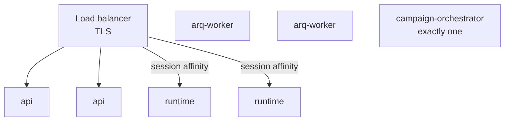

The reference Compose stack is built to start on the first try, not to be exposed. This page lists what is wrong with it for production and what to do instead.

## What the reference stack is not

Every item below is in `docker-compose.yaml` or `apps/api/app/main.py` today:

| Setting | Reference stack | Why it is a problem |
| --- | --- | --- |
| `uvicorn --reload` on `api` | Enabled | Watches files, uses more memory, restarts on any change |
| Source bind-mounts | `./apps` mounted into `api`, `arq-worker`, `campaign-orchestrator` | Those containers are not self-contained; the image is not what runs |
| CORS | `allow_origins=["*"]` with `allow_credentials=True` | Any origin can call the API with credentials |
| Passwords | `admin123`, `minioadmin123`, `redissecret` | Public knowledge |
| MinIO console | Published on `9001` | Admin UI exposed |
| TLS | None | Telephony providers require HTTPS and WSS |
| Replicas | One of each | No redundancy |

## Build real images

Drop the bind-mounts and the reload flag. Build tagged images, push them to a registry, and deploy those:

```bash
docker build -f apps/api/Dockerfile -t your-registry/voicera-api:1.0.0 .
docker build -f apps/runtime/Dockerfile -t your-registry/voicera-runtime:1.0.0 .
```

Run the API without `--reload`:

```bash
uvicorn app.main:app --host 0.0.0.0 --port 8000 --workers 4
```

## Reverse proxy and TLS

Put a proxy in front of both the API and the runtime. The runtime carries WebSocket audio, so the upgrade headers are mandatory:

```nginx
server {
    listen 443 ssl http2;
    server_name api.example.com;

    ssl_certificate     /etc/letsencrypt/live/api.example.com/fullchain.pem;
    ssl_certificate_key /etc/letsencrypt/live/api.example.com/privkey.pem;

    location / {
        proxy_pass http://127.0.0.1:8000;
        proxy_set_header Host              $host;
        proxy_set_header X-Real-IP         $remote_addr;
        proxy_set_header X-Forwarded-For   $proxy_add_x_forwarded_for;
        proxy_set_header X-Forwarded-Proto $scheme;
    }
}

server {
    listen 443 ssl http2;
    server_name voice.example.com;

    ssl_certificate     /etc/letsencrypt/live/voice.example.com/fullchain.pem;
    ssl_certificate_key /etc/letsencrypt/live/voice.example.com/privkey.pem;

    location / {
        proxy_pass http://127.0.0.1:7860;
        proxy_http_version 1.1;
        proxy_set_header Upgrade    $http_upgrade;
        proxy_set_header Connection "upgrade";
        proxy_set_header Host       $host;

        # Calls outlive default timeouts
        proxy_read_timeout  3600s;
        proxy_send_timeout  3600s;
    }
}
```

Then set `VOICE_SERVER_BASE_URL=https://voice.example.com` **before** creating telephony agents — see [Public voice URLs](public-voice-urls).

## Tighten CORS

`allow_origins=["*"]` with credentials is the reference default. Restrict it to the origins that actually call the API, in `apps/api/app/main.py`, and rebuild.

## Externalise the stores

The in-stack `postgres`, `redis`, and `minio` are conveniences. In production prefer managed or dedicated instances with their own backups, monitoring, and upgrade path:

| Store | Replace with |
| --- | --- |
| PostgreSQL | A managed Postgres with the DocumentDB extension, or a dedicated server. FerretDB still fronts it. |
| Redis | A managed Redis. Use `rediss://` for TLS — the ARQ settings enable TLS when the scheme is `rediss`. |
| MinIO | Any S3-compatible store, including S3 itself. |

## Scaling



| Component | Scales | How |
| --- | --- | --- |
| **API** | Freely | Stateless. All replicas need the same `SECRET_KEY`, or tokens fail across them. |
| **Runtime** | Freely, with care | One WebSocket per live call. Route with **session affinity** so a call's `/answer` and its audio reach the same instance. Drain before shutdown — restarting drops live calls. |
| **ARQ worker** | Freely | ARQ delivers each job to exactly one worker, and slot acquisition is atomic Lua. |
| **Campaign orchestrator** | **Not at all** | Run exactly one. |

<Warning>
Never run more than one campaign orchestrator. Its scheduling state (`_batch_in_progress`, `_processing_locks`, `_last_activity`) is in-memory, and it uses Redis **pub/sub**, which fans out to every subscriber. Two replicas would both schedule the next batch — dialling at twice the configured rate — and the completion sweep could mark a live campaign `completed`. Compose pins it implicitly via `container_name`.
</Warning>

## Sizing

Start here and measure:

| Concurrent calls | Runtime | API | Notes |
| --- | --- | --- | --- |
| Up to 10 | 1 × 2 vCPU / 4 GB | 1 × 2 vCPU / 4 GB | The default org limit is 10 |
| Up to 50 | 2–3 × 4 vCPU / 8 GB | 2 × 2 vCPU / 4 GB | Raise `DEFAULT_ORG_CONCURRENCY_LIMIT` |
| 50+ | Scale on measured CPU | 2+ | Model vendor rate limits usually bind first |

With cloud providers the runtime is mostly waiting on network, so it is rarely CPU-bound. Self-hosted models change the picture entirely — see [Running on GPUs](../../developer/model-server/gpu-operations).

## Secrets

Keep them out of `.env` on disk. Use your platform's secret manager and inject at runtime.

| Secret | Note |
| --- | --- |
| `SECRET_KEY` | Must be **identical** across API replicas |
| `INTERNAL_API_KEY` | Shared by API and runtime |
| `PROVIDER_AUTH_ENCRYPTION_KEY` | Back it up. Losing it orphans every stored credential, permanently. |
| Database, Redis, MinIO passwords | Change from the shipped defaults |

Every variable the stack reads, with defaults and which service consumes it, is in [Environment variables](../../developer/reference/environment-variables).

## Backups

Back up all three durable stores together — a database restored without its recordings is inconsistent:

```bash
docker exec voicera_oss_postgres pg_dump -U admin postgres | gzip > db.sql.gz
# plus MinIO contents and the Chroma volume
```

Redis is ephemeral. Store `PROVIDER_AUTH_ENCRYPTION_KEY` with the backup — the credentials are useless without it. See [Daily operations](../operator/operations).

## Upgrades

1. Back up all three stores.
2. Pull and build the new images.
3. Restart the API first — `initialize_database()` reconciles collections and indexes idempotently on startup.
4. Restart workers and the orchestrator.
5. Drain and restart runtimes last, so live calls finish.

There is no migration tool; schema is enforced by Pydantic at the edge.

## Checklist

- [ ] Images built and tagged; no bind-mounts, no `--reload` on `api`
- [ ] TLS on both the API and the runtime, with WebSocket upgrade
- [ ] `VOICE_SERVER_BASE_URL` set to the public host before creating agents
- [ ] CORS restricted
- [ ] All default passwords changed
- [ ] MinIO console not publicly reachable
- [ ] `SECRET_KEY` identical across API replicas
- [ ] `PROVIDER_AUTH_ENCRYPTION_KEY` backed up
- [ ] Exactly one campaign orchestrator
- [ ] Runtime behind session affinity
- [ ] Backups scheduled and a restore tested

## Related

* [Security hardening](security-hardening)
* [Public voice URLs](public-voice-urls)
* [Docker Compose](docker-compose)
* [Environment variables](../../developer/reference/environment-variables)
