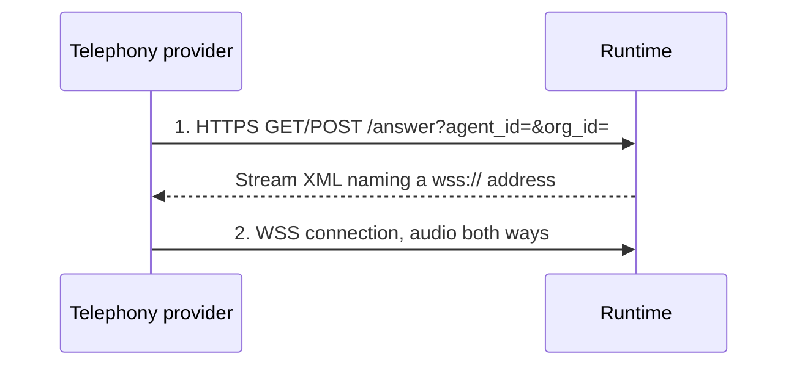

Real phone calls require your telephony provider to reach the runtime from the public internet. This page covers `VOICE_SERVER_BASE_URL`, what breaks when it is wrong, and how to proxy it correctly.

## Why a public URL is required

Two separate connections come **inbound** from your provider:



Neither is outbound, so NAT traversal and firewall punching do not help. The provider must resolve and reach your hostname.

## Setting it

```bash
# Local development only
VOICE_SERVER_BASE_URL=http://localhost:7860

# Production
VOICE_SERVER_BASE_URL=https://voice.example.com
```

One variable, used in two places:

| Used by | For |
| --- | --- |
| **API** | Builds the answer URL stored on the provider application when an agent is created |
| **Runtime** | Builds the `wss://` address inside the Stream XML it returns |

Both read the same value, so they cannot disagree.

## The one-way door

`build_answer_urls()` composes:

```text
{VOICE_SERVER_BASE_URL}/answer?agent_id={agent_id}&org_id={org_id}
```

and `create_application(agent_id, answer_url)` sends it to your provider **when the agent is created**.

<Warning>
Changing `VOICE_SERVER_BASE_URL` afterwards does **not** update agents that already exist. Your provider keeps calling the old URL, and those agents stop answering — with no error in VoicEra, because nothing reaches it.

Fix it per agent: `PATCH /api/v1/agents/{agent_id}` re-provisions the application against the current value, or delete and recreate the agent. Set the variable correctly **before** creating telephony agents.
</Warning>

VoicEra currently uses the same URL for answer and hangup.

## What breaks, and how it looks

| Symptom | Cause |
| --- | --- |
| `VOICE_SERVER_BASE_URL is not configured` on agent create | Unset. The API refuses rather than provisioning a broken application. |
| Provider reports the webhook failed | Hostname not resolvable, TLS invalid, or a firewall in the way |
| `/answer` succeeds, no audio | The provider could not open the WSS URL — usually a proxy not upgrading the connection |
| Stream XML names `localhost` | Still set to the development value |
| Agents created earlier stopped working | The base URL changed after creation — see above |

## Reverse proxy

The runtime serves HTTP and WebSocket on the same port, so one server block covers both — but the upgrade headers are mandatory:

```nginx
server {
    listen 443 ssl http2;
    server_name voice.example.com;

    ssl_certificate     /etc/letsencrypt/live/voice.example.com/fullchain.pem;
    ssl_certificate_key /etc/letsencrypt/live/voice.example.com/privkey.pem;

    location / {
        proxy_pass http://127.0.0.1:7860;

        # Required for the audio WebSocket
        proxy_http_version 1.1;
        proxy_set_header Upgrade    $http_upgrade;
        proxy_set_header Connection "upgrade";

        proxy_set_header Host              $host;
        proxy_set_header X-Real-IP         $remote_addr;
        proxy_set_header X-Forwarded-For   $proxy_add_x_forwarded_for;
        proxy_set_header X-Forwarded-Proto $scheme;

        # Calls outlive default timeouts
        proxy_read_timeout  3600s;
        proxy_send_timeout  3600s;
    }
}
```

Two defaults bite: without `proxy_http_version 1.1` and the `Upgrade`/`Connection` headers the WebSocket never establishes, and nginx's 60-second read timeout kills any call longer than a minute.

## Tunnels for local testing

<Tabs>
<Tab title="cloudflared">
```bash
cloudflared tunnel --url http://localhost:7860
```
</Tab>

<Tab title="ngrok">
```bash
ngrok http 7860
```
</Tab>
</Tabs>

Put the assigned HTTPS hostname in `VOICE_SERVER_BASE_URL`, restart the API and runtime, **then** create your telephony agents.

<Note>
Free tunnels get a new hostname every restart. Since the URL is baked in at agent-create time, recreate or `PATCH` your agents whenever the tunnel address changes.
</Note>

## Verifying

Check the runtime is reachable from outside:

```bash
curl -s https://voice.example.com/health
```

Then confirm the Stream XML names the public host:

```bash
curl -s -X POST \
  "https://voice.example.com/answer?agent_id=$AGENT_ID&org_id=$ORG_ID"
```

```xml
<Response>
  <Stream bidirectional="true">wss://voice.example.com/agent/ORG_ID/AGENT_ID</Stream>
</Response>
```

If that address says `localhost`, no real call will ever connect.

Finally, test the WebSocket upgrade itself:

```bash
curl -i -N \
  -H "Connection: Upgrade" -H "Upgrade: websocket" \
  -H "Sec-WebSocket-Version: 13" -H "Sec-WebSocket-Key: dGhlIHNhbXBsZSBub25jZQ==" \
  "https://voice.example.com/agent/$ORG_ID/$AGENT_ID"
```

`101 Switching Protocols` means the proxy is configured correctly. `200` or `400` means it is not upgrading.

## Security

<Warning>
`/answer` and `/agent/{org_id}/{agent_id}` have **no authentication** — they must be publicly reachable for telephony to work, and the runtime resolves everything from the path. Anyone who learns an org and agent id pair can open a pipeline session and consume your model credits.

Mitigate with rate limiting at the proxy, and IP-allowlist your provider's ranges where they publish them. See [Security hardening](security-hardening).
</Warning>

## Related

* [Telephony model](../concepts/telephony-model)
* [Telephony clients](../../developer/clients/telephony)
* [Troubleshooting telephony](../troubleshooting/telephony)
* [Production deployment](production)
* [Environment variables](../../developer/reference/environment-variables)
