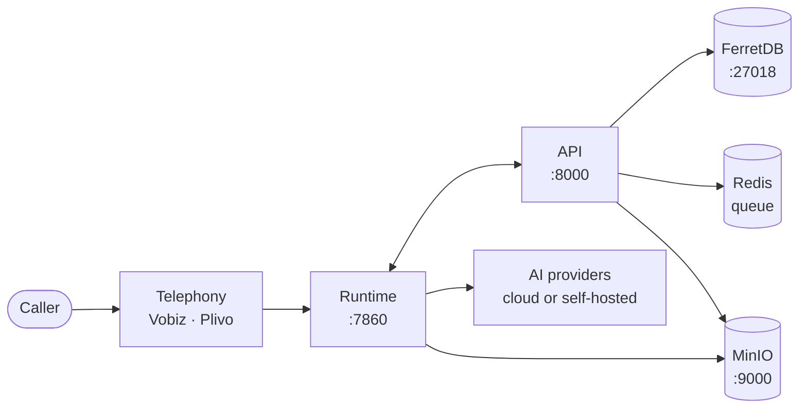

**VoicEra** is an open-source platform for building real-time conversational phone agents. It wires speech-to-text, large language models, text-to-speech, and telephony into one self-hosted stack, and gives you a REST API to drive it.

Use VoicEra to run inbound helplines, outbound calling campaigns, IVR replacements, and support hotlines — without building voice infrastructure yourself.

<Note>
New here? Read [What is VoicEra](introduction/what-is-voicera) for the plain-language overview, or go straight to the [Quickstart](quickstart/index) if you have Docker ready.
</Note>

## Browse the docs

VoicEra's documentation is split into three tabs across the top of this site.

<Tabs>
<Tab title="Guides">
**You are here.** Learn the system and run it day to day.

* [**Introduction**](introduction/index) — what VoicEra is and what it is for
* [**Quickstart**](quickstart/index) — empty machine to working agent, in five steps
* [**Using the dashboard**](dashboard/index) — no terminal, no code, just clicking through the web console
* [**Core concepts**](concepts/index) — architecture, pipeline, campaigns, providers
* [**Running VoicEra**](operator/running-a-campaign) — campaigns, documents, daily operations
* [**Deployment**](deployment/docker-compose) — Compose, production, hardening
* [**Troubleshooting**](troubleshooting/index) — symptom-first index
</Tab>

<Tab title="Developer">
Build on VoicEra, or extend it.

* [**Services**](../developer/services/index) — the containers and the packages they run
* [**Model server**](../developer/model-server/index) — self-hosted STT, TTS, and LLM
* [**Clients**](../developer/clients/index) — the surfaces anything connects through
* [**Contributing**](../developer/guides/local-setup) — local setup, adding providers, testing
* [**Configuration reference**](../developer/reference/environment-variables) — variables, ports, data model
* [**Dashboard**](../developer/frontend/index) — the Next.js console
</Tab>

<Tab title="API Reference">
Every route, extracted from source.

* [**Introduction**](../api-reference/overview) · [**Authentication**](../api-reference/authentication) · [**Errors**](../api-reference/errors)
* [**Agents**](../api-reference/agents) · [**Calls**](../api-reference/calls) · [**Campaigns**](../api-reference/campaigns)
* [**Phone numbers**](../api-reference/phone-numbers) · [**Knowledge and RAG**](../api-reference/knowledge-and-rag)
* [**Users and organisations**](../api-reference/users-and-orgs) · [**Provider credentials**](../api-reference/provider-auth)
* [**WebSocket API**](../api-reference/websocket-api) · [**Endpoints cheatsheet**](../api-reference/endpoints-cheatsheet)

A running API also serves an interactive console at `http://localhost:8000/docs`.
</Tab>
</Tabs>

## What you get

| Capability | What it does |
| --- | --- |
| **Real-time voice agents** | Sub-2-second STT → LLM → TTS loop built on [Pipecat](concepts/voice-pipeline). |
| **26 providers** | 22 cloud vendors — OpenAI, Deepgram, Cartesia, ElevenLabs, Sarvam, Groq, Azure, Google and more — plus the Bhashini and Kenpath adapters and two local providers, behind [one registry](../developer/reference/provider-registry). |
| **Self-hosted models** | Run STT, TTS, and LLM on your own GPUs via the [model server](../developer/model-server/overview). |
| **Telephony** | Inbound and outbound calls through [Vobiz or Plivo](concepts/telephony-model), provider-agnostic. |
| **Outbound campaigns** | CSV-driven [campaigns](concepts/campaigns) with retries, scheduling, circuit breakers, and concurrency limits. |
| **Knowledge base (RAG)** | Ground answers in your own documents. See [Knowledge base](concepts/knowledge-base-rag). |
| **Multi-tenant** | Organisations, [roles, and scoped access](../developer/reference/multi-tenancy) built in. |
| **Self-hosted** | One Docker Compose stack. Your data, your servers, your model keys. |

## Where to start

| If you are… | Start here |
| --- | --- |
| **Evaluating or demoing** | [Prerequisites](quickstart/prerequisites) → [Install and run](quickstart/install-and-run) → [Create your first agent](dashboard/create-an-agent) |
| **Not a developer, just want to run it** | [Using the dashboard](dashboard/index) — no terminal needed past the one-time install |
| **Running calls day to day** | [Operating via the API](../api-reference/recipes) → [Running a campaign](operator/running-a-campaign) |
| **Building or extending** | [Architecture](concepts/architecture) → [Local setup](../developer/guides/local-setup) → [REST API](../api-reference/overview) |
| **Deploying to production** | [Docker Compose](deployment/docker-compose) → [Public voice URLs](deployment/public-voice-urls) → [Security hardening](deployment/security-hardening) |

## The stack at a glance

Two services, three stores, one job queue, and your choice of AI providers. The full picture is in [Architecture](concepts/architecture).

## What VoicEra is not

VoicEra is **API-first**. Everything is driven by HTTP requests, and `/docs` gives you an interactive OpenAPI console. The bundled dashboard is a client of that same API.

<Note>
The Compose stack also starts a web dashboard on port 3000. See [Dashboard](../developer/frontend/overview).
</Note>

VoicEra also does not resell telephony or model capacity. You bring your own provider accounts, or you run the models yourself.

## Need help?

* Start with [Troubleshooting](troubleshooting/common-issues).
* Look up unfamiliar terms in the [Glossary](concepts/glossary).
* Read the [Contributing guide](../developer/guides/contributing-guide) before opening a pull request.
