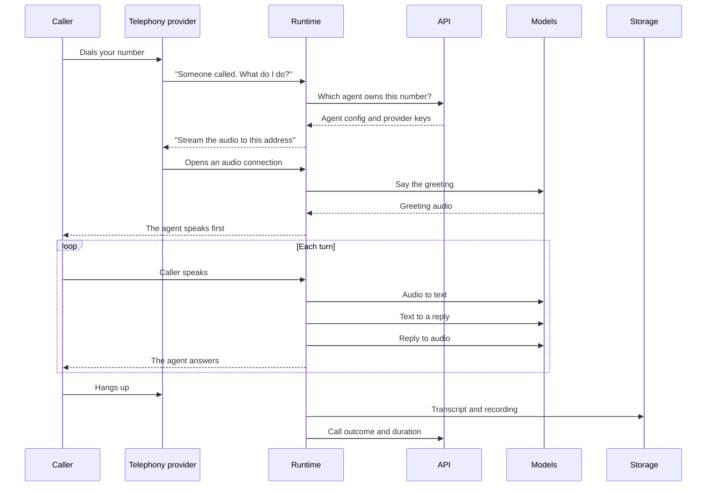

This page follows one call from the moment a phone rings to the moment the transcript lands in storage. It is the narrative version; [Data flow](../concepts/data-flow) has the rigorous diagrams and [Voice pipeline](../concepts/voice-pipeline) walks through how the pipeline itself is built.

## The four moving parts

| Part | Runs where | Job |
| --- | --- | --- |
| **Telephony provider** | Vobiz or Plivo, outside your network | Owns the number, bridges the phone network to the internet |
| **Runtime** | Your server, port `7860` | Holds the live conversation, one WebSocket per call |
| **API** | Your server, port `8000` | Holds configuration and credentials, records what happened |
| **Models** | A cloud vendor, or your own GPUs | Turn audio into text, text into a reply, and the reply into audio |

## A call, start to finish

### 1. The provider asks what to do

An inbound call triggers a webhook to the runtime's `/answer` endpoint, carrying the agent and organisation ids. The runtime replies with a small XML document naming the WebSocket address to stream audio to. Nothing about the conversation has happened yet — this is just the handshake.

### 2. The runtime loads the agent

Before answering, the runtime asks the API for the agent's configuration and the organisation's provider credentials. It has no standing credentials of its own: it authenticates with a shared internal key, receives a short-lived token, and gets back only what that organisation is entitled to. See [Provider credentials](../../developer/reference/provider-auth).

### 3. The pipeline starts

With config in hand, the runtime builds three services — speech-to-text, a language model, and text-to-speech — from the [provider registry](../../developer/reference/provider-registry), and assembles them into a Pipecat pipeline. Audio flows in one side, audio flows out the other.

The agent usually speaks first, with the greeting from its prompts.

### 4. Turn by turn

Each turn is the same loop, running continuously rather than in discrete steps:

* Speech-to-text emits words **while the caller is still talking**, so the agent is not waiting for silence.
* Voice activity detection decides when the caller has actually finished.
* The language model streams its reply token by token.
* Text-to-speech begins speaking before the full reply exists.

That overlap is what keeps the response at sub-2-second latency. If the caller interrupts, playback stops and the agent listens — see barge-in in [Voice pipeline](../concepts/voice-pipeline).

### 5. The call ends

When either side hangs up — or the agent decides it is done — the runtime writes the transcript and recording to object storage and tells the API how the call went. The call log is then queryable, and clients fetch artifacts through authenticated API routes rather than reaching into the bucket.

## Outbound calls

Outbound reverses only the first step. Something asks the API to place a call; the API checks the organisation is not already running its max number of simultaneous calls — a [concurrency slot](../../developer/reference/call-concurrency) — records the call, and asks the provider to dial. When the callee answers, the provider hits `/answer` and everything proceeds identically.

Campaigns are outbound calls at volume, with a queue, retries, and an automatic cutoff in front: once enough calls have been placed to judge, if too many of them are failing the campaign pauses itself instead of burning through the rest of the list. See [Campaigns](../concepts/campaigns).

## Where your data lives

Everything stays on infrastructure you control:

| Data | Where |
| --- | --- |
| Agents, users, call history, campaigns | FerretDB, on your PostgreSQL volume |
| Recordings and transcripts | MinIO, on your disk |
| Knowledge-base vectors | Chroma, on your disk |
| Provider credentials | FerretDB, Fernet-encrypted |

The only data that leaves your network is the audio and text sent to whichever model vendors you choose, one turn at a time. Run the [model server](../../developer/model-server/overview) on your own hardware and even that stays in-house.

## Where the models run

| Option | Trade-off |
| --- | --- |
| **Cloud providers** | Fastest to start, no hardware, per-minute cost, audio leaves your network |
| **Self-hosted** | Needs GPUs and setup, nothing leaves, fixed cost |
| **Mixed** | Self-host speech, use a cloud LLM, or the reverse |

The choice is per agent, and changing it is a configuration edit. You can also run the model server locally and call cloud providers at the same time — the mix is set per model slot, not all-or-nothing.

## Where next

* [Use cases](use-cases)
* [Install and run](../quickstart/install-and-run)
* [Architecture](../concepts/architecture)
* [Voice pipeline](../concepts/voice-pipeline)
