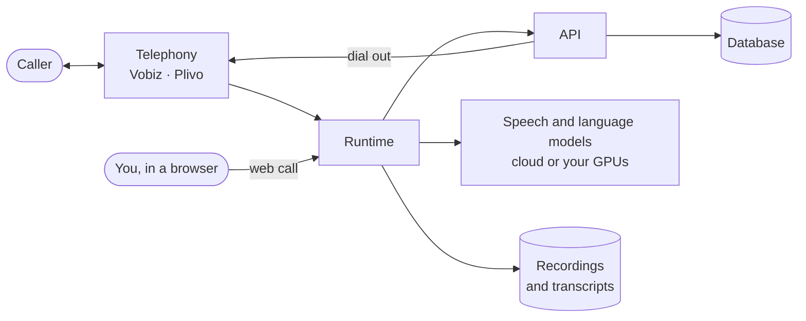

**VoicEra is software for running AI agents that answer and place phone calls.** You self-host it — on your own servers or in your own cloud account — connect a phone number, describe how the agent should behave, and it holds real conversations with callers.

It is aimed at organisations that need phone lines in multiple languages and want to keep the recordings, transcripts, and contact data on infrastructure they control.

## The problem it solves

Government departments, NGOs, and service providers often need phone lines that can:

* Answer many calls at once, in the caller's own language.
* Follow a script, or answer from a set of documents.
* Log who called, when, and what was said.
* Place outbound calls — reminders, surveys, follow-ups — to a list of numbers.

Hiring for that does not scale, and hosted voice-AI services mean sending citizen conversations to a third party. VoicEra is the middle path: the software is open source, and you decide where it runs and which models it calls.

## What you get

| Part | What it does |
| --- | --- |
| **API** | Everything you configure — agents, numbers, campaigns, documents, users. |
| **Runtime** | Runs the live conversation on each call: listen, think, speak. |
| **Model server** *(optional)* | Runs speech and language models on your own GPUs instead of calling a cloud vendor. |
| **FerretDB** | Stores agents, users, call history, and campaigns. |
| **MinIO** | Stores recordings and transcripts. |
| **Redis** | Drives campaign scheduling and caps how many calls run at once. |

You also bring two things VoicEra does not provide: a **telephony account** for real phone numbers, and either **model API keys** or **GPUs** to run models yourself — or both at once, mixed per model slot.

## What an agent is

An agent is a saved configuration, not a running process. It holds:

* **Prompts** — the system prompt and the greeting.
* **Behaviour** — how it handles interruptions, silence, and hold messages.
* **Models** — which speech-to-text, text-to-speech, and language model to use.
* **Language** — the primary language, and any secondary ones.
* **Knowledge** — documents it may answer from.

Agents come in two kinds. A **telephony** agent is reachable on a real phone number. A **websocket** agent is reachable from a browser, which is how you test without spending call minutes.

## How a call works

A call reaches the runtime one of three ways: a caller dials your number, the API dials out (a campaign, or a test call from the dashboard), or you open a call straight from the browser. From there the path is the same:

1. The runtime **listens** (speech-to-text), **decides what to say** (a language model), and **speaks** (text-to-speech) — turn after turn, at sub-2-second latency.
2. The transcript and recording are saved to your object store, whichever way the call started.

## Who it is for

| You are… | VoicEra gives you |
| --- | --- |
| **An organisation running a helpline** | Self-hosted phone agents with your data on your servers |
| **A developer** | A REST API and a provider system you can extend without forking |
| **An operations team** | Outbound campaigns with retries, scheduling, and safety limits |
| **A researcher or integrator** | An open stack you can point at your own models |

## What it is not

* **Not a hosted service.** You run it. There is no VoicEra cloud to sign up for.
* **Not a telephony carrier.** You bring a Vobiz or Plivo account.
* **Not a no-code product.** The core stack is API-first. A web dashboard exists — see [Frontend overview](../../developer/frontend/overview).
* **Not a model provider.** You supply API keys or hardware.

## Where next

* [How it works](how-it-works) — the call path in more detail
* [Use cases](use-cases) — what people build with it
* [Prerequisites](../quickstart/prerequisites) — what you need before installing
* [Architecture](../concepts/architecture) — the engineering view
