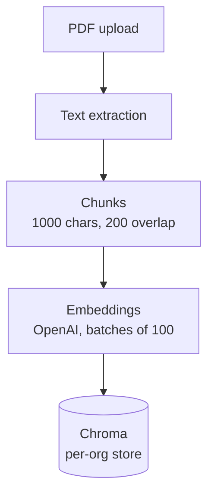

Knowledge documents ground an agent's answers in your own PDFs. This page covers the whole lifecycle over the API: upload, check ingest status, attach to an agent, and delete.

<Note>
Prefer clicking? [Upload a document](../dashboard/everyday-tasks#upload-a-document) covers this same workflow from the dashboard's **Knowledge Base** screen — no `curl` required. This page uses HTTP throughout, which is the complete surface and what you want for scripting.
</Note>

## What a knowledge document is

One uploaded PDF, plus everything derived from it. Uploading creates three things:

| Where | What | Lifetime |
| --- | --- | --- |
| FerretDB, `KnowledgeDocuments` | Metadata: `document_id`, `status`, `chunk_count`, `embedding_model`, `storage_key`. | Until deleted |
| MinIO | The original PDF under the org's prefix in the `voicera-calls` bucket. | Until deleted |
| Chroma | The embedded chunks, in a per-organisation store under `CHROMA_BASE_DIR`. | Until deleted |

The store directory is named by a SHA-256 hash of the `org_id`, so one organisation cannot read another's vectors. Ingest runs as a FastAPI background task, so the upload request returns immediately and the document ripens from `processing` to `ready` afterwards.



Chunking and batching are `DEFAULT_CHUNK_SIZE` 1000, `DEFAULT_OVERLAP` 200, and `DEFAULT_BATCH_SIZE` 100 in `apps/api/app/rag/ingest_pipeline.py`. They are function defaults, not environment variables — changing them means changing the code.

## Upload

Multipart POST, one PDF per request.

```bash
export API=http://localhost:8000
export TOKEN=YOUR_JWT

curl -X POST "$API/api/v1/knowledge/upload" \
  -H "Authorization: Bearer $TOKEN" \
  -F "file=@handbook.pdf"
```

```json
{
  "document_id": "YOUR_DOCUMENT_ID",
  "org_id": "YOUR_ORG_ID",
  "original_filename": "handbook.pdf",
  "status": "processing"
}
```

`201` with `status: "processing"` means the file is stored and ingest is scheduled. It does not mean the document is searchable yet. Poll the list route until `status` is `ready`. Failure codes are in [Knowledge and RAG](../../api-reference/knowledge-and-rag#post-knowledgeupload).

Ingest failures never surface as an HTTP error, because ingest happens after the response. They land on the document as `status: "failed"` with an `error_message`. The ones you will see:

| `error_message` | Cause |
| --- | --- |
| `KB_EMBEDDING_API_KEY is not configured.` | The global embedding key is unset. |
| `No extractable text (empty or image-only PDF).` | A scanned PDF with no text layer. VoicEra does not run OCR. |
| `The embedding API key is not valid. Update KB_EMBEDDING_API_KEY and retry.` | The key was rejected by OpenAI. |

## List

```bash
curl "$API/api/v1/knowledge" -H "Authorization: Bearer $TOKEN"
```

```json
[
  {
    "document_id": "YOUR_DOCUMENT_ID",
    "org_id": "YOUR_ORG_ID",
    "original_filename": "handbook.pdf",
    "status": "ready",
    "chunk_count": 42,
    "embedding_model": "text-embedding-3-small",
    "storage_key": "…",
    "error_message": null,
    "created_at": "2026-09-01T10:00:00+00:00",
    "updated_at": "2026-09-01T10:00:14+00:00"
  }
]
```

The path has **no trailing slash** — `/api/v1/knowledge`, not `/api/v1/knowledge/`. `status` is one of `processing`, `ready`, or `failed`. `chunk_count` is populated only once ingest succeeds; `error_message` only when it failed. There is no single-document GET route and no pagination — the list returns every document in the organisation.

## Delete

```bash
curl -X DELETE "$API/api/v1/knowledge/YOUR_DOCUMENT_ID" \
  -H "Authorization: Bearer $TOKEN"
```

```json
{"deleted": true}
```

Delete removes the Chroma vectors first and the metadata row second. If the Chroma delete fails, the metadata row is **kept** and the route returns `500` — deliberately, so you never end up with orphaned vectors that no document row can name. Retry the delete rather than deleting the row by hand.

`404 Document not found` means no document with that id in your organisation.

<Note>
Deleting a document does not update agents that reference it. An agent whose `config.knowledge_base.document_ids` still names a deleted document keeps working — retrieval simply finds nothing for that id. Update the agent as well.
</Note>

## Attaching to an agent

Retrieval only happens for agents that ask for it. The attachment lives in `config.knowledge_base` on the agent, defined by `AgentKnowledgeBase` in `apps/api/app/models/schemas.py`.

| Field | Type | Default | Range |
| --- | --- | --- | --- |
| `enabled` | bool | `false` | — |
| `mode` | string | `"context"` | `tool` or `context` |
| `document_ids` | list of strings | `[]` | Empty means every ready document in the organisation. |
| `top_k` | int | `5` | 1–10 |

Attach on an existing agent with a PATCH:

```bash
curl -X PATCH "$API/api/v1/agents/YOUR_AGENT_ID" \
  -H "Authorization: Bearer $TOKEN" \
  -H 'Content-Type: application/json' \
  -d '{
    "config": {
      "knowledge_base": {
        "enabled": true,
        "mode": "context",
        "document_ids": ["YOUR_DOCUMENT_ID"],
        "top_k": 5
      }
    }
  }'
```

`top_k` is clamped again at both ends of the wire: `KnowledgeRetrieveRequest` bounds it 1–10, the runtime clamps it to the same range, and the retrieval service clamps it a third time. Values outside the range are corrected, not rejected.

## Retrieval modes

The two modes differ in **who decides to search**, and the difference is audible on a call.

<Tabs>
<Tab title="context">
The default. Before each LLM turn, the runtime takes the caller's last utterance verbatim, retrieves against it, and rewrites that message in the context with the excerpts folded in. After the assistant's turn ends the original message is restored, so excerpts do not accumulate across the conversation.

Every turn costs one embedding call and one Chroma query. If retrieval returns nothing, the raw user text is used unchanged — the turn still happens.

Pick this when the documents are the subject of the call and nearly every turn needs them.
</Tab>

<Tab title="tool">
The runtime registers a `search_knowledge_base` function on the LLM and lets the model call it when it judges the question needs a document. The tool takes a natural-language `query` — which may differ from what the caller said — and returns `{query, excerpts, total_results}`.

No retrieval happens on turns the model does not ask for, so latency on ordinary turns is unaffected. In exchange, the model can decline to search when it should have.

Pick this when documents answer a minority of questions, and requires an LLM that supports tool calling.
</Tab>
</Tabs>

Both modes call the same retrieval path: `POST /api/v1/rag/retrieve`, authenticated with `X-API-Key` rather than a JWT, because the runtime is a service and not a user. That route is not for operators — it takes an explicit `org_id` in the body and is documented in [Knowledge base (RAG)](../concepts/knowledge-base-rag).

Retrieval scoping: when `document_ids` is set, the query asks Chroma for up to four times `top_k` candidates (capped at 25) and then filters to the named documents, so narrowing to one document still returns a full set of hits. An empty `document_ids` list on the retrieve request returns zero chunks; omitting the field searches everything.

## Limits

| Limit | Value | Where |
| --- | --- | --- |
| File type | PDF only | `apps/api/app/routers/knowledge.py` rejects any other extension |
| Text layer | Required | `No extractable text` on image-only PDFs; there is no OCR step |
| Upload size | `KB_MAX_UPLOAD_BYTES`, default 25 MiB | `apps/api/app/config.py` |
| Chunk size / overlap | 1000 / 200 characters | `apps/api/app/rag/ingest_pipeline.py`, not configurable by env |
| Embedding batch | 100 chunks per request | Same file |
| `top_k` | 1–10 | Clamped in three places |
| Embeddings provider | OpenAI only | `ingest_pipeline.py` constructs an `OpenAI` client directly |

Two environment variables are required for anything to work:

| Variable | Default | Effect when unset |
| --- | --- | --- |
| `KB_EMBEDDING_API_KEY` | empty | Ingest marks documents `failed`; retrieval raises `500`. |
| `KB_EMBEDDING_MODEL` | `text-embedding-3-small` | Has a working default, so it rarely needs setting. |

<Warning>
`KB_EMBEDDING_API_KEY` is a **single global key**, not per-organisation. Every tenant's documents are embedded through the same OpenAI account, and `apps/api/app/config.py` describes it as temporary. Treat it accordingly on a multi-tenant deployment.
</Warning>

Changing `KB_EMBEDDING_MODEL` after documents exist does not re-embed them. Old chunks keep their original embeddings while new queries are embedded with the new model, and comparing across two embedding spaces gives meaningless distances. Re-upload every document after a model change.

Chroma is embedded in the API process, not a separate service. It persists to the `voicera_oss_chroma_data` volume, which must be in your backup set — see [Daily operations](operations).

## Related

* [Knowledge base (RAG)](../concepts/knowledge-base-rag)
* [Agent configuration](../../developer/reference/agent-configuration)
* [Environment variables](../../developer/reference/environment-variables)
* [Operating via the API](../../api-reference/recipes)
