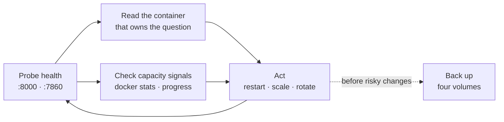

Keeping a running VoicEra stack healthy: what to probe, which logs answer which question, what to back up, and how to bring it back. Everything here assumes the reference [Docker Compose](../deployment/docker-compose) stack.

The loop this page describes:



## Health endpoints

Three health endpoints, none of them authenticated.

| Service | Endpoint | Returns |
| --- | --- | --- |
| API | `GET http://localhost:8000/health` | `{"status": "ok"\|"degraded", "database": "up"\|"down"}` |
| Runtime | `GET http://localhost:7860/health` | `{"status": "ok", "service": "voicera-runtime"}` |
| Model-server gateway | `GET http://localhost:8100/health` | `{"status": "healthy"\|"degraded", "upstreams": {…}}` |

```bash
curl http://localhost:8000/health
curl http://localhost:7860/health
```

The API's handler in `apps/api/app/main.py` pings FerretDB on every request. `degraded` means the process is alive but the database is unreachable — the API answers, and every route that touches data fails. Treat `degraded` as down.

The runtime's handler is a **static response**. It confirms the process is serving HTTP and nothing else: it does not check the API, MinIO, or any AI provider. A runtime returning `ok` can still fail every call. To test the path that matters, hit the answer webhook, which does reach the API to load the agent:

```bash
curl 'http://localhost:7860/answer?agent_id=YOUR_AGENT_ID&org_id=YOUR_ORG_ID'
```

Expect XML containing a `<Stream>` URL. An error here is a real fault; `/health` would not have shown it.

The gateway reports `degraded` when a deployed slot's upstream fails its check, and names which one in `upstreams`. It is a separate Compose project — see [Overview](../../developer/model-server/overview).

Compose's own healthchecks cover only `postgres`, `minio`, and `redis`. `api`, `runtime`, `arq-worker`, and `campaign-orchestrator` have **no** `healthcheck:` block, so `docker compose ps` shows them as running whether or not they are working. Probe them yourself:

```bash
make application-ps
```

## Which logs matter

Every long-lived service uses the `json-file` driver with `max-size: 10m` and `max-file: 3` — 30 MB per container, then the oldest file is dropped. That rotation is set on `postgres`, `ferretdb`, `api`, `minio`, `redis`, `arq-worker`, `campaign-orchestrator`, and `runtime`.

<Tip>
30 MB of rotation is roughly a day on a busy stack. A log line older than that is gone. Ship logs off the host before you need to investigate an incident from last week.
</Tip>

| Question | Container | Command |
| --- | --- | --- |
| Did an API request fail, and why? | `api` | `docker compose logs -f api` |
| Why did a call sound wrong or drop? | `runtime` | `docker compose logs -f runtime` |
| Why is a campaign not dialling? | `arq-worker` | `docker compose logs -f arq-worker` |
| Why did a campaign pause or complete early? | `campaign-orchestrator` | `docker compose logs -f campaign-orchestrator` |
| Is the database reachable? | `ferretdb`, `postgres` | `docker compose logs ferretdb postgres` |
| Did an artifact upload fail? | `minio` | `docker compose logs minio` |

Campaigns need both worker containers, and they answer different questions. The orchestrator decides *when* a batch runs; the ARQ worker *runs* it. A campaign stuck at zero progress is usually the worker; a campaign that stopped mid-list is usually the orchestrator. See [Workers and orchestrator](../../developer/services/workers).

For a live call, follow both sides at once — the runtime logs the pipeline, the API logs what the runtime asked it for:

```bash
docker compose logs -f runtime api
```

Turn up verbosity by setting `DEBUG=true` in the root `.env` and recreating the stack. `DEBUG` reaches the API through `env_file` only and is deliberately not interpolated in `docker-compose.yaml`; the reason is in [Environment variables](../../developer/reference/environment-variables).

## Backups

VoicEra keeps state in **four** places. A backup that covers fewer than four is incomplete.

| Store | Volume | Holds | Recreatable? |
| --- | --- | --- | --- |
| PostgreSQL (behind FerretDB) | `voicera_oss_ferretdb_postgres_data` | Users, organisations, agents, phone numbers, provider credentials, call logs, campaigns. | No |
| MinIO | `voicera_oss_minio_data` | Recordings, transcripts, campaign CSVs, knowledge PDFs. | No |
| Chroma | `voicera_oss_chroma_data` | Knowledge-base embeddings. | Yes, by re-uploading every PDF — at the cost of re-embedding. |
| Redis | `voicera_oss_redis_data` | ARQ job queue, campaign events, concurrency slots, circuit-breaker windows. | Mostly. Losing it drops in-flight jobs. |

Back up the database logically, through `pg_dump` against the `voicera_oss_postgres` container — not by copying the volume of a running Postgres:

```bash
docker exec voicera_oss_postgres \
  pg_dump -U admin -d postgres -Fc \
  > voicera-postgres-$(date +%F).dump
```

Use `-Fc` (custom format); it restores selectively and compresses. Substitute your own `MONGODB_USER` for `admin` if you changed it — Compose reuses that value as `POSTGRES_USER`.

MinIO copies out with the `mc` client, using the same image the stack already pulls:

```bash
docker run --rm --network voicera_app-network \
  -v "$PWD/minio-backup:/backup" \
  minio/mc:latest sh -c \
  "mc alias set src http://minio:9000 minioadmin minioadmin123 && \
   mc mirror --overwrite src/voicera-calls /backup"
```

Check the network name with `docker network ls` — Compose prefixes `app-network` with the project name, which defaults to the directory name.

Chroma and Redis are file trees; copy them with a throwaway container while the stack is stopped:

```bash
docker run --rm \
  -v voicera_oss_chroma_data:/data:ro \
  -v "$PWD:/backup" \
  alpine tar czf /backup/chroma-$(date +%F).tar.gz -C /data .
```

Same command with `voicera_oss_redis_data` for Redis. Redis is worth capturing mainly so a restore does not resurrect stale queue entries; if you are willing to lose in-flight campaign batches, you can skip it and let the queue rebuild.

<Warning>
`docker compose down -v` deletes **all four volumes**: your database, every recording and transcript, every knowledge embedding, and the queue. There is no undo and no confirmation prompt. Use `make application-down` (which runs `docker compose down` without `-v`) unless you specifically intend to destroy the data.
</Warning>

## Restoring

Restore into a stack whose stores are running but whose application containers are stopped, so nothing writes underneath you.

```bash
docker compose up -d postgres ferretdb minio redis
```

PostgreSQL, from a `-Fc` dump:

```bash
docker exec -i voicera_oss_postgres \
  pg_restore -U admin -d postgres --clean --if-exists \
  < voicera-postgres-2026-09-01.dump
```

MinIO, mirroring back:

```bash
docker run --rm --network voicera_app-network \
  -v "$PWD/minio-backup:/backup" \
  minio/mc:latest sh -c \
  "mc alias set dst http://minio:9000 minioadmin minioadmin123 && \
   mc mirror --overwrite /backup dst/voicera-calls"
```

Chroma, with the whole stack down:

```bash
docker run --rm \
  -v voicera_oss_chroma_data:/data \
  -v "$PWD:/backup" \
  alpine sh -c "rm -rf /data/* && tar xzf /backup/chroma-2026-09-01.tar.gz -C /data"
```

Then bring the rest up and verify:

```bash
make application-up
curl http://localhost:8000/health
```

<Warning>
Restoring a database backup without the **matching `PROVIDER_AUTH_ENCRYPTION_KEY`** gives you rows you cannot read. Provider credentials are Fernet-encrypted with that key; a restore under a different key leaves every `ProviderAuth` blob permanently undecryptable and every telephony and model call failing. Back the key up alongside the dump, and treat losing it as losing the credentials.
</Warning>

## Rotating secrets

Three generated secrets, three very different rotation stories.

| Secret | Rotating it costs | Procedure |
| --- | --- | --- |
| `SECRET_KEY` | Every issued JWT is invalidated. Users log in again. | Change it in `.env`, `docker compose up -d api arq-worker campaign-orchestrator`. Safe. |
| `INTERNAL_API_KEY` | The runtime cannot reach service routes until it also has the new value. | Change it in `.env`, then recreate **both** sides together — it is set on `api`, `arq-worker`, and `runtime`. |
| `PROVIDER_AUTH_ENCRYPTION_KEY` | **Every stored provider credential becomes unreadable.** | Re-enter every credential through `POST /api/v1/auth` after rotating. Plan the downtime. |

Rotating the Fernet key has no migration path in the code: `apps/api/app/services/secret_crypto.py` decrypts with exactly one key and raises `Failed to decrypt ProviderAuth credentials` for anything the current key cannot open. To rotate deliberately, export the credentials you need first (`GET /api/v1/auth/{provider}` returns secrets unmasked to an admin), change the key, restart, and re-upsert.

Infrastructure passwords — `MONGODB_PASSWORD`, `MINIO_ROOT_PASSWORD`, `REDIS_PASSWORD` — need coordinated changes because Compose interpolates each into more than one place. `MONGODB_PASSWORD` is also `POSTGRES_PASSWORD`, and changing it against an initialised Postgres volume does not change the existing database user. `REDIS_PASSWORD` is the easy one: Compose rebuilds `REDIS_URL` from it, so changing it and recreating is enough. Details in [Security hardening](../deployment/security-hardening).

## Capacity signals

VoicEra exposes no metrics endpoint. Capacity is read from the API, from Docker, and from the logs.

| Signal | Where | What it means |
| --- | --- | --- |
| Concurrent calls versus `DEFAULT_ORG_CONCURRENCY_LIMIT` | `.env`, default 10 | The ceiling on simultaneous calls per organisation. A campaign that never reaches its `max_concurrency` is being held here. |
| Campaign `processed_rows` rate | `GET /api/v1/campaign/{id}/progress` | Flat while `state` is `running` means slots, worker, or schedule window. |
| Runtime CPU | `docker stats voicera_oss_runtime` | Each live call is one WebSocket and one Pipecat pipeline in **one** container. This saturates first. |
| API CPU and memory | `docker stats voicera_oss_api` | The API also does RAG ingest in-process, so a large PDF upload shows here. |
| Redis memory | `docker compose exec redis redis-cli -a redissecret INFO memory` | Queue depth and circuit-breaker windows. Steady growth means jobs are not being consumed. |
| MinIO disk | `docker system df -v` | Recordings dominate. Nothing prunes them — there is no retention policy in the code. |
| Postgres volume size | `docker system df -v` | Call logs grow without bound. |

Scale in this order, because it matches where the load actually lands: runtime first (one WebSocket per live call), then the ARQ worker, then the API. The campaign orchestrator does **not** scale — see [Production deployment](../deployment/production).

Neither recordings nor call logs are ever deleted by VoicEra. Budget disk for the full retention you intend, and prune deliberately.

## Restart and recovery

Routine restart, preserving all data:

```bash
make restart
```

`make restart` runs `application-down` then `application-up`. `application-down` runs `docker compose down` with no `-v`, so the volumes survive. `application-up` ensures the three secrets exist in `.env` before starting, which is why it is preferred over a bare `docker compose up`.

Restarting one service in place, without touching the others:

```bash
docker compose restart api
docker compose up -d --build api
```

Use `restart` after an environment change that the container reads at runtime; use `up -d --build` after a code or Dockerfile change.

What survives a restart, and what does not:

| Survives | Lost |
| --- | --- |
| Everything in the four volumes | Live calls — each is a WebSocket held by the runtime process |
| Queued ARQ jobs (Redis is persisted) | The orchestrator's in-memory `_batch_in_progress` and `_last_activity` state |
| Campaign state in the database | |

Losing the orchestrator's in-memory state is recoverable by design: the completion monitor runs every 60 seconds, re-reads every `running` campaign from the database, and falls back to `last_activity_at`, `last_batch_scheduled_at`, or `started_at` when it has no in-memory record. A campaign interrupted by a restart resumes within about a minute without intervention.

Recovery checks after any restart:

```bash
make application-ps
curl http://localhost:8000/health
curl http://localhost:7860/health
curl -s "$API/api/v1/campaign/" -H "Authorization: Bearer $TOKEN"
```

Confirm every campaign you expect to be `running` still is. One that was `paused` by the circuit breaker before the restart stays `paused` — that state is in the database, and only `POST /{campaign_id}/resume` clears it.

If the API will not start, read its logs first. The failure is almost always one of: `SECRET_KEY` missing (Compose refuses to interpolate and the stack never starts), FerretDB not yet accepting connections, or a startup exception from `initialize_database`, which is raised and logged before the process exits.

## Related

* [Docker Compose](../deployment/docker-compose)
* [Production deployment](../deployment/production)
* [Security hardening](../deployment/security-hardening)
* [Ports and defaults](../../developer/reference/ports-and-defaults)
* [Deployment troubleshooting](../troubleshooting/deployment)
