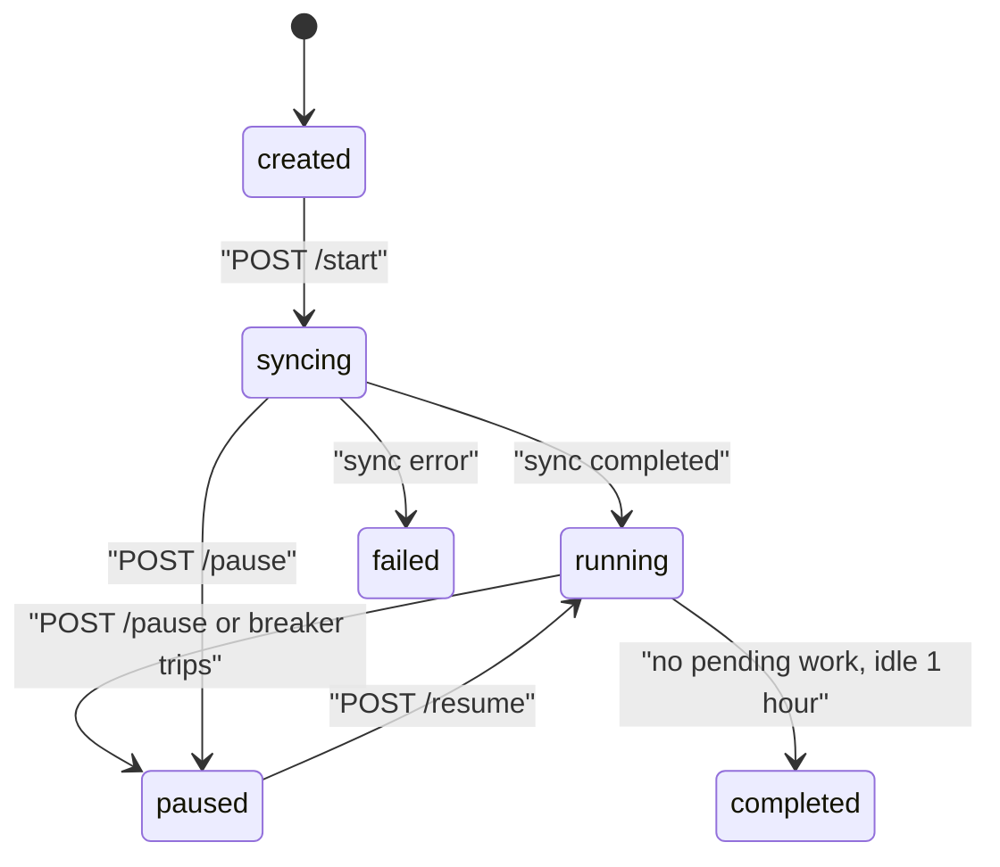

A campaign dials a list of contacts with one telephony agent, under a concurrency ceiling, with retries and a circuit breaker. This page runs one end to end with `curl`, from CSV to downloaded report.

<Note>
Prefer clicking? [Run a calling campaign](../dashboard/run-a-campaign) covers this same workflow from the dashboard's **Batches** screen — no `curl` required. This page drives the same endpoints over HTTP, which is what you want for scripting and scheduling. See also [Dashboard tour](../../developer/frontend/dashboard-tour).
</Note>

## Before you start

Four things must exist before `POST /api/v1/campaign/create` will succeed. The API checks each one and returns a specific error if it is missing.

| Prerequisite | Checked by | Failure |
| --- | --- | --- |
| A JWT with an active organisation | `_require_org` in `apps/api/app/routers/campaign.py` | `400 No active organisation in token` |
| An agent with `agent_category: "telephony"` | `_validate_telephony_agent` | `422 Campaign requires a telephony agent` |
| A phone number attached to that agent | `_count_agent_from_numbers` | `422 Attach a phone number to this agent before creating a campaign` |
| `max_concurrency` at or below the org limit | `_validate_max_concurrency` | `400 max_concurrency (N) cannot exceed org limit (M)` |

The organisation limit comes from `DEFAULT_ORG_CONCURRENCY_LIMIT`, default `10`, clamped to a minimum of `1` in `apps/api/app/constants/campaign.py`.

Set a token and the API base once:

```bash
export API=http://localhost:8000
export TOKEN=$(curl -s -X POST "$API/api/v1/users/login" \
  -H 'Content-Type: application/json' \
  -d '{"email":"you@example.com","password":"YOUR_PASSWORD"}' \
  | python3 -c 'import sys,json; print(json.load(sys.stdin)["access_token"])')
```

Creating the agent and attaching the number are covered in [Operating via the API](../../api-reference/recipes).

## The contact CSV

The CSV contract is enforced by `CampaignSourceSyncService.validate_source_data` in `apps/api/app/services/campaign/source_sync.py`.

| Rule | Detail |
| --- | --- |
| Header row required | The file must have a header row and at least one data row. |
| `phone_number` column required | Header names are lowercased and stripped before matching, so `Phone_Number` works. |
| Every number starts with `+` | Country code is mandatory. Offending row numbers are listed in the error. |
| No duplicate numbers | Duplicate rows are rejected, with the row numbers listed. |
| Every other column becomes a variable | `build_context_variables` zips the headers against the row and stores the result as the run's `context_variables`. |

Rows with a blank `phone_number` are skipped at sync time rather than rejected at validation time.

```csv
phone_number,customer_name,account_id
+919876543210,Asha,ACC-1001
+919876543211,Ravi,ACC-1002
+919876543212,Meera,ACC-1003
```

`customer_name` and `account_id` reach the agent as call-time variables. Declare matching keys in the agent's `config.custom_variables` so the prompt can reference them — see [Agent configuration](../../developer/reference/agent-configuration).

## Upload

Upload is a multipart POST to `/api/v1/campaign/upload`. It stores the file in MinIO and validates it in one call.

```bash
curl -X POST "$API/api/v1/campaign/upload" \
  -H "Authorization: Bearer $TOKEN" \
  -F "file=@contacts.csv"
```

```json
{
  "source_id": "campaigns/YOUR_ORG_ID/3f9c…_contacts.csv",
  "filename": "contacts.csv",
  "contact_rows": 3
}
```

`contact_rows` counts data rows that carry a non-empty `phone_number`. Keep `source_id` — it is the MinIO object key you pass to create.

| Response | Meaning |
| --- | --- |
| `400 Only CSV files are allowed` | The filename does not end in `.csv`. |
| `400 Empty file` | Zero bytes uploaded. |
| `413` | Larger than `CAMPAIGN_MAX_CSV_BYTES`, default 5 MiB. |
| `400` with a validation message | The CSV failed one of the rules above. Nothing is created; fix and re-upload. |
| `502 Failed to store CSV` | MinIO rejected the write. Check the `minio` service. |

<Note>
The path is `/api/v1/campaign/upload`. There is no `/upload-csv` route.
</Note>

## Create the campaign

```bash
curl -X POST "$API/api/v1/campaign/create" \
  -H "Authorization: Bearer $TOKEN" \
  -H 'Content-Type: application/json' \
  -d '{
    "name": "October outreach",
    "agent_id": "YOUR_AGENT_ID",
    "source_type": "csv",
    "source_id": "campaigns/YOUR_ORG_ID/3f9c…_contacts.csv",
    "rate_limit_per_second": 1,
    "max_concurrency": 5,
    "from_number": "+919000000000"
  }'
```

The campaign is created in state `created`. It does not dial until you start it. Full field bounds and defaults are in [Campaigns](../../api-reference/campaigns#post-campaigncreate).

## Retry, schedule, concurrency and circuit breaker

<Note>
`max_concurrency`, `schedule_config`, and `circuit_breaker` are **request fields at the top level of the create body**, but the API nests them inside `orchestrator_metadata` on the stored document. Read them back from `orchestrator_metadata`, not from the top level of the response. Only `retry_config` is stored as its own top-level field.
</Note>

### Retry

`retry_config` governs whether a failed contact is queued again. Field bounds and defaults are in [Campaigns](../../api-reference/campaigns#post-campaigncreate).

A retry is a new queued run with `retry_count` incremented and `is_retry`, `retry_attempt`, and `retry_reason` merged into its context variables, so the prompt can tell a redial from a first attempt.

### Schedule

`schedule_config` confines dialling to weekly windows. When `enabled` is `false` or `slots` is empty, the campaign dials at any hour.

```json
{
  "enabled": true,
  "timezone": "Asia/Kolkata",
  "slots": [
    {"day_of_week": 0, "start_time": "10:00", "end_time": "18:00"},
    {"day_of_week": 1, "start_time": "10:00", "end_time": "18:00"}
  ]
}
```

`day_of_week` is 0 for Monday through 6 for Sunday. Times are `HH:MM` and compared as strings against the current time in `timezone`, with the window half-open — `start_time` inclusive, `end_time` exclusive. An unrecognised timezone falls back to "always in schedule" rather than failing.

Outside a window the orchestrator declines to schedule the next batch. The campaign stays `running` and resumes at the next window without any action from you.

### Concurrency

`max_concurrency` is this campaign's ceiling on simultaneous live calls, enforced by the dispatcher as a `campaign:{campaign_id}` scope on top of the organisation's slot pool. `rate_limit_per_second` throttles how fast new calls are placed. See [Call concurrency and rate limiting](../../developer/reference/call-concurrency).

The orchestrator dispatches in batches of `CAMPAIGN_BATCH_SIZE`, default `10`, set on the `campaign-orchestrator` service in `docker-compose.yaml`.

### Circuit breaker

The breaker pauses a campaign that is failing broadly, so a bad number range or a dead provider does not burn the whole list. Field bounds and defaults are in [Campaigns](../../api-reference/campaigns#post-campaigncreate).

The counts live in Redis sorted sets keyed per campaign and are evaluated in a Lua script, so the check is atomic across workers.

A full create body with every block:

```bash
curl -X POST "$API/api/v1/campaign/create" \
  -H "Authorization: Bearer $TOKEN" \
  -H 'Content-Type: application/json' \
  -d '{
    "name": "October outreach",
    "agent_id": "YOUR_AGENT_ID",
    "source_type": "csv",
    "source_id": "campaigns/YOUR_ORG_ID/3f9c…_contacts.csv",
    "rate_limit_per_second": 2,
    "max_concurrency": 5,
    "retry_config": {
      "enabled": true,
      "max_retries": 2,
      "retry_delay_seconds": 120,
      "retry_on_busy": true,
      "retry_on_no_answer": true,
      "retry_on_voicemail": false
    },
    "schedule_config": {
      "enabled": true,
      "timezone": "Asia/Kolkata",
      "slots": [{"day_of_week": 0, "start_time": "10:00", "end_time": "18:00"}]
    },
    "circuit_breaker": {
      "enabled": true,
      "failure_threshold": 0.5,
      "window_seconds": 300,
      "min_calls_in_window": 5
    }
  }'
```

To change any of these later, `PATCH /api/v1/campaign/{campaign_id}` accepts the same blocks and merges them into `orchestrator_metadata`:

```bash
curl -X PATCH "$API/api/v1/campaign/YOUR_CAMPAIGN_ID" \
  -H "Authorization: Bearer $TOKEN" \
  -H 'Content-Type: application/json' \
  -d '{"max_concurrency": 8, "rate_limit_per_second": 3}'
```

## Start, pause and resume

The three lifecycle routes are all `POST` with no body. Each rejects a campaign in the wrong state with `400`.

```bash
curl -X POST "$API/api/v1/campaign/YOUR_CAMPAIGN_ID/start" \
  -H "Authorization: Bearer $TOKEN"
```

```json
{"status": "started", "campaign_id": "YOUR_CAMPAIGN_ID"}
```



| Route | Allowed from | Does |
| --- | --- | --- |
| `/start` | `created` only | Sets `syncing`, enqueues `sync_campaign_source` on the ARQ worker. The worker reads the CSV, creates one queued run per contact, sets `total_rows`, and publishes a sync-completed event that makes the orchestrator schedule the first batch. |
| `/pause` | `running` or `syncing` | Sets `paused`. In-flight calls finish; no new batch is scheduled. |
| `/resume` | `paused` only | Sets `running` **and resets the circuit breaker counters** for the campaign. |

A redial child campaign skips the sync step: `start_campaign` sees `parent_campaign_id` in its metadata, goes straight to `running`, and publishes sync-completed itself, because its runs were created at redial time.

```bash
curl -X POST "$API/api/v1/campaign/YOUR_CAMPAIGN_ID/pause" -H "Authorization: Bearer $TOKEN"
curl -X POST "$API/api/v1/campaign/YOUR_CAMPAIGN_ID/resume" -H "Authorization: Bearer $TOKEN"
```

## Watching progress

Two routes. `progress` is the summary; `runs` is the per-call detail.

```bash
curl "$API/api/v1/campaign/YOUR_CAMPAIGN_ID/progress" \
  -H "Authorization: Bearer $TOKEN"
```

```json
{
  "campaign_id": "YOUR_CAMPAIGN_ID",
  "state": "running",
  "total_rows": 3,
  "processed_rows": 2,
  "failed_rows": 0,
  "progress_percentage": 66.66666666666666,
  "rate_limit": 2,
  "started_at": "2026-09-01T10:00:00+00:00",
  "completed_at": null
}
```

`progress_percentage` is `processed_rows / total_rows * 100`, and `0` when `total_rows` is `0` — which is what you see between `/start` and the end of the source sync.

```bash
curl "$API/api/v1/campaign/YOUR_CAMPAIGN_ID/runs?limit=50&offset=0" \
  -H "Authorization: Bearer $TOKEN"
```

`runs` returns CallLog documents for the campaign, `limit` 1–500 (default 50) and `offset` from 0. Artifact URLs are rewritten to the authenticated API proxy routes, so a call's recording and transcript are fetched with `GET /api/v1/calls/{call_id}/recording` and `.../transcript`.

Poll `progress` on an interval; there is no push channel exposed to API clients. The Redis campaign event bus is internal to the orchestrator and worker.

Listing and fetching campaigns:

```bash
curl "$API/api/v1/campaign/" -H "Authorization: Bearer $TOKEN"
curl "$API/api/v1/campaign/YOUR_CAMPAIGN_ID" -H "Authorization: Bearer $TOKEN"
```

The list route's path ends in a slash.

## Reading the report

`/report` streams CSV, not JSON. It is capped at the 500 most recent call logs for the campaign.

```bash
curl "$API/api/v1/campaign/YOUR_CAMPAIGN_ID/report" \
  -H "Authorization: Bearer $TOKEN" \
  -o campaign_report.csv
```

The columns are fixed: `call_id`, `to_number`, `status`, `call_response`, `duration`, `created_at`.

For a campaign longer than 500 calls, page `/runs` instead and build your own file.

To get the original contact CSV back, ask for a presigned MinIO link:

```bash
curl "$API/api/v1/campaign/YOUR_CAMPAIGN_ID/source-download-url" \
  -H "Authorization: Bearer $TOKEN"
```

```json
{"download_url": "http://localhost:9000/voicera-calls/campaigns/…"}
```

The URL points at MinIO directly, so it must be reachable from wherever you open it. See [Docker Compose](../deployment/docker-compose).

## Redial

Redial creates a **new child campaign** over the failed contacts of a finished one. It does not modify the parent.

```bash
curl -X POST "$API/api/v1/campaign/YOUR_CAMPAIGN_ID/redial" \
  -H "Authorization: Bearer $TOKEN" \
  -H 'Content-Type: application/json' \
  -d '{"name": "October outreach — redial 1"}'
```

The body is `{"name": "..."}` and nothing else. The child inherits the parent's `agent_id`, `source_type`, `source_id`, `rate_limit_per_second`, `retry_config`, `from_number`, and whole `orchestrator_metadata`, with `parent_campaign_id` added. Queued runs are built from the parent's redial candidates, carrying their original `context_variables`, and `total_rows` is set to that count.

The child is returned in state `created`. **Start it explicitly** — redial does not dial anything on its own:

```bash
curl -X POST "$API/api/v1/campaign/CHILD_CAMPAIGN_ID/start" \
  -H "Authorization: Bearer $TOKEN"
```

`400 No failed contacts to redial` means there is nothing to retry.

## When a campaign halts itself

A campaign can stop moving without you touching it. Four causes, distinguished by state and `progress`.

| Symptom | Cause | What to do |
| --- | --- | --- |
| State flips to `paused` and you did not pause it | The circuit breaker tripped. Failure rate reached `failure_threshold` over `window_seconds` with at least `min_calls_in_window` calls. A `circuit_breaker_tripped` entry is appended to the campaign log with the observed rate. | Fix the underlying cause — provider credentials, caller ID, number quality — then `POST /resume`, which also resets the breaker counters. |
| State stays `running` but nothing dials | Outside a `schedule_config` window. | Nothing. It resumes at the next slot. Widen the slots with `PATCH` if the window is wrong. |
| State stays `running`, `processed_rows` frozen, no calls | No concurrency slots free, or the ARQ worker is down. | Check `docker compose ps arq-worker` and its logs. See [Daily operations](operations). |
| State becomes `completed` earlier than expected | The orchestrator's completion monitor found no pending or in-progress runs and no activity for one hour. | Check `failed_rows` against `total_rows`, then redial. |

The breaker is checked from two directions: once per call outcome as the result lands, and again before each batch is scheduled. Both paths set the campaign to `paused` and publish the same event, so a tripped breaker cannot be missed by an idle campaign.

Completion is inferred, not asserted. `_should_mark_complete` requires no batch in progress, no queued or processing runs, and at least `completion_timeout` (3600 seconds) since the last activity — from in-memory state, or from `last_activity_at`, `last_batch_scheduled_at`, or `started_at` on the document if the orchestrator restarted. The check runs every 60 seconds.

<Warning>
That in-memory state means the campaign orchestrator is a **single-replica service**. Running two copies makes them schedule batches against each other. See [Production deployment](../deployment/production).
</Warning>

## Related

* [Campaigns](../concepts/campaigns)
* [Call concurrency and rate limiting](../../developer/reference/call-concurrency)
* [Workers and orchestrator](../../developer/services/workers)
* [Operating via the API](../../api-reference/recipes)
* [Campaign troubleshooting](../troubleshooting/campaigns)
